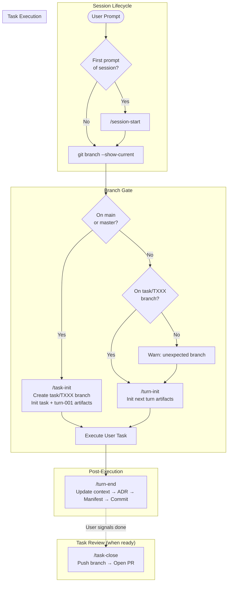

# coding-agents-config

Agentic pipeline configuration for Claude Code. Enforces a task-and-turn workflow with provenance tracking, branch protection, and governance rules.

## Setup

### 1. Clone the repo

```sh
git clone <repo-url> ~/coding-agents-config
```

### 2. Create symlinks (automated)

Run the setup script — it creates all symlinks and backs up any existing files:

```sh
bash scripts/setup.sh
```

<details>
<summary>Manual symlink commands</summary>

```sh
ln -s ~/coding-agents-config/skills ~/.claude/skills
ln -s ~/coding-agents-config/hooks ~/.claude/hooks
ln -s ~/coding-agents-config/CLAUDE.md ~/.claude/CLAUDE.md
ln -s ~/coding-agents-config/settings.json ~/.claude/settings.json
```

If any of these already exist, back them up first (`mv <target> <target>.bak`).
</details>

### 3. Verify

```sh
ls -la ~/.claude/skills        # should point to ~/coding-agents-config/skills
ls -la ~/.claude/hooks         # should point to ~/coding-agents-config/hooks
ls -la ~/.claude/CLAUDE.md     # should point to ~/coding-agents-config/CLAUDE.md
ls -la ~/.claude/settings.json # should point to ~/coding-agents-config/settings.json
```

## Structure

```
coding-agents-config/
├── CLAUDE.md           # Global instructions — task/turn protocol, branch rules
├── AGENTS.md           # Agent loader directive
├── settings.json       # Claude Code settings (model, permissions, hooks)
├── hooks/              # Shell hooks triggered by Claude Code events
│   └── branch-guard.sh # Blocks edits on main/master
├── skills/             # Slash-command skills
│   ├── session-start/  # Initialize session context
│   ├── task-init/      # Create task branch and initial artifacts
│   ├── task-close/     # Finalize task, push branch, open PR
│   ├── turn-init/      # Create turn directory and artifacts within active task
│   ├── turn-end/       # Finalize turn with PR, ADR, manifest
│   ├── branch-guard/   # Create task branch if on main
│   ├── af-be-build-*/  # App Factory backend build pipeline skills
│   ├── af-memory/      # App Factory pipeline state management
│   ├── af-project-init/# App Factory project initialization
│   ├── dsl-utils/      # DSL model interpreter utilities
│   ├── ui-utils/       # UI implementation language utilities
│   ├── e2e-tests/      # End-to-end test artifacts
│   └── unit-tests/     # Unit test implementation sync
├── agents/             # Sub-agent definitions
│   └── agent-architecture-planner.md
├── scripts/            # Automation scripts
│   └── setup.sh
├── docs/               # Reference documentation
├── archive/            # Deprecated skills and templates
└── .appfactory/        # Task/turn tracking, specs, prompts, and memory
    ├── tasks/          # Task branches with turn subdirectories
    ├── specs/          # Specifications (PRD, DDD, DSL)
    ├── prompts/        # Prompt templates
    └── memory/         # Project pipeline state
```

## Execution Flow

The agentic pipeline enforces a task-scoped, turn-based workflow for all coding tasks:



### Task and Turn Protocol

| Phase | Trigger | Steps | Outputs |
|-------|---------|-------|---------|
| **Session Start** | First prompt | Load git state, load context docs | Context loaded |
| **Task Init** | On main/master | Create `task/TXXX` branch, init `.appfactory/tasks/task-XXX/` | Branch + task artifacts |
| **Turn Init** | On task branch | Resolve turn ID, create `turns/turn-XXX/` | `turn_context.md`, `execution_trace.json` |
| **Execution** | Every coding prompt | Execute task | Modified files |
| **Turn End** | After every prompt | Update context, write ADR, manifest, commit | 4 artifacts complete |
| **Task Close** | User signals ready | Push branch, open PR | Pull request |

### Commit Message Format

```
AI Coding Agent Change:
- <imperative bullet>
- <imperative bullet>
```

### Directory Layout per Task

```
.appfactory/tasks/task-001/
├── task_context.md
├── task_status.json
├── task_summary.md
├── pull_request.md
└── turns/
    ├── turn-001/
    │   ├── turn_context.md
    │   ├── execution_trace.json
    │   ├── adr.md
    │   └── manifest.json
    └── turn-002/
        └── ...
```

## Skills (17)

| Category | Skill | Description |
|----------|-------|-------------|
| **Session** | `session-start` | Load repository state and core pipeline context |
| **Task** | `task-init` | Initialize task branch and task + turn-001 artifacts |
| | `task-close` | Finalize active task branch, push, and open a PR |
| **Turn** | `turn-init` | Initialize the next turn within the active task branch |
| | `turn-end` | Finalize the active turn with ADR, manifest, and commit |
| | `branch-guard` | Create task branch if on main/master |
| **App Factory — Build** | `af-be-build-prd` | Generate a backend-focused Product Requirements Document |
| | `af-be-build-ddd` | Generate Domain-Driven Design document from an approved PRD |
| | `af-be-build-dsl` | Generate backend DSL YAML from a DDD document |
| | `af-be-build-plan` | Generate backend execution plan from DSL and tech stack profile |
| | `af-be-build-implementation` | Execute backend generation from DSL specification |
| **App Factory — Utility** | `af-project-init` | Initialize a new App Factory project scaffold |
| | `af-memory` | CRUD operations for App Factory pipeline state (`state.yml`) |
| **Testing** | `e2e-tests` | End-to-end HTTP test artifact generation |
| | `unit-tests` | Unit test implementation sync |
| **Utilities** | `dsl-utils` | DSL model interpreter helpers |
| | `ui-utils` | UI implementation language helpers |

## Agents

| Agent | Description |
|-------|-------------|
| `agent-architecture-planner` | Reads PRD, DDD, DSL, and repo structure to produce spec gap matrix, module maps, implementation plans, and review artifacts for downstream coding agents |

## Hooks

| Hook | Trigger | Purpose |
|------|---------|---------|
| `branch-guard.sh` | `PreToolUse(Bash)` | Block edits on main/master; prompt for task branch creation |

## Settings

`settings.json` configures the following for all sessions:

- **Model**: `claude-opus-4-5` (large), `claude-sonnet-4-6` (fast)
- **Permissions**: pre-approved allow-list for common shell tools (`git`, `gh`, `npm`, `docker`, etc.) and deny-list for destructive operations
- **Hooks**: `branch-guard.sh` fires before every Bash tool use
- **Status line**: custom status line command

## Adding a New Skill

Each skill lives in its own directory under `skills/` with a `SKILL.md` file:

```
skills/my-skill/
└── SKILL.md
```

The `SKILL.md` front matter must include at minimum a `description` field. The `.system/skill-creator` meta-skill in the archive can guide you through creating one.

## Syncing Across Machines

Since this is a standard git repo, pull on any machine to stay current:

```sh
cd ~/coding-agents-config && git pull
```

The symlinks mean changes are picked up immediately — no reinstall needed.
