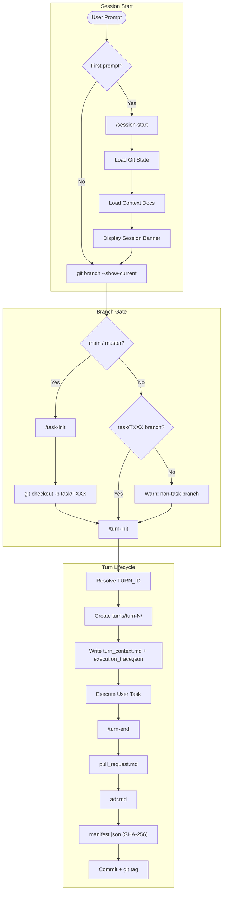

# coding-agents-config

Agentic pipeline configuration for Claude Code. Enforces a turn-based workflow with task/turn tracking, branch protection, provenance artifacts, and App Factory build skills.

## Setup

### 1. Clone the repo

```sh
git clone <repo-url> ~/coding-agents-config
```

### 2. Create symlinks (automated)

Run the setup script — it creates all symlinks and backs up any existing files:

```sh
bash scripts/setup.sh
```

<details>
<summary>Manual symlink commands</summary>

```sh
ln -s ~/coding-agents-config/skills ~/.claude/skills
ln -s ~/coding-agents-config/hooks ~/.claude/hooks
ln -s ~/coding-agents-config/agents ~/.claude/agents
ln -s ~/coding-agents-config/CLAUDE.md ~/.claude/CLAUDE.md
ln -s ~/coding-agents-config/settings.json ~/.claude/settings.json
```

If any of these already exist, back them up first (`mv <target> <target>.bak`).
</details>

### 3. Verify

```sh
ls -la ~/.claude/skills        # should point to ~/coding-agents-config/skills
ls -la ~/.claude/hooks         # should point to ~/coding-agents-config/hooks
ls -la ~/.claude/agents        # should point to ~/coding-agents-config/agents
ls -la ~/.claude/CLAUDE.md     # should point to ~/coding-agents-config/CLAUDE.md
ls -la ~/.claude/settings.json # should point to ~/coding-agents-config/settings.json
```

## Structure

```
coding-agents-config/
├── CLAUDE.md                   # Global instructions — turn protocol, branch rules
├── AGENTS.md                   # Agent loader directive
├── settings.json               # Claude Code settings (model, permissions, hooks)
├── hooks/
│   └── branch-guard.sh         # PreToolUse hook: blocks edits on main/master
├── agents/
│   └── agent-architecture-planner.md  # Architecture & planning sub-agent
├── skills/
│   ├── .system/                # Meta-skills (skill-creator, skill-installer, imagegen, openai-docs, plugin-creator)
│   ├── .nestjs/                # NestJS-specific skills (nestjs-crud-resource, nestjs-prisma-resource, etc.)
│   ├── session-start/          # Load git state and context docs at session start
│   ├── task-init/              # Initialize task branch + turn-001 artifacts
│   ├── task-close/             # Finalize task branch and open pull request
│   ├── turn-init/              # Create turn directory and initial artifacts
│   ├── turn-end/               # Write PR, ADR, manifest; commit and tag
│   ├── branch-guard/           # Create task branch if on main
│   ├── af-be-build-prd/        # AppFactory: generate backend PRD from intake worksheet
│   ├── af-be-build-ddd/        # AppFactory: generate DDD document from PRD
│   ├── af-be-build-dsl/        # AppFactory: generate backend DSL YAML from DDD
│   ├── af-be-build-plan/       # AppFactory: generate backend execution plan from DSL
│   ├── af-be-build-implementation/  # AppFactory: execute backend code generation
│   ├── af-memory/              # AppFactory: CRUD for pipeline state in .appfactory/memory/
│   ├── af-project-init/        # AppFactory: scaffold a new project repo
│   ├── dsl-utils/              # DSL utilities (dsl-model-interpreter)
│   ├── e2e-tests/              # E2E test utilities (http-test-artifacts)
│   ├── ui-utils/               # UI utilities (ui-implementation-language)
│   └── unit-tests/             # Unit test utilities (test-implementation-sync)
├── scripts/
│   └── setup.sh                # Symlink installer
├── .appfactory/
│   ├── tasks/                  # Task branches with per-turn artifacts
│   ├── tasks_index.csv         # Task registry
│   ├── specs/                  # Specifications
│   ├── prompts/                # Prompt templates
│   ├── memory/                 # Pipeline state (state.yml)
│   └── changelog.md            # Turn-by-turn history
├── docs/                       # Reference documentation
└── archive/                    # Archived/retired skills and templates
```

## Execution Flow

The pipeline enforces a strict turn-based lifecycle for every coding task:



### Lifecycle Summary

| Phase | Skill | Outputs |
|-------|-------|---------|
| Session start | `/session-start` | Context loaded, banner displayed |
| Task init (main only) | `/task-init` | `task/TXXX` branch, task artifacts, `turn-001` |
| Turn init | `/turn-init` | `turn_context.md`, `execution_trace.json` |
| Execution | _(user task)_ | Modified files |
| Turn end | `/turn-end` | `pull_request.md`, `adr.md`, `manifest.json`, commit, tag |
| Task close | `/task-close` | Branch pushed, PR opened |

## Skills

### Pipeline / Lifecycle

| Skill | Description |
|-------|-------------|
| `session-start` | Load git state and four context docs; display session banner |
| `task-init` | Create `task/TXXX` branch and initialize task + turn-001 artifacts |
| `task-close` | Finalize task branch, push, and open a PR against main |
| `turn-init` | Create turn directory and write initial `turn_context.md` / `execution_trace.json` |
| `turn-end` | Write `pull_request.md`, `adr.md`, `manifest.json`; commit and tag |
| `branch-guard` | Create task branch when on main/master |

### AppFactory Build Pipeline

| Skill | Description |
|-------|-------------|
| `af-be-build-prd` | Generate a backend PRD from an intake worksheet |
| `af-be-build-ddd` | Generate a DDD document from an approved PRD |
| `af-be-build-dsl` | Generate a backend DSL YAML from a DDD document |
| `af-be-build-plan` | Generate a backend execution plan from a DSL and tech-stack profile |
| `af-be-build-implementation` | Execute backend code generation from a DSL plan |
| `af-memory` | Read / write pipeline state in `.appfactory/memory/state.yml` |
| `af-project-init` | Scaffold a new AppFactory project repo |

### Utility Skill Groups

| Group | Sub-skill | Description |
|-------|-----------|-------------|
| `dsl-utils` | `dsl-model-interpreter` | Interpret DSL model files |
| `e2e-tests` | `http-test-artifacts` | Generate HTTP test artifacts |
| `ui-utils` | `ui-implementation-language` | UI language standards |
| `unit-tests` | `test-implementation-sync` | Sync tests with implementation |

### NestJS Skills (`.nestjs`)

| Skill | Description |
|-------|-------------|
| `nestjs-crud-resource` | Generate a NestJS CRUD resource |
| `nestjs-prisma-resource` | Generate a NestJS CRUD resource with Prisma |
| `nestjs-customer-crud-scaffold` | Scaffold a full NestJS customer CRUD app |
| `nestjs-observability` | Add observability to a NestJS app |
| `app-from-dsl` | Generate a NestJS app from a DSL definition |
| `field-mapper-generator` | Generate field-mapper utilities |
| `prisma` | Prisma schema and migration helpers |

### Meta-Skills (`.system`)

| Skill | Description |
|-------|-------------|
| `skill-creator` | Create new skills with `SKILL.md` |
| `skill-installer` | Install skills from marketplaces |
| `plugin-creator` | Create Claude Code plugins |
| `imagegen` | Image generation utilities |
| `openai-docs` | OpenAI docs reference skill |

## Agents

| Agent | Description |
|-------|-------------|
| `agent-architecture-planner` | Architecture and planning agent — reads PRD, DDD, and DSL to produce module maps, task plans, and ADRs for downstream coding agents |

## Hooks

| Hook | Trigger | Purpose |
|------|---------|---------|
| `branch-guard.sh` | `PreToolUse(Bash)` | Block edits and shell commands on main/master |

## Configuration (`settings.json`)

| Key | Value |
|-----|-------|
| `ANTHROPIC_MODEL` | `claude-opus-4-5-20251101` |
| `ANTHROPIC_SMALL_FAST_MODEL` | `claude-sonnet-4-6` |
| `cleanupPeriodDays` | `90` |
| `voiceEnabled` | `true` |

Pre-approved Bash commands include: `git`, `gh`, `pnpm`, `npm`, `npx`, `node`, `docker`, `psql`, `jq`, `curl`, and standard Unix utilities.

## Adding a New Skill

Each skill lives in its own directory under `skills/` with a `SKILL.md` file:

```
skills/my-skill/
└── SKILL.md
```

Use the `.system/skill-creator` meta-skill to scaffold one, or `.system/skill-installer` to pull a skill from a marketplace.

## Syncing Across Machines

Since this is a standard git repo, pull on any machine to stay current:

```sh
cd ~/coding-agents-config && git pull
```

The symlinks mean changes are picked up immediately — no reinstall needed.
