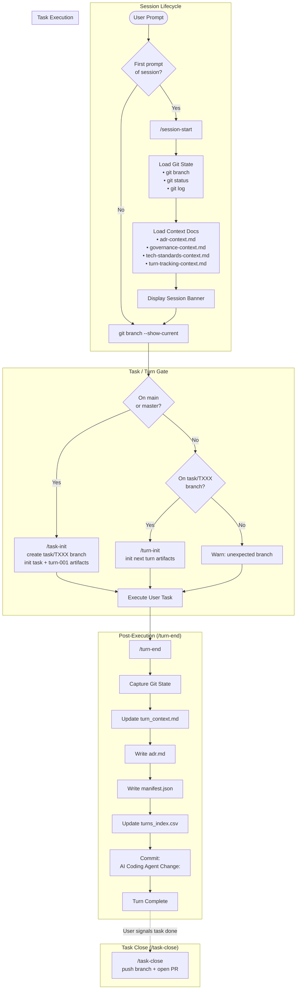

# coding-agents-config

Agentic pipeline configuration for Claude Code. Enforces a task-and-turn workflow with provenance tracking, branch protection, and governance rules. Powers the **AppFactory** backend-generation pipeline.

## Setup

### 1. Clone the repo

```sh
git clone <repo-url> ~/coding-agents-config
```

### 2. Create symlinks (automated)

Run the setup script — it creates all symlinks and backs up any existing files:

```sh
bash scripts/setup.sh
```

<details>
<summary>Manual symlink commands</summary>

```sh
ln -s ~/coding-agents-config/skills ~/.claude/skills
ln -s ~/coding-agents-config/hooks ~/.claude/hooks
ln -s ~/coding-agents-config/CLAUDE.md ~/.claude/CLAUDE.md
ln -s ~/coding-agents-config/settings.json ~/.claude/settings.json
```

If any of these already exist, back them up first (`mv <target> <target>.bak`).
</details>

### 3. Verify

```sh
ls -la ~/.claude/skills        # should point to ~/coding-agents-config/skills
ls -la ~/.claude/hooks         # should point to ~/coding-agents-config/hooks
ls -la ~/.claude/CLAUDE.md     # should point to ~/coding-agents-config/CLAUDE.md
ls -la ~/.claude/settings.json # should point to ~/coding-agents-config/settings.json
```

## Structure

```
coding-agents-config/
├── CLAUDE.md               # Global instructions — turn protocol, branch rules
├── AGENTS.md               # Agent loader directive
├── settings.json           # Claude Code settings (model, permissions, hooks)
├── hooks/
│   └── branch-guard.sh     # Prevents edits on main/master
├── skills/                 # Slash-command skills
│   ├── .system/            # Meta-skills (skill-creator, skill-installer, plugin-creator)
│   ├── .nestjs/            # NestJS-specific generation skills
│   ├── session-start/      # Initialize session context
│   ├── task-init/          # Create task branch and first turn artifacts
│   ├── task-close/         # Finalize task, push branch, open PR
│   ├── turn-init/          # Create turn directory and artifacts
│   ├── turn-end/           # Finalize turn with ADR, manifest, commit
│   ├── branch-guard/       # Create task branch if on main/master
│   ├── af-be-build-prd/    # Build backend Product Requirements Document
│   ├── af-be-build-ddd/    # Generate Domain-Driven Design document from PRD
│   ├── af-be-build-dsl/    # Generate backend DSL YAML from DDD document
│   ├── af-be-build-plan/   # Generate backend execution plan from DSL
│   ├── af-be-build-implementation/ # Execute backend code generation from DSL
│   ├── af-project-init/    # Initialize a new AppFactory project scaffold
│   ├── af-memory/          # CRUD operations for AppFactory pipeline state
│   ├── dsl-utils/          # DSL interpretation utilities
│   ├── e2e-tests/          # E2E / HTTP test artifact generation
│   ├── ui-utils/           # UI implementation language utilities
│   └── unit-tests/         # Unit test synchronization utilities
├── agents/
│   └── agent-architecture-planner.md  # Architecture planning agent definition
├── scripts/
│   └── setup.sh
├── docs/                   # Reference documentation
│   ├── ai-to-appfactory-migration-analysis.md
│   ├── app-nextjs-nestjs-prisma.md
│   └── migration-ai-to-appfactory.md
├── archive/                # Retired skills and legacy turn history
│   ├── templates/          # Turn lifecycle templates (historical)
│   ├── legacy-turns/       # Pre-task-model turn history
│   └── <retired-skills>/   # Skills superseded by af-* equivalents
└── .appfactory/            # Task/turn tracking and specs
    ├── tasks/              # Task branches with turns
    ├── specs/              # Specifications
    ├── prompts/            # Prompt templates
    └── memory/             # Project memory / pipeline state
```

## Execution Flow

The agentic pipeline enforces a strict task-and-turn workflow for all coding work:



### Turn Protocol Summary

| Phase | Trigger | Steps | Outputs |
|-------|---------|-------|---------|
| **Session Start** | First prompt | Load git state → Load 4 context docs → Display banner | Context loaded |
| **Task Init** | On `main`/`master` | Create `task/TXXX` branch → Init task + `turn-001` artifacts | Task directory, turn-001 |
| **Turn Init** | On `task/TXXX` branch | Resolve turn ID → Create turn dir → Write context + trace | `turn_context.md`, `execution_trace.json` |
| **Execution** | Every coding prompt | Execute task | Modified files |
| **Turn End** | After every prompt | Update context → ADR → Manifest → Index → Commit | 4 artifacts, git commit |
| **Task Close** | User request | Push branch → Open pull request | PR on GitHub |

## Skills

### Pipeline Lifecycle

| Skill | Description |
|-------|-------------|
| `session-start` | Load repository state and core pipeline context at session start |
| `task-init` | Initialize a new `task/TXXX` branch and `turn-001` artifacts |
| `task-close` | Finalize the active task, push branch, open pull request |
| `turn-init` | Initialize the next turn within the active task branch |
| `turn-end` | Finalize the active turn: ADR, manifest, index entry, commit |
| `branch-guard` | Create task branch if current branch is `main` or `master` |

### AppFactory Backend Pipeline

| Skill | Description |
|-------|-------------|
| `af-be-build-prd` | Build a backend-focused Product Requirements Document |
| `af-be-build-ddd` | Generate a Domain-Driven Design document from an approved PRD |
| `af-be-build-dsl` | Generate a backend DSL YAML from a DDD document |
| `af-be-build-plan` | Generate a backend execution plan from DSL + tech stack profile |
| `af-be-build-implementation` | Execute backend code generation from the DSL specification |
| `af-project-init` | Initialize a new AppFactory project scaffold |
| `af-memory` | CRUD operations for AppFactory pipeline state (`state.yml`) |

### Utility Skill Groups

| Group | Skills |
|-------|--------|
| `dsl-utils` | `dsl-model-interpreter` |
| `e2e-tests` | `http-test-artifacts` |
| `ui-utils` | `ui-implementation-language` |
| `unit-tests` | `test-implementation-sync` |

### Meta-Skills (`.system`)

| Skill | Description |
|-------|-------------|
| `skill-creator` | Create new skills with a SKILL.md scaffold |
| `skill-installer` | Install skills from marketplaces |
| `plugin-creator` | Create new Claude Code plugins |

### NestJS Skills (`.nestjs`)

| Skill | Description |
|-------|-------------|
| `nestjs-prisma-resource` | Generate NestJS CRUD resource with Prisma |
| `nestjs-customer-crud-scaffold` | Scaffold NestJS customer CRUD application |
| `nestjs-crud-resource` | Generate NestJS CRUD module |
| `nestjs-observability` | Add observability (logging/tracing) to NestJS |
| `app-from-dsl` | Generate NestJS app from DSL definition |
| `field-mapper-generator` | Generate field mapper classes |
| `prisma` | Prisma schema and migration utilities |

## Agents

| Agent | Description |
|-------|-------------|
| `agent-architecture-planner` | Architecture and planning agent — reads PRD, DDD, DSL, and repo structure to produce spec alignment, ADRs, module maps, and task plans |

## Hooks

| Hook | Trigger | Purpose |
|------|---------|---------|
| `branch-guard.sh` | `PreToolUse(Bash)` | Block write operations on `main`/`master` |

## Task & Turn Artifact Model

```
.appfactory/
  tasks/
    task-001/
      task_context.md       # Task description, goals, acceptance criteria
      task_status.json      # Current status and metadata
      task_summary.md       # Human-readable task summary
      pull_request.md       # PR description draft
      turns/
        turn-001/
          turn_context.md   # Turn inputs, outputs, timing
          execution_trace.json
          adr.md            # Architecture Decision Record
          manifest.json     # SHA-256 checksums of all modified files
  specs/                    # Specifications and requirements
  prompts/                  # Prompt templates
  memory/                   # AppFactory pipeline state (state.yml)
```

### Registries

- `.appfactory/tasks_index.csv` — one row per task, updated at each status change
- `.appfactory/tasks/task-XXX/turns_index.csv` — one row per turn (optional)

## Commit Message Format

```
AI Coding Agent Change:
- <imperative bullet>
- <imperative bullet>
- <imperative bullet>
```

## Adding a new skill

Each skill lives in its own directory under `skills/` with a `SKILL.md` file:

```
skills/my-skill/
└── SKILL.md
```

Use the `.system/skill-creator` meta-skill to scaffold one from Claude Code.

## Syncing across machines

```sh
cd ~/coding-agents-config && git pull
```

Symlinks mean changes are picked up immediately — no reinstall needed.
