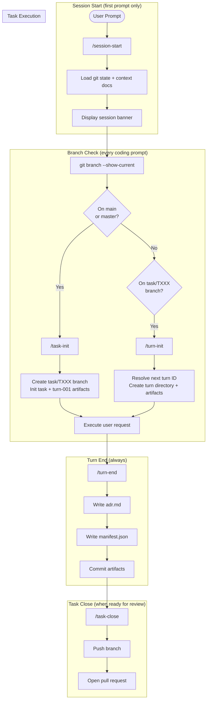

# coding-agents-config

Agentic pipeline configuration for Claude Code. Enforces a task/turn-based workflow with provenance tracking, branch protection, and governance rules.

## Setup

### 1. Clone the repo

```sh
git clone <repo-url> ~/coding-agents-config
```

### 2. Create symlinks (automated)

Run the setup script — it creates all symlinks and backs up any existing files:

```sh
bash scripts/setup.sh
```

The script symlinks into both `~/.claude/` and `~/.codex/`:

<details>
<summary>What gets symlinked</summary>

**Into `~/.claude/`:**
```sh
ln -s ~/coding-agents-config/skills    ~/.claude/skills
ln -s ~/coding-agents-config/agents    ~/.claude/agents
ln -s ~/coding-agents-config/hooks     ~/.claude/hooks
ln -s ~/coding-agents-config/scripts   ~/.claude/scripts
ln -s ~/coding-agents-config/CLAUDE.md ~/.claude/CLAUDE.md
ln -s ~/coding-agents-config/settings.json ~/.claude/settings.json
```

**Into `~/.codex/`:**
```sh
ln -s ~/coding-agents-config/agents   ~/.codex/agents
ln -s ~/coding-agents-config/AGENTS.md ~/.codex/AGENTS.md
```

If any target already exists, the script backs it up first (`mv <target> <target>.bak`).
</details>

### 3. Verify

```sh
ls -la ~/.claude/skills        # should point to ~/coding-agents-config/skills
ls -la ~/.claude/hooks         # should point to ~/coding-agents-config/hooks
ls -la ~/.claude/agents        # should point to ~/coding-agents-config/agents
ls -la ~/.claude/CLAUDE.md     # should point to ~/coding-agents-config/CLAUDE.md
ls -la ~/.claude/settings.json # should point to ~/coding-agents-config/settings.json
```

## Structure

```
coding-agents-config/
├── CLAUDE.md           # Global instructions — task/turn protocol, branch rules
├── AGENTS.md           # Agent loader directive
├── settings.json       # Claude Code settings (model, permissions, hooks)
├── hooks/              # Shell hooks triggered by Claude Code events
│   └── branch-guard.sh # Blocks edits on main/master
├── skills/             # Slash-command skills
│   ├── session-start/  # Initialize session context
│   ├── task-init/      # Create task branch and first turn artifacts
│   ├── task-close/     # Finalize task branch and open pull request
│   ├── turn-init/      # Create turn directory and artifacts
│   ├── turn-end/       # Finalize turn with PR, ADR, manifest
│   ├── branch-guard/   # Create turn branch if on main
│   ├── af-be-build-prd/       # AppFactory: generate backend PRD
│   ├── af-be-build-ddd/       # AppFactory: generate DDD document
│   ├── af-be-build-dsl/       # AppFactory: generate backend DSL YAML
│   ├── af-be-build-plan/      # AppFactory: generate execution plan
│   ├── af-be-build-implementation/ # AppFactory: execute backend generation
│   ├── af-memory/             # AppFactory: pipeline state management
│   ├── af-project-init/       # AppFactory: initialize new project scaffold
│   ├── dsl-utils/             # DSL utility helpers
│   ├── ui-utils/              # UI utility helpers
│   ├── e2e-tests/             # End-to-end test helpers
│   └── unit-tests/            # Unit test helpers
├── agents/             # Agent definitions
│   └── agent-architecture-planner.md
├── scripts/            # Automation scripts
│   └── setup.sh
├── .appfactory/        # Task/turn tracking and pipeline artifacts
│   ├── tasks/          # Task directories with turn subdirectories
│   ├── specs/          # Specifications
│   ├── prompts/        # Prompt templates
│   ├── memory/         # Pipeline state (state.yml)
│   └── tasks_index.csv # Task registry
└── docs/               # Reference documentation
```

## Execution Flow

The agentic pipeline enforces a task/turn workflow. Every coding session follows this lifecycle:



### Lifecycle Summary

| Phase | Trigger | Skill | Outputs |
|-------|---------|-------|---------|
| **Session Start** | First prompt | `/session-start` | Git state + context loaded |
| **Task Init** | On `main`/`master` | `/task-init` | `task/TXXX` branch, `task_context.md`, `task_status.json`, `turn-001/` |
| **Turn Init** | On `task/TXXX` | `/turn-init` | `turn_context.md`, `execution_trace.json` |
| **Turn End** | After every prompt | `/turn-end` | `adr.md`, `manifest.json`, commit |
| **Task Close** | Ready for review | `/task-close` | Push + pull request |

### Task and Turn Artifacts

Tasks live under `.appfactory/tasks/task-XXX/`:

| Artifact | Description |
|----------|-------------|
| `task_context.md` | Task description and metadata |
| `task_status.json` | Current task state |
| `task_summary.md` | Human-readable task summary |
| `pull_request.md` | PR description draft |
| `turns/turn-XXX/turn_context.md` | Turn description and timing |
| `turns/turn-XXX/execution_trace.json` | Tool calls and execution log |
| `turns/turn-XXX/adr.md` | Architecture Decision Record |
| `turns/turn-XXX/manifest.json` | SHA-256 checksums of changed files |

## Skills (17)

### Pipeline Lifecycle

| Skill | Description |
|-------|-------------|
| `session-start` | Load git state and core pipeline context at session start |
| `task-init` | Initialize a new task branch and `turn-001` artifacts; run when on `main`/`master` |
| `task-close` | Finalize the active task branch, push it, and open a pull request |
| `turn-init` | Initialize the next turn within the active task branch |
| `turn-end` | Finalize the active turn with ADR, manifest, and commit |
| `branch-guard` | Create a task branch if accidentally on `main`/`master` |

### AppFactory — Backend Build Pipeline

| Skill | Description |
|-------|-------------|
| `af-be-build-prd` | Generate a backend Product Requirements Document from a PRD worksheet |
| `af-be-build-ddd` | Generate a Domain-Driven Design document from an approved PRD |
| `af-be-build-dsl` | Generate a backend DSL YAML from a DDD document |
| `af-be-build-plan` | Generate a step-by-step backend execution plan from a DSL + tech stack |
| `af-be-build-implementation` | Execute backend generation using the DSL and a tech stack implementation |
| `af-memory` | CRUD operations for AppFactory pipeline state in `.appfactory/memory/state.yml` |
| `af-project-init` | Initialize a new AppFactory project with scaffold, README, and git |

### Utilities

| Skill | Description |
|-------|-------------|
| `dsl-utils` | DSL utility helpers |
| `ui-utils` | UI utility helpers |
| `e2e-tests` | End-to-end test helpers |
| `unit-tests` | Unit test helpers |

## Hooks

| Hook | Trigger | Purpose |
|------|---------|---------|
| `branch-guard.sh` | `PreToolUse(Bash)` | Block edits on `main`/`master` |

## Settings

`settings.json` configures Claude Code for this pipeline:

| Setting | Value |
|---------|-------|
| Default model | `claude-opus-4-5-20251101` |
| Fast model | `claude-sonnet-4-6` |
| Session cleanup | 90 days |
| Voice | Enabled |

Key permission grants: `git`, `gh`, `pnpm`, `npm`, `node`, `docker`, `psql`, `jq`, `curl`, and common shell utilities.

Key permission denials: `rm -rf /`, force-push to `main`, `npm publish`.

## Adding a new skill

Each skill lives in its own directory under `skills/` with a `SKILL.md` file:

```
skills/my-skill/
└── SKILL.md
```

The `SKILL.md` front matter must declare `name` and `description`:

```yaml
---
name: my-skill
description: One-line description of what this skill does.
---
```

## Syncing across machines

Since this is a standard git repo, pull on any machine to stay current:

```sh
cd ~/coding-agents-config && git pull
```

Symlinks pick up changes immediately — no reinstall needed.
