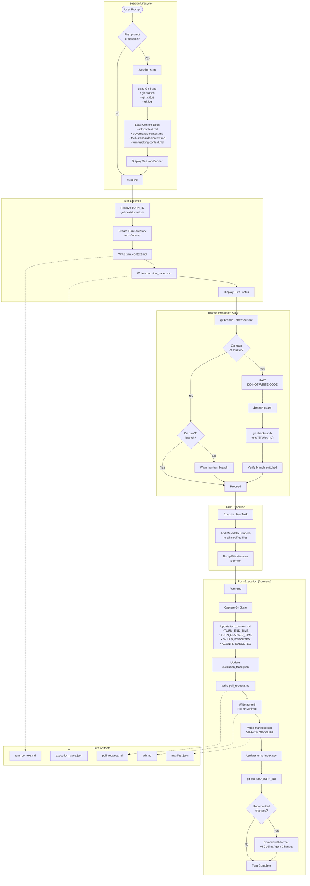

# coding-agents-config

Agentic pipeline configuration for Claude Code. Enforces turn-based workflow with provenance tracking, branch protection, and governance rules.

## Setup

### 1. Clone the repo

```sh
git clone <repo-url> ~/coding-agents-config
```

### 2. Create symlinks (automated)

Run the setup script — it creates all symlinks and backs up any existing files:

```sh
bash scripts/setup.sh
```

<details>
<summary>Manual symlink commands</summary>

```sh
ln -s ~/coding-agents-config/skills ~/.claude/skills
ln -s ~/coding-agents-config/hooks ~/.claude/hooks
ln -s ~/coding-agents-config/templates ~/.claude/templates
ln -s ~/coding-agents-config/scripts ~/.claude/scripts
ln -s ~/coding-agents-config/CLAUDE.md ~/.claude/CLAUDE.md
ln -s ~/coding-agents-config/settings.json ~/.claude/settings.json
```

If any of these already exist, back them up first (`mv <target> <target>.bak`).
</details>

### 3. Verify

```sh
ls -la ~/.claude/skills        # should point to ~/coding-agents-config/skills
ls -la ~/.claude/hooks         # should point to ~/coding-agents-config/hooks
ls -la ~/.claude/templates     # should point to ~/coding-agents-config/templates
ls -la ~/.claude/CLAUDE.md     # should point to ~/coding-agents-config/CLAUDE.md
ls -la ~/.claude/settings.json # should point to ~/coding-agents-config/settings.json
```

## Structure

```
coding-agents-config/
├── CLAUDE.md           # Global instructions — turn protocol, branch rules
├── AGENTS.md           # Agent loader directive
├── settings.json       # Claude Code settings (model, permissions)
├── hooks/              # Shell hooks triggered by Claude Code events
│   └── branch-guard.sh # Prevents edits on main/master
├── skills/             # Slash-command skills
│   ├── .system/        # Meta-skills (skill-creator, skill-installer)
│   ├── session-start/  # Initialize session context
│   ├── turn-init/      # Create turn directory and artifacts
│   ├── turn-end/       # Finalize turn with PR, ADR, manifest
│   ├── branch-guard/   # Create turn branch if on main
│   └── ...             # Other skills
├── templates/          # Turn lifecycle templates
│   ├── adr_template.md
│   ├── pull_request_template.md
│   ├── manifest.schema.json
│   └── ...
├── scripts/            # Automation scripts
│   └── setup.sh
├── .appfactory/        # Task/turn tracking and specs
│   ├── tasks/          # Task branches with turns
│   ├── specs/          # Specifications
│   ├── prompts/        # Prompt templates
│   └── memory/         # Project memory
├── plugins/            # Plugin management
├── prompts/            # Prompt templates
└── docs/               # Reference documentation
```

## Execution Flow

The agentic pipeline enforces a strict turn-based workflow for all coding tasks:



### Turn Protocol Summary

| Phase | Steps | Outputs |
|-------|-------|---------|
| **Session Start** | Load git state → Load 4 context docs → Display banner | Context loaded |
| **Turn Init** | Resolve ID → Create dir → Write context + trace | `turn_context.md`, `execution_trace.json` |
| **Branch Gate** | Check branch → HALT if main → Create turn branch | Safe branch |
| **Execution** | Execute task → Add headers → Bump versions | Modified files |
| **Turn End** | Update context → Write PR → ADR → Manifest → Index → Tag | 5 artifacts complete |

## Skills (9)

| Category | Skill | Description |
|----------|-------|-------------|
| **Session** | `session-start` | Initialize session, load context docs |
| **Turn** | `turn-init` | Create turn directory and initial artifacts |
| | `turn-end` | Finalize turn with PR, ADR, manifest |
| | `branch-guard` | Create turn branch if on main/master |
| **Scaffolding** | `schema-to-database` | Generate DB tables and entity code from JSON schema |
| | `nestjs-prisma-resource` | Generate NestJS CRUD resource with Prisma |
| | `nestjs-customer-crud-scaffold` | Scaffold NestJS customer CRUD app |
| | `code-entity-to-crud` | Entity to CRUD generation |
| **Utility** | `helloworld` | Test skill invocation |

### Meta-Skills (.system)

| Skill | Description |
|-------|-------------|
| `skill-creator` | Create new skills with SKILL.md |
| `skill-installer` | Install skills from marketplaces |

## Templates

| Template | Purpose |
|----------|---------|
| `adr_template.md` | Architecture Decision Record format |
| `pull_request_template.md` | PR description format |
| `manifest.schema.json` | Turn manifest JSON schema |
| `metadata_header.txt` | Source file header format |
| `branch_naming.md` | Branch naming conventions |
| `commit_message.md` | Commit message format |
| `tech-stack.template.md` | Tech stack documentation |

## Hooks

| Hook | Trigger | Purpose |
|------|---------|---------|
| `branch-guard.sh` | PreToolUse(Edit) | Block edits on main/master |

## Adding a new skill

Each skill lives in its own directory under `skills/` with a `SKILL.md` file:

```
skills/my-skill/
└── SKILL.md
```

The `.system/skill-creator` meta-skill can guide you through creating one — invoke it from Claude Code.

## Syncing across machines

Since this is a standard git repo, pull on any machine to stay current:

```sh
cd ~/coding-agents-config && git pull
```

The symlinks mean changes are picked up immediately — no reinstall needed.
