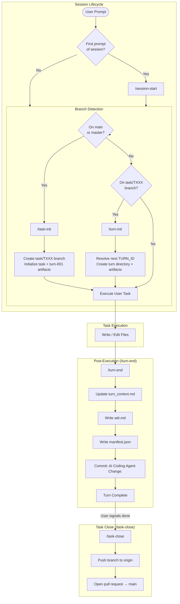

# coding-agents-config

Agentic pipeline configuration for Claude Code. Enforces a task/turn-based workflow with provenance tracking, branch protection, AppFactory build skills, and governance rules.

## Setup

### 1. Clone the repo

```sh
git clone https://github.com/bobwares/coding-agents-config ~/coding-agents-config
```

### 2. Create symlinks (automated)

Run the setup script — it creates all symlinks and backs up any existing files:

```sh
bash scripts/setup.sh
```

<details>
<summary>Manual symlink commands</summary>

```sh
ln -s ~/coding-agents-config/skills ~/.claude/skills
ln -s ~/coding-agents-config/hooks ~/.claude/hooks
ln -s ~/coding-agents-config/agents ~/.claude/agents
ln -s ~/coding-agents-config/CLAUDE.md ~/.claude/CLAUDE.md
ln -s ~/coding-agents-config/settings.json ~/.claude/settings.json
```

If any of these already exist, back them up first (`mv <target> <target>.bak`).
</details>

### 3. Verify

```sh
ls -la ~/.claude/skills        # should point to ~/coding-agents-config/skills
ls -la ~/.claude/hooks         # should point to ~/coding-agents-config/hooks
ls -la ~/.claude/agents        # should point to ~/coding-agents-config/agents
ls -la ~/.claude/CLAUDE.md     # should point to ~/coding-agents-config/CLAUDE.md
ls -la ~/.claude/settings.json # should point to ~/coding-agents-config/settings.json
```

## Structure

```
coding-agents-config/
├── CLAUDE.md                   # Global instructions — task/turn protocol, branch rules
├── AGENTS.md                   # Agent loader directive
├── settings.json               # Claude Code settings (model, permissions, hooks)
├── agents/                     # Subagent definitions
│   └── agent-architecture-planner.md
├── hooks/                      # Shell hooks triggered by Claude Code events
│   └── branch-guard.sh         # Prevents edits on main/master
├── skills/                     # Slash-command skills
│   ├── .system/                # Meta-skills (skill-creator, skill-installer, plugin-creator, imagegen, openai-docs)
│   ├── .nestjs/                # NestJS-specific generation skills
│   ├── session-start/          # Initialize session context
│   ├── task-init/              # Create task branch and first turn artifacts
│   ├── task-close/             # Finalize task and open pull request
│   ├── turn-init/              # Create next turn directory and artifacts
│   ├── turn-end/               # Finalize turn with ADR, manifest, commit
│   ├── branch-guard/           # Create task branch if on main/master
│   ├── af-be-build-prd/        # AppFactory: write backend PRD
│   ├── af-be-build-ddd/        # AppFactory: generate DDD document from PRD
│   ├── af-be-build-dsl/        # AppFactory: generate DSL YAML from DDD
│   ├── af-be-build-plan/       # AppFactory: generate execution plan from DSL
│   ├── af-be-build-implementation/ # AppFactory: execute backend code generation
│   ├── af-memory/              # AppFactory: pipeline state CRUD (state.yml)
│   ├── af-project-init/        # AppFactory: scaffold a new project
│   ├── dsl-utils/              # DSL model interpreter utilities
│   ├── e2e-tests/              # E2E / HTTP test artifact generation
│   ├── ui-utils/               # UI implementation language utilities
│   └── unit-tests/             # Unit test synchronization utilities
├── docs/                       # Reference documentation
├── archive/                    # Retired skills, legacy turns, and old templates
│   ├── templates/              # Original turn lifecycle templates (legacy)
│   └── legacy-turns/           # Pre-task-model turn history
└── .appfactory/                # Task/turn tracking and specs
    ├── tasks/                  # Task branches with turns
    ├── specs/                  # Specifications
    ├── prompts/                # Prompt templates
    └── memory/                 # Project memory
```

## Execution Flow

The agentic pipeline enforces a strict task/turn-based workflow:



### Turn Protocol Summary

| Phase | Trigger | Steps | Outputs |
|-------|---------|-------|---------|
| **Session Start** | First prompt | Load git state → Load 4 context docs → Display banner | Context loaded |
| **Task Init** | Branch is main/master | Create `task/TXXX` → Create task artifacts + turn-001 | `task_context.md`, `task_status.json`, `task_summary.md`, `turn-001/` |
| **Turn Init** | On task branch | Resolve next TURN_ID → Create dir → Write context + trace | `turn_context.md`, `execution_trace.json` |
| **Execution** | Always | Execute task → Write/edit files | Modified files |
| **Turn End** | After every prompt | Update context → Write ADR → Write manifest → Commit | `adr.md`, `manifest.json`, git commit |
| **Task Close** | User signals done | Push branch → Open PR | Pull request |

## Skills

### Pipeline Skills (6)

| Skill | Description |
|-------|-------------|
| `session-start` | Load repository state and core pipeline context. Run at session start. |
| `task-init` | Initialize a new `task/TXXX` branch and create task + turn-001 artifacts. Run when on main/master. |
| `task-close` | Finalize the active task branch, push it, and open a pull request against main. |
| `turn-init` | Initialize the next turn within the active task branch. |
| `turn-end` | Finalize the active turn — write ADR, manifest, commit. Run after every coding prompt. |
| `branch-guard` | Check current branch and create a task branch if on main/master. |

### AppFactory Backend Build Pipeline (7)

A sequential pipeline for building backend applications from requirements to running code:

| Skill | Description |
|-------|-------------|
| `af-be-build-prd` | Build a business-facing Product Requirements Document from a PRD worksheet or discovery notes. |
| `af-be-build-ddd` | Generate a backend Domain-Driven Design document from an approved PRD. |
| `af-be-build-dsl` | Generate a backend DSL YAML from a DDD document for downstream code generation. |
| `af-be-build-plan` | Generate a step-by-step backend execution plan from a DSL YAML and tech stack profile. |
| `af-be-build-implementation` | Execute backend code generation using an App Factory tech stack implementation. |
| `af-memory` | CRUD operations for AppFactory pipeline state (`state.yml`) across skills. |
| `af-project-init` | Initialize a new AppFactory project with base scaffold, README, and git setup. |

### Utility Skill Collections (4)

| Directory | Skill | Description |
|-----------|-------|-------------|
| `dsl-utils/` | `dsl-model-interpreter` | Interpret and validate DSL model documents |
| `e2e-tests/` | `http-test-artifacts` | Generate HTTP test artifact files |
| `ui-utils/` | `ui-implementation-language` | UI language and component conventions |
| `unit-tests/` | `test-implementation-sync` | Keep test files synchronized with implementation |

### NestJS Skills (.nestjs/)

| Skill | Description |
|-------|-------------|
| `app-from-dsl` | Generate a NestJS application from a DSL specification |
| `field-mapper-generator` | Generate field mapper utilities |
| `nestjs-crud-resource` | Scaffold a NestJS CRUD resource |
| `nestjs-customer-crud-scaffold` | Scaffold a NestJS customer CRUD app |
| `nestjs-observability` | Add observability instrumentation to a NestJS app |
| `nestjs-prisma-resource` | Generate a NestJS CRUD resource backed by Prisma |
| `prisma` | Prisma schema and migration utilities |

### Meta-Skills (.system/)

| Skill | Description |
|-------|-------------|
| `skill-creator` | Create new skills with a SKILL.md scaffold |
| `skill-installer` | Install skills from the anthropic-agent-skills marketplace |
| `plugin-creator` | Create new plugin packages |
| `imagegen` | Generate images |
| `openai-docs` | Fetch and summarize OpenAI documentation |

## Agents

| Agent | Description |
|-------|-------------|
| `agent-architecture-planner` | Architecture and planning agent. Reads PRD, DDD, DSL, and repo structure to produce specification alignment, architecture decisions, module maps, and task plans for downstream coding agents. |

## Hooks

| Hook | Trigger | Purpose |
|------|---------|---------|
| `branch-guard.sh` | `PreToolUse(Bash)` | Block edits on main/master before any tool runs |

## Settings

Key `settings.json` configuration:

| Setting | Value |
|---------|-------|
| Primary model | `claude-opus-4-5-20251101` |
| Fast model | `claude-sonnet-4-6` |
| Status line | Custom `statusline-command.sh` |
| Skill marketplace | `anthropic-agent-skills` (GitHub: `anthropics/skills`) |
| Cleanup period | 90 days |

Pre-authorized Bash commands include: `git`, `gh`, `pnpm`, `npm`, `npx`, `node`, `tsc`, `mvn`, `gradle`, `java`, `docker`, `psql`, and common shell utilities.

## Adding a new skill

Each skill lives in its own directory under `skills/` with a `SKILL.md` file:

```
skills/my-skill/
└── SKILL.md
```

Use the `.system/skill-creator` meta-skill from Claude Code to generate the scaffold interactively.

## Syncing across machines

Since this is a standard git repo, pull on any machine to stay current:

```sh
cd ~/coding-agents-config && git pull
```

Symlinks mean changes are picked up immediately — no reinstall needed.
