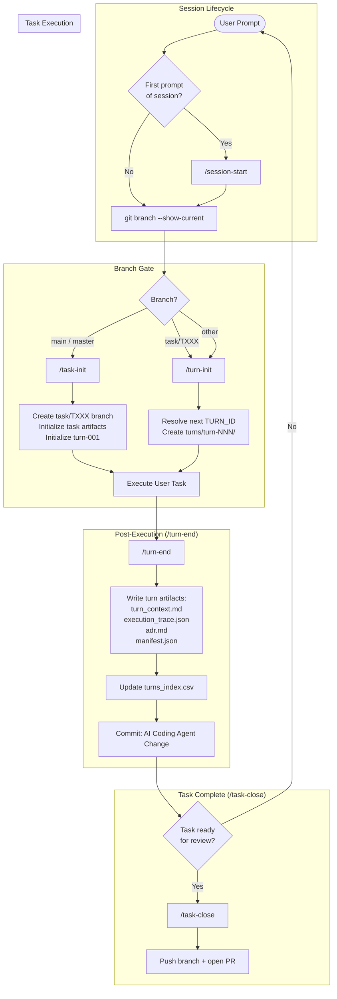

# coding-agents-config

Agentic pipeline configuration for Claude Code. Enforces a task/turn-based workflow with provenance tracking, branch protection, and governance rules.

## Setup

### 1. Clone the repo

```sh
git clone <repo-url> ~/coding-agents-config
```

### 2. Create symlinks (automated)

Run the setup script — it creates all symlinks and backs up any existing files:

```sh
bash scripts/setup.sh
```

<details>
<summary>Manual symlink commands</summary>

```sh
ln -s ~/coding-agents-config/skills      ~/.claude/skills
ln -s ~/coding-agents-config/agents      ~/.claude/agents
ln -s ~/coding-agents-config/hooks       ~/.claude/hooks
ln -s ~/coding-agents-config/scripts     ~/.claude/scripts
ln -s ~/coding-agents-config/CLAUDE.md   ~/.claude/CLAUDE.md
ln -s ~/coding-agents-config/settings.json ~/.claude/settings.json
```

If any of these already exist, back them up first (`mv <target> <target>.bak`).
</details>

### 3. Verify

```sh
ls -la ~/.claude/skills        # should point to ~/coding-agents-config/skills
ls -la ~/.claude/agents        # should point to ~/coding-agents-config/agents
ls -la ~/.claude/hooks         # should point to ~/coding-agents-config/hooks
ls -la ~/.claude/CLAUDE.md     # should point to ~/coding-agents-config/CLAUDE.md
ls -la ~/.claude/settings.json # should point to ~/coding-agents-config/settings.json
```

## Structure

```
coding-agents-config/
├── CLAUDE.md                   # Global instructions — task/turn protocol, branch rules
├── AGENTS.md                   # Agent loader directive
├── settings.json               # Claude Code settings (model, permissions, hooks)
├── hooks/                      # Shell hooks triggered by Claude Code events
│   └── branch-guard.sh         # Blocks edits on main/master
├── agents/                     # Agent definitions
│   └── agent-architecture-planner.md
├── skills/                     # Slash-command skills
│   ├── .system/                # Meta-skills (skill-creator, skill-installer, etc.)
│   ├── .nestjs/                # NestJS scaffolding skills (hidden namespace)
│   ├── session-start/          # Initialize session context
│   ├── task-init/              # Create task branch + turn-001 artifacts
│   ├── task-close/             # Push task branch and open PR
│   ├── turn-init/              # Create turn directory and artifacts
│   ├── turn-end/               # Finalize turn with ADR, manifest, index
│   ├── branch-guard/           # Create task branch if on main/master
│   ├── af-be-build-prd/        # AppFactory: Build backend PRD
│   ├── af-be-build-ddd/        # AppFactory: Generate DDD document
│   ├── af-be-build-dsl/        # AppFactory: Generate backend DSL YAML
│   ├── af-be-build-plan/       # AppFactory: Generate implementation plan
│   ├── af-be-build-implementation/ # AppFactory: Execute backend code generation
│   ├── af-memory/              # AppFactory: Pipeline state management
│   ├── af-project-init/        # AppFactory: Initialize project scaffold
│   ├── dsl-utils/              # DSL interpreter utilities
│   ├── e2e-tests/              # E2E/HTTP test artifact skills
│   ├── ui-utils/               # UI implementation utilities
│   └── unit-tests/             # Unit test sync skills
├── scripts/                    # Automation scripts
│   └── setup.sh
├── docs/                       # Reference documentation
├── .appfactory/                # Task/turn tracking and specs
│   ├── tasks/                  # Per-task directories with turn subdirectories
│   ├── tasks_index.csv         # Global task registry
│   ├── specs/                  # Specifications
│   ├── prompts/                # Prompt templates
│   └── memory/                 # Project memory
└── archive/                    # Retired skills, legacy turns, and templates
```

## Execution Flow

The agentic pipeline enforces a task/turn-based workflow for all coding tasks:



### Workflow Summary

| Phase | Trigger | Skill | Outputs |
|-------|---------|-------|---------|
| **Session Start** | First prompt of session | `/session-start` | Git state + context loaded |
| **Task Init** | On `main` or `master` | `/task-init` | `task/TXXX` branch, task artifacts, turn-001 |
| **Turn Init** | On `task/TXXX` branch | `/turn-init` | `turn_context.md`, `execution_trace.json` |
| **Execution** | User prompt | — | Modified files |
| **Turn End** | After every execution | `/turn-end` | `adr.md`, `manifest.json`, commit |
| **Task Close** | Task ready for review | `/task-close` | Branch pushed, PR opened |

### Task and Turn Artifact Layout

```
.appfactory/tasks/task-001/
├── task_context.md
├── task_status.json
├── task_summary.md
├── pull_request.md
└── turns/
    ├── turn-001/
    │   ├── turn_context.md
    │   ├── execution_trace.json
    │   ├── adr.md
    │   └── manifest.json
    └── turn-002/
        └── ...
```

## Skills

### Pipeline (Lifecycle)

| Skill | Description |
|-------|-------------|
| `session-start` | Load repository state and core pipeline context at session start |
| `task-init` | Initialize a new `task/TXXX` branch with task artifacts and turn-001 |
| `task-close` | Finalize the active task branch, push, and open a pull request |
| `turn-init` | Initialize the next turn within the active task branch |
| `turn-end` | Finalize turn — write ADR, manifest, update index, commit |
| `branch-guard` | Check current branch; create task branch if on main/master |

### AppFactory (af-*)

| Skill | Description |
|-------|-------------|
| `af-be-build-prd` | Build a business-facing backend Product Requirements Document |
| `af-be-build-ddd` | Generate a Domain-Driven Design document from an approved PRD |
| `af-be-build-dsl` | Generate a backend DSL YAML from a DDD document |
| `af-be-build-plan` | Generate a backend implementation plan from a DSL and tech stack profile |
| `af-be-build-implementation` | Execute backend code generation from DSL spec |
| `af-memory` | CRUD pipeline state in `.appfactory/memory/state.yml` |
| `af-project-init` | Initialize a new AppFactory project scaffold |

### Utilities

| Skill | Location | Description |
|-------|----------|-------------|
| `dsl-model-interpreter` | `dsl-utils/` | Interpret and validate DSL model definitions |
| `ui-implementation-language` | `ui-utils/` | UI component language conventions |
| `http-test-artifacts` | `e2e-tests/` | Generate HTTP test artifacts |
| `test-implementation-sync` | `unit-tests/` | Sync unit tests with implementation |

### NestJS (.nestjs — hidden namespace)

| Skill | Description |
|-------|-------------|
| `app-from-dsl` | Generate a NestJS app from a DSL spec |
| `field-mapper-generator` | Generate field mapper utilities |
| `nestjs-crud-resource` | Scaffold a NestJS CRUD resource |
| `nestjs-customer-crud-scaffold` | Scaffold a NestJS customer CRUD app |
| `nestjs-observability` | Add observability (logging, metrics) to a NestJS app |
| `nestjs-prisma-resource` | Generate a NestJS CRUD resource with Prisma |
| `prisma-guidelines` | Prisma usage guidelines and patterns |
| `prisma-persistence` | Generate Prisma persistence layer |

### Meta (.system)

| Skill | Description |
|-------|-------------|
| `skill-creator` | Create new skills with SKILL.md |
| `skill-installer` | Install skills from marketplaces |
| `plugin-creator` | Create new Claude Code plugins |
| `imagegen` | Image generation utilities |
| `openai-docs` | OpenAI documentation reference |

## Hooks

| Hook | Trigger | Purpose |
|------|---------|---------|
| `branch-guard.sh` | `PreToolUse(Bash)` | Block bash commands on main/master |

## Settings

Key `settings.json` configuration:

| Setting | Value |
|---------|-------|
| `ANTHROPIC_MODEL` | `claude-opus-4-5-20251101` |
| `ANTHROPIC_SMALL_FAST_MODEL` | `claude-sonnet-4-6` |
| `cleanupPeriodDays` | `90` |
| `voiceEnabled` | `true` |

Allowed tools are pre-approved in `permissions.allow` so common bash commands (`git`, `npm`, `docker`, `find`, `jq`, etc.) do not require confirmation.

## Commit Message Format

All AI-generated commits use:

```
AI Coding Agent Change:
- <imperative bullet>
- <imperative bullet>
```

## Adding a new skill

Each skill lives in its own directory under `skills/` with a `SKILL.md` file:

```
skills/my-skill/
└── SKILL.md
```

Use the `.system/skill-creator` meta-skill to scaffold one, or copy an existing `SKILL.md` as a starting point.

## Syncing across machines

```sh
cd ~/coding-agents-config && git pull
```

Symlinks mean changes take effect immediately — no reinstall needed.
