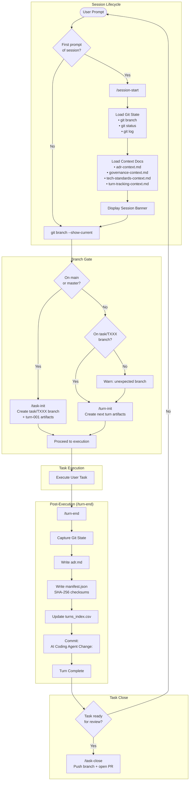

# coding-agents-config

Agentic pipeline configuration for Claude Code. Enforces a task-and-turn workflow with provenance tracking, branch protection, and governance rules. Includes the AppFactory skill suite for AI-driven backend application generation.

## Setup

### 1. Clone the repo

```sh
git clone <repo-url> ~/coding-agents-config
```

### 2. Create symlinks (automated)

Run the setup script — it creates all symlinks and backs up any existing files:

```sh
bash scripts/setup.sh
```

<details>
<summary>Manual symlink commands</summary>

```sh
ln -s ~/coding-agents-config/skills ~/.claude/skills
ln -s ~/coding-agents-config/hooks ~/.claude/hooks
ln -s ~/coding-agents-config/CLAUDE.md ~/.claude/CLAUDE.md
ln -s ~/coding-agents-config/settings.json ~/.claude/settings.json
```

If any of these already exist, back them up first (`mv <target> <target>.bak`).
</details>

### 3. Verify

```sh
ls -la ~/.claude/skills        # should point to ~/coding-agents-config/skills
ls -la ~/.claude/hooks         # should point to ~/coding-agents-config/hooks
ls -la ~/.claude/CLAUDE.md     # should point to ~/coding-agents-config/CLAUDE.md
ls -la ~/.claude/settings.json # should point to ~/coding-agents-config/settings.json
```

## Structure

```
coding-agents-config/
├── CLAUDE.md                   # Global instructions — task/turn protocol, branch rules
├── AGENTS.md                   # Agent loader directive
├── settings.json               # Claude Code settings (model, permissions, hooks)
├── hooks/
│   └── branch-guard.sh         # Blocks edits on main/master
├── skills/
│   ├── session-start/          # Initialize session context
│   ├── task-init/              # Create task branch + turn-001 artifacts
│   ├── task-close/             # Push branch and open PR
│   ├── turn-init/              # Create turn directory and artifacts
│   ├── turn-end/               # Finalize turn with ADR, manifest, commit
│   ├── branch-guard/           # Create task branch if on main
│   ├── af-be-build-prd/        # AppFactory: generate Product Requirements Document
│   ├── af-be-build-ddd/        # AppFactory: generate DDD document from PRD
│   ├── af-be-build-dsl/        # AppFactory: generate backend DSL YAML from DDD
│   ├── af-be-build-plan/       # AppFactory: generate backend execution plan from DSL
│   ├── af-be-build-implementation/ # AppFactory: scaffold backend app from DSL + tech stack
│   ├── af-memory/              # AppFactory: read/write pipeline state (state.yml)
│   ├── af-project-init/        # AppFactory: initialize new project scaffold
│   ├── dsl-utils/
│   │   └── dsl-model-interpreter/  # Parse and validate app-dsl YAML specs
│   ├── e2e-tests/
│   │   └── http-test-artifacts/    # Generate .http request files for API testing
│   ├── ui-utils/
│   │   └── ui-implementation-language/ # UI implementation language utilities
│   └── unit-tests/
│       └── test-implementation-sync/   # Sync unit tests with service/DTO implementations
├── agents/
│   └── agent-architecture-planner.md
├── docs/                       # Reference documentation
├── scripts/
│   └── setup.sh                # Symlink installer
├── archive/                    # Archived/superseded skills
└── .appfactory/
    ├── tasks/                  # Task branches with turn artifacts
    ├── specs/                  # Project specifications
    ├── prompts/                # Prompt templates
    ├── memory/                 # Pipeline state
    └── tasks_index.csv         # Global task registry
```

## Execution Flow

The agentic pipeline enforces a strict task-and-turn workflow for all coding tasks:



### Task and Turn Protocol Summary

| Phase | Trigger | Action | Outputs |
|-------|---------|--------|---------|
| **Session Start** | First prompt | Load git state + context docs | Context loaded |
| **Task Init** | On `main`/`master` | Create `task/TXXX`, init turn-001 | `task_context.md`, `task_status.json`, `task_summary.md`, turn-001 artifacts |
| **Turn Init** | On `task/TXXX` | Create next turn directory + artifacts | `turn_context.md`, `execution_trace.json` |
| **Execution** | Every prompt | Run user task | Modified files |
| **Turn End** | After every prompt | ADR + manifest + commit | `adr.md`, `manifest.json`, git commit |
| **Task Close** | User signals done | Push + PR | Pull request |

### Task and Turn Model

- A **task** is the branch-scoped unit of work that becomes one pull request.
- A **turn** is one AI execution cycle within the active task branch.
- Task IDs are global and zero-padded to 3 digits: `001`, `002`, `003`
- Turn IDs reset per task and are zero-padded to 3 digits: `001`, `002`, `003`

### Task Artifact Layout

```
.appfactory/tasks/task-001/
├── task_context.md
├── task_status.json
├── task_summary.md
├── pull_request.md
└── turns/
    ├── turn-001/
    │   ├── turn_context.md
    │   ├── execution_trace.json
    │   ├── adr.md
    │   └── manifest.json
    └── turn-002/
        └── ...
```

## Skills

### Pipeline Skills (6)

| Skill | Description |
|-------|-------------|
| `session-start` | Load repository state and core pipeline context. Run at the start of every session. |
| `task-init` | Initialize a new task branch (`task/TXXX`) and create task + turn-001 artifacts. Run when on `main`/`master`. |
| `task-close` | Finalize the active task branch, push it, and open a pull request against main. |
| `turn-init` | Initialize the next turn within the active task branch. |
| `turn-end` | Finalize the active turn — write ADR, manifest, update index, commit. Run after every prompt. |
| `branch-guard` | Check current branch; create a task branch if on main/master. |

### AppFactory Skills (7)

The AppFactory pipeline transforms a business idea into a running backend application through a structured sequence of AI-driven steps.

| Skill | Description |
|-------|-------------|
| `af-be-build-prd` | Generate a Product Requirements Document from a PRD intake worksheet. |
| `af-be-build-ddd` | Generate a Domain-Driven Design document from an approved PRD. |
| `af-be-build-dsl` | Generate a backend DSL YAML specification from a DDD document. |
| `af-be-build-plan` | Generate a backend execution plan from a DSL YAML + tech stack profile. |
| `af-be-build-implementation` | Scaffold the backend application by copying a tech stack template and generating domain code from the DSL. |
| `af-memory` | CRUD operations for AppFactory pipeline state — read/write `state.yml` in `.appfactory/memory/`. |
| `af-project-init` | Initialize a new AppFactory project with the base scaffold, README, and git setup. |

### Utility Skills (4)

| Skill | Description |
|-------|-------------|
| `dsl-model-interpreter` | Parse and validate app-dsl YAML specifications before code generation. |
| `http-test-artifacts` | Generate `.http` request files for REST client testing of backend endpoints. |
| `test-implementation-sync` | Ensure unit tests are synchronized with service/DTO implementations. |
| `ui-implementation-language` | UI implementation language utilities for frontend generation. |

## Hooks

| Hook | Trigger | Purpose |
|------|---------|---------|
| `branch-guard.sh` | `PreToolUse(Bash)` | Block edits on `main`/`master` |

## Settings

`settings.json` configures Claude Code for the pipeline:

- **Models**: `claude-opus-4-5` (primary), `claude-sonnet-4-6` (small/fast)
- **Permissions**: Pre-approved `git`, `npm`, `pnpm`, `docker`, `psql`, `jq`, `curl`, and standard shell commands. Prompts before `git push`, `git commit`, `sudo`, and `.env` reads.
- **Hooks**: `branch-guard.sh` runs before every Bash tool call.
- **Session cleanup**: 90-day artifact retention.

## AppFactory Pipeline

The AppFactory skills implement a structured workflow for generating backend applications:

```
PRD Worksheet
    ↓ af-be-build-prd
Product Requirements Document (.md)
    ↓ af-be-build-ddd
Domain-Driven Design Document (.md)
    ↓ af-be-build-dsl
Backend DSL YAML (dsl-be-ddd.yaml)
    ↓ af-be-build-plan
Execution Plan (.md)
    ↓ af-be-build-implementation
Running Backend Application
```

Tech stack profiles and implementation templates live in the AppFactory gallery (`~/gallery/app-factory`).

## Adding a New Skill

Each skill lives in its own directory under `skills/` with a `SKILL.md` file:

```
skills/my-skill/
└── SKILL.md
```

The `SKILL.md` frontmatter must include `name` and `description`. Nested skills can live as subdirectories (e.g., `skills/dsl-utils/dsl-model-interpreter/SKILL.md`).

## Syncing Across Machines

Since this is a standard git repo, pull on any machine to stay current:

```sh
cd ~/coding-agents-config && git pull
```

The symlinks mean changes are picked up immediately — no reinstall needed.
