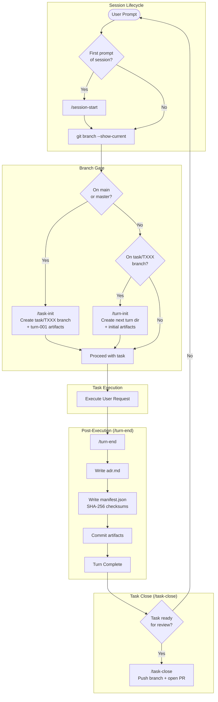

# coding-agents-config

Agentic pipeline configuration for Claude Code. Enforces a turn-based workflow with provenance tracking, branch protection, and governance rules.

## Setup

### 1. Clone the repo

```sh
git clone <repo-url> ~/coding-agents-config
```

### 2. Create symlinks (automated)

Run the setup script — it creates all symlinks and backs up any existing files:

```sh
bash scripts/setup.sh
```

<details>
<summary>Manual symlink commands</summary>

```sh
ln -s ~/coding-agents-config/skills ~/.claude/skills
ln -s ~/coding-agents-config/hooks ~/.claude/hooks
ln -s ~/coding-agents-config/agents ~/.claude/agents
ln -s ~/coding-agents-config/scripts ~/.claude/scripts
ln -s ~/coding-agents-config/CLAUDE.md ~/.claude/CLAUDE.md
ln -s ~/coding-agents-config/settings.json ~/.claude/settings.json
```

If any of these already exist, back them up first (`mv <target> <target>.bak`).
</details>

### 3. Verify

```sh
ls -la ~/.claude/skills        # should point to ~/coding-agents-config/skills
ls -la ~/.claude/hooks         # should point to ~/coding-agents-config/hooks
ls -la ~/.claude/agents        # should point to ~/coding-agents-config/agents
ls -la ~/.claude/CLAUDE.md     # should point to ~/coding-agents-config/CLAUDE.md
ls -la ~/.claude/settings.json # should point to ~/coding-agents-config/settings.json
```

## Structure

```
coding-agents-config/
├── CLAUDE.md           # Global instructions — turn protocol, branch rules
├── AGENTS.md           # Agent loader directive
├── settings.json       # Claude Code settings (model, permissions, hooks)
├── agents/             # Sub-agent definitions
│   └── agent-architecture-planner.md
├── hooks/              # Shell hooks triggered by Claude Code events
│   └── branch-guard.sh # Prevents edits on main/master
├── skills/             # Slash-command skills
│   ├── session-start/  # Initialize session context
│   ├── task-init/      # Create task branch and turn-001 artifacts
│   ├── task-close/     # Finalize task, push, and open PR
│   ├── turn-init/      # Create turn directory and initial artifacts
│   ├── turn-end/       # Finalize turn with ADR, manifest, commit
│   ├── branch-guard/   # Create task branch if on main
│   ├── af-be-build-prd/         # Generate backend PRD
│   ├── af-be-build-ddd/         # Generate DDD document from PRD
│   ├── af-be-build-dsl/         # Generate DSL YAML from DDD
│   ├── af-be-build-plan/        # Generate backend execution plan
│   ├── af-be-build-implementation/ # Execute backend code generation
│   ├── af-project-init/         # Initialize a new AppFactory project
│   └── af-memory/               # AppFactory pipeline state CRUD
├── scripts/            # Automation scripts
│   └── setup.sh
├── docs/               # Reference documentation
│   ├── app-nextjs-nestjs-prisma.md
│   ├── agent-architecture-planner.md
│   ├── ai-to-appfactory-migration-analysis.md
│   └── migration-ai-to-appfactory.md
├── archive/            # Retired skills and templates
└── .appfactory/        # Task/turn tracking and specs
    ├── tasks/          # Task branches with turns
    ├── specs/          # Specifications
    ├── prompts/        # Prompt templates
    └── memory/         # Project memory
```

## Execution Flow

The agentic pipeline enforces a strict task/turn-based workflow for all coding tasks:



### Turn Protocol Summary

| Phase | Trigger | Outputs |
|-------|---------|---------|
| **Session Start** | First prompt of session | Context loaded |
| **Task Init** | Branch is `main` / `master` | `task/TXXX` branch, turn-001 artifacts |
| **Turn Init** | Branch is `task/TXXX` | Turn dir, `turn_context.md`, `execution_trace.json` |
| **Execution** | Every coding prompt | Modified files |
| **Turn End** | After every prompt (even failures) | `adr.md`, `manifest.json`, commit |
| **Task Close** | User signals task is done | PR opened against main |

## Skills (13)

| Category | Skill | Description |
|----------|-------|-------------|
| **Session** | `session-start` | Load repository state and core pipeline context |
| **Task** | `task-init` | Initialize task branch and turn-001 artifacts |
| | `task-close` | Finalize task branch, push, and open PR |
| **Turn** | `turn-init` | Create next turn directory and initial artifacts |
| | `turn-end` | Finalize turn with ADR, manifest, and commit |
| | `branch-guard` | Create task branch if current branch is main/master |
| **AppFactory** | `af-be-build-prd` | Generate a backend Product Requirements Document |
| | `af-be-build-ddd` | Generate DDD document from an approved PRD |
| | `af-be-build-dsl` | Generate DSL YAML from a DDD document |
| | `af-be-build-plan` | Generate backend execution plan from DSL + tech stack |
| | `af-be-build-implementation` | Execute backend code generation from DSL spec |
| | `af-project-init` | Initialize a new AppFactory project scaffold |
| | `af-memory` | CRUD operations for AppFactory pipeline state |

## Agents

| Agent | Model | Description |
|-------|-------|-------------|
| `agent-architecture-planner` | Sonnet | Reads PRD/DDD/DSL and repo structure to produce architecture decisions, module maps, task plans, and review artifacts for downstream coding agents |

## Hooks

| Hook | Trigger | Purpose |
|------|---------|---------|
| `branch-guard.sh` | PreToolUse(Bash) | Block destructive operations on main/master |

## Settings

The `settings.json` configures:

- **Models**: `claude-opus-4-5` (primary), `claude-sonnet-4-6` (fast)
- **Permissions**: Pre-approved allow-list for common dev tools (`git`, `npm`, `pnpm`, `docker`, `psql`, etc.)
- **Denied**: Force-push to main, `rm -rf /`, publishing packages
- **Status line**: Custom shell command for terminal status display
- **Plugin marketplaces**: `anthropic-agent-skills` (GitHub-sourced)

## Adding a new skill

Each skill lives in its own directory under `skills/` with a `SKILL.md` file:

```
skills/my-skill/
└── SKILL.md
```

The `SKILL.md` front-matter declares the skill name, description, and triggers. Claude Code discovers skills automatically from the `~/.claude/skills` symlink.

## Syncing across machines

Since this is a standard git repo, pull on any machine to stay current:

```sh
cd ~/coding-agents-config && git pull
```

The symlinks mean changes are picked up immediately — no reinstall needed.
