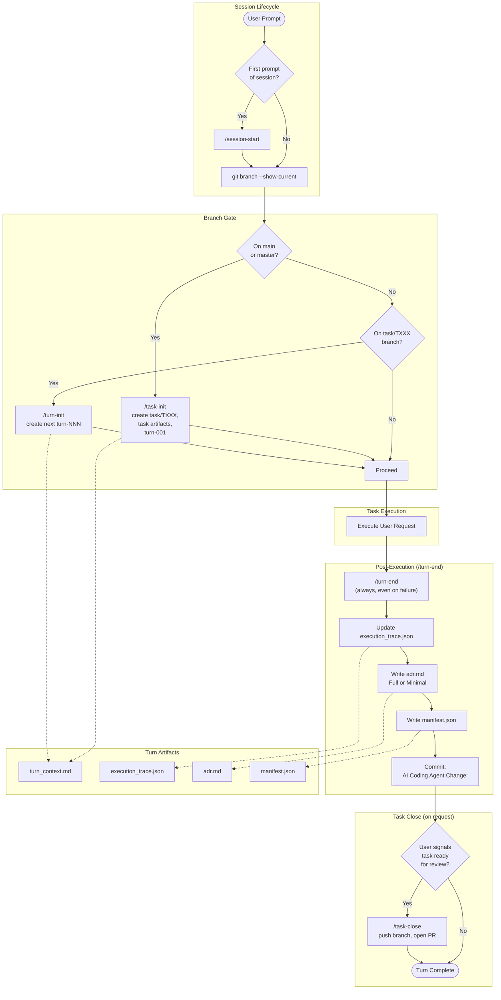

# coding-agents-config

Agentic pipeline configuration for Claude Code and Codex. Enforces task/turn-based workflow with provenance tracking, branch protection, and governance rules, plus a library of AppFactory (`af-*`) skills for spec-driven application generation.

## Setup

### 1. Clone the repo

```sh
git clone <repo-url> ~/coding-agents-config
```

### 2. Create symlinks (automated)

Run the setup script — it creates all symlinks and backs up any existing files:

```sh
bash scripts/setup.sh
```

This links into three places:

- `~/.claude/` (Claude Code): `skills`, `agents`, `rules`, `hooks`, `context`, `scripts`, `plugins`, `CLAUDE.md`, `settings.json`
- `~/.codex/` (Codex): `agents`, `AGENTS.md`
- `./.claude/` (repo-local): `CLAUDE.md`

Only items that exist in this repo are linked; missing optional directories (e.g. `rules`, `context`, `plugins`) are skipped. Any existing file or symlink at a target path is backed up to `<target>.bak` first.

<details>
<summary>Manual symlink commands</summary>

```sh
ln -s ~/coding-agents-config/skills ~/.claude/skills
ln -s ~/coding-agents-config/agents ~/.claude/agents
ln -s ~/coding-agents-config/hooks ~/.claude/hooks
ln -s ~/coding-agents-config/scripts ~/.claude/scripts
ln -s ~/coding-agents-config/CLAUDE.md ~/.claude/CLAUDE.md
ln -s ~/coding-agents-config/settings.json ~/.claude/settings.json

ln -s ~/coding-agents-config/agents ~/.codex/agents
ln -s ~/coding-agents-config/AGENTS.md ~/.codex/AGENTS.md
```

If any of these already exist, back them up first (`mv <target> <target>.bak`).
</details>

### 3. Verify

```sh
ls -la ~/.claude/skills        # should point to ~/coding-agents-config/skills
ls -la ~/.claude/agents        # should point to ~/coding-agents-config/agents
ls -la ~/.claude/hooks         # should point to ~/coding-agents-config/hooks
ls -la ~/.claude/CLAUDE.md     # should point to ~/coding-agents-config/CLAUDE.md
ls -la ~/.claude/settings.json # should point to ~/coding-agents-config/settings.json
ls -la ~/.codex/AGENTS.md      # should point to ~/coding-agents-config/AGENTS.md
```

## Structure

```
coding-agents-config/
├── CLAUDE.md           # Global instructions — task/turn protocol, branch rules
├── AGENTS.md           # Codex loader directive — points at ~/.claude/CLAUDE.md
├── settings.json       # Claude Code settings (model, permissions)
├── hooks/              # Shell hooks triggered by Claude Code events
│   └── branch-guard.sh # Auto-creates a task/TXXX branch when on main/master
├── skills/             # Slash-command skills (37 SKILL.md files)
│   ├── .system/        # Meta-skills (skill-creator, skill-installer, plugin-creator, ...)
│   ├── .nestjs/         # NestJS/Prisma code-generation skills
│   ├── session-start/  # Load repo/git state at session start
│   ├── task-init/       # Create task branch + task_context + turn-001
│   ├── turn-init/       # Create the next turn within an active task branch
│   ├── turn-end/        # Finalize a turn (trace, ADR, manifest, commit)
│   ├── task-close/      # Push the task branch and open a pull request
│   ├── branch-guard/    # Create a task branch if on main/master
│   ├── af-*/            # AppFactory skills: PRD, DDD, planning, implementation, checks
│   ├── dsl-utils/, ui-utils/, unit-tests/, e2e-tests/  # Supporting/utility skills
│   └── ...
├── agents/              # Reusable agent definitions
│   └── agent-architecture-planner.md
├── scripts/             # Automation scripts
│   ├── setup.sh          # Creates the symlinks described above
│   └── af-state.sh       # Helpers for reading/writing .appfactory/memory/state.yaml
├── .appfactory/         # Task/turn tracking and specs for this repo's own work
│   ├── tasks/           # task-XXX/ directories with turns/turn-XXX/ artifacts
│   ├── tasks_index.csv  # Registry of all tasks (branch, status, PR URL, turn count)
│   ├── specs/           # Specifications
│   ├── prompts/         # Prompt templates
│   └── memory/          # Project memory (state.yaml)
├── archive/             # Retired skills and templates kept for reference
├── docs/                # Reference documentation (AppFactory plan, migration notes, ...)
└── .github/             # PR and issue templates
```

## Execution Flow

The agentic pipeline enforces a strict task/turn-based workflow for all coding prompts:


```mermaid
flowchart TB
    subgraph SESSION["Session Lifecycle"]
        START([User Prompt]) --> SS{First prompt<br/>of session?}
        SS -->|Yes| SESSION_START["/session-start"]
        SS -->|No| CHECK_BRANCH
        SESSION_START --> CHECK_BRANCH["git branch --show-current"]
    end

    subgraph BRANCH_GATE["Branch Gate"]
        CHECK_BRANCH --> IS_MAIN{On main<br/>or master?}
        IS_MAIN -->|Yes| TASK_INIT["/task-init<br/>create task/TXXX,<br/>task artifacts,<br/>turn-001"]
        IS_MAIN -->|No| IS_TASK{On task/TXXX<br/>branch?}
        IS_TASK -->|Yes| TURN_INIT["/turn-init<br/>create next turn-NNN"]
        IS_TASK -->|No| PROCEED
        TASK_INIT --> PROCEED["Proceed"]
        TURN_INIT --> PROCEED
    end

    subgraph EXECUTION["Task Execution"]
        PROCEED --> EXEC["Execute User Request"]
    end

    subgraph POST_EXEC["Post-Execution (/turn-end)"]
        EXEC --> TURN_END["/turn-end<br/>(always, even on failure)"]
        TURN_END --> WRITE_TRACE["Update execution_trace.json"]
        WRITE_TRACE --> WRITE_ADR["Write adr.md<br/>Full or Minimal"]
        WRITE_ADR --> WRITE_MANIFEST["Write manifest.json"]
        WRITE_MANIFEST --> COMMIT["Commit:<br/>AI Coding Agent Change:"]
    end

    subgraph TASK_CLOSE["Task Close (on request)"]
        COMMIT --> READY{User signals<br/>task ready<br/>for review?}
        READY -->|Yes| TASK_CLOSE_STEP["/task-close<br/>push branch, open PR"]
        READY -->|No| DONE([Turn Complete])
        TASK_CLOSE_STEP --> DONE
    end

    subgraph ARTIFACTS["Turn Artifacts"]
        direction LR
        A1["turn_context.md"]
        A2["execution_trace.json"]
        A3["adr.md"]
        A4["manifest.json"]
    end

    WRITE_TRACE -.-> A2
    WRITE_ADR -.-> A3
    WRITE_MANIFEST -.-> A4
    TASK_INIT -.-> A1
    TURN_INIT -.-> A1
```

### Task/Turn Protocol Summary

| Phase | Trigger | Steps | Outputs |
|-------|---------|-------|---------|
| **Session Start** | First prompt of the session | `/session-start` loads git state and repo context | Context loaded |
| **Task Init** | Current branch is `main`/`master` | `/task-init` creates `task/TXXX`, task artifacts, and `turn-001` | `task_context.md`, `task_status.json`, `task_summary.md`, `pull_request.md`, turn-001 artifacts |
| **Turn Init** | Current branch is `task/TXXX` | `/turn-init` resolves and creates the next `turn-NNN` | `turn_context.md`, `execution_trace.json` |
| **Execution** | Every coding prompt | Execute the user's request | Modified files |
| **Turn End** | After every execution, even on failure | `/turn-end` updates trace, writes ADR + manifest, commits | `adr.md`, `manifest.json`, commit |
| **Task Close** | User signals the task is ready for review | `/task-close` pushes the branch and opens a PR against `main` | Pull request |

Task IDs are global and zero-padded to 3 digits (`001`, `002`, ...); turn IDs reset per task and are also zero-padded to 3 digits. See `CLAUDE.md` for the full rules, including the hard gate that blocks writes on `main`/`master`.

## Skills (37)

| Category | Skill | Description |
|----------|-------|-------------|
| **Session/Task/Turn** | `session-start` | Load repository state and core pipeline context |
| | `task-init` | Initialize a new task branch and create task + turn-001 artifacts |
| | `turn-init` | Initialize the next turn within the active task branch |
| | `turn-end` | Finalize the active turn after execution |
| | `task-close` | Finalize the active task branch, push it, and open a pull request |
| | `branch-guard` | Check current git branch and create a task branch if on main/master |
| **AppFactory (af-\*)** | `af-orchestrator` | Orchestrates the App Factory software development lifecycle |
| | `af-project-init` | Orchestrate AppFactory project initialization |
| | `af-memory` | CRUD operations for AppFactory pipeline state (`.appfactory/memory/state.yaml`) |
| | `af-be-prd-build` | Build a business-facing backend PRD from an intake worksheet |
| | `af-be-ddd-orchestrator` | Orchestrate backend DDD workflow through build, analyze, refactor, and test phases |
| | `af-be-ddd-build` | Generate a backend Domain-Driven Design document from an approved PRD |
| | `af-be-ddd-analysis` | Analyze a backend DDD document |
| | `af-be-ddd-refactor` | Refactor a backend DDD document |
| | `af-be-ddd-dsl` | Generate a backend application DSL YAML document from a DDD document |
| | `af-ddd-tests` (`af-be-ddd-tests`) | Generate Gherkin-style BDD scenarios from DDD and PRD specifications |
| | `af-be-plan` | Generate a backend execution plan from a domain DSL and tech stack profile |
| | `af-be-implementation` | Generate backend domain code from the execution plan and BDD feature specs |
| | `af-app-check` | Audit an application for production readiness (security, database, deployment, code quality) |
| **NestJS/Prisma (`.nestjs/`)** | `app-from-dsl` | Orchestrate full-stack application generation from app-dsl YAML specs |
| | `nestjs-crud-resource` | Generate a NestJS CRUD module (controller, service, DTOs) from a DSL backend spec |
| | `nestjs-prisma-resource` | Generate a complete NestJS CRUD resource backed by Prisma |
| | `nestjs-customer-crud-scaffold` | Scaffold a NestJS customer CRUD app via the Nest CLI |
| | `nestjs-observability` | Add structured observability (logging, correlation IDs, redaction) to a Prisma-backed NestJS app |
| | `field-mapper-generator` | Generate field mapper/converter utilities from DSL mapper specs |
| | `prisma-persistence` | Generate Prisma schema and migrations from a DSL persistence model |
| | `prisma-guidelines` | Prisma ORM development guidelines and constraints |
| **DSL/UI/Test utilities** | `dsl-model-interpreter` (`dsl-utils/`) | Parse and validate app-dsl YAML specifications |
| | `ui-implementation-language` (`ui-utils/`) | Declarative YAML standard for UI pages, forms, and state bindings |
| | `test-implementation-sync` (`unit-tests/`) | Keep unit tests synchronized with service/DTO implementations |
| | `http-test-artifacts` (`e2e-tests/`) | Generate `.http` request files for API endpoint testing |
| **Misc** | `eval-labeler` | Label and compare model responses (Response A vs B) for coding tasks |

### Meta-Skills (`.system/`)

| Skill | Description |
|-------|-------------|
| `skill-creator` | Guide for creating and updating skills |
| `skill-installer` | Install skills into `$CODEX_HOME/skills` from a curated list or GitHub repo |
| `plugin-creator` | Scaffold Codex plugin directories and marketplace entries |
| `imagegen` | Generate or edit raster images for tasks that need bitmap visual assets |
| `openai-docs` | Look up official OpenAI documentation and model guidance |

## Hooks

| Hook | Trigger | Purpose |
|------|---------|---------|
| `branch-guard.sh` | PreToolUse (write/bash tools) | Auto-creates the next `task/TXXX` branch when invoked on `main`/`master` |

## Adding a new skill

Each skill lives in its own directory under `skills/` with a `SKILL.md` file:

```
skills/my-skill/
└── SKILL.md
```

The `.system/skill-creator` meta-skill can guide you through creating one — invoke it from Claude Code.

## Archive

`archive/` holds retired skills and templates (e.g. earlier versions of `schema-to-database`, `shadcn`, `legacy-turns`) kept for reference. They are not symlinked into `~/.claude/` or `~/.codex/`.

## Syncing across machines

Since this is a standard git repo, pull on any machine to stay current:

```sh
cd ~/coding-agents-config && git pull
```

The symlinks mean changes are picked up immediately — no reinstall needed.
