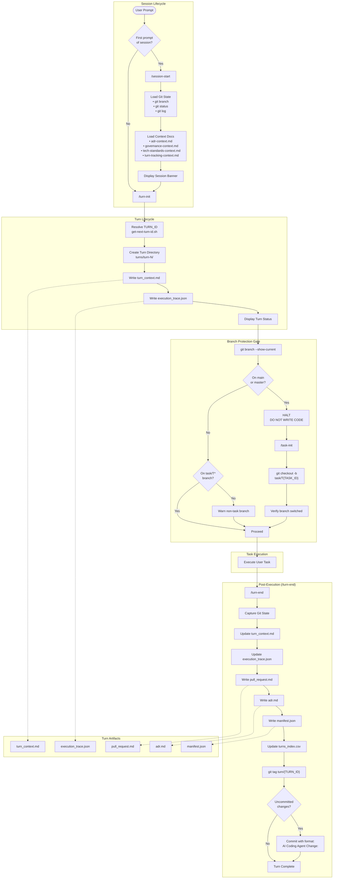

# coding-agents-config

Agentic pipeline configuration for Claude Code and Codex. Enforces a turn-based workflow with provenance tracking, branch protection, and governance rules. Provides the full AppFactory software development lifecycle as composable skills.

## Setup

### 1. Clone the repo

```sh
git clone <repo-url> ~/coding-agents-config
```

### 2. Create symlinks (automated)

Run the setup script — it creates all symlinks and backs up any existing files:

```sh
bash scripts/setup.sh
```

The script links the following into `~/.claude/`:

| Item | Purpose |
|------|---------|
| `skills/` | Slash-command skills |
| `agents/` | Agent definitions |
| `hooks/` | Claude Code event hooks |
| `scripts/` | Automation scripts |
| `CLAUDE.md` | Global instructions |
| `settings.json` | Claude Code settings |

It also links `agents/` and `AGENTS.md` into `~/.codex/` for Codex support.

<details>
<summary>Manual symlink commands</summary>

```sh
ln -s ~/coding-agents-config/skills   ~/.claude/skills
ln -s ~/coding-agents-config/agents   ~/.claude/agents
ln -s ~/coding-agents-config/hooks    ~/.claude/hooks
ln -s ~/coding-agents-config/scripts  ~/.claude/scripts
ln -s ~/coding-agents-config/CLAUDE.md    ~/.claude/CLAUDE.md
ln -s ~/coding-agents-config/settings.json ~/.claude/settings.json

ln -s ~/coding-agents-config/agents   ~/.codex/agents
ln -s ~/coding-agents-config/AGENTS.md ~/.codex/AGENTS.md
```

If any of these already exist, back them up first (`mv <target> <target>.bak`).
</details>

### 3. Verify

```sh
ls -la ~/.claude/skills        # should point to ~/coding-agents-config/skills
ls -la ~/.claude/agents        # should point to ~/coding-agents-config/agents
ls -la ~/.claude/hooks         # should point to ~/coding-agents-config/hooks
ls -la ~/.claude/CLAUDE.md     # should point to ~/coding-agents-config/CLAUDE.md
ls -la ~/.claude/settings.json # should point to ~/coding-agents-config/settings.json
```

## Structure

```
coding-agents-config/
├── CLAUDE.md           # Global instructions — turn protocol, branch rules
├── AGENTS.md           # Codex agent loader directive
├── settings.json       # Claude Code settings (model, permissions)
├── agents/             # Agent definition files
│   └── agent-architecture-planner.md
├── hooks/              # Shell hooks triggered by Claude Code events
│   └── branch-guard.sh # Prevents edits on main/master
├── skills/             # Slash-command skills
│   ├── .system/        # Meta-skills (skill-creator, skill-installer, imagegen, plugin-creator)
│   ├── .nestjs/        # NestJS & Prisma code-generation skills
│   ├── dsl-utils/      # DSL parsing and validation
│   ├── e2e-tests/      # E2E and HTTP test artifact generation
│   ├── ui-utils/       # UI implementation utilities
│   ├── unit-tests/     # Unit test synchronization
│   ├── session-start/  # Initialize session context
│   ├── task-init/      # Create task branch and artifacts
│   ├── task-close/     # Finalize task and open pull request
│   ├── turn-init/      # Create turn directory and initial artifacts
│   ├── turn-end/       # Finalize turn with PR, ADR, manifest
│   ├── branch-guard/   # Ensure execution is on a task branch
│   ├── af-orchestrator/         # AppFactory SDLC orchestrator
│   ├── af-project-init/         # Project initialization
│   ├── af-be-prd-build/         # PRD generation
│   ├── af-be-ddd-orchestrator/  # DDD workflow orchestrator
│   ├── af-be-ddd-build/         # DDD document generation
│   ├── af-be-ddd-analysis/      # DDD quality analysis
│   ├── af-be-ddd-refactor/      # DDD refactoring
│   ├── af-be-ddd-tests/         # BDD test generation
│   ├── af-be-ddd-dsl/           # DSL generation from DDD
│   ├── af-be-plan/              # Backend execution planning
│   ├── af-be-implementation/    # Backend code implementation
│   ├── af-app-check/            # Production-readiness audit
│   ├── af-memory/               # Pipeline state management
│   └── eval-labeler/            # Model response evaluation
├── scripts/            # Automation scripts
│   ├── setup.sh        # Create all ~/.claude and ~/.codex symlinks
│   └── af-state.sh     # AppFactory state management utilities
├── docs/               # Reference documentation
├── .appfactory/        # Task/turn tracking and specs
│   ├── tasks/          # Task branches with turns
│   ├── specs/          # Specifications
│   ├── prompts/        # Prompt templates
│   └── memory/         # Project memory / pipeline state
└── .github/            # GitHub issue and PR templates
```

## Execution Flow

The agentic pipeline enforces a strict turn-based workflow for all coding tasks:


```mermaid
flowchart TB
    subgraph SESSION["Session Lifecycle"]
        START([User Prompt]) --> SS{First prompt<br/>of session?}
        SS -->|Yes| SESSION_START["/session-start"]
        SS -->|No| TURN_INIT

        SESSION_START --> LOAD_GIT["Load Git State<br/>• git branch<br/>• git status<br/>• git log"]
        LOAD_GIT --> LOAD_CTX["Load Context Docs<br/>• adr-context.md<br/>• governance-context.md<br/>• tech-standards-context.md<br/>• turn-tracking-context.md"]
        LOAD_CTX --> BANNER["Display Session Banner"]
        BANNER --> TURN_INIT
    end

    subgraph TURN["Turn Lifecycle"]
        TURN_INIT["/turn-init"] --> RESOLVE_ID["Resolve TURN_ID<br/>get-next-turn-id.sh"]
        RESOLVE_ID --> CREATE_DIR["Create Turn Directory<br/>turns/turn-N/"]
        CREATE_DIR --> WRITE_CTX["Write turn_context.md"]
        WRITE_CTX --> WRITE_TRACE["Write execution_trace.json"]
        WRITE_TRACE --> TURN_BANNER["Display Turn Status"]
    end

    subgraph BRANCH_GATE["Branch Protection Gate"]
        TURN_BANNER --> CHECK_BRANCH["git branch --show-current"]
        CHECK_BRANCH --> IS_MAIN{On main<br/>or master?}
        IS_MAIN -->|Yes| HALT["HALT<br/>DO NOT WRITE CODE"]
        HALT --> TASK_INIT["/task-init"]
        TASK_INIT --> CREATE_BRANCH["git checkout -b<br/>task/T{TASK_ID}"]
        CREATE_BRANCH --> VERIFY["Verify branch switched"]
        IS_MAIN -->|No| IS_TURN{On task/T*<br/>branch?}
        IS_TURN -->|Yes| PROCEED["Proceed"]
        IS_TURN -->|No| WARN["Warn non-task branch"]
        WARN --> PROCEED
        VERIFY --> PROCEED
    end

    subgraph EXECUTION["Task Execution"]
        PROCEED --> EXEC["Execute User Task"]
    end

    subgraph POST_EXEC["Post-Execution (/turn-end)"]
        EXEC --> TURN_END["/turn-end"]
        TURN_END --> CAPTURE_GIT["Capture Git State"]
        CAPTURE_GIT --> UPDATE_CTX["Update turn_context.md"]
        UPDATE_CTX --> UPDATE_TRACE["Update execution_trace.json"]
        UPDATE_TRACE --> WRITE_PR["Write pull_request.md"]
        WRITE_PR --> WRITE_ADR["Write adr.md"]
        WRITE_ADR --> WRITE_MANIFEST["Write manifest.json"]
        WRITE_MANIFEST --> UPDATE_INDEX["Update turns_index.csv"]
        UPDATE_INDEX --> TAG["git tag turn/{TURN_ID}"]
        TAG --> CHECK_UNCOMMITTED{Uncommitted<br/>changes?}
        CHECK_UNCOMMITTED -->|Yes| COMMIT["Commit with format:<br/>AI Coding Agent Change:"]
        CHECK_UNCOMMITTED -->|No| COMPLETE
        COMMIT --> COMPLETE["Turn Complete"]
    end

    subgraph ARTIFACTS["Turn Artifacts"]
        direction LR
        A1["turn_context.md"]
        A2["execution_trace.json"]
        A3["pull_request.md"]
        A4["adr.md"]
        A5["manifest.json"]
    end

    WRITE_CTX -.-> A1
    WRITE_TRACE -.-> A2
    WRITE_PR -.-> A3
    WRITE_ADR -.-> A4
    WRITE_MANIFEST -.-> A5
```

### Turn Protocol Summary

| Phase | Steps | Outputs |
|-------|-------|---------|
| **Session Start** | Load git state → Load 4 context docs → Display banner | Context loaded |
| **Turn Init** | Resolve ID → Create dir → Write context + trace | `turn_context.md`, `execution_trace.json` |
| **Branch Gate** | Check branch → HALT if main → Run `/task-init` | Safe task branch |
| **Execution** | Execute task | Modified files |
| **Turn End** | Update context → Write PR → ADR → Manifest → Index → Tag | 5 artifacts complete |

## Skills

### Lifecycle Skills

| Skill | Description |
|-------|-------------|
| `session-start` | Load repository state and core pipeline context at session start |
| `task-init` | Initialize a new task branch and create task + turn-001 artifacts |
| `task-close` | Finalize the active task branch, push it, and open a pull request |
| `turn-init` | Initialize the next turn within the active task branch |
| `turn-end` | Finalize the active turn with PR, ADR, manifest, and commit |
| `branch-guard` | Ensure execution is on a task-scoped branch; create one if on main |

### AppFactory Pipeline Skills

The AppFactory pipeline is orchestrated by `af-orchestrator` and runs the following phases in sequence:

| # | Phase | Skill | Description |
|---|-------|-------|-------------|
| 1 | Initialization | `af-project-init` | Orchestrate project setup and export environment variables |
| 2 | Requirements | `af-be-prd-build` | Build business-facing PRD from worksheets and discovery notes |
| 3 | DDD | `af-be-ddd-orchestrator` | Orchestrate backend DDD workflow through build → analyze → refactor loop |
| 4 | | `af-be-ddd-build` | Generate human-readable DDD document from approved PRD |
| 5 | | `af-be-ddd-analysis` | Analyze DDD spec for quality, completeness, and PRD alignment |
| 6 | | `af-be-ddd-refactor` | Refactor DDD based on analysis findings |
| 7 | Testing | `af-be-ddd-tests` | Generate Gherkin BDD scenarios from DDD and PRD |
| 8 | Planning | `af-be-plan` | Backend execution plan and strategy definition |
| 9 | DSL | `af-be-ddd-dsl` | Generate Domain-Specific Language from DDD specifications |
| 10 | Implementation | `af-be-implementation` | Backend code implementation from DDD specifications |
| 11 | Validation | `af-app-check` | Production-readiness audit across security, DB, deployment, and quality |
| 12 | Utility | `af-memory` | CRUD operations for pipeline state in `.appfactory/memory/state.yaml` |

### NestJS Skills (`skills/.nestjs/`)

| Skill | Description |
|-------|-------------|
| `app-from-dsl` | Full-stack application generation from app-dsl YAML specifications |
| `field-mapper-generator` | Generate field mapper/converter utilities between UI, API, and persistence layers |
| `nestjs-crud-resource` | Generate NestJS CRUD module with controller, service, and DTOs from DSL backend spec |
| `nestjs-customer-crud-scaffold` | Scaffold a NestJS customer CRUD application from a schema file |
| `nestjs-observability` | Add structured observability (logging, correlation IDs, Prisma query logging) to NestJS apps |
| `nestjs-prisma-resource` | Generate a complete NestJS CRUD resource backed by Prisma from an input schema |
| `prisma-guidelines` | Prisma ORM development guidelines and constraints reference |
| `prisma-persistence` | Generate Prisma schema and migrations from DSL persistence model |

### Utility Skills

| Skill | Description |
|-------|-------------|
| `dsl-model-interpreter` | Parse and validate app-dsl YAML specifications |
| `ui-implementation-language` | UI implementation language standards and conventions |
| `test-implementation-sync` | Ensure unit tests are synchronized with service/DTO implementations |
| `http-test-artifacts` | Generate `.http` request files for REST API endpoint testing |
| `eval-labeler` | Evaluate and label model responses (Response A vs B) for coding tasks |

### Meta-Skills (`skills/.system/`)

| Skill | Description |
|-------|-------------|
| `skill-creator` | Create new skills with SKILL.md scaffolding |
| `skill-installer` | Install skills from GitHub marketplaces |
| `plugin-creator` | Create new Claude Code plugins |
| `imagegen` | AI image generation via OpenAI |
| `openai-docs` | OpenAI API documentation reference |

## Agents

| Agent | Description |
|-------|-------------|
| `agent-architecture-planner` | Architecture and planning agent — reads PRD, DDD, DSL, and repo structure to produce specification alignment, architecture decisions, module maps, and task plans |

## Hooks

| Hook | Trigger | Purpose |
|------|---------|---------|
| `branch-guard.sh` | PreToolUse(Edit) | Block edits on main/master |

## Scripts

| Script | Purpose |
|--------|---------|
| `setup.sh` | Create all `~/.claude` and `~/.codex` symlinks with backup support |
| `af-state.sh` | AppFactory state management utilities — source in af-* skills to manage `state.yaml` |

## Adding a new skill

Each skill lives in its own directory under `skills/` with a `SKILL.md` file:

```
skills/my-skill/
└── SKILL.md
```

The `.system/skill-creator` meta-skill can guide you through creating one — invoke it from Claude Code:

```
/skill-creator
```

## Syncing across machines

Since this is a standard git repo, pull on any machine to stay current:

```sh
cd ~/coding-agents-config && git pull
```

The symlinks mean changes are picked up immediately — no reinstall needed.
