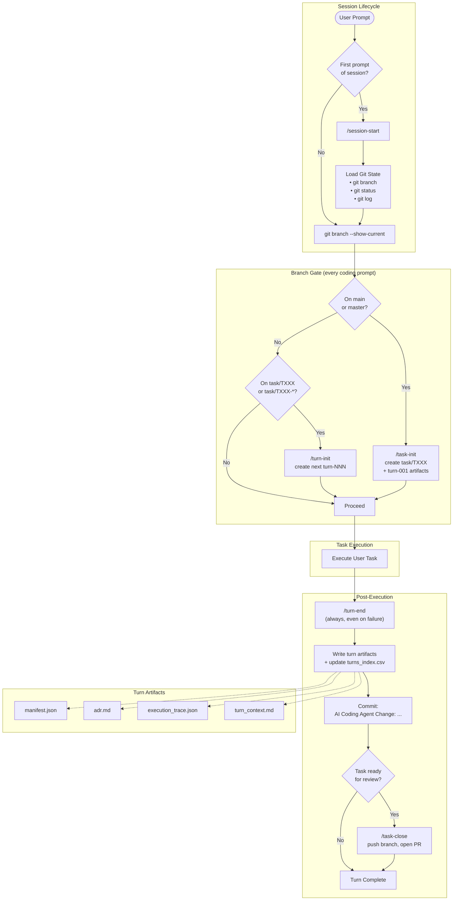

# coding-agents-config

Agentic pipeline configuration for Claude Code (and Codex). Enforces a task/turn-based workflow with provenance tracking, branch protection, and governance rules, plus the **App Factory** skill set for spec-to-code software delivery.

## Setup

### 1. Clone the repo

```sh
git clone <repo-url> ~/coding-agents-config
```

### 2. Create symlinks (automated)

Run the setup script — it creates all symlinks and backs up any existing files:

```sh
bash scripts/setup.sh
```

It links into three locations:

- `~/.claude/` — `skills`, `agents`, `hooks`, `scripts`, `CLAUDE.md`, `settings.json` (plus `rules`, `context`, `plugins` if present)
- `~/.codex/` — `agents`, `AGENTS.md`
- `./.claude/` (repo-local) — `CLAUDE.md`

<details>
<summary>Manual symlink commands</summary>

```sh
ln -s ~/coding-agents-config/skills ~/.claude/skills
ln -s ~/coding-agents-config/agents ~/.claude/agents
ln -s ~/coding-agents-config/hooks ~/.claude/hooks
ln -s ~/coding-agents-config/scripts ~/.claude/scripts
ln -s ~/coding-agents-config/CLAUDE.md ~/.claude/CLAUDE.md
ln -s ~/coding-agents-config/settings.json ~/.claude/settings.json
ln -s ~/coding-agents-config/agents ~/.codex/agents
ln -s ~/coding-agents-config/AGENTS.md ~/.codex/AGENTS.md
```

If any of these already exist, back them up first (`mv <target> <target>.bak`).

</details>

### 3. Verify

```sh
ls -la ~/.claude/skills        # should point to ~/coding-agents-config/skills
ls -la ~/.claude/agents        # should point to ~/coding-agents-config/agents
ls -la ~/.claude/hooks         # should point to ~/coding-agents-config/hooks
ls -la ~/.claude/CLAUDE.md     # should point to ~/coding-agents-config/CLAUDE.md
ls -la ~/.claude/settings.json # should point to ~/coding-agents-config/settings.json
ls -la ~/.codex/AGENTS.md      # should point to ~/coding-agents-config/AGENTS.md
```

## Structure

```
coding-agents-config/
├── CLAUDE.md           # Claude Code global instructions — task/turn protocol, branch rules
├── AGENTS.md           # Codex loader directive — points to ~/.claude/CLAUDE.md
├── settings.json       # Claude Code settings (model, permissions, hooks, plugins)
├── package.json        # Node deps (caveman plugin support)
├── hooks/              # Shell hooks triggered by Claude Code events
│   └── branch-guard.sh # PreToolUse hook: auto-creates a task branch when on main/master
├── agents/              # Standalone subagent definitions
│   └── agent-architecture-planner.md
├── skills/              # Slash-command / auto-invoked skills
│   ├── .system/          # Codex system skills (skill-creator, skill-installer, plugin-creator, imagegen, openai-docs)
│   ├── session-start/    # Load repo + pipeline context at session start
│   ├── task-init/        # Create task/TXXX branch + turn-001 (run on main/master)
│   ├── turn-init/        # Create the next turn inside the active task
│   ├── turn-end/         # Finalize a turn (always run after execution)
│   ├── task-close/       # Push the task branch and open a PR
│   ├── branch-guard/     # Fallback branch guard (mirrors hooks/branch-guard.sh)
│   ├── af-orchestrator/  # Drives the App Factory SDLC end to end
│   ├── af-project-init/  # Bootstrap a new AppFactory target project
│   ├── af-memory/        # CRUD for .appfactory/state.yaml pipeline state
│   ├── af-be-prd-build/  # Business PRD → backend PRD document
│   ├── af-be-ddd-build/  # PRD → Domain-Driven Design document
│   ├── af-be-ddd-dsl/    # DDD → backend domain DSL (YAML)
│   ├── af-be-ddd-analysis/   # Analyze DSL/DDD for gaps and drift
│   ├── af-be-ddd-refactor/   # Refactor DSL/DDD based on analysis findings
│   ├── af-be-ddd-tests/  # DSL/PRD → Gherkin BDD feature specs
│   ├── af-be-ddd-orchestrator/ # Build → analyze → refactor → test loop
│   ├── af-be-plan/       # DSL + tech-stack profile → execution plan
│   ├── af-be-implementation/ # Execution plan + BDD specs → generated backend code
│   ├── af-app-check/     # Production-readiness audit (security, DB, deploy, quality)
│   ├── eval-labeler/     # Label/score Response A vs Response B evals
│   ├── dsl-utils/        # dsl-model-interpreter tooling
│   ├── e2e-tests/        # http-test-artifacts tooling
│   ├── ui-utils/         # ui-implementation-language tooling
│   └── unit-tests/       # test-implementation-sync tooling
├── scripts/             # Automation scripts
│   ├── setup.sh         # Create the symlinks above
│   └── af-state.sh      # AppFactory state helper
├── .appfactory/         # Task/turn tracking and pipeline state
│   ├── tasks/           # task-XXX/ directories with turns/, status, PR draft
│   ├── tasks_index.csv  # One row per task: branch, status, PR URL, turn count
│   ├── changelog.md     # Turn-by-turn history reconstructed from artifacts
│   ├── specs/           # Specifications
│   ├── prompts/         # Prompt templates
│   └── memory/          # Project memory
├── docs/                # Reference documentation (migration notes, plans, skill summary)
├── .github/             # PR and issue templates
├── archive/             # Retired skills, docs, and templates kept for reference
└── node_modules/        # caveman plugin dependency
```

Per-skill templates (task/turn scaffolds, prompt templates, etc.) live under each skill's own `templates/` directory, e.g. `skills/task-init/templates/`, `skills/turn-init/templates/`.

## Execution Flow

The agentic pipeline enforces a strict task/turn-based workflow for all coding tasks:


```mermaid
flowchart TB
    subgraph SESSION["Session Lifecycle"]
        START([User Prompt]) --> SS{First prompt<br/>of session?}
        SS -->|Yes| SESSION_START["/session-start"]
        SS -->|No| BRANCH_CHECK
        SESSION_START --> LOAD_GIT["Load Git State<br/>• git branch<br/>• git status<br/>• git log"]
        LOAD_GIT --> BRANCH_CHECK
    end

    subgraph BRANCH_GATE["Branch Gate (every coding prompt)"]
        BRANCH_CHECK["git branch --show-current"] --> IS_MAIN{On main<br/>or master?}
        IS_MAIN -->|Yes| TASK_INIT["/task-init<br/>create task/TXXX<br/>+ turn-001 artifacts"]
        IS_MAIN -->|No| IS_TASK{On task/TXXX<br/>or task/TXXX-*?}
        IS_TASK -->|Yes| TURN_INIT["/turn-init<br/>create next turn-NNN"]
        IS_TASK -->|No| PROCEED
        TASK_INIT --> PROCEED["Proceed"]
        TURN_INIT --> PROCEED
    end

    subgraph EXECUTION["Task Execution"]
        PROCEED --> EXEC["Execute User Task"]
    end

    subgraph POST_EXEC["Post-Execution"]
        EXEC --> TURN_END["/turn-end<br/>(always, even on failure)"]
        TURN_END --> WRITE_ARTIFACTS["Write turn artifacts<br/>+ update turns_index.csv"]
        WRITE_ARTIFACTS --> COMMIT["Commit:<br/>AI Coding Agent Change: ..."]
        COMMIT --> READY{Task ready<br/>for review?}
        READY -->|Yes| TASK_CLOSE["/task-close<br/>push branch, open PR"]
        READY -->|No| COMPLETE["Turn Complete"]
        TASK_CLOSE --> COMPLETE
    end

    subgraph ARTIFACTS["Turn Artifacts"]
        direction LR
        A1["turn_context.md"]
        A2["execution_trace.json"]
        A3["adr.md"]
        A4["manifest.json"]
    end

    WRITE_ARTIFACTS -.-> A1
    WRITE_ARTIFACTS -.-> A2
    WRITE_ARTIFACTS -.-> A3
    WRITE_ARTIFACTS -.-> A4
```

### Task/Turn Protocol Summary

| Phase | Skill | When | Outputs |
|-------|-------|------|---------|
| **Session Start** | `session-start` | First prompt of the session | Git state + context loaded |
| **Task Init** | `task-init` | Current branch is `main`/`master` | `task/TXXX` branch, `task_context.md`, turn-001 |
| **Turn Init** | `turn-init` | Already on a `task/TXXX` branch | Next `turns/turn-NNN/` directory |
| **Execution** | — | Every coding prompt | Modified files |
| **Turn End** | `turn-end` | After every prompt, even on failure | `turn_context.md`, `execution_trace.json`, `adr.md`, `manifest.json` |
| **Task Close** | `task-close` | User signals the task is ready for review | Pushed branch + pull request |

Branch protection is enforced twice: `hooks/branch-guard.sh` runs as a `PreToolUse` hook on `Bash` calls and auto-creates a `task/TXXX` branch if the agent is still on `main`/`master`; the `branch-guard` skill provides the same behavior as a callable fallback.

## Skills

Skills live under `skills/<name>/SKILL.md`. Three groups:

### Pipeline (task/turn lifecycle)

| Skill | Description |
|-------|-------------|
| `session-start` | Load repository state and core pipeline context at the start of every session |
| `task-init` | Initialize a new task branch and create task + turn-001 artifacts (run on `main`/`master`) |
| `turn-init` | Initialize the next turn within the active task branch |
| `turn-end` | Finalize the active turn after execution, every time |
| `task-close` | Finalize the active task branch, push it, and open a pull request against `main` |
| `branch-guard` | Check current git branch and create a turn-scoped branch if on `main`/`master` |

### App Factory (spec-to-code SDLC)

| Skill | Description |
|-------|-------------|
| `af-orchestrator` | Orchestrates the App Factory Software Development Lifecycle end to end |
| `af-project-init` | Bootstrap AppFactory project initialization (env vars + helper script) |
| `af-memory` | CRUD operations against `.appfactory/state.yaml` pipeline state |
| `af-be-prd-build` | Build a business-facing backend PRD from an intake worksheet |
| `af-be-ddd-build` | Generate a backend Domain-Driven Design document from an approved PRD |
| `af-be-ddd-dsl` | Generate a backend domain DSL (YAML) from a DDD document |
| `af-be-ddd-analysis` | Analyze DSL/DDD artifacts for gaps, contradictions, and drift |
| `af-be-ddd-refactor` | Refactor DSL/DDD based on analysis findings |
| `af-be-ddd-tests` | Generate Gherkin BDD feature files from DDD and PRD specifications |
| `af-be-ddd-orchestrator` | Orchestrate the DDD build → analyze → refactor → test loop |
| `af-be-plan` | Generate a backend execution plan from a domain DSL and tech-stack profile |
| `af-be-implementation` | Copy a tech-stack implementation and generate domain code from the plan + BDD specs |
| `af-app-check` | Audit an application for production readiness (security, database, deployment, quality) |

### Utility

| Skill | Description |
|-------|-------------|
| `eval-labeler` | Process `Eval.md` files to score/compare Response A vs Response B for coding tasks |
| `dsl-utils/dsl-model-interpreter` | DSL model interpretation tooling |
| `e2e-tests/http-test-artifacts` | HTTP-based end-to-end test artifact tooling |
| `ui-utils/ui-implementation-language` | UI implementation language tooling |
| `unit-tests/test-implementation-sync` | Keeps unit tests in sync with implementation |

### Codex system skills (`skills/.system/`)

Bundled for Codex parity (see `AGENTS.md` / `~/.codex` symlinks): `skill-creator`, `skill-installer`, `plugin-creator`, `imagegen`, `openai-docs`.

## Agents

Standalone subagent definitions under `agents/`, symlinked to both `~/.claude/agents` and `~/.codex/agents`:

| Agent | Description |
|-------|-------------|
| `agent-architecture-planner` | Reads PRD/DDD/DSL and repo structure to produce architecture decisions, module maps, task plans, and sequencing for downstream coding agents |

## Hooks

| Hook | Trigger | Purpose |
|------|---------|---------|
| `branch-guard.sh` | `PreToolUse` (Bash) | Auto-create a `task/TXXX` branch instead of allowing writes on `main`/`master` |

## App Factory state (`.appfactory/`)

Task/turn provenance and AppFactory pipeline state live under `.appfactory/`:

- `tasks/task-XXX/` — task context, status, summary, PR draft, and per-turn artifacts
- `tasks_index.csv` — one row per task (branch, status, PR URL, turn count)
- `changelog.md` — turn-by-turn history reconstructed from surviving artifacts
- `specs/`, `prompts/`, `memory/` — specifications, prompt templates, and pipeline memory

## Archive

`archive/` holds skills, docs, and templates retired from active use (older scaffolding skills such as `schema-to-database`, `nestjs-crud-resource`, `react-form-page`, plus legacy turn artifacts) — kept for reference, not symlinked or loaded by the pipeline.

## Adding a new skill

Each skill lives in its own directory under `skills/` with a `SKILL.md` file:

```
skills/my-skill/
└── SKILL.md
```

The `.system/skill-creator` meta-skill can guide you through creating one — invoke it from Claude Code or Codex.

## Syncing across machines

Since this is a standard git repo, pull on any machine to stay current:

```sh
cd ~/coding-agents-config && git pull
```

The symlinks mean changes are picked up immediately — no reinstall needed.
