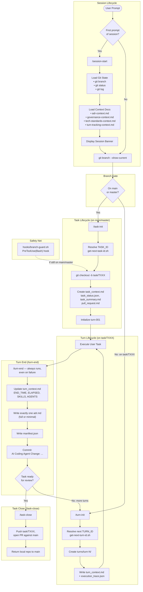

# coding-agents-config

Shared configuration for coding agents (Claude Code and Codex): a turn/task-based
governance layer with provenance tracking and branch protection, plus the
**App Factory** skill pipeline for spec-to-code application generation
(PRD → Domain-Driven Design → DSL → execution plan → backend implementation).

## Setup

### 1. Clone the repo

```sh
git clone <repo-url> ~/coding-agents-config
```

### 2. Create symlinks (automated)

Run the setup script — it creates all symlinks and backs up any existing files:

```sh
bash scripts/setup.sh
```

<details>
<summary>Manual symlink commands</summary>

Into `~/.claude/` (Claude Code):

```sh
ln -s ~/coding-agents-config/skills    ~/.claude/skills
ln -s ~/coding-agents-config/agents    ~/.claude/agents
ln -s ~/coding-agents-config/hooks     ~/.claude/hooks
ln -s ~/coding-agents-config/scripts   ~/.claude/scripts
ln -s ~/coding-agents-config/CLAUDE.md ~/.claude/CLAUDE.md
ln -s ~/coding-agents-config/settings.json ~/.claude/settings.json
```

Into `~/.codex/` (Codex):

```sh
ln -s ~/coding-agents-config/agents    ~/.codex/agents
ln -s ~/coding-agents-config/AGENTS.md ~/.codex/AGENTS.md
```

Into the repo-local `./.claude/` (so `CLAUDE.md` resolves inside the repo itself):

```sh
ln -s ~/coding-agents-config/CLAUDE.md ~/coding-agents-config/.claude/CLAUDE.md
```

`scripts/setup.sh` also links `rules/`, `context/`, and `plugins/` into
`~/.claude/` if those directories are present. If any target already exists,
back it up first (`mv <target> <target>.bak`).
</details>

### 3. Verify

```sh
ls -la ~/.claude/skills        # should point to ~/coding-agents-config/skills
ls -la ~/.claude/agents        # should point to ~/coding-agents-config/agents
ls -la ~/.claude/hooks         # should point to ~/coding-agents-config/hooks
ls -la ~/.claude/CLAUDE.md     # should point to ~/coding-agents-config/CLAUDE.md
ls -la ~/.claude/settings.json # should point to ~/coding-agents-config/settings.json
ls -la ~/.codex/AGENTS.md      # should point to ~/coding-agents-config/AGENTS.md
```

## Structure

```
coding-agents-config/
├── CLAUDE.md            # Global instructions — turn/task protocol, branch rules
├── AGENTS.md            # Codex loader directive (points at ~/.claude/CLAUDE.md)
├── settings.json         # Claude Code settings (model, permissions, hooks, plugins)
├── package.json          # Root Node dependency (caveman, for skill templating)
├── hooks/                 # Shell hooks triggered by Claude Code events
│   └── branch-guard.sh   # PreToolUse hook — auto-creates a task/TXXX branch off main/master
├── agents/                # Reusable subagent definitions
│   └── agent-architecture-planner.md
├── skills/                 # Slash-command skills, one directory per skill
│   ├── .system/            # Meta-skills (skill-creator, skill-installer, plugin-creator, imagegen, openai-docs)
│   ├── session-start/      # Initialize session context
│   ├── task-init/          # Create task branch + turn-001 artifacts (run on main/master)
│   ├── turn-init/          # Create the next turn directory + artifacts (run on a task branch)
│   ├── turn-end/           # Finalize a turn — ADR, manifest, execution trace
│   ├── task-close/         # Finalize a task — commit, push, open PR against main
│   ├── branch-guard/       # Turn-scoped branch guard (skill form of hooks/branch-guard.sh)
│   ├── af-*/                # App Factory SDLC pipeline skills (see below)
│   ├── .nestjs/             # NestJS/Prisma code-generation skills
│   ├── dsl-utils/           # app-dsl YAML parsing/validation
│   ├── e2e-tests/           # HTTP test artifact generation
│   ├── ui-utils/            # UI DSL language reference
│   ├── unit-tests/          # Test/implementation sync checks
│   └── eval-labeler/        # Model response evaluation labeling
│       └── <skill>/templates/  # Each skill keeps its own templates alongside it
├── .appfactory/            # Task/turn tracking and App Factory pipeline state
│   ├── tasks/               # task-XXX/ dirs — task_context.md, task_status.json, turns/
│   ├── tasks_index.csv      # Registry of all tasks (branch, status, PR URL, turn count)
│   ├── specs/                # Specifications
│   ├── prompts/               # Prompt templates and drafts
│   ├── memory/                 # Project memory
│   └── changelog.md            # Pipeline changelog
├── docs/                    # Reference documentation (migration analyses, architecture notes)
├── archive/                  # Retired/superseded skills, kept for reference
└── .github/                   # PR template and issue templates
```

## Execution Flow

The agentic pipeline enforces a turn-based workflow nested inside a task-based
workflow for all coding tasks. A **task** is the branch-scoped unit of work
that becomes one pull request; a **turn** is one AI execution cycle within
that task branch.


```mermaid
flowchart TB
    subgraph SESSION["Session Lifecycle"]
        START([User Prompt]) --> SS{First prompt<br/>of session?}
        SS -->|Yes| SESSION_START["/session-start"]
        SS -->|No| BRANCH_CHECK
        SESSION_START --> LOAD_GIT["Load Git State<br/>• git branch<br/>• git status<br/>• git log"]
        LOAD_GIT --> LOAD_CTX["Load Context Docs<br/>• adr-context.md<br/>• governance-context.md<br/>• tech-standards-context.md<br/>• turn-tracking-context.md"]
        LOAD_CTX --> BANNER["Display Session Banner"]
        BANNER --> BRANCH_CHECK
    end

    subgraph BRANCH_GATE["Branch Gate"]
        BRANCH_CHECK["git branch --show-current"] --> IS_MAIN{On main<br/>or master?}
    end

    subgraph TASK["Task Lifecycle (on main/master)"]
        IS_MAIN -->|Yes| TASK_INIT["/task-init"]
        TASK_INIT --> RESOLVE_TASK["Resolve TASK_ID<br/>get-next-task-id.sh"]
        RESOLVE_TASK --> NEW_TASK_BRANCH["git checkout -b task/TXXX"]
        NEW_TASK_BRANCH --> TASK_ARTIFACTS["Create task_context.md<br/>task_status.json, task_summary.md<br/>pull_request.md"]
        TASK_ARTIFACTS --> TURN_001["Initialize turn-001"]
    end

    subgraph TURN["Turn Lifecycle (on task/TXXX)"]
        IS_MAIN -->|No: on task/TXXX| TURN_INIT["/turn-init"]
        TURN_001 --> EXEC
        TURN_INIT --> RESOLVE_TURN["Resolve next TURN_ID<br/>get-next-turn-id.sh"]
        RESOLVE_TURN --> CREATE_DIR["Create turns/turn-N/"]
        CREATE_DIR --> WRITE_CTX["Write turn_context.md<br/>+ execution_trace.json"]
        WRITE_CTX --> EXEC["Execute User Task"]
    end

    subgraph POST_EXEC["Turn End (/turn-end)"]
        EXEC --> TURN_END["/turn-end — always runs,<br/>even on failure"]
        TURN_END --> UPDATE_CTX["Update turn_context.md<br/>END_TIME, ELAPSED, SKILLS, AGENTS"]
        UPDATE_CTX --> WRITE_ADR["Write exactly one adr.md<br/>(full or minimal)"]
        WRITE_ADR --> WRITE_MANIFEST["Write manifest.json"]
        WRITE_MANIFEST --> COMMIT["Commit:<br/>AI Coding Agent Change: ..."]
        COMMIT --> OPEN{Task ready<br/>for review?}
    end

    subgraph CLOSE["Task Close (/task-close)"]
        OPEN -->|Yes| TASK_CLOSE["/task-close"]
        TASK_CLOSE --> PUSH["Push task/TXXX,<br/>open PR against main"]
        PUSH --> RETURN["Return local repo to main"]
        OPEN -->|No: more turns| TURN_INIT
    end

    subgraph GUARD["Safety Net"]
        HOOK["hooks/branch-guard.sh<br/>PreToolUse(Bash) hook"] -.->|"if still on main/master"| NEW_TASK_BRANCH
    end
```

### Turn/Task Protocol Summary

| Phase | Trigger | Steps | Outputs |
|-------|---------|-------|---------|
| **Session Start** | First prompt of session | Load git state → load 4 context docs → display banner | Context loaded |
| **Task Init** | Branch is `main`/`master` | Resolve `TASK_ID` → create `task/TXXX` → seed task artifacts + turn-001 | `task_context.md`, `task_status.json`, `task_summary.md`, `pull_request.md` |
| **Turn Init** | Branch is `task/TXXX` | Resolve next `TURN_ID` → create turn dir → write context + trace | `turn_context.md`, `execution_trace.json` |
| **Execution** | Every prompt | Execute the user's request | Modified files |
| **Turn End** | After every prompt, even on failure | Finalize context → write ADR → write manifest → commit | `adr.md`, `manifest.json`, commit |
| **Task Close** | User signals task is ready for review | Update task artifacts → push → open PR → return to `main` | PR against `main` |

`hooks/branch-guard.sh` is a `PreToolUse(Bash)` safety net: if a write/bash
tool call is about to run while still on `main`/`master`, it auto-creates the
next `task/TXXX` branch so code is never committed directly to the trunk.

## Skills

### Pipeline Control

| Skill | Description |
|-------|--------------|
| `session-start` | Load repository state and core pipeline context at session start |
| `task-init` | Initialize a new task branch (`task/TXXX`) and create task + turn-001 artifacts |
| `turn-init` | Initialize the next turn within the active task branch |
| `turn-end` | Finalize the active turn — ADR, manifest, execution trace |
| `task-close` | Finalize the active task, push it, and open a pull request against `main` |
| `branch-guard` | Turn-scoped branch guard skill (create a turn branch if still on main) |

### App Factory — Backend SDLC Pipeline (`af-*`)

Orchestrated end-to-end by `af-orchestrator`, generating a backend application
from a PRD worksheet through to running code:

| Skill | Phase | Description |
|-------|-------|--------------|
| `af-project-init` | Initialization | Export required environment variables and bootstrap the AppFactory project |
| `af-be-prd-build` | Requirements | Build a business-facing PRD from a worksheet/questionnaire |
| `af-be-ddd-orchestrator` | Domain-Driven Design | Orchestrate the DDD build → analyze → refactor loop |
| `af-be-ddd-build` | | Generate a human-readable DDD document from an approved PRD |
| `af-be-ddd-analysis` | | Analyze a DDD document for quality, completeness, and PRD alignment |
| `af-be-ddd-refactor` | | Refactor the DDD document based on analysis findings |
| `af-be-ddd-tests` | Testing | Generate Gherkin-style BDD feature files from DDD + PRD specs |
| `af-be-plan` | Planning | Generate a backend execution plan from a domain DSL and tech-stack profile |
| `af-be-ddd-dsl` | DSL Generation | Generate a backend domain DSL (YAML) from the DDD document |
| `af-be-implementation` | Implementation | Copy the selected tech-stack implementation and generate domain code from the plan + BDD specs |
| `af-app-check` | Validation | Audit an application for production readiness (security, DB, deployment, code quality) |
| `af-memory` | Cross-cutting | CRUD operations on `.appfactory/state.yaml` — shared pipeline state across skills |

### Scaffolding — NestJS / Prisma (`.nestjs/`)

| Skill | Description |
|-------|--------------|
| `app-from-dsl` | Orchestrate full-stack generation (entity, CRUD API, forms, tests) from app-dsl YAML |
| `nestjs-crud-resource` | Generate a NestJS CRUD module (controller, service, DTOs) from a DSL backend spec |
| `nestjs-prisma-resource` | Generate a full NestJS + Prisma CRUD resource from an input schema |
| `nestjs-customer-crud-scaffold` | Scaffold a NestJS customer CRUD app via a non-interactive Nest CLI wrapper |
| `nestjs-observability` | Add structured logging, correlation IDs, and redaction to a NestJS + Prisma backend |
| `field-mapper-generator` | Generate field mapper/converter utilities from DSL mapper specs |
| `prisma/prisma-persistence` | Generate Prisma schema and migrations from a DSL persistence model |
| `prisma/prisma-guidelines` | Prisma development guidelines and constraints reference |

### DSL & Utilities

| Skill | Description |
|-------|--------------|
| `dsl-utils/dsl-model-interpreter` | Parse and validate app-dsl YAML specifications |
| `ui-utils/ui-implementation-language` | Declarative YAML language reference for UI pages, forms, and bindings |
| `e2e-tests/http-test-artifacts` | Generate `.http` request files for REST endpoint testing |
| `unit-tests/test-implementation-sync` | Ensure unit tests stay synchronized with service/DTO implementations |

### Evaluation

| Skill | Description |
|-------|--------------|
| `eval-labeler` | Process `Eval.md` files to label and compare two model responses (Response A vs B) |

### Meta-Skills (`.system/`)

| Skill | Description |
|-------|--------------|
| `skill-creator` | Guide for creating and updating skills |
| `skill-installer` | Install skills into `$CODEX_HOME/skills` from a curated list or GitHub repo |
| `plugin-creator` | Scaffold plugin directories with `.codex-plugin/plugin.json` and marketplace entries |
| `imagegen` | Generate or edit raster images (photos, illustrations, textures, mockups) |
| `openai-docs` | Look up official OpenAI API/model documentation with citations |

## Templates

Templates are no longer centralized — each skill keeps the templates it needs
alongside it, under `skills/<skill>/templates/`. Notable examples:

| Template | Skill |
|----------|-------|
| `task_context.md`, `turn_context.md` | `task-init/templates/` |
| `turn_context.md` | `turn-init/templates/` |
| `ddd-template.md` | `af-be-ddd-build/templates/` |
| `domain-dsl-template.yaml` | `af-be-ddd-dsl/templates/` |
| `feature-template.gherkin`, `gherkin-spec-template.md` | `af-be-ddd-tests/templates/` |
| `execution-plan-template.md` | `af-be-plan/templates/` |
| `prd-template.md` | `af-be-prd-build/templates/` |
| `implementation-manifest-template.yaml` | `af-be-implementation/templates/` |
| `gitignore.template` | `af-project-init/templates/` |

ADR format, PR description format, and commit message format are defined in
`CLAUDE.md` rather than as standalone template files.

## Hooks

| Hook | Trigger | Purpose |
|------|---------|---------|
| `branch-guard.sh` | `PreToolUse(Bash)` | Auto-create the next `task/TXXX` branch if still on `main`/`master` |

## Adding a new skill

Each skill lives in its own directory under `skills/` with a `SKILL.md` file:

```
skills/my-skill/
└── SKILL.md
```

The `.system/skill-creator` meta-skill can guide you through creating one — invoke it from Claude Code.

## Docs

Reference material and design history lives in `docs/`:

- `appFactory-plan.md` — App Factory pipeline design
- `app-nextjs-nestjs-prisma.md` — Next.js/NestJS/Prisma tech-stack notes
- `skill-summary.md` — Table of App Factory skills, phases, and invocation order
- `ai-to-appfactory-migration-analysis.md`, `migration-ai-to-appfactory.md` — Migration analyses from earlier pipeline iterations

Superseded skills are kept for reference under `archive/`.

## Syncing across machines

Since this is a standard git repo, pull on any machine to stay current:

```sh
cd ~/coding-agents-config && git pull
```

The symlinks mean changes are picked up immediately — no reinstall needed.
