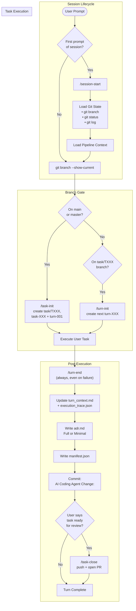

# coding-agents-config

Agentic pipeline configuration for Claude Code and Codex. Enforces a turn-based workflow with provenance tracking, branch protection, and governance rules, plus the App Factory skill library for DDD-driven backend generation.

## Setup

### 1. Clone the repo

```sh
git clone <repo-url> ~/coding-agents-config
```

### 2. Create symlinks (automated)

Run the setup script — it links the repo into `~/.claude/` (Claude Code), `~/.codex/` (Codex), and a repo-local `./.claude/`, backing up any existing files:

```sh
bash scripts/setup.sh
```

<details>
<summary>Manual symlink commands</summary>

```sh
# ~/.claude/ (Claude Code)
ln -s ~/coding-agents-config/skills ~/.claude/skills
ln -s ~/coding-agents-config/agents ~/.claude/agents
ln -s ~/coding-agents-config/hooks ~/.claude/hooks
ln -s ~/coding-agents-config/scripts ~/.claude/scripts
ln -s ~/coding-agents-config/CLAUDE.md ~/.claude/CLAUDE.md
ln -s ~/coding-agents-config/settings.json ~/.claude/settings.json

# ~/.codex/ (Codex)
ln -s ~/coding-agents-config/agents ~/.codex/agents
ln -s ~/coding-agents-config/AGENTS.md ~/.codex/AGENTS.md

# repo-local ./.claude/
ln -s ~/coding-agents-config/CLAUDE.md ~/coding-agents-config/.claude/CLAUDE.md
```

If any of these already exist, back them up first (`mv <target> <target>.bak`).

`rules/`, `context/`, and `plugins/` are also linked by the script if present; they're optional, machine-local, and not committed to this repo (see `.gitignore`).
</details>

### 3. Verify

```sh
ls -la ~/.claude/skills        # should point to ~/coding-agents-config/skills
ls -la ~/.claude/agents        # should point to ~/coding-agents-config/agents
ls -la ~/.claude/hooks         # should point to ~/coding-agents-config/hooks
ls -la ~/.claude/CLAUDE.md     # should point to ~/coding-agents-config/CLAUDE.md
ls -la ~/.claude/settings.json # should point to ~/coding-agents-config/settings.json
```

## Structure

```
coding-agents-config/
├── CLAUDE.md           # Global instructions — turn protocol, branch rules
├── AGENTS.md           # Codex loader directive (points at ~/.claude/CLAUDE.md)
├── settings.json       # Claude Code settings (model, permissions, hooks, plugins)
├── package.json        # Plugin marketplace dependency (caveman)
├── hooks/              # Shell hooks triggered by Claude Code events
│   └── branch-guard.sh # Auto-creates a task branch when on main/master
├── agents/             # Standalone subagent definitions
│   └── agent-architecture-planner.md
├── skills/             # Slash-command skills
│   ├── .system/        # Meta-skills (skill-creator, skill-installer, plugin-creator, imagegen, openai-docs)
│   ├── session-start/  # Load repo state and pipeline context at session start
│   ├── task-init/      # Create a new task branch + task-001 artifacts
│   ├── turn-init/       # Initialize the next turn within the active task
│   ├── turn-end/        # Finalize the active turn (PR, ADR, manifest)
│   ├── task-close/      # Finalize the task branch, push, open a PR
│   ├── branch-guard/    # Create a turn-scoped branch if on main/master
│   ├── af-orchestrator/         # App Factory SDLC orchestrator
│   ├── af-project-init/         # Initialize an App Factory project
│   ├── af-be-prd-build/         # Build a backend PRD from a worksheet
│   ├── af-be-ddd-orchestrator/  # Orchestrate DDD build/analyze/refactor/test loop
│   ├── af-be-ddd-build/         # Generate a DDD doc from an approved PRD
│   ├── af-be-ddd-analysis/      # Audit a DDD doc for quality/completeness
│   ├── af-be-ddd-refactor/      # Apply DDD analysis findings
│   ├── af-be-ddd-tests/         # Generate Gherkin BDD scenarios from DDD + PRD
│   ├── af-be-ddd-dsl/           # Generate a backend DSL YAML from a DDD doc
│   ├── af-be-plan/              # Generate a backend execution plan from DSL
│   ├── af-be-implementation/    # Generate backend code from plan + BDD specs
│   ├── af-app-check/            # Production-readiness audit
│   ├── af-memory/               # CRUD on .appfactory/state.yaml pipeline state
│   ├── dsl-utils/dsl-model-interpreter/        # Parse/validate app-dsl YAML
│   ├── e2e-tests/http-test-artifacts/          # Generate .http request files
│   ├── ui-utils/ui-implementation-language/    # Declarative UI YAML spec
│   ├── unit-tests/test-implementation-sync/    # Keep tests in sync with implementation
│   └── eval-labeler/    # Label/score model response evaluations
├── archive/             # Deprecated skills, prior templates, legacy turn data
├── docs/                # Reference documentation (migration notes, skill summary, plans)
├── scripts/             # Automation scripts
│   ├── setup.sh         # Creates the symlinks above
│   └── af-state.sh      # Helper for af-memory state.yaml access
├── .appfactory/         # Task/turn tracking and specs
│   ├── tasks/           # Task branches with turns (task_context.md, task_status.json, ...)
│   ├── specs/           # Specifications
│   ├── prompts/         # Prompt templates
│   ├── memory/          # Project memory
│   ├── tasks_index.csv  # Registry of all tasks and their status
│   └── changelog.md     # Turn-by-turn change history
└── .github/             # Issue and PR templates
```

## Execution Flow

The agentic pipeline enforces a strict turn-based workflow for all coding tasks:


```mermaid
flowchart TB
    subgraph SESSION["Session Lifecycle"]
        START([User Prompt]) --> SS{First prompt<br/>of session?}
        SS -->|Yes| SESSION_START["/session-start"]
        SS -->|No| BRANCH_CHECK

        SESSION_START --> LOAD_GIT["Load Git State<br/>• git branch<br/>• git status<br/>• git log"]
        LOAD_GIT --> LOAD_CTX["Load Pipeline Context"]
        LOAD_CTX --> BRANCH_CHECK
    end

    subgraph BRANCH_GATE["Branch Gate"]
        BRANCH_CHECK["git branch --show-current"] --> IS_MAIN{On main<br/>or master?}
        IS_MAIN -->|Yes| TASK_INIT["/task-init<br/>create task/TXXX,<br/>task-XXX + turn-001"]
        IS_MAIN -->|No| IS_TASK{On task/TXXX<br/>branch?}
        IS_TASK -->|Yes| TURN_INIT["/turn-init<br/>create next turn-XXX"]
        TASK_INIT --> EXEC
        TURN_INIT --> EXEC
    end

    subgraph EXECUTION["Task Execution"]
        EXEC["Execute User Task"]
    end

    subgraph POST_EXEC["Post-Execution"]
        EXEC --> TURN_END["/turn-end<br/>(always, even on failure)"]
        TURN_END --> WRITE_CTX["Update turn_context.md<br/>+ execution_trace.json"]
        WRITE_CTX --> WRITE_ADR["Write adr.md<br/>Full or Minimal"]
        WRITE_ADR --> WRITE_MANIFEST["Write manifest.json"]
        WRITE_MANIFEST --> COMMIT["Commit:<br/>AI Coding Agent Change:"]
        COMMIT --> READY{User says<br/>task ready<br/>for review?}
        READY -->|Yes| TASK_CLOSE["/task-close<br/>push + open PR"]
        READY -->|No| COMPLETE["Turn Complete"]
        TASK_CLOSE --> COMPLETE
    end
```

### Turn Protocol Summary

| Phase | Trigger | Steps | Outputs |
|-------|---------|-------|---------|
| **Session Start** | First prompt of session | Load git state → load pipeline context | Context loaded |
| **Task Init** | Branch is `main`/`master` | Resolve next task id → `git checkout -b task/TXXX` → scaffold task + turn-001 | `task-XXX/` artifacts |
| **Turn Init** | Already on `task/TXXX` | Resolve next turn id → create `turns/turn-XXX/` | `turn_context.md`, `execution_trace.json` |
| **Execution** | Every prompt | Execute the user's request | Modified files |
| **Turn End** | After every prompt, even on failure | Update context/trace → write ADR + manifest → commit | `adr.md`, `manifest.json`, commit |
| **Task Close** | User signals task is ready for review | Push branch → open PR | `pull_request.md`, PR opened |

## Skills

| Category | Skill | Description |
|----------|-------|-------------|
| **Pipeline** | `session-start` | Load repository state and core pipeline context at session start |
| | `task-init` | Initialize a new task branch and create task + turn-001 artifacts |
| | `turn-init` | Initialize the next turn within the active task branch |
| | `turn-end` | Finalize the active turn after execution |
| | `task-close` | Finalize the active task branch, push it, and open a PR against main |
| | `branch-guard` | Create a turn-scoped branch if on main/master |
| **App Factory — Orchestration** | `af-orchestrator` | Orchestrate the App Factory software development lifecycle |
| | `af-project-init` | Initialize an App Factory project by exporting required env vars |
| **App Factory — PRD/DDD** | `af-be-prd-build` | Build a backend PRD from an intake worksheet |
| | `af-be-ddd-orchestrator` | Orchestrate the DDD build/analyze/refactor/test loop |
| | `af-be-ddd-build` | Generate a human-readable DDD doc from an approved PRD |
| | `af-be-ddd-analysis` | Audit a DDD spec for quality, completeness, and PRD alignment |
| | `af-be-ddd-refactor` | Refactor a DDD spec based on analysis findings |
| | `af-be-ddd-tests` | Generate Gherkin BDD scenarios from DDD + PRD specs |
| | `af-be-ddd-dsl` | Generate a backend DSL YAML from a DDD doc |
| **App Factory — Plan/Build** | `af-be-plan` | Generate a backend execution plan from a DSL + tech stack profile |
| | `af-be-implementation` | Generate backend code from the execution plan + BDD specs |
| | `af-app-check` | Audit an application for production readiness |
| **App Factory — Utility** | `af-memory` | CRUD operations on `.appfactory/state.yaml` pipeline state |
| | `dsl-utils/dsl-model-interpreter` | Parse and validate `app-dsl` YAML specifications |
| | `e2e-tests/http-test-artifacts` | Generate `.http` request files for API endpoint testing |
| | `ui-utils/ui-implementation-language` | Declarative YAML spec for UI pages, forms, and widgets |
| | `unit-tests/test-implementation-sync` | Keep unit tests synchronized with implementation |
| **Evaluation** | `eval-labeler` | Label and score model-response evaluation runs |

### Meta-Skills (`.system/`)

| Skill | Description |
|-------|-------------|
| `skill-creator` | Create new skills with SKILL.md |
| `skill-installer` | Install skills from marketplaces |
| `plugin-creator` | Scaffold a new Claude Code plugin |
| `imagegen` | Image generation helper |
| `openai-docs` | OpenAI/Codex documentation reference |

## Agents

| Agent | Purpose |
|-------|---------|
| `agent-architecture-planner` | Reads PRD/DDD/DSL and repo structure to produce architecture decisions, module maps, and task plans for downstream coding agents |

## Hooks

| Hook | Trigger | Purpose |
|------|---------|---------|
| `branch-guard.sh` | `PreToolUse(Bash)` | Auto-create a task branch instead of allowing writes on main/master |

## Archive

`archive/` holds deprecated skills and legacy artifacts kept for reference, including the prior `templates/` directory (`adr_template.md`, `pull_request_template.md`, `manifest.schema.json`, `metadata_header.txt`, `branch_naming.md`, `commit_message.md`, `tech-stack.template.md`) and earlier DSL-to-app generation skills (`app-from-dsl`, `field-mapper-generator`, `nestjs-crud-resource`, `react-form-page`, `schema-to-database`, etc.). See `archive/README.md` and `archive/SUMMARY.md`.

## Adding a new skill

Each skill lives in its own directory under `skills/` with a `SKILL.md` file:

```
skills/my-skill/
└── SKILL.md
```

The `.system/skill-creator` meta-skill can guide you through creating one — invoke it from Claude Code.

## Syncing across machines

Since this is a standard git repo, pull on any machine to stay current:

```sh
cd ~/coding-agents-config && git pull
```

The symlinks mean changes are picked up immediately — no reinstall needed.
