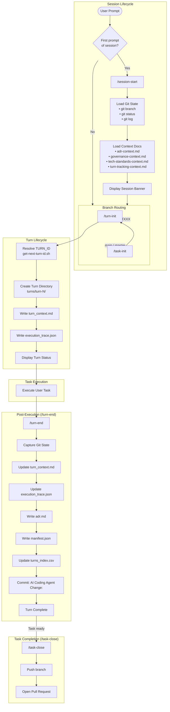

# coding-agents-config

Agentic pipeline configuration for Claude Code. Enforces a task/turn-based workflow with provenance tracking, branch protection, and governance rules. Also hosts the AppFactory backend pipeline for AI-driven application generation.

## Setup

### 1. Clone the repo

```sh
git clone <repo-url> ~/coding-agents-config
```

### 2. Create symlinks (automated)

Run the setup script — it creates all symlinks and backs up any existing files:

```sh
bash scripts/setup.sh
```

<details>
<summary>Manual symlink commands</summary>

```sh
ln -s ~/coding-agents-config/skills ~/.claude/skills
ln -s ~/coding-agents-config/hooks ~/.claude/hooks
ln -s ~/coding-agents-config/CLAUDE.md ~/.claude/CLAUDE.md
ln -s ~/coding-agents-config/settings.json ~/.claude/settings.json
```

If any of these already exist, back them up first (`mv <target> <target>.bak`).
</details>

### 3. Verify

```sh
ls -la ~/.claude/skills        # should point to ~/coding-agents-config/skills
ls -la ~/.claude/hooks         # should point to ~/coding-agents-config/hooks
ls -la ~/.claude/CLAUDE.md     # should point to ~/coding-agents-config/CLAUDE.md
ls -la ~/.claude/settings.json # should point to ~/coding-agents-config/settings.json
```

## Structure

```
coding-agents-config/
├── CLAUDE.md               # Global instructions — task/turn protocol, branch rules
├── AGENTS.md               # Agent loader directive
├── settings.json           # Claude Code settings (model, permissions, hooks)
├── hooks/                  # Shell hooks triggered by Claude Code events
│   └── branch-guard.sh     # Blocks edits on main/master
├── skills/                 # Slash-command skills
│   ├── .system/            # Meta-skills (skill-creator, skill-installer, plugin-creator, imagegen, openai-docs)
│   ├── .nestjs/            # NestJS-specific generation skills
│   ├── session-start/      # Load session state and context docs
│   ├── task-init/          # Initialize task branch and first turn
│   ├── task-close/         # Finalize task, push branch, open PR
│   ├── turn-init/          # Create next turn directory and artifacts
│   ├── turn-end/           # Finalize turn with ADR, manifest, and commit
│   ├── branch-guard/       # Create task branch if on main/master
│   ├── af-project-init/    # Initialize a new AppFactory project
│   ├── af-be-build-prd/    # Build backend PRD from intake worksheet
│   ├── af-be-build-ddd/    # Generate DDD document from PRD
│   ├── af-be-build-dsl/    # Generate backend DSL YAML from DDD
│   ├── af-be-build-plan/   # Generate backend execution plan from DSL + tech stack
│   ├── af-be-build-implementation/ # Execute backend code generation from DSL
│   ├── af-memory/          # CRUD for AppFactory pipeline state (state.yml)
│   ├── dsl-utils/          # DSL model interpreter utilities
│   ├── e2e-tests/          # E2E test artifact generation
│   ├── ui-utils/           # UI implementation language utilities
│   └── unit-tests/         # Unit test sync utilities
├── agents/                 # Sub-agent definitions
│   └── agent-architecture-planner.md
├── docs/                   # Reference documentation and migration guides
├── scripts/                # Automation scripts
│   └── setup.sh
└── archive/                # Deprecated skills, legacy turns, and old templates
    ├── templates/          # Legacy turn lifecycle templates
    └── legacy-turns/       # Historical turn records
```

## Execution Flow

The agentic pipeline enforces a strict task/turn-based workflow for all coding tasks:


```mermaid
flowchart TB
    subgraph SESSION["Session Lifecycle"]
        START([User Prompt]) --> SS{First prompt<br/>of session?}
        SS -->|Yes| SESSION_START["/session-start"]
        SS -->|No| BRANCH_CHECK

        SESSION_START --> LOAD_GIT["Load Git State<br/>• git branch<br/>• git status<br/>• git log"]
        LOAD_GIT --> LOAD_CTX["Load Context Docs<br/>• adr-context.md<br/>• governance-context.md<br/>• tech-standards-context.md<br/>• turn-tracking-context.md"]
        LOAD_CTX --> BANNER["Display Session Banner"]
        BANNER --> BRANCH_CHECK
    end

    subgraph BRANCH_CHECK["Branch Routing"]
        BRANCH_CHECK{Branch?} -->|main / master| TASK_INIT["/task-init"]
        BRANCH_CHECK -->|task/TXXX| TURN_INIT["/turn-init"]
        TASK_INIT --> TURN_INIT
    end

    subgraph TURN["Turn Lifecycle"]
        TURN_INIT --> RESOLVE_ID["Resolve TURN_ID<br/>get-next-turn-id.sh"]
        RESOLVE_ID --> CREATE_DIR["Create Turn Directory<br/>turns/turn-N/"]
        CREATE_DIR --> WRITE_CTX["Write turn_context.md"]
        WRITE_CTX --> WRITE_TRACE["Write execution_trace.json"]
        WRITE_TRACE --> TURN_BANNER["Display Turn Status"]
    end

    subgraph EXECUTION["Task Execution"]
        TURN_BANNER --> EXEC["Execute User Task"]
    end

    subgraph POST_EXEC["Post-Execution (/turn-end)"]
        EXEC --> TURN_END["/turn-end"]
        TURN_END --> CAPTURE_GIT["Capture Git State"]
        CAPTURE_GIT --> UPDATE_CTX["Update turn_context.md"]
        UPDATE_CTX --> UPDATE_TRACE["Update execution_trace.json"]
        UPDATE_TRACE --> WRITE_ADR["Write adr.md"]
        WRITE_ADR --> WRITE_MANIFEST["Write manifest.json"]
        WRITE_MANIFEST --> UPDATE_INDEX["Update turns_index.csv"]
        UPDATE_INDEX --> COMMIT["Commit: AI Coding Agent Change:"]
        COMMIT --> COMPLETE["Turn Complete"]
    end

    subgraph TASK_DONE["Task Completion (/task-close)"]
        COMPLETE -->|Task ready| TASK_CLOSE["/task-close"]
        TASK_CLOSE --> PUSH["Push branch"]
        PUSH --> PR["Open Pull Request"]
    end
```

### Turn Protocol Summary

| Phase | Steps | Outputs |
|-------|-------|---------|
| **Session Start** | Load git state → Load 4 context docs → Display banner | Context loaded |
| **Task Init** | Create `task/TXXX` branch → Init task artifacts → Create turn-001 | Task + turn dirs |
| **Turn Init** | Resolve ID → Create dir → Write context + trace | `turn_context.md`, `execution_trace.json` |
| **Execution** | Execute task | Modified files |
| **Turn End** | Update context → Write ADR → Manifest → Index → Commit | 4 artifacts + commit |
| **Task Close** | Push branch → Open PR | Pull request |

## Skills

### Lifecycle Skills

| Skill | Description |
|-------|-------------|
| `session-start` | Load repository state and core pipeline context. Run at the start of every session. |
| `task-init` | Initialize a new task branch and create task + turn-001 artifacts. Run when on main/master. |
| `task-close` | Finalize the active task branch, push it, and open a pull request against main. |
| `turn-init` | Initialize the next turn within the active task branch. |
| `turn-end` | Finalize the active turn after execution. Run after every coding prompt, even on failure. |
| `branch-guard` | Create a task-scoped branch if the current branch is main or master. |

### AppFactory Backend Pipeline

The `af-*` skills implement a multi-stage pipeline for generating backend applications:

```
intake → /af-be-build-prd → /af-be-build-ddd → /af-be-build-dsl → /af-be-build-plan → /af-be-build-implementation
```

| Skill | Description |
|-------|-------------|
| `af-project-init` | Initialize a new AppFactory project with scaffold, README, and git setup. |
| `af-be-build-prd` | Build a backend PRD from an intake worksheet or discovery notes. |
| `af-be-build-ddd` | Generate a Domain-Driven Design document from an approved PRD. |
| `af-be-build-dsl` | Generate a backend DSL YAML from a DDD document. |
| `af-be-build-plan` | Generate a backend execution plan from DSL + tech stack profile. |
| `af-be-build-implementation` | Execute backend code generation from a DSL specification. |
| `af-memory` | CRUD operations for AppFactory pipeline state (`state.yml`). |

### NestJS Skills (`.nestjs/`)

| Skill | Description |
|-------|-------------|
| `nestjs-crud-resource` | Generate NestJS CRUD module with controller, service, and DTOs from DSL. |
| `nestjs-prisma-resource` | Generate a complete NestJS CRUD resource backed by Prisma from a schema. |
| `nestjs-customer-crud-scaffold` | Scaffold a NestJS customer CRUD application. |
| `nestjs-observability` | Add observability (logging, metrics, tracing) to a NestJS app. |
| `app-from-dsl` | Generate a full NestJS application from a DSL specification. |
| `field-mapper-generator` | Generate field mapper utilities. |
| `prisma` | Prisma schema and migration utilities. |

### Utility Skills

| Category | Skill | Description |
|----------|-------|-------------|
| **DSL** | `dsl-utils/dsl-model-interpreter` | Interpret and validate DSL model documents. |
| **E2E Tests** | `e2e-tests/http-test-artifacts` | Generate HTTP test artifacts for E2E test suites. |
| **UI** | `ui-utils/ui-implementation-language` | Standardize UI implementation language and patterns. |
| **Unit Tests** | `unit-tests/test-implementation-sync` | Sync unit tests with implementation changes. |

### Meta-Skills (`.system`)

| Skill | Description |
|-------|-------------|
| `skill-creator` | Create new skills with a `SKILL.md` scaffold. |
| `skill-installer` | Install skills from marketplaces. |
| `plugin-creator` | Create Claude Code plugins. |
| `imagegen` | Image generation utilities. |
| `openai-docs` | OpenAI documentation reference. |

## Agents

Sub-agents defined in `agents/` are loaded by Claude Code as specialized execution contexts:

| Agent | Description |
|-------|-------------|
| `agent-architecture-planner` | Architecture and planning agent for App Factory projects. Reads PRD, DDD, DSL, and repo structure to produce architecture decisions, module maps, task plans, and review artifacts. |

## Hooks

| Hook | Trigger | Purpose |
|------|---------|---------|
| `branch-guard.sh` | `PreToolUse(Bash)` | Block edits on main/master before any bash command |

## Settings

`settings.json` configures the Claude Code runtime for this pipeline:

| Setting | Value |
|---------|-------|
| Default model | `claude-opus-4-5-20251101` |
| Fast model | `claude-sonnet-4-6` |
| Cleanup period | 90 days |
| Voice | Enabled |

Key permission allowlist: `git`, `gh`, `pnpm`, `npm`, `node`, `docker`, `psql`, `jq`, `curl`, and common shell utilities.

Key permission denylist: `rm -rf /`, `git push --force main`, `npm publish`.

## Directory Conventions

### Task / Turn Artifacts

All task and turn artifacts live under `.appfactory/tasks/`:

```
.appfactory/
  tasks/
    task-001/
      task_context.md       # Task description and scope
      task_status.json      # Current task state
      task_summary.md       # Human-readable summary
      pull_request.md       # PR description draft
      turns/
        turn-001/
          turn_context.md   # Turn inputs, outputs, timing
          execution_trace.json
          adr.md            # Architecture Decision Record
          manifest.json     # SHA-256 file checksums
  specs/                    # Product and domain specifications
  prompts/                  # Reusable prompt templates
  memory/                   # Pipeline state (state.yml)
```

### Commit Message Format

```
AI Coding Agent Change:
- <imperative bullet>
- <imperative bullet>
```

### Branch Naming

| Pattern | Purpose |
|---------|---------|
| `task/TXXX` | Primary task branch (e.g., `task/T001`) |
| `task/TXXX-description` | Task branch with short description |

## Adding a New Skill

Each skill lives in its own directory under `skills/` with a `SKILL.md` file:

```
skills/my-skill/
└── SKILL.md
```

The `.system/skill-creator` meta-skill guides you through creating one — invoke it from Claude Code with `/skill-creator`.

## Archive

The `archive/` directory contains deprecated skills and legacy turn records preserved for historical reference. Skills in `archive/` are not loaded by Claude Code.

## Syncing Across Machines

Since this is a standard git repo, pull on any machine to stay current:

```sh
cd ~/coding-agents-config && git pull
```

The symlinks mean changes are picked up immediately — no reinstall needed.
