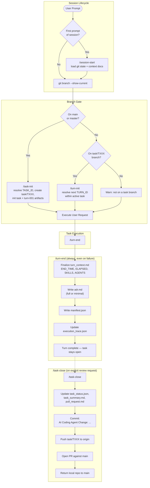

# coding-agents-config

Agentic pipeline configuration for Claude Code (and Codex). Enforces a task/turn-based workflow with provenance tracking, branch protection, and governance rules, plus a library of App Factory skills for spec-driven application generation.

## Setup

### 1. Clone the repo

```sh
git clone <repo-url> ~/coding-agents-config
```

### 2. Create symlinks (automated)

Run the setup script — it creates all symlinks and backs up any existing files:

```sh
bash scripts/setup.sh
```

<details>
<summary>Manual symlink commands</summary>

```sh
# ~/.claude/
ln -s ~/coding-agents-config/skills ~/.claude/skills
ln -s ~/coding-agents-config/agents ~/.claude/agents
ln -s ~/coding-agents-config/hooks ~/.claude/hooks
ln -s ~/coding-agents-config/scripts ~/.claude/scripts
ln -s ~/coding-agents-config/CLAUDE.md ~/.claude/CLAUDE.md
ln -s ~/coding-agents-config/settings.json ~/.claude/settings.json

# ~/.codex/
ln -s ~/coding-agents-config/agents ~/.codex/agents
ln -s ~/coding-agents-config/AGENTS.md ~/.codex/AGENTS.md

# repo-local ./.claude/
ln -s ~/coding-agents-config/CLAUDE.md ./.claude/CLAUDE.md
```

`scripts/setup.sh` also links `rules/`, `context/`, and `plugins/` into `~/.claude/` when those directories exist in the repo. If any target already exists, the script (or you, doing it manually) should back it up first (`mv <target> <target>.bak`).
</details>

### 3. Verify

```sh
ls -la ~/.claude/skills        # should point to ~/coding-agents-config/skills
ls -la ~/.claude/agents        # should point to ~/coding-agents-config/agents
ls -la ~/.claude/hooks         # should point to ~/coding-agents-config/hooks
ls -la ~/.claude/CLAUDE.md     # should point to ~/coding-agents-config/CLAUDE.md
ls -la ~/.claude/settings.json # should point to ~/coding-agents-config/settings.json
ls -la ~/.codex/AGENTS.md      # should point to ~/coding-agents-config/AGENTS.md
```

## Structure

```
coding-agents-config/
├── CLAUDE.md           # Global instructions — task/turn protocol, branch rules
├── AGENTS.md           # Codex loader directive (reads ~/.claude/CLAUDE.md)
├── settings.json       # Claude Code settings (model, permissions, hooks, plugins)
├── package.json        # Node dependency manifest (caveman)
├── agents/             # Subagent definitions
│   └── agent-architecture-planner.md
├── hooks/              # Shell hooks triggered by Claude Code events
│   └── branch-guard.sh # Auto-creates task/TXXX branch when on main/master
├── scripts/            # Automation scripts
│   ├── setup.sh        # Symlink installer
│   └── af-state.sh     # AppFactory state.yaml helpers, sourced by af-* skills
├── skills/              # Slash-command skills
│   ├── .system/         # Vendored meta-skills (skill-creator, skill-installer, imagegen, ...)
│   ├── .nestjs/         # Disabled NestJS/Prisma scaffolding skills (dot-prefixed = not discovered)
│   ├── session-start/   # Load git state + pipeline context at session start
│   ├── task-init/       # Create task/TXXX branch and task-001 artifacts
│   ├── turn-init/       # Create the next turn directory within the active task
│   ├── turn-end/        # Finalize a turn (ADR, manifest, execution trace)
│   ├── task-close/      # Finalize task, push branch, open PR against main
│   ├── branch-guard/    # Legacy turn-scoped branch guard
│   ├── af-*/            # App Factory PRD → DDD → DSL → plan → implementation pipeline
│   ├── dsl-utils/, e2e-tests/, ui-utils/, unit-tests/  # Category folders wrapping one skill each
│   └── eval-labeler/    # Label/compare model responses in eval run directories
├── .appfactory/         # Task/turn tracking and specs (see below)
│   ├── tasks/           # Task branches, each with turns/turn-NNN/
│   ├── specs/           # Specifications
│   ├── prompts/         # Prompt notes used while iterating on the pipeline
│   ├── memory/          # AppFactory state.yaml (project memory)
│   ├── tasks_index.csv  # Registry of all tasks
│   └── changelog.md
├── docs/                # Reference documentation (App Factory design notes)
├── archive/             # Deprecated/superseded skills kept for reference
└── .github/             # Issue templates, PR template
```

## Task & Turn Model

- A **task** is the branch-scoped unit of work that becomes one pull request. Task ids are global and zero-padded to 3 digits: `001`, `002`, `003`.
- A **turn** is one AI execution cycle within the active task branch, nested under that task. Turn ids reset per task and are zero-padded to 3 digits.
- Task branch format: `task/TXXX`. Never commit directly to `main` or `master`.


```mermaid
flowchart TB
    subgraph SESSION["Session Lifecycle"]
        START([User Prompt]) --> SS{First prompt<br/>of session?}
        SS -->|Yes| SESSION_START["/session-start<br/>load git state + context docs"]
        SS -->|No| BRANCH_CHECK
        SESSION_START --> BRANCH_CHECK["git branch --show-current"]
    end

    subgraph GATE["Branch Gate"]
        BRANCH_CHECK --> IS_MAIN{On main<br/>or master?}
        IS_MAIN -->|Yes| TASK_INIT["/task-init<br/>resolve TASK_ID, create task/TXXX,<br/>init task + turn-001 artifacts"]
        IS_MAIN -->|No| IS_TASK{On task/TXXX<br/>branch?}
        IS_TASK -->|Yes| TURN_INIT["/turn-init<br/>resolve next TURN_ID<br/>within active task"]
        IS_TASK -->|No| WARN["Warn: not on a task branch"]
        TASK_INIT --> EXEC
        TURN_INIT --> EXEC
        WARN --> EXEC
    end

    subgraph EXECUTION["Task Execution"]
        EXEC["Execute User Request"] --> TURN_END
    end

    subgraph POST_EXEC["/turn-end (always, even on failure)"]
        TURN_END["/turn-end"] --> UPDATE_CTX["Finalize turn_context.md<br/>END_TIME, ELAPSED, SKILLS, AGENTS"]
        UPDATE_CTX --> WRITE_ADR["Write adr.md<br/>(full or minimal)"]
        WRITE_ADR --> WRITE_MANIFEST["Write manifest.json"]
        WRITE_MANIFEST --> UPDATE_TRACE["Update execution_trace.json"]
        UPDATE_TRACE --> COMPLETE["Turn complete — task stays open"]
    end

    subgraph CLOSE["/task-close (on explicit review request)"]
        COMPLETE -.-> TASK_CLOSE["/task-close"]
        TASK_CLOSE --> UPDATE_TASK["Update task_status.json,<br/>task_summary.md, pull_request.md"]
        UPDATE_TASK --> COMMIT["Commit:<br/>AI Coding Agent Change: ..."]
        COMMIT --> PUSH["Push task/TXXX to origin"]
        PUSH --> PR["Open PR against main"]
        PR --> RETURN_MAIN["Return local repo to main"]
    end
```

### Turn Protocol Summary

| Phase | Trigger | Steps | Outputs |
|-------|---------|-------|---------|
| **Session Start** | First prompt of session | Load git state → load 4 context docs → display banner | Context loaded |
| **Task Init** | On `main`/`master` | Resolve TASK_ID → create `task/TXXX` → init task + `turn-001` artifacts | New task branch, task artifacts |
| **Turn Init** | On `task/TXXX` | Resolve next TURN_ID within the active task → create turn directory | `turn_context.md`, `execution_trace.json` |
| **Execution** | Every coding prompt | Execute the user's request | Modified files |
| **Turn End** | After every prompt, even on failure | Update turn context → write ADR → write manifest → update execution trace | `adr.md`, `manifest.json`, updated `turn_context.md`/`execution_trace.json` |
| **Task Close** | User signals task is ready for review | Update task artifacts → commit → push → open PR → return to `main` | `pull_request.md`, PR opened, `tasks_index.csv` updated |

## Skills

### Pipeline (task/turn lifecycle)

| Skill | Description |
|-------|-------------|
| `session-start` | Load repository state and core pipeline context. Run at the start of every session. |
| `task-init` | Initialize a new task branch and create task + `turn-001` artifacts. Runs when on `main`/`master`. |
| `turn-init` | Initialize the next turn within the active task branch. Runs when already on a task branch. |
| `turn-end` | Finalize the active turn after execution — ADR, manifest, execution trace. Runs after every prompt, even on failure. |
| `task-close` | Finalize the active task branch, push it, and open a pull request against `main`. |
| `branch-guard` | Legacy guard that creates a `turn/T<TURN_ID>` branch off `main`/`master`; superseded by `task-init` for new work. |

### App Factory (spec-driven backend generation)

| Skill | Description |
|-------|-------------|
| `af-orchestrator` | Orchestrates the App Factory software development lifecycle end to end. |
| `af-project-init` | Exports required environment variables and invokes the AppFactory project-init helper script. |
| `af-memory` | CRUD operations on `.appfactory/memory/state.yaml` to track pipeline progress and context across skills. |
| `af-be-prd-build` | Builds a business-facing backend PRD from a completed intake worksheet or discovery notes. |
| `af-be-ddd-build` | Generates a backend Domain-Driven Design document from an approved PRD, following `ddd-template.md`. |
| `af-be-ddd-analysis` | Audits a generated DDD spec for quality, completeness, and PRD alignment. |
| `af-be-ddd-refactor` | Applies targeted patches to a DDD spec based on `af-be-ddd-analysis` findings. |
| `af-be-ddd-orchestrator` | Orchestrates the DDD build → analyze → refactor loop → test phases. |
| `af-be-ddd-dsl` | Generates a backend application DSL YAML document from a DDD document. |
| `af-be-ddd-tests` | Generates Gherkin-style BDD scenarios from DDD and PRD specifications, organized by bounded context. |
| `af-be-plan` | Generates a backend execution plan from a domain DSL and a tech stack profile. |
| `af-be-implementation` | Copies the selected tech stack implementation into the target project and generates domain code from the plan and BDD specs. |
| `af-app-check` | Audits an application for production readiness (security, database, deployment, code quality) before release. |

### Testing & UI utilities

| Skill | Description |
|-------|-------------|
| `dsl-utils/dsl-model-interpreter` | Parses and validates `app-dsl` YAML specifications before code generation. |
| `e2e-tests/http-test-artifacts` | Generates `.http` request files for REST client testing of backend endpoints. |
| `ui-utils/ui-implementation-language` | Declarative YAML standard for pages, layouts, widgets, forms, and API bindings. |
| `unit-tests/test-implementation-sync` | Keeps unit tests synchronized with the actual service/DTO implementation. |

### Other

| Skill | Description |
|-------|-------------|
| `eval-labeler` | Processes `Eval.md` files to label and compare Response A vs. Response B for coding-task evaluations. |

### Hidden/disabled groups

Directories prefixed with `.` are not discovered as invocable skills; they hold vendored or parked skills kept for reference:

| Directory | Contents |
|-----------|----------|
| `.system/` | Vendored meta-skills: `skill-creator`, `skill-installer`, `plugin-creator`, `imagegen`, `openai-docs`. |
| `.nestjs/` | Parked NestJS/Prisma scaffolding skills (`nestjs-crud-resource`, `nestjs-prisma-resource`, `nestjs-customer-crud-scaffold`, `nestjs-observability`, `field-mapper-generator`, `app-from-dsl`, `prisma/prisma-guidelines`, `prisma/prisma-persistence`). |

## Agents

| Agent | Description |
|-------|-------------|
| `agent-architecture-planner` | Reads the PRD, DDD, DSL, and existing repo structure to produce spec alignment, architecture decisions, module maps, task plans, and review artifacts for downstream coding agents. |

## Hooks

| Hook | Trigger | Purpose |
|------|---------|---------|
| `branch-guard.sh` | `PreToolUse(Bash)` | If on `main`/`master`, auto-creates and switches to the next `task/TXXX` branch instead of blocking. |

## Docs

Reference material on the App Factory design, generated under `docs/`:

- `appFactory-plan.md`
- `app-nextjs-nestjs-prisma.md`
- `ai-to-appfactory-migration-analysis.md`
- `migration-ai-to-appfactory.md`
- `skill-summary.md`

## Archive

`archive/` holds skills and templates that predate the current task/turn + App Factory pipeline (e.g. `schema-to-database`, `nestjs-crud-resource`, `react-form-page`, `shadcn`, `legacy-turns`). They are kept for reference and are not symlinked into `~/.claude/`.

## Adding a new skill

Each skill lives in its own directory under `skills/` with a `SKILL.md` file:

```
skills/my-skill/
└── SKILL.md
```

The `.system/skill-creator` meta-skill can guide you through creating one — invoke it from Claude Code.

## Syncing across machines

Since this is a standard git repo, pull on any machine to stay current:

```sh
cd ~/coding-agents-config && git pull
```

The symlinks mean changes are picked up immediately — no reinstall needed.
