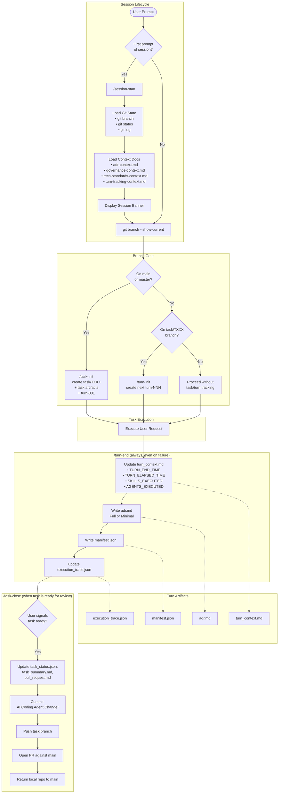

# coding-agents-config

Agentic pipeline configuration for Claude Code (and Codex, via `AGENTS.md`). Enforces a task/turn workflow with provenance tracking, branch protection, governance rules, and a library of 37 skills spanning the App Factory SDLC pipeline, NestJS/Prisma scaffolding, DSL tooling, and general utilities.

## Setup

### 1. Clone the repo

```sh
git clone <repo-url> ~/coding-agents-config
```

### 2. Create symlinks (automated)

Run the setup script — it creates all symlinks and backs up any existing files:

```sh
bash scripts/setup.sh
```

<details>
<summary>Manual symlink commands</summary>

```sh
ln -s ~/coding-agents-config/skills ~/.claude/skills
ln -s ~/coding-agents-config/agents ~/.claude/agents
ln -s ~/coding-agents-config/hooks ~/.claude/hooks
ln -s ~/coding-agents-config/scripts ~/.claude/scripts
ln -s ~/coding-agents-config/CLAUDE.md ~/.claude/CLAUDE.md
ln -s ~/coding-agents-config/settings.json ~/.claude/settings.json

# Codex
ln -s ~/coding-agents-config/agents ~/.codex/agents
ln -s ~/coding-agents-config/AGENTS.md ~/.codex/AGENTS.md
```

If any of these already exist, back them up first (`mv <target> <target>.bak`).
</details>

### 3. Verify

```sh
ls -la ~/.claude/skills        # should point to ~/coding-agents-config/skills
ls -la ~/.claude/agents        # should point to ~/coding-agents-config/agents
ls -la ~/.claude/hooks         # should point to ~/coding-agents-config/hooks
ls -la ~/.claude/CLAUDE.md     # should point to ~/coding-agents-config/CLAUDE.md
ls -la ~/.claude/settings.json # should point to ~/coding-agents-config/settings.json
```

## Structure

```
coding-agents-config/
├── CLAUDE.md            # Global instructions — task/turn protocol, branch rules
├── AGENTS.md            # Codex loader directive (points at CLAUDE.md)
├── settings.json        # Claude Code settings (model, permissions, hooks, plugins)
├── agents/              # Standalone agent definitions
│   └── agent-architecture-planner.md
├── hooks/                # Shell hooks triggered by Claude Code events
│   └── branch-guard.sh   # Auto-creates a task branch when on main/master
├── skills/               # Slash-command skills (37 SKILL.md files)
│   ├── session-start/    # Load repo state + pipeline context (run every session)
│   ├── task-init/        # Create task/TXXX branch + task/turn-001 artifacts
│   ├── turn-init/        # Create the next turn directory within a task
│   ├── turn-end/         # Finalize a turn (adr.md, manifest.json, trace)
│   ├── task-close/       # Push task branch, open PR, return to main
│   ├── branch-guard/     # Legacy turn-scoped branch guard
│   ├── af-orchestrator/          # App Factory SDLC orchestrator
│   ├── af-project-init/          # App Factory project initialization
│   ├── af-be-prd-build/          # Backend PRD authoring
│   ├── af-be-ddd-orchestrator/   # DDD build/analyze/refactor/test loop
│   ├── af-be-ddd-build/          # Generate DDD doc from PRD
│   ├── af-be-ddd-analysis/       # Audit a DDD doc for gaps
│   ├── af-be-ddd-refactor/       # Patch a DDD doc from analysis findings
│   ├── af-be-ddd-tests/          # Generate Gherkin/BDD feature specs
│   ├── af-be-plan/               # Backend execution plan from DDD + tech stack
│   ├── af-be-ddd-dsl/            # Backend DSL YAML from DDD doc
│   ├── af-be-implementation/     # Generate backend code from plan + DSL
│   ├── af-app-check/             # Production-readiness audit
│   ├── af-memory/                # CRUD on .appfactory/memory/state.yaml
│   ├── .nestjs/                  # NestJS/Prisma scaffolding skills
│   │   ├── app-from-dsl/
│   │   ├── nestjs-crud-resource/
│   │   ├── nestjs-prisma-resource/
│   │   ├── nestjs-customer-crud-scaffold/
│   │   ├── nestjs-observability/
│   │   ├── field-mapper-generator/
│   │   └── prisma/{prisma-guidelines,prisma-persistence}/
│   ├── dsl-utils/dsl-model-interpreter/   # Parse/validate app-dsl YAML
│   ├── ui-utils/ui-implementation-language/ # Declarative UI YAML spec
│   ├── unit-tests/test-implementation-sync/ # Keep tests aligned with impl
│   ├── e2e-tests/http-test-artifacts/       # Generate .http request files
│   ├── eval-labeler/             # Label/score model response evals
│   └── .system/                  # Meta-skills (skill-creator, skill-installer,
│                                  # plugin-creator, imagegen, openai-docs)
├── scripts/              # Automation scripts
│   ├── setup.sh           # Symlink installer
│   └── af-state.sh        # App Factory state.yaml helpers
├── .appfactory/           # Task/turn tracking and specs
│   ├── tasks/              # task-NNN/ directories with turns/turn-NNN/ artifacts
│   ├── specs/               # Specifications (PRD, DDD, DSL)
│   ├── prompts/              # Prompt templates
│   ├── memory/                # Project memory (state.yaml)
│   ├── tasks_index.csv         # Registry of all tasks
│   └── changelog.md             # Project changelog
├── archive/               # Deprecated/superseded skills and legacy templates
├── docs/                  # Reference documentation
│   └── skill-summary.md    # App Factory pipeline skill order/table
└── .github/               # PR + issue templates
```

## Execution Flow

The agentic pipeline enforces a task/turn workflow for all coding tasks:


```mermaid
flowchart TB
    subgraph SESSION["Session Lifecycle"]
        START([User Prompt]) --> SS{First prompt<br/>of session?}
        SS -->|Yes| SESSION_START["/session-start"]
        SS -->|No| BRANCH_CHECK
        SESSION_START --> LOAD_GIT["Load Git State<br/>• git branch<br/>• git status<br/>• git log"]
        LOAD_GIT --> LOAD_CTX["Load Context Docs<br/>• adr-context.md<br/>• governance-context.md<br/>• tech-standards-context.md<br/>• turn-tracking-context.md"]
        LOAD_CTX --> BANNER["Display Session Banner"]
        BANNER --> BRANCH_CHECK
    end

    subgraph BRANCH_GATE["Branch Gate"]
        BRANCH_CHECK["git branch --show-current"] --> IS_MAIN{On main<br/>or master?}
        IS_MAIN -->|Yes| TASK_INIT["/task-init<br/>create task/TXXX<br/>+ task artifacts<br/>+ turn-001"]
        IS_MAIN -->|No| IS_TASK{On task/TXXX<br/>branch?}
        IS_TASK -->|Yes| TURN_INIT["/turn-init<br/>create next turn-NNN"]
        IS_TASK -->|No| WARN["Proceed without<br/>task/turn tracking"]
    end

    subgraph EXECUTION["Task Execution"]
        TASK_INIT --> EXEC["Execute User Request"]
        TURN_INIT --> EXEC
        WARN --> EXEC
    end

    subgraph TURN_END_PHASE["/turn-end (always, even on failure)"]
        EXEC --> UPDATE_CTX["Update turn_context.md<br/>• TURN_END_TIME<br/>• TURN_ELAPSED_TIME<br/>• SKILLS_EXECUTED<br/>• AGENTS_EXECUTED"]
        UPDATE_CTX --> WRITE_ADR["Write adr.md<br/>Full or Minimal"]
        WRITE_ADR --> WRITE_MANIFEST["Write manifest.json"]
        WRITE_MANIFEST --> UPDATE_TRACE["Update execution_trace.json"]
    end

    subgraph TASK_CLOSE_PHASE["/task-close (when task is ready for review)"]
        UPDATE_TRACE -.-> READY{User signals<br/>task ready?}
        READY -->|Yes| CLOSE["Update task_status.json,<br/>task_summary.md,<br/>pull_request.md"]
        CLOSE --> COMMIT["Commit:<br/>AI Coding Agent Change:"]
        COMMIT --> PUSH["Push task branch"]
        PUSH --> PR["Open PR against main"]
        PR --> RETURN["Return local repo to main"]
    end

    subgraph ARTIFACTS["Turn Artifacts"]
        direction LR
        A1["turn_context.md"]
        A2["execution_trace.json"]
        A3["adr.md"]
        A4["manifest.json"]
    end

    UPDATE_CTX -.-> A1
    UPDATE_TRACE -.-> A2
    WRITE_ADR -.-> A3
    WRITE_MANIFEST -.-> A4
```

### Task/Turn Protocol Summary

| Phase | Trigger | Steps | Outputs |
|-------|---------|-------|---------|
| **Session Start** | First prompt of session | Load git state → load 4 context docs → display banner | Context loaded |
| **Task Init** | Current branch is `main`/`master` | Resolve next `TXXX` → `git checkout -b task/TXXX` → scaffold task dir + turn-001 | `task_context.md`, `task_status.json`, `task_summary.md`, `pull_request.md`, turn-001 artifacts |
| **Turn Init** | Already on a `task/TXXX` branch | Resolve next turn id → create `turns/turn-NNN/` | `turn_context.md`, `execution_trace.json` |
| **Execution** | Every coding prompt | Execute the user's request | Modified files |
| **Turn End** | After every execution, even on failure | Finalize turn context → write ADR → write manifest → update trace | `adr.md`, `manifest.json`, updated `turn_context.md`/`execution_trace.json` |
| **Task Close** | User signals the task is ready for review | Update task artifacts → commit → push → open PR → return to `main` | PR against `main`, `tasks_index.csv` updated |

See `CLAUDE.md` for the full governance rules (hard gate against writing on `main`/`master`, branch naming, commit message format, ADR rules).

## Skills (37)

| Category | Skill | Description |
|----------|-------|-------------|
| **Session/Task/Turn** | `session-start` | Load repo git state + pipeline context docs at session start |
| | `task-init` | Create `task/TXXX` branch and initialize task + turn-001 artifacts |
| | `turn-init` | Initialize the next turn within the active task branch |
| | `turn-end` | Finalize the active turn (adr.md, manifest.json, trace) |
| | `task-close` | Push the task branch and open a PR against `main` |
| | `branch-guard` | Legacy: create a turn-scoped branch if on `main`/`master` |
| **App Factory — Orchestration** | `af-orchestrator` | Orchestrate the App Factory software development lifecycle |
| | `af-project-init` | Export required env vars and invoke project-init helper script |
| | `af-memory` | CRUD on `.appfactory/memory/state.yaml` pipeline state |
| **App Factory — Requirements/Design** | `af-be-prd-build` | Build a business-facing backend PRD from an intake worksheet |
| | `af-be-ddd-orchestrator` | Orchestrate the backend DDD build/analyze/refactor/test loop |
| | `af-be-ddd-build` | Generate a human-readable backend DDD doc from an approved PRD |
| | `af-be-ddd-analysis` | Audit a DDD spec for quality, completeness, and PRD alignment |
| | `af-be-ddd-refactor` | Patch a DDD spec using `af-be-ddd-analysis` findings |
| | `af-be-ddd-tests` | Generate Gherkin/BDD feature files from DDD + PRD specs |
| **App Factory — Planning/Build** | `af-be-plan` | Generate a backend execution plan from DSL + tech stack profile |
| | `af-be-ddd-dsl` | Generate a backend DSL YAML doc from the DDD doc |
| | `af-be-implementation` | Generate backend domain code from the plan + BDD specs |
| | `af-app-check` | Audit an app for production readiness (security, DB, deploy, quality) |
| **NestJS/Prisma Scaffolding** (`.nestjs/`) | `app-from-dsl` | Orchestrate full-stack generation from app-dsl YAML |
| | `nestjs-crud-resource` | Generate a NestJS CRUD module from a DSL backend spec |
| | `nestjs-prisma-resource` | Generate a full NestJS + Prisma CRUD resource from a schema |
| | `nestjs-customer-crud-scaffold` | Scaffold a NestJS customer CRUD app via a Nest CLI wrapper |
| | `nestjs-observability` | Add structured logging/observability to a NestJS + Prisma backend |
| | `field-mapper-generator` | Generate field mapper/converter utilities from DSL mapper specs |
| | `prisma-guidelines` / `prisma-persistence` | Prisma schema and persistence-layer conventions |
| **DSL/UI/Test Utilities** | `dsl-model-interpreter` | Parse and validate app-dsl YAML specifications |
| | `ui-implementation-language` | Declarative YAML spec for framework-neutral UI pages/widgets |
| | `test-implementation-sync` | Keep generated unit tests aligned with implementations |
| | `http-test-artifacts` | Generate `.http` request files for API endpoint testing |
| **Evaluation** | `eval-labeler` | Label/score Response A vs Response B model evaluations |
| **Meta (`.system/`)** | `skill-creator` | Create new skills with a `SKILL.md` |
| | `skill-installer` | Install skills into `$CODEX_HOME/skills` from a curated list or repo |
| | `plugin-creator` | Scaffold Codex plugin directories and marketplace entries |
| | `imagegen` | Generate/edit raster images (photos, illustrations, textures, mockups) |
| | `openai-docs` | Look up official OpenAI docs/model guidance with citations |

See `docs/skill-summary.md` for the App Factory pipeline in invocation order.

## Agents

| Agent | Description |
|-------|-------------|
| `agent-architecture-planner.md` | Architecture planning agent definition |

## Hooks

| Hook | Trigger | Purpose |
|------|---------|---------|
| `branch-guard.sh` | `PreToolUse` (Bash + write tools) | Auto-creates the next `task/TXXX` branch when a tool is about to run on `main`/`master`, instead of blocking |

## Archive

`archive/` holds skills and templates that were superseded by the current `.appfactory/` task/turn model and the App Factory skill set (e.g. the pre-DSL `templates/` directory, `schema-to-database`, `code-entity-to-crud`, `find-skills`, `legacy-turns`). See `archive/README.md` and `archive/SUMMARY.md` for what moved where and why.

## Adding a new skill

Each skill lives in its own directory under `skills/` with a `SKILL.md` file:

```
skills/my-skill/
└── SKILL.md
```

The `.system/skill-creator` meta-skill can guide you through creating one — invoke it from Claude Code.

## Syncing across machines

Since this is a standard git repo, pull on any machine to stay current:

```sh
cd ~/coding-agents-config && git pull
```

The symlinks mean changes are picked up immediately — no reinstall needed.
