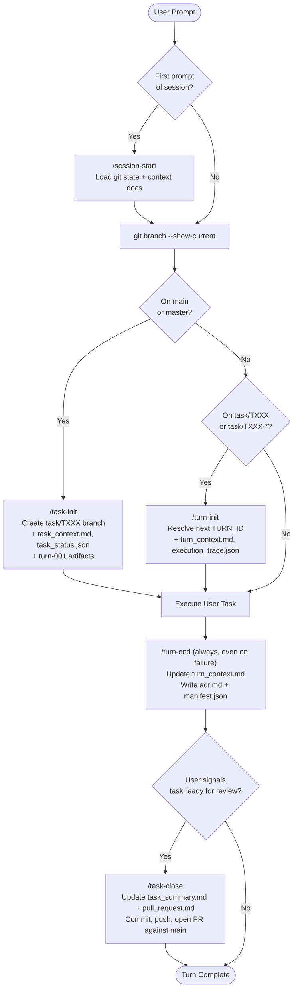

# coding-agents-config

Agentic pipeline configuration for Claude Code (and Codex). Enforces a task/turn-based workflow with provenance tracking, branch protection, and governance rules via symlinked skills, hooks, and settings.

## Setup

### 1. Clone the repo

```sh
git clone <repo-url> ~/coding-agents-config
```

### 2. Create symlinks (automated)

Run the setup script — it creates all symlinks and backs up any existing files:

```sh
bash scripts/setup.sh
```

It links into three locations:

| Target | Items |
|--------|-------|
| `~/.claude/` | `skills`, `agents`, `rules`, `hooks`, `context`, `scripts`, `plugins`, `CLAUDE.md`, `settings.json` |
| `~/.codex/` | `agents`, `AGENTS.md` |
| `./.claude/` (repo-local) | `CLAUDE.md` |

Only items that currently exist in the repo (e.g. `rules/`, `context/`, `plugins/` are placeholders reserved for future use) produce real symlink targets; missing ones are skipped safely.

<details>
<summary>Manual symlink commands</summary>

```sh
ln -s ~/coding-agents-config/skills ~/.claude/skills
ln -s ~/coding-agents-config/agents ~/.claude/agents
ln -s ~/coding-agents-config/hooks ~/.claude/hooks
ln -s ~/coding-agents-config/scripts ~/.claude/scripts
ln -s ~/coding-agents-config/CLAUDE.md ~/.claude/CLAUDE.md
ln -s ~/coding-agents-config/settings.json ~/.claude/settings.json

ln -s ~/coding-agents-config/agents ~/.codex/agents
ln -s ~/coding-agents-config/AGENTS.md ~/.codex/AGENTS.md
```

If any of these already exist, back them up first (`mv <target> <target>.bak`).
</details>

### 3. Verify

```sh
ls -la ~/.claude/skills        # should point to ~/coding-agents-config/skills
ls -la ~/.claude/agents        # should point to ~/coding-agents-config/agents
ls -la ~/.claude/hooks         # should point to ~/coding-agents-config/hooks
ls -la ~/.claude/CLAUDE.md     # should point to ~/coding-agents-config/CLAUDE.md
ls -la ~/.claude/settings.json # should point to ~/coding-agents-config/settings.json
```

## Structure

```
coding-agents-config/
├── CLAUDE.md           # Global instructions — task/turn protocol, branch rules
├── AGENTS.md           # Codex agent loader directive (loads ~/.claude/CLAUDE.md)
├── settings.json       # Claude Code settings (env, permissions, hooks)
├── agents/             # Standalone agent definitions
│   └── agent-architecture-planner.md
├── hooks/              # Shell hooks triggered by Claude Code events
│   └── branch-guard.sh # Auto-creates a task/TXXX branch on main/master
├── skills/             # Slash-command skills
│   ├── .system/        # Meta-skills (skill-creator, skill-installer, imagegen, ...)
│   ├── session-start/  # Load git state + pipeline context at session start
│   ├── task-init/      # Create task branch + task/turn-001 artifacts
│   ├── turn-init/      # Create the next turn within the active task
│   ├── turn-end/       # Finalize a turn (ADR, manifest, execution trace)
│   ├── task-close/     # Finalize task, push branch, open PR
│   ├── branch-guard/   # Legacy manual branch guard (turn/T<id> branches)
│   ├── af-*/           # AppFactory skills — see Skills below
│   ├── dsl-utils/      # DSL parsing skills (e.g. dsl-model-interpreter)
│   ├── e2e-tests/      # E2E test artifact skills (e.g. http-test-artifacts)
│   ├── ui-utils/       # UI DSL skills (e.g. ui-implementation-language)
│   ├── unit-tests/     # Unit test sync skills (e.g. test-implementation-sync)
│   └── eval-labeler/   # Label/score model-response evaluation runs
├── scripts/             # Automation scripts
│   ├── setup.sh         # Create all symlinks
│   └── af-state.sh      # AppFactory pipeline state helper
├── .appfactory/         # Task/turn tracking and specs (see Task & Turn Model)
│   ├── tasks/           # task-XXX/ directories with turns/turn-XXX/
│   ├── specs/            # Specifications
│   ├── prompts/           # Prompt templates
│   ├── memory/            # Project memory
│   ├── changelog.md       # Recovered turn-by-turn history
│   └── tasks_index.csv    # Task registry
├── .github/              # PR and issue templates
├── archive/              # Retired skill libraries and prior iterations
└── docs/                 # Reference documentation
```

## Execution Flow

The agentic pipeline enforces a strict task/turn-based workflow for all coding tasks, driven by the "Mandatory Skill Invocations" section of `CLAUDE.md`:


```mermaid
flowchart TB
    START([User Prompt]) --> SS{First prompt<br/>of session?}
    SS -->|Yes| SESSION_START["/session-start<br/>Load git state + context docs"]
    SS -->|No| CHECK_BRANCH
    SESSION_START --> CHECK_BRANCH["git branch --show-current"]

    CHECK_BRANCH --> IS_MAIN{On main<br/>or master?}
    IS_MAIN -->|Yes| TASK_INIT["/task-init<br/>Create task/TXXX branch<br/>+ task_context.md, task_status.json<br/>+ turn-001 artifacts"]
    IS_MAIN -->|No| IS_TASK{On task/TXXX<br/>or task/TXXX-*?}
    IS_TASK -->|Yes| TURN_INIT["/turn-init<br/>Resolve next TURN_ID<br/>+ turn_context.md, execution_trace.json"]
    IS_TASK -->|No| EXEC
    TASK_INIT --> EXEC
    TURN_INIT --> EXEC

    EXEC["Execute User Task"] --> TURN_END["/turn-end (always, even on failure)<br/>Update turn_context.md<br/>Write adr.md + manifest.json"]

    TURN_END --> READY{User signals<br/>task ready for review?}
    READY -->|Yes| TASK_CLOSE["/task-close<br/>Update task_summary.md + pull_request.md<br/>Commit, push, open PR against main"]
    READY -->|No| DONE([Turn Complete])
    TASK_CLOSE --> DONE
```

### Turn Protocol Summary

| Phase | Trigger | Skill | Outputs |
|-------|---------|-------|---------|
| **Session Start** | First prompt of session | `session-start` | Git state + pipeline context loaded |
| **Task Init** | Branch is `main`/`master` | `task-init` | `task/TXXX` branch, task artifacts, turn-001 |
| **Turn Init** | Already on `task/TXXX` | `turn-init` | `turns/turn-XXX/` with `turn_context.md`, `execution_trace.json` |
| **Execution** | Every coding prompt | — | Modified files |
| **Turn End** | After every prompt, even on failure | `turn-end` | `adr.md`, `manifest.json`, updated trace |
| **Task Close** | User signals ready for review | `task-close` | `task_summary.md`, `pull_request.md`, pushed branch, PR |

### Hard Gate

Direct writes on `main`/`master` are never allowed. `hooks/branch-guard.sh` runs as a `PreToolUse(Bash)` hook (see `settings.json`) and auto-creates the next `task/TXXX` branch if it detects the active branch is `main` or `master`.

### Task and Turn Model

- A **task** is the branch-scoped unit of work that becomes one pull request (`task/TXXX`, 3-digit zero-padded, IDs global).
- A **turn** is one AI execution cycle within the active task branch (`turn-XXX`, 3-digit zero-padded, IDs reset per task).
- Artifacts live under `.appfactory/tasks/task-XXX/` (task-level) and `.appfactory/tasks/task-XXX/turns/turn-XXX/` (turn-level) — see `CLAUDE.md` for the required file list.

## Skills (23 + 5 meta)

| Category | Skill | Description |
|----------|-------|-------------|
| **Session** | `session-start` | Load git state and core pipeline context at session start |
| **Task** | `task-init` | Initialize a new task branch and create task + turn-001 artifacts |
| **Turn** | `turn-init` | Initialize the next turn within the active task branch |
| | `turn-end` | Finalize the active turn (ADR, manifest, execution trace) |
| | `task-close` | Finalize the active task, push it, open a PR against `main` |
| | `branch-guard` | Legacy manual guard — creates a `turn/T<id>` branch if on main/master |
| **AppFactory** | `af-orchestrator` | Orchestrates the App Factory software development lifecycle |
| | `af-project-init` | Orchestrate AppFactory project init and export required env vars |
| | `af-be-prd-build` | Build a business-facing backend PRD from a worksheet/questionnaire |
| | `af-be-ddd-orchestrator` | Orchestrate the backend DDD build → analyze → refactor → test loop |
| | `af-be-ddd-build` | Generate a human-readable backend DDD document from an approved PRD |
| | `af-be-ddd-analysis` | Audit a DDD spec for quality, completeness, and PRD alignment |
| | `af-be-ddd-refactor` | Refactor a DDD spec using `af-be-ddd-analysis` findings |
| | `af-be-ddd-tests` | Generate Gherkin BDD feature files from DDD + PRD specs |
| | `af-be-plan` | Generate a backend execution plan from a domain DSL + tech stack profile |
| | `af-be-ddd-dsl` | Generate a backend application DSL YAML from a DDD document |
| | `af-be-implementation` | Generate backend code from the execution plan and BDD specs |
| | `af-app-check` | Audit an app for production readiness (security, DB, deployment, quality) |
| | `af-memory` | CRUD operations on `.appfactory/state.yaml` pipeline state |
| **DSL / UI / Test utils** | `dsl-utils/dsl-model-interpreter` | Parse and validate app-dsl YAML specifications |
| | `ui-utils/ui-implementation-language` | Declarative YAML language for UI pages, widgets, forms |
| | `e2e-tests/http-test-artifacts` | Generate `.http` request files for API endpoint testing |
| | `unit-tests/test-implementation-sync` | Keep unit tests synchronized with implementation |
| **Utility** | `eval-labeler` | Label/score model-response evaluation runs (Response A vs B) |

### Meta-Skills (`.system/`)

| Skill | Description |
|-------|-------------|
| `skill-creator` | Guide for creating and updating skills |
| `skill-installer` | Install skills into `$CODEX_HOME/skills` from a curated list or repo |
| `plugin-creator` | Scaffold plugin directories with `.codex-plugin/plugin.json` |
| `imagegen` | Generate or edit raster images (photos, illustrations, mockups) |
| `openai-docs` | Look up official OpenAI docs/model guidance with citations |

## Agents

| Agent | Purpose |
|-------|---------|
| `agents/agent-architecture-planner.md` | Standalone architecture-planning agent definition |

## Hooks

| Hook | Trigger | Purpose |
|------|---------|---------|
| `branch-guard.sh` | `PreToolUse(Bash)` | Auto-create the next `task/TXXX` branch when on `main`/`master` |

## Adding a new skill

Each skill lives in its own directory under `skills/` with a `SKILL.md` file:

```
skills/my-skill/
└── SKILL.md
```

The `.system/skill-creator` meta-skill can guide you through creating one — invoke it from Claude Code.

## Syncing across machines

Since this is a standard git repo, pull on any machine to stay current:

```sh
cd ~/coding-agents-config && git pull
```

The symlinks mean changes are picked up immediately — no reinstall needed.
