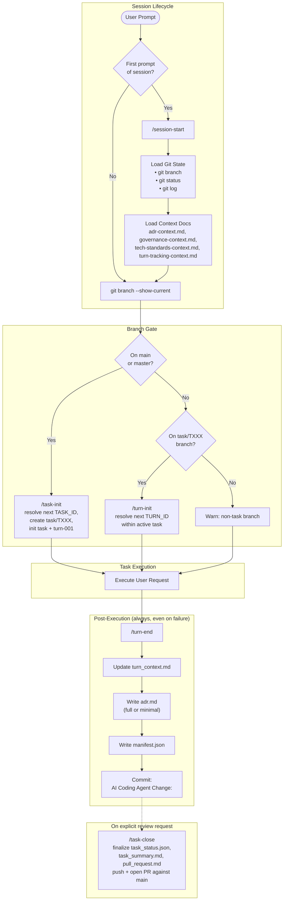

# coding-agents-config

Agentic pipeline configuration for Claude Code and Codex. Enforces a task/turn-based workflow with provenance tracking, branch protection, and governance rules, and hosts the **App Factory** (`af-*`) skill pipeline for generating full-stack applications from PRD → DDD → DSL → plan → implementation.

## Setup

### 1. Clone the repo

```sh
git clone <repo-url> ~/coding-agents-config
```

### 2. Create symlinks (automated)

Run the setup script — it creates all symlinks and backs up any existing files:

```sh
bash scripts/setup.sh
```

<details>
<summary>Manual symlink commands</summary>

```sh
# Into ~/.claude/
ln -s ~/coding-agents-config/skills       ~/.claude/skills
ln -s ~/coding-agents-config/agents       ~/.claude/agents
ln -s ~/coding-agents-config/hooks        ~/.claude/hooks
ln -s ~/coding-agents-config/scripts      ~/.claude/scripts
ln -s ~/coding-agents-config/CLAUDE.md    ~/.claude/CLAUDE.md
ln -s ~/coding-agents-config/settings.json ~/.claude/settings.json

# Into ~/.codex/
ln -s ~/coding-agents-config/agents    ~/.codex/agents
ln -s ~/coding-agents-config/AGENTS.md ~/.codex/AGENTS.md

# Repo-local
ln -s ~/coding-agents-config/CLAUDE.md ~/coding-agents-config/.claude/CLAUDE.md
```

If any of these already exist, back them up first (`mv <target> <target>.bak`).
</details>

`scripts/setup.sh` also links `rules/`, `context/`, and `plugins/` into `~/.claude/` if they exist — these are reserved for future use and are not present in the repo yet, so those links are skipped.

### 3. Verify

```sh
ls -la ~/.claude/skills        # should point to ~/coding-agents-config/skills
ls -la ~/.claude/hooks         # should point to ~/coding-agents-config/hooks
ls -la ~/.claude/CLAUDE.md     # should point to ~/coding-agents-config/CLAUDE.md
ls -la ~/.claude/settings.json # should point to ~/coding-agents-config/settings.json
ls -la ~/.codex/AGENTS.md      # should point to ~/coding-agents-config/AGENTS.md
```

## Structure

```
coding-agents-config/
├── CLAUDE.md           # Global instructions — task/turn protocol, branch rules
├── AGENTS.md           # Codex loader directive (points at CLAUDE.md)
├── settings.json       # Claude Code settings (model, permissions, hooks, plugins)
├── package.json        # npm dependency: caveman (plugin marketplace)
├── hooks/              # Shell hooks triggered by Claude Code events
│   └── branch-guard.sh # Prevents edits on main/master
├── agents/             # Subagent definitions
│   └── agent-architecture-planner.md
├── skills/             # Slash-command skills
│   ├── .system/        # Meta-skills (skill-creator, skill-installer, plugin-creator, imagegen, openai-docs)
│   ├── session-start/  # Load git state + pipeline context at session start
│   ├── task-init/      # Create task branch + task/turn-001 artifacts
│   ├── turn-init/      # Create the next turn within the active task
│   ├── turn-end/       # Finalize a turn (adr.md, manifest.json, commit)
│   ├── task-close/     # Finalize a task and open its pull request
│   ├── branch-guard/   # Legacy turn-branch guard (superseded by task-init)
│   ├── af-*/           # App Factory backend generation pipeline (see below)
│   ├── dsl-utils/, e2e-tests/, ui-utils/, unit-tests/  # Category folders of utility skills
│   └── eval-labeler/   # Label/score model responses on coding tasks
├── scripts/             # Automation scripts
│   ├── setup.sh          # Create ~/.claude and ~/.codex symlinks
│   └── af-state.sh       # Helpers for .appfactory/memory/state.yaml
├── .appfactory/          # Task/turn tracking and App Factory specs/state
│   ├── tasks/             # task-XXX/ directories, each with nested turns/
│   ├── specs/             # Generated PRD/DDD/DSL specifications
│   ├── prompts/           # Prompt templates
│   ├── memory/            # Pipeline state (state.yaml)
│   ├── changelog.md
│   └── tasks_index.csv    # Registry of all tasks and their status
├── docs/                 # Reference documentation (AppFactory plan, skill summary, migration notes)
├── archive/              # Superseded skills, templates, and legacy turn history
└── .github/              # PR and issue templates
```

## Execution Flow

The agentic pipeline enforces a task/turn workflow for all coding tasks:


```mermaid
flowchart TB
    subgraph SESSION["Session Lifecycle"]
        START([User Prompt]) --> SS{First prompt<br/>of session?}
        SS -->|Yes| SESSION_START["/session-start"]
        SS -->|No| BRANCH_CHECK
        SESSION_START --> LOAD_GIT["Load Git State<br/>• git branch<br/>• git status<br/>• git log"]
        LOAD_GIT --> LOAD_CTX["Load Context Docs<br/>adr-context.md, governance-context.md,<br/>tech-standards-context.md, turn-tracking-context.md"]
        LOAD_CTX --> BRANCH_CHECK
    end

    subgraph GATE["Branch Gate"]
        BRANCH_CHECK["git branch --show-current"] --> IS_MAIN{On main<br/>or master?}
        IS_MAIN -->|Yes| TASK_INIT["/task-init<br/>resolve next TASK_ID,<br/>create task/TXXX,<br/>init task + turn-001"]
        IS_MAIN -->|No| IS_TASK{On task/TXXX<br/>branch?}
        IS_TASK -->|Yes| TURN_INIT["/turn-init<br/>resolve next TURN_ID<br/>within active task"]
        IS_TASK -->|No| WARN["Warn: non-task branch"]
    end

    subgraph EXECUTION["Task Execution"]
        TASK_INIT --> EXEC["Execute User Request"]
        TURN_INIT --> EXEC
        WARN --> EXEC
    end

    subgraph POST_EXEC["Post-Execution (always, even on failure)"]
        EXEC --> TURN_END["/turn-end"]
        TURN_END --> WRITE_CTX["Update turn_context.md"]
        WRITE_CTX --> WRITE_ADR["Write adr.md<br/>(full or minimal)"]
        WRITE_ADR --> WRITE_MANIFEST["Write manifest.json"]
        WRITE_MANIFEST --> COMMIT["Commit:<br/>AI Coding Agent Change:"]
    end

    subgraph CLOSE["On explicit review request"]
        COMMIT -.-> TASK_CLOSE["/task-close<br/>finalize task_status.json,<br/>task_summary.md, pull_request.md<br/>push + open PR against main"]
    end
```

### Task/Turn Protocol Summary

| Phase | Trigger | Steps | Outputs |
|-------|---------|-------|---------|
| **Session Start** | First prompt of session | Load git state → load pipeline context docs | Context loaded |
| **Task Init** | Current branch is `main`/`master` | Resolve next `TASK_ID` → create `task/TXXX` → init task + `turn-001` | `.appfactory/tasks/task-XXX/` scaffold |
| **Turn Init** | Current branch is `task/TXXX` | Resolve next `TURN_ID` within the active task | `turns/turn-XXX/` scaffold |
| **Execution** | Every prompt | Execute the user's request | Modified files |
| **Turn End** | After every prompt, even on failure | Update turn context → write ADR → write manifest → commit | `turn_context.md`, `adr.md`, `manifest.json` |
| **Task Close** | User signals the task is ready for review | Finalize task status/summary → push branch → open PR | `task_status.json`, `task_summary.md`, `pull_request.md`, PR |

Artifacts live under `.appfactory/tasks/task-XXX/` (task-level) and `.appfactory/tasks/task-XXX/turns/turn-XXX/` (turn-level); see `CLAUDE.md` for the exact required file list. Every new task appends a row to `.appfactory/tasks_index.csv`.

## Skills

### Session / Task / Turn Lifecycle

| Skill | Description |
|-------|-------------|
| `session-start` | Load git state and core pipeline context docs at the start of every session |
| `task-init` | Initialize a new task branch (`task/TXXX`) and create task + `turn-001` artifacts; runs when on `main`/`master` |
| `turn-init` | Initialize the next turn within the active task branch |
| `turn-end` | Finalize the active turn (ADR, manifest, commit); runs after every prompt, even on failure |
| `task-close` | Finalize the active task branch, push it, and open a pull request against `main` |
| `branch-guard` | Legacy guard that creates a `turn/T{ID}` branch off `main`/`master`; superseded by `task-init` |

### App Factory Backend Pipeline (`af-*`)

End-to-end backend generation: PRD → DDD → DSL → plan → implementation → verification. See `docs/skill-summary.md` for the full phase-by-phase reference and `docs/appFactory-plan.md` for the architecture.

| Skill | Description |
|-------|-------------|
| `af-orchestrator` | Orchestrates the full App Factory software development lifecycle |
| `af-project-init` | Exports required environment variables and initializes a new App Factory project |
| `af-be-prd-build` | Builds a business-facing backend PRD from an intake worksheet or discovery notes |
| `af-be-ddd-orchestrator` | Orchestrates the backend DDD build → analyze → refactor loop → test phases |
| `af-be-ddd-build` | Generates a human-readable backend DDD document from an approved PRD |
| `af-be-ddd-analysis` | Audits a generated DDD document for quality, completeness, and PRD alignment |
| `af-be-ddd-refactor` | Applies targeted patches to a DDD document from `af-be-ddd-analysis` findings |
| `af-be-ddd-tests` | Generates Gherkin BDD feature files from the DDD and PRD, organized by aggregate |
| `af-be-plan` | Generates a step-by-step backend execution plan from a domain DSL and tech-stack profile |
| `af-be-ddd-dsl` | Generates a backend application DSL YAML document from the DDD document |
| `af-be-implementation` | Copies the selected tech-stack implementation and generates domain code from the plan + BDD specs |
| `af-app-check` | Audits an application for production readiness (security, database, deployment, code quality) |
| `af-memory` | CRUD operations for `.appfactory/memory/state.yaml` — tracks pipeline progress and context |

### Utility Skills

| Category folder | Sub-skill | Description |
|------------------|-----------|-------------|
| `dsl-utils/` | `dsl-model-interpreter` | Parse and validate app-dsl YAML specifications before code generation |
| `e2e-tests/` | `http-test-artifacts` | Generate `.http` request files for REST endpoint testing |
| `ui-utils/` | `ui-implementation-language` | Declarative YAML standard for framework-neutral UI page/widget/form definitions |
| `unit-tests/` | `test-implementation-sync` | Keep unit tests synchronized with actual service/DTO implementations |

### Evaluation

| Skill | Description |
|-------|-------------|
| `eval-labeler` | Processes `Eval.md` files to label and score Response A vs. Response B on coding tasks |

### Meta-Skills (`.system/`)

| Skill | Description |
|-------|-------------|
| `skill-creator` | Guide for creating or updating a skill |
| `skill-installer` | Install curated skills from `openai/skills` or another repo into `$CODEX_HOME/skills` |
| `plugin-creator` | Scaffold Codex plugin directories with a `.codex-plugin/plugin.json` manifest |
| `imagegen` | Generate or edit raster images (photos, illustrations, mockups, sprites) |
| `openai-docs` | Look up official OpenAI API/product documentation with citations |

## Agents

| Agent | Description |
|-------|-------------|
| `agent-architecture-planner` | Reads the PRD, DDD, DSL, and repo structure to produce architecture decisions, module maps, task plans, and review artifacts for downstream coding agents |

## Hooks

| Hook | Trigger | Purpose |
|------|---------|---------|
| `branch-guard.sh` | `PreToolUse(Bash)` | Block edits on `main`/`master` |

## Documentation

| Doc | Purpose |
|-----|---------|
| `docs/appFactory-plan.md` | App Factory implementation plan and architecture |
| `docs/skill-summary.md` | Phase-by-phase reference table for the `af-*` pipeline |
| `docs/app-nextjs-nestjs-prisma.md` | Reference generation pipeline for Next.js + NestJS + Prisma apps |
| `docs/migration-ai-to-appfactory.md` | Migration notes: `ai/` → `.appfactory/` |
| `docs/ai-to-appfactory-migration-analysis.md` | Analysis backing the `ai/` → `.appfactory/` migration |

## Archive

`archive/` holds skills, templates, and turn history that were superseded by the App Factory pipeline and the task/turn model (e.g. the original `templates/` directory, per-entity scaffolding skills like `schema-to-database` and `nestjs-crud-resource`, and `legacy-turns/`). Kept for reference; not symlinked into `~/.claude/`.

## Adding a new skill

Each skill lives in its own directory under `skills/` with a `SKILL.md` file:

```
skills/my-skill/
└── SKILL.md
```

The `.system/skill-creator` meta-skill can guide you through creating one — invoke it from Claude Code or Codex.

## Syncing across machines

Since this is a standard git repo, pull on any machine to stay current:

```sh
cd ~/coding-agents-config && git pull
```

The symlinks mean changes are picked up immediately — no reinstall needed.
