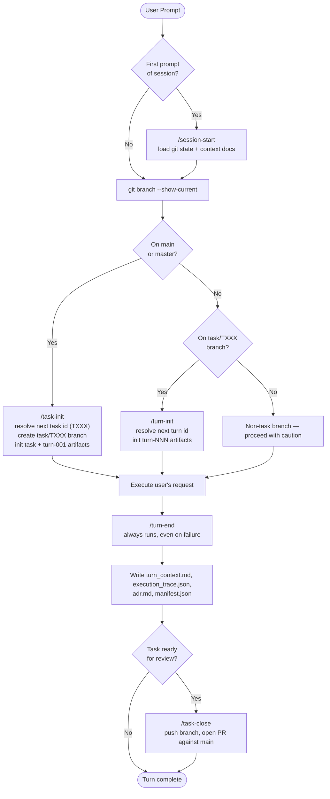

# coding-agents-config

Agentic pipeline configuration for Claude Code. Enforces a task/turn workflow with provenance tracking, branch protection, and governance rules, plus the **App Factory** skill set for spec-driven application generation (PRD → DDD → DSL → plan → implementation).

## Setup

### 1. Clone the repo

```sh
git clone <repo-url> ~/coding-agents-config
```

### 2. Create symlinks (automated)

Run the setup script — it creates all symlinks and backs up any existing files:

```sh
bash scripts/setup.sh
```

<details>
<summary>Manual symlink commands</summary>

```sh
# ~/.claude/
ln -s ~/coding-agents-config/skills ~/.claude/skills
ln -s ~/coding-agents-config/agents ~/.claude/agents
ln -s ~/coding-agents-config/hooks ~/.claude/hooks
ln -s ~/coding-agents-config/scripts ~/.claude/scripts
ln -s ~/coding-agents-config/CLAUDE.md ~/.claude/CLAUDE.md
ln -s ~/coding-agents-config/settings.json ~/.claude/settings.json

# ~/.codex/
ln -s ~/coding-agents-config/agents ~/.codex/agents
ln -s ~/coding-agents-config/AGENTS.md ~/.codex/AGENTS.md

# repo-local
ln -s ~/coding-agents-config/CLAUDE.md ./.claude/CLAUDE.md
```

If any of these already exist, back them up first (`mv <target> <target>.bak`).
</details>

### 3. Verify

```sh
ls -la ~/.claude/skills        # should point to ~/coding-agents-config/skills
ls -la ~/.claude/agents        # should point to ~/coding-agents-config/agents
ls -la ~/.claude/hooks         # should point to ~/coding-agents-config/hooks
ls -la ~/.claude/CLAUDE.md     # should point to ~/coding-agents-config/CLAUDE.md
ls -la ~/.claude/settings.json # should point to ~/coding-agents-config/settings.json
```

## Structure

```
coding-agents-config/
├── CLAUDE.md           # Global instructions — task/turn protocol, branch rules
├── AGENTS.md           # Codex agent loader directive
├── settings.json       # Claude Code settings (model, permissions, hooks, plugins)
├── package.json        # Node dependency pin (caveman)
├── agents/             # Subagent definitions
│   └── agent-architecture-planner.md
├── hooks/              # Shell hooks triggered by Claude Code events
│   └── branch-guard.sh # Blocks edits while on main/master
├── scripts/             # Automation scripts
│   ├── setup.sh         # Create ~/.claude and ~/.codex symlinks
│   └── af-state.sh      # Helpers for reading/writing .appfactory/memory/state.yaml
├── skills/              # Slash-command skills (see below)
├── docs/                # Reference docs (App Factory plan, migration analyses, skill summary)
├── archive/             # Superseded skills and templates kept for reference
└── .appfactory/         # Task/turn tracking and App Factory pipeline state
    ├── tasks/            # Task branches, each with turn-NNN artifacts
    ├── tasks_index.csv   # Registry of all tasks (branch, status, PR, turn count)
    ├── specs/            # PRD / DDD / DSL specification artifacts
    ├── prompts/          # Prompt templates used by App Factory skills
    ├── memory/           # Pipeline state (state.yaml)
    └── changelog.md
```

## Execution Flow

Every coding prompt runs through a task/turn protocol defined in `CLAUDE.md`:


```mermaid
flowchart TB
    START([User Prompt]) --> FIRST{First prompt<br/>of session?}
    FIRST -->|Yes| SS["/session-start<br/>load git state + context docs"]
    FIRST -->|No| BRANCHCHK
    SS --> BRANCHCHK["git branch --show-current"]

    BRANCHCHK --> ISMAIN{On main<br/>or master?}
    ISMAIN -->|Yes| TASKINIT["/task-init<br/>resolve next task id (TXXX)<br/>create task/TXXX branch<br/>init task + turn-001 artifacts"]
    ISMAIN -->|No| ISTASK{On task/TXXX<br/>branch?}
    ISTASK -->|Yes| TURNINIT["/turn-init<br/>resolve next turn id<br/>init turn-NNN artifacts"]
    ISTASK -->|No| WARN[Non-task branch — proceed with caution]

    TASKINIT --> EXEC
    TURNINIT --> EXEC
    WARN --> EXEC

    EXEC["Execute user's request"] --> TURNEND["/turn-end<br/>always runs, even on failure"]
    TURNEND --> WRITEARTIFACTS["Write turn_context.md, execution_trace.json,<br/>adr.md, manifest.json"]
    WRITEARTIFACTS --> READY{Task ready<br/>for review?}
    READY -->|Yes| TASKCLOSE["/task-close<br/>push branch, open PR against main"]
    READY -->|No| DONE([Turn complete])
    TASKCLOSE --> DONE
```

### Hard Gate

Code must never be written on `main` or `master`. If the active branch is `main`/`master`, `/task-init` must complete successfully — creating and switching to `task/TXXX` — before any write or edit action.

## Skills

Skills live under `skills/`, one directory per skill with a `SKILL.md` file.

| Category | Skill | Description |
|----------|-------|-------------|
| **Session** | `session-start` | Load repository state and core pipeline context at the start of a session |
| **Task** | `task-init` | Initialize a new task branch (`task/TXXX`) and create task + turn-001 artifacts |
| | `task-close` | Finalize the active task branch, push it, and open a PR against main |
| **Turn** | `turn-init` | Initialize the next turn within the active task branch |
| | `turn-end` | Finalize the active turn's artifacts after execution |
| | `branch-guard` | Create a `turn/T<ID>` branch if currently on main/master |
| **App Factory — PRD/DDD/DSL** | `af-be-prd-build` | Build a backend PRD from an intake worksheet or discovery notes |
| | `af-be-ddd-build` | Generate a backend Domain-Driven Design document from an approved PRD |
| | `af-be-ddd-analysis` | Audit a generated DDD document for completeness and PRD alignment |
| | `af-be-ddd-refactor` | Apply targeted patches to a DDD document from analysis findings |
| | `af-be-ddd-dsl` | Generate a backend DSL YAML document from a DDD document |
| | `af-be-ddd-orchestrator` | Orchestrate the build → analyze → refactor loop → test DDD workflow |
| **App Factory — Plan/Build** | `af-be-plan` | Generate a backend execution plan from a domain DSL and tech stack profile |
| | `af-be-ddd-tests` | Generate Gherkin/BDD feature files from DDD and PRD specifications |
| | `af-be-implementation` | Generate backend domain code from the execution plan and BDD specs |
| | `af-project-init` | Export required environment variables and bootstrap an App Factory project |
| | `af-orchestrator` | Orchestrate the full App Factory software development lifecycle |
| | `af-memory` | CRUD operations on `.appfactory/memory/state.yaml` pipeline state |
| | `af-app-check` | Audit an application for production readiness (security, DB, deploy, code quality) |
| **Utilities** | `dsl-utils/dsl-model-interpreter` | Parse and validate app-dsl YAML specifications |
| | `e2e-tests/http-test-artifacts` | Generate `.http` request files for API endpoint testing |
| | `ui-utils/ui-implementation-language` | Declarative YAML standard for UI pages, layouts, and widgets |
| | `unit-tests/test-implementation-sync` | Keep unit tests synchronized with actual implementations |
| | `eval-labeler` | Label and compare model responses (Response A vs B) for coding tasks |

Two hidden, vendored skill collections also live under `skills/` and are symlinked as part of the directory but are not part of this project's own pipeline docs:
- `.system/` — Codex meta-skills (`skill-creator`, `skill-installer`, `plugin-creator`, `imagegen`, `openai-docs`)
- `.nestjs/` — an older NestJS/Prisma/DSL code-generation skill set, largely superseded by the `af-be-*` App Factory skills

## Agents

| Agent | Description |
|-------|-------------|
| `agent-architecture-planner` | Reads the PRD, DDD, DSL, and repo structure to produce architecture decisions, module maps, and task plans for downstream coding agents |

## Hooks

| Hook | Trigger | Purpose |
|------|---------|---------|
| `branch-guard.sh` | `PreToolUse(Bash)` | Blocks work while on `main`/`master` |

## Adding a new skill

Each skill lives in its own directory under `skills/` with a `SKILL.md` file:

```
skills/my-skill/
└── SKILL.md
```

The `.system/skill-creator` meta-skill can guide you through creating one — invoke it from Claude Code.

## Task and turn artifacts

Task and turn state is tracked under `.appfactory/`:

- `tasks_index.csv` — registry of every task (branch, status, PR URL, turn count)
- `tasks/task-XXX/` — `task_context.md`, `task_status.json`, `task_summary.md`, `pull_request.md`
- `tasks/task-XXX/turns/turn-XXX/` — `turn_context.md`, `execution_trace.json`, `adr.md`, `manifest.json`

See `CLAUDE.md` for the full directory contract and commit message format.

## Syncing across machines

Since this is a standard git repo, pull on any machine to stay current:

```sh
cd ~/coding-agents-config && git pull
```

The symlinks mean changes are picked up immediately — no reinstall needed.
