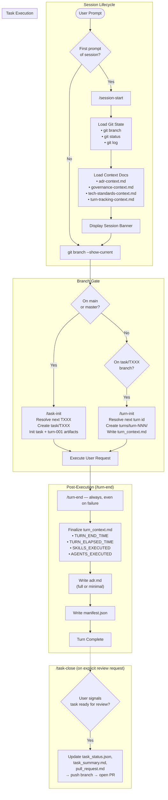

# coding-agents-config

Agentic pipeline configuration for Claude Code (and Codex). Enforces a task/turn-based workflow with provenance tracking, branch protection, and governance rules, plus a library of AppFactory skills for generating full-stack applications from a PRD.

## Setup

### 1. Clone the repo

```sh
git clone <repo-url> ~/coding-agents-config
```

### 2. Create symlinks (automated)

Run the setup script — it creates all symlinks and backs up any existing files:

```sh
bash scripts/setup.sh
```

<details>
<summary>Manual symlink commands</summary>

```sh
# ~/.claude/
ln -s ~/coding-agents-config/skills ~/.claude/skills
ln -s ~/coding-agents-config/agents ~/.claude/agents
ln -s ~/coding-agents-config/hooks ~/.claude/hooks
ln -s ~/coding-agents-config/scripts ~/.claude/scripts
ln -s ~/coding-agents-config/CLAUDE.md ~/.claude/CLAUDE.md
ln -s ~/coding-agents-config/settings.json ~/.claude/settings.json

# ~/.codex/
ln -s ~/coding-agents-config/agents ~/.codex/agents
ln -s ~/coding-agents-config/AGENTS.md ~/.codex/AGENTS.md

# repo-local ./.claude/
ln -s ~/coding-agents-config/CLAUDE.md ./.claude/CLAUDE.md
```

If any of these already exist, back them up first (`mv <target> <target>.bak`).
</details>

### 3. Verify

```sh
ls -la ~/.claude/skills        # should point to ~/coding-agents-config/skills
ls -la ~/.claude/agents        # should point to ~/coding-agents-config/agents
ls -la ~/.claude/hooks         # should point to ~/coding-agents-config/hooks
ls -la ~/.claude/CLAUDE.md     # should point to ~/coding-agents-config/CLAUDE.md
ls -la ~/.claude/settings.json # should point to ~/coding-agents-config/settings.json
```

## Structure

```
coding-agents-config/
├── CLAUDE.md           # Global instructions — task/turn protocol, branch rules, ADR requirement
├── AGENTS.md           # Codex loader directive (points at CLAUDE.md)
├── settings.json       # Claude Code settings (model, permissions, hooks, plugins)
├── hooks/              # Shell hooks triggered by Claude Code events
│   └── branch-guard.sh # PreToolUse hook — auto-creates a task branch when on main/master
├── skills/             # Slash-command skills (see table below)
├── agents/             # Subagent definitions (e.g. agent-architecture-planner)
├── scripts/             # Automation scripts
│   ├── setup.sh         # Create the symlinks above
│   └── af-state.sh      # Helpers for reading/writing .appfactory/memory/state.yaml
├── .appfactory/         # Task/turn tracking, AppFactory pipeline state, specs and prompts
│   ├── tasks/            # One directory per task (task-XXX), each holding its turns
│   ├── tasks_index.csv   # Registry of every task: branch, status, PR URL, turn count
│   ├── specs/            # PRD/DDD/DSL specifications
│   ├── prompts/          # Prompt drafts and notes
│   ├── memory/           # AppFactory pipeline state (state.yaml)
│   └── changelog.md      # Historical turn-by-turn change log
├── docs/                # Reference documentation (skill summary, migration notes, pipeline plan)
├── archive/             # Superseded skills and templates kept for reference
└── .github/             # PR and issue templates
```

## Execution Flow

The agentic pipeline enforces a strict task/turn workflow for all coding prompts, as defined in `CLAUDE.md`:


```mermaid
flowchart TB
    subgraph SESSION["Session Lifecycle"]
        START([User Prompt]) --> SS{First prompt<br/>of session?}
        SS -->|Yes| SESSION_START["/session-start"]
        SS -->|No| BRANCH_CHECK
        SESSION_START --> LOAD_GIT["Load Git State<br/>• git branch<br/>• git status<br/>• git log"]
        LOAD_GIT --> LOAD_CTX["Load Context Docs<br/>• adr-context.md<br/>• governance-context.md<br/>• tech-standards-context.md<br/>• turn-tracking-context.md"]
        LOAD_CTX --> BANNER["Display Session Banner"]
        BANNER --> BRANCH_CHECK
    end

    subgraph BRANCH_GATE["Branch Gate"]
        BRANCH_CHECK["git branch --show-current"] --> IS_MAIN{On main<br/>or master?}
        IS_MAIN -->|Yes| TASK_INIT["/task-init<br/>Resolve next TXXX<br/>Create task/TXXX<br/>Init task + turn-001 artifacts"]
        IS_MAIN -->|No| IS_TASK{On task/TXXX<br/>branch?}
        IS_TASK -->|Yes| TURN_INIT["/turn-init<br/>Resolve next turn id<br/>Create turns/turn-NNN/<br/>Write turn_context.md"]
        TASK_INIT --> EXEC
        TURN_INIT --> EXEC
    end

    subgraph EXECUTION["Task Execution"]
        EXEC["Execute User Request"]
    end

    subgraph POST_EXEC["Post-Execution (/turn-end)"]
        EXEC --> TURN_END["/turn-end — always, even on failure"]
        TURN_END --> UPDATE_CTX["Finalize turn_context.md<br/>• TURN_END_TIME<br/>• TURN_ELAPSED_TIME<br/>• SKILLS_EXECUTED<br/>• AGENTS_EXECUTED"]
        UPDATE_CTX --> WRITE_ADR["Write adr.md<br/>(full or minimal)"]
        WRITE_ADR --> WRITE_MANIFEST["Write manifest.json"]
        WRITE_MANIFEST --> COMPLETE["Turn Complete"]
    end

    subgraph TASK_CLOSE["/task-close (on explicit review request)"]
        COMPLETE -.-> READY{User signals<br/>task ready for review?}
        READY -->|Yes| CLOSE["Update task_status.json,<br/>task_summary.md,<br/>pull_request.md<br/>→ push branch → open PR"]
    end
```

### Task/Turn Protocol Summary

| Phase | Trigger | Skill | Outputs |
|-------|---------|-------|---------|
| **Session Start** | First prompt of the session | `session-start` | Git state + 4 context docs loaded |
| **Task Init** | Current branch is `main`/`master` | `task-init` | New `task/TXXX` branch, `task_context.md`, `task_status.json`, `turn-001` |
| **Turn Init** | Already on a `task/TXXX` branch | `turn-init` | Next `turns/turn-NNN/` directory and `turn_context.md` |
| **Turn End** | After every coding prompt, even on failure | `turn-end` | Finalized `turn_context.md`, `adr.md`, `manifest.json` |
| **Task Close** | User signals the task is ready for review | `task-close` | Updated task artifacts, pushed branch, PR against `main` |

Task ids are global and zero-padded (`001`, `002`, ...); turn ids reset per task and are also zero-padded (`turn-001`, `turn-002`, ...). See `CLAUDE.md` for the full directory layout and hard gate ("never write code while on `main`/`master`").

## Skills

### Session & Task/Turn Lifecycle

| Skill | Description |
|-------|-------------|
| `session-start` | Load repository state and core pipeline context at the start of every session |
| `task-init` | Initialize a new task branch and create task + turn-001 artifacts (run when on `main`/`master`) |
| `turn-init` | Initialize the next turn within the active task branch |
| `turn-end` | Finalize the active turn (ADR, manifest, context) after every coding prompt |
| `task-close` | Finalize the active task branch, push it, and open a pull request against `main` |
| `branch-guard` | Legacy guard that creates a `turn/T<ID>` branch if invoked directly on `main`/`master` |

### AppFactory Pipeline (`af-*`)

End-to-end application generation pipeline, orchestrated by `af-orchestrator`:

| # | Phase | Skill | Invoked by | Description |
|---|-------|-------|------------|-------------|
| 1 | Initialization | `af-project-init` | `af-orchestrator` | Export required env vars and bootstrap a new AppFactory project |
| 2 | Requirements | `af-be-prd-build` | `af-orchestrator` | Build a business-facing backend PRD from an intake worksheet |
| 3 | Domain-Driven Design | `af-be-ddd-orchestrator` | `af-orchestrator` | Orchestrate the DDD build → analyze → refactor loop |
| 4 | | `af-be-ddd-build` | `af-be-ddd-orchestrator` | Generate a human-readable DDD document from the approved PRD |
| 5 | | `af-be-ddd-analysis` | `af-be-ddd-orchestrator` | Audit the DDD document for quality, completeness, and PRD alignment |
| 6 | | `af-be-ddd-refactor` | `af-be-ddd-orchestrator` | Patch the DDD document based on analysis findings |
| 7 | Testing | `af-be-ddd-tests` | `af-be-ddd-orchestrator` | Generate Gherkin BDD feature files from the DDD and PRD |
| 8 | Planning | `af-be-plan` | `af-orchestrator` | Generate a step-by-step backend execution plan from a DSL + tech stack profile |
| 9 | DSL Generation | `af-be-ddd-dsl` | `af-be-implementation` | Generate the backend DSL YAML from the DDD document |
| 10 | Implementation | `af-be-implementation` | `af-orchestrator` | Copy the selected tech stack implementation and generate domain code |
| 11 | Validation | `af-app-check` | `af-orchestrator` | Audit the generated application for production readiness |
| 12 | Utility | `af-memory` | All `af-*` skills | CRUD operations on `.appfactory/memory/state.yaml` pipeline state |

### Utilities

| Category | Skill | Description |
|----------|-------|-------------|
| `dsl-utils/` | `dsl-model-interpreter` | Parse and validate `app-dsl` YAML specifications |
| `ui-utils/` | `ui-implementation-language` | Declarative YAML standard for UI pages, layouts, widgets, and forms |
| `e2e-tests/` | `http-test-artifacts` | Generate `.http` request files for API endpoint testing |
| `unit-tests/` | `test-implementation-sync` | Keep generated unit tests aligned with their target implementations |
| — | `eval-labeler` | Label and score Response A vs Response B model outputs in eval run directories |

## Agents

| Agent | Description |
|-------|-------------|
| `agent-architecture-planner` | Reads PRD/DDD/DSL and repo structure to produce architecture decisions, module maps, and task plans for downstream coding agents |

## Hooks

| Hook | Trigger | Purpose |
|------|---------|---------|
| `branch-guard.sh` | `PreToolUse` (Bash and write tools) | Auto-creates the next `task/TXXX` branch if the agent is still on `main`/`master` |

## Archive

`archive/` holds superseded skills and templates (e.g. the original `app-from-dsl` skill library, `code-entity-to-crud`, `nestjs-crud-resource`, `prisma-persistence`, legacy turn templates) kept for reference. They are not wired into the active pipeline — see `archive/README.md` for details.

## Adding a new skill

Each skill lives in its own directory under `skills/` with a `SKILL.md` file:

```
skills/my-skill/
└── SKILL.md
```

## Syncing across machines

Since this is a standard git repo, pull on any machine to stay current:

```sh
cd ~/coding-agents-config && git pull
```

The symlinks mean changes are picked up immediately — no reinstall needed.
