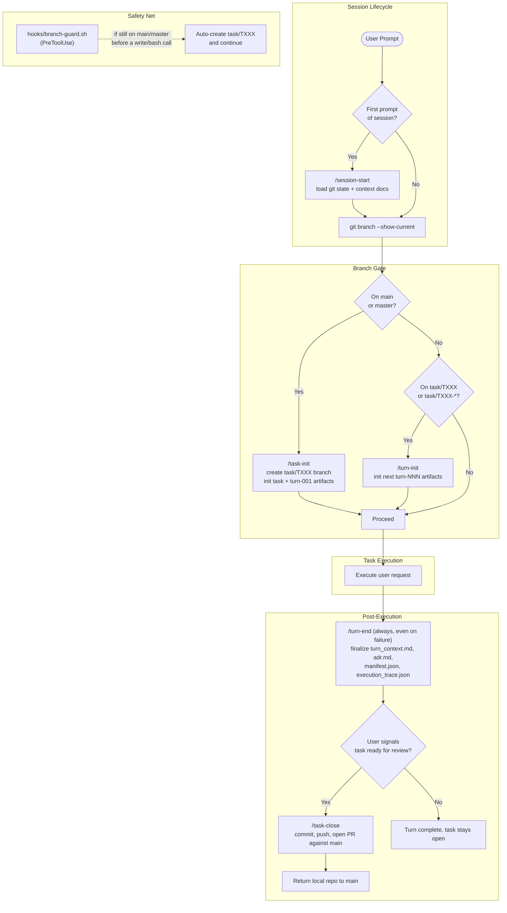

# coding-agents-config

Agentic pipeline configuration for Claude Code and Codex. Enforces a turn-based
workflow (task → turn) with provenance tracking, branch protection, and
governance rules, plus a library of 37 skills spanning the App Factory (`af-*`)
DDD backend pipeline, NestJS/Prisma scaffolding, and pipeline lifecycle
management.

## Setup

### 1. Clone the repo

```sh
git clone <repo-url> ~/coding-agents-config
```

### 2. Create symlinks (automated)

Run the setup script — it creates all symlinks and backs up any existing files:

```sh
bash scripts/setup.sh
```

It links into three locations:

- `~/.claude/` — `skills`, `agents`, `hooks`, `scripts`, `CLAUDE.md`, `settings.json`, plus `rules`, `context`, `plugins` if present
- `~/.codex/` — `agents`, `AGENTS.md`
- `./.claude/` (repo-local) — `CLAUDE.md`

<details>
<summary>Manual symlink commands</summary>

```sh
ln -s ~/coding-agents-config/skills ~/.claude/skills
ln -s ~/coding-agents-config/agents ~/.claude/agents
ln -s ~/coding-agents-config/hooks ~/.claude/hooks
ln -s ~/coding-agents-config/scripts ~/.claude/scripts
ln -s ~/coding-agents-config/CLAUDE.md ~/.claude/CLAUDE.md
ln -s ~/coding-agents-config/settings.json ~/.claude/settings.json

ln -s ~/coding-agents-config/agents ~/.codex/agents
ln -s ~/coding-agents-config/AGENTS.md ~/.codex/AGENTS.md
```

If any of these already exist, back them up first (`mv <target> <target>.bak`).
</details>

### 3. Verify

```sh
ls -la ~/.claude/skills        # should point to ~/coding-agents-config/skills
ls -la ~/.claude/hooks         # should point to ~/coding-agents-config/hooks
ls -la ~/.claude/scripts       # should point to ~/coding-agents-config/scripts
ls -la ~/.claude/CLAUDE.md     # should point to ~/coding-agents-config/CLAUDE.md
ls -la ~/.claude/settings.json # should point to ~/coding-agents-config/settings.json
ls -la ~/.codex/AGENTS.md      # should point to ~/coding-agents-config/AGENTS.md
```

## Structure

```
coding-agents-config/
├── CLAUDE.md            # Global instructions — turn protocol, branch rules
├── AGENTS.md            # Codex loader directive (reads CLAUDE.md)
├── settings.json        # Claude Code settings (model, permissions, hooks)
├── agents/              # Agent definitions (e.g. agent-architecture-planner.md)
├── hooks/               # Shell hooks triggered by Claude Code events
│   └── branch-guard.sh  # Auto-creates a task/TXXX branch when on main/master
├── skills/               # Slash-command skills (37 total, see below)
│   ├── .system/          # Meta-skills (skill-creator, skill-installer, plugin-creator, ...)
│   ├── .nestjs/           # NestJS/Prisma scaffolding skills
│   ├── af-*/              # App Factory backend DDD pipeline skills
│   ├── session-start/     # Initialize session context
│   ├── task-init/         # Create task branch and turn-001 artifacts
│   ├── turn-init/         # Create the next turn directory and artifacts
│   ├── turn-end/          # Finalize a turn (ADR, manifest, execution trace)
│   ├── task-close/        # Finalize a task, push, and open a PR
│   ├── branch-guard/      # Turn-scoped branch fallback
│   └── ...                # dsl-utils, e2e-tests, ui-utils, unit-tests, eval-labeler
├── scripts/              # Automation scripts (setup.sh, af-state.sh)
├── docs/                 # Reference documentation and migration notes
├── agents/               # Agent role/persona definitions
├── archive/              # Superseded skills and templates kept for reference
├── .github/              # Issue templates and PR template
└── .appfactory/          # Task/turn tracking and specs
    ├── tasks/            # task-XXX/ directories with turns/, status, PR notes
    ├── tasks_index.csv   # Registry of all tasks and their status
    ├── specs/            # Specifications
    ├── prompts/          # Prompt templates
    ├── memory/           # Project memory
    └── changelog.md
```

## Execution Flow

The agentic pipeline enforces a task/turn workflow for all coding tasks, driven
by `CLAUDE.md`'s "Mandatory Skill Invocations":


```mermaid
flowchart TB
    subgraph SESSION["Session Lifecycle"]
        START([User Prompt]) --> SS{First prompt<br/>of session?}
        SS -->|Yes| SESSION_START["/session-start<br/>load git state + context docs"]
        SS -->|No| BRANCH_CHECK
        SESSION_START --> BRANCH_CHECK
    end

    subgraph BRANCH_GATE["Branch Gate"]
        BRANCH_CHECK["git branch --show-current"] --> IS_MAIN{On main<br/>or master?}
        IS_MAIN -->|Yes| TASK_INIT["/task-init<br/>create task/TXXX branch<br/>init task + turn-001 artifacts"]
        IS_MAIN -->|No| IS_TASK{On task/TXXX<br/>or task/TXXX-*?}
        IS_TASK -->|Yes| TURN_INIT["/turn-init<br/>init next turn-NNN artifacts"]
        IS_TASK -->|No| PROCEED
        TASK_INIT --> PROCEED
        TURN_INIT --> PROCEED
    end

    subgraph EXECUTION["Task Execution"]
        PROCEED["Proceed"] --> EXEC["Execute user request"]
    end

    subgraph POST_EXEC["Post-Execution"]
        EXEC --> TURN_END["/turn-end (always, even on failure)<br/>finalize turn_context.md, adr.md,<br/>manifest.json, execution_trace.json"]
        TURN_END --> READY{User signals<br/>task ready for review?}
        READY -->|Yes| TASK_CLOSE["/task-close<br/>commit, push, open PR against main"]
        READY -->|No| DONE["Turn complete, task stays open"]
        TASK_CLOSE --> RETURN["Return local repo to main"]
    end

    subgraph SAFETY["Safety Net"]
        direction LR
        HOOK["hooks/branch-guard.sh<br/>(PreToolUse)"] -.->|"if still on main/master<br/>before a write/bash call"| AUTO["Auto-create task/TXXX<br/>and continue"]
    end
```

### Turn Protocol Summary

| Phase | Steps | Outputs |
|-------|-------|---------|
| **Session Start** | Load git state → load context docs → display banner | Context loaded |
| **Task Init** (on `main`/`master`) | Resolve next task id → create `task/TXXX` → init task + turn-001 artifacts | `task_context.md`, `task_status.json`, `task_summary.md`, `pull_request.md`, turn-001 files |
| **Turn Init** (on `task/TXXX`) | Resolve next turn id → create turn dir → write context + trace | `turn_context.md`, `execution_trace.json` |
| **Execution** | Execute the user's request | Modified files |
| **Turn End** | Update turn context → write ADR → write manifest → update trace | `adr.md`, `manifest.json` |
| **Task Close** (on request) | Update task artifacts → commit → push → open PR → return to `main` | PR against `main` |

## Skills (37)

| Category | Skill | Description |
|----------|-------|--------------|
| **Pipeline Lifecycle** | `session-start` | Load git state and core pipeline context at session start |
| | `task-init` | Create a new `task/TXXX` branch and initialize task + turn-001 artifacts |
| | `turn-init` | Initialize the next turn within the active task branch |
| | `turn-end` | Finalize the active turn (ADR, manifest, execution trace) |
| | `task-close` | Finalize the active task, push, and open a PR against `main` |
| | `branch-guard` | Fallback: create a turn-scoped branch if still on `main`/`master` |
| **App Factory (`af-*`)** | `af-orchestrator` | Orchestrate the App Factory software development lifecycle |
| | `af-project-init` | Export required env vars and initialize an AppFactory project |
| | `af-memory` | CRUD operations on `.appfactory/state.yaml` pipeline state |
| | `af-be-prd-build` | Build a backend PRD from an intake worksheet |
| | `af-be-ddd-build` | Generate a backend DDD document from an approved PRD |
| | `af-be-ddd-dsl` | Generate a backend DSL YAML document from a DDD document |
| | `af-be-ddd-analysis` | Analyze a backend DDD/DSL design |
| | `af-be-ddd-refactor` | Refactor a backend DDD/DSL design |
| | `af-be-ddd-tests` | Generate Gherkin BDD feature files from DDD + PRD specs |
| | `af-be-ddd-orchestrator` | Orchestrate the DDD build → analyze → refactor → test loop |
| | `af-be-plan` | Generate a backend execution plan from a DSL + tech stack profile |
| | `af-be-implementation` | Generate backend domain code from the execution plan and BDD specs |
| | `af-app-check` | Audit an application for production readiness before release |
| **NestJS / Prisma (`.nestjs/`)** | `app-from-dsl` | Orchestrate full-stack generation from `app-dsl/` |
| | `nestjs-crud-resource` | Generate a NestJS CRUD module (controller/service/DTOs) |
| | `nestjs-prisma-resource` | Generate a NestJS CRUD resource backed by Prisma |
| | `nestjs-customer-crud-scaffold` | Scaffold a NestJS customer CRUD app |
| | `nestjs-observability` | Add logging/observability patterns to a NestJS app |
| | `field-mapper-generator` | Generate mapper functions between UI/API/persistence layers |
| | `prisma-persistence` | Generate Prisma models, migrations, and client |
| | `prisma-guidelines` | Prisma development constraints and anti-patterns |
| **Utility** | `dsl-model-interpreter` (`dsl-utils/`) | Parse and validate `app-dsl` YAML specifications |
| | `http-test-artifacts` (`e2e-tests/`) | Generate `.http` request files for API testing |
| | `ui-implementation-language` (`ui-utils/`) | Framework-neutral YAML language for UI pages/forms |
| | `test-implementation-sync` (`unit-tests/`) | Keep unit tests synchronized with actual implementations |
| | `eval-labeler` | Label and score Response A vs Response B model evaluations |

### Meta-Skills (`.system/`)

| Skill | Description |
|-------|-------------|
| `skill-creator` | Create new skills with a `SKILL.md` |
| `skill-installer` | Install skills from marketplaces |
| `plugin-creator` | Scaffold Codex plugin directories and marketplace entries |
| `imagegen` | Generate or edit raster images |
| `openai-docs` | Look up official OpenAI API/product documentation |

## Hooks

| Hook | Trigger | Purpose |
|------|---------|---------|
| `branch-guard.sh` | `PreToolUse` (Bash/write tools) | If still on `main`/`master`, auto-create and switch to the next `task/TXXX` branch before the call runs |

## Templates

Templates live alongside the skills that use them rather than in a shared
top-level directory, e.g. `skills/task-init/templates/task_context.md` and
`skills/turn-init/templates/turn_context.md`. Older shared templates
(ADR, PR, manifest schema, metadata header, branch naming, commit message)
are preserved under `archive/templates/`.

## Adding a new skill

Each skill lives in its own directory with a `SKILL.md` file:

```
skills/my-skill/
└── SKILL.md
```

The `.system/skill-creator` meta-skill can guide you through creating one — invoke it from Claude Code.

## Syncing across machines

Since this is a standard git repo, pull on any machine to stay current:

```sh
cd ~/coding-agents-config && git pull
```

The symlinks mean changes are picked up immediately — no reinstall needed.
