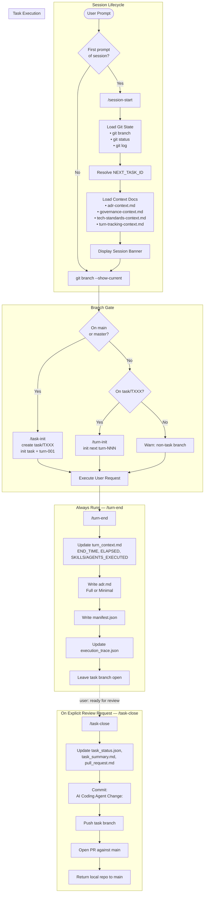

# coding-agents-config

Agentic pipeline configuration for Claude Code (and Codex). Enforces a task/turn-based workflow with provenance tracking, branch protection, and governance rules, plus a library of reusable skills and agents for App Factory (AppFactory) backend generation, NestJS/Prisma scaffolding, and general utilities.

## Setup

### 1. Clone the repo

```sh
git clone <repo-url> ~/coding-agents-config
```

### 2. Create symlinks (automated)

Run the setup script — it creates all symlinks and backs up any existing files:

```sh
bash scripts/setup.sh
```

It links:

| Into | Items |
|------|-------|
| `~/.claude/` | `skills`, `agents`, `rules`, `hooks`, `context`, `scripts`, `plugins`, `CLAUDE.md`, `settings.json` |
| `~/.codex/` | `agents`, `AGENTS.md` |
| `./.claude/` (repo-local) | `CLAUDE.md` |

Only items that exist in this repo produce a working link — `rules`, `context`, and `plugins` are reserved for future use and aren't present yet.

<details>
<summary>Manual symlink commands</summary>

```sh
ln -s ~/coding-agents-config/skills ~/.claude/skills
ln -s ~/coding-agents-config/agents ~/.claude/agents
ln -s ~/coding-agents-config/hooks ~/.claude/hooks
ln -s ~/coding-agents-config/scripts ~/.claude/scripts
ln -s ~/coding-agents-config/CLAUDE.md ~/.claude/CLAUDE.md
ln -s ~/coding-agents-config/settings.json ~/.claude/settings.json
ln -s ~/coding-agents-config/agents ~/.codex/agents
ln -s ~/coding-agents-config/AGENTS.md ~/.codex/AGENTS.md
```

If any of these already exist, back them up first (`mv <target> <target>.bak`).
</details>

### 3. Verify

```sh
ls -la ~/.claude/skills        # should point to ~/coding-agents-config/skills
ls -la ~/.claude/hooks         # should point to ~/coding-agents-config/hooks
ls -la ~/.claude/CLAUDE.md     # should point to ~/coding-agents-config/CLAUDE.md
ls -la ~/.claude/settings.json # should point to ~/coding-agents-config/settings.json
```

## Structure

```
coding-agents-config/
├── CLAUDE.md            # Global instructions — task/turn protocol, branch rules
├── AGENTS.md            # Codex agent loader directive
├── settings.json        # Claude Code settings (model, permissions, hooks, plugins)
├── package.json         # npm metadata (caveman plugin dependency)
├── hooks/               # Shell hooks triggered by Claude Code events
│   └── branch-guard.sh  # PreToolUse hook — auto-creates task/TXXX branch off main/master
├── agents/              # Standalone subagent definitions
│   └── agent-architecture-planner.md
├── skills/              # Slash-command skills
│   ├── session-start/       # Load repo + pipeline context at session start
│   ├── task-init/           # Create task/TXXX branch and turn-001 artifacts
│   ├── task-close/          # Finalize task, push, open PR
│   ├── turn-init/           # Create the next turn inside the active task
│   ├── turn-end/            # Finalize a turn (ADR, manifest, trace)
│   ├── branch-guard/        # Model-invoked branch guard (see hooks/)
│   ├── af-*/                # App Factory backend SDLC pipeline (13 skills)
│   ├── dsl-utils/           # DSL parsing utility (nested skill)
│   ├── ui-utils/            # UI DSL utility (nested skill)
│   ├── unit-tests/          # Test/implementation sync utility (nested skill)
│   ├── e2e-tests/           # HTTP test artifact utility (nested skill)
│   ├── eval-labeler/        # Model response evaluation/labeling
│   ├── .nestjs/             # NestJS + Prisma code-generation skills (8 skills)
│   └── .system/             # Meta / Codex-imported skills (skill-creator, imagegen, ...)
├── scripts/              # Automation scripts
│   ├── setup.sh          # Create ~/.claude and ~/.codex symlinks
│   └── af-state.sh       # Helpers for reading/writing .appfactory/memory/state.yaml
├── .appfactory/          # Task/turn tracking, specs, prompts, memory
│   ├── tasks/            # task-XXX/ directories with turns/ subfolders
│   ├── tasks_index.csv   # Registry of all tasks
│   ├── specs/            # PRD/DDD/DSL specifications
│   ├── prompts/          # Reusable prompt library
│   └── memory/           # Pipeline state (state.yaml)
├── docs/                 # Reference documentation (migration notes, plans, skill summary)
├── archive/              # Superseded skills and templates kept for reference
└── .github/              # PR template and issue templates (epic, task, bug)
```

## Execution Flow

The agentic pipeline enforces a task/turn-based workflow for all coding prompts, defined in `CLAUDE.md`:


```mermaid
flowchart TB
    subgraph SESSION["Session Lifecycle"]
        START([User Prompt]) --> SS{First prompt<br/>of session?}
        SS -->|Yes| SESSION_START["/session-start"]
        SS -->|No| BRANCH_CHECK
        SESSION_START --> LOAD_GIT["Load Git State<br/>• git branch<br/>• git status<br/>• git log"]
        LOAD_GIT --> RESOLVE_NEXT["Resolve NEXT_TASK_ID"]
        RESOLVE_NEXT --> LOAD_CTX["Load Context Docs<br/>• adr-context.md<br/>• governance-context.md<br/>• tech-standards-context.md<br/>• turn-tracking-context.md"]
        LOAD_CTX --> BANNER["Display Session Banner"]
        BANNER --> BRANCH_CHECK
    end

    subgraph BRANCH_GATE["Branch Gate"]
        BRANCH_CHECK["git branch --show-current"] --> IS_MAIN{On main<br/>or master?}
        IS_MAIN -->|Yes| TASK_INIT["/task-init<br/>create task/TXXX<br/>init task + turn-001"]
        IS_MAIN -->|No| IS_TASK{On task/TXXX?}
        IS_TASK -->|Yes| TURN_INIT["/turn-init<br/>init next turn-NNN"]
        IS_TASK -->|No| WARN["Warn: non-task branch"]
        TASK_INIT --> EXEC
        TURN_INIT --> EXEC
        WARN --> EXEC
    end

    subgraph EXECUTION["Task Execution"]
        EXEC["Execute User Request"]
    end

    subgraph TURN_END_FLOW["Always Runs — /turn-end"]
        EXEC --> TURN_END["/turn-end"]
        TURN_END --> UPDATE_CTX["Update turn_context.md<br/>END_TIME, ELAPSED, SKILLS/AGENTS_EXECUTED"]
        UPDATE_CTX --> WRITE_ADR["Write adr.md<br/>Full or Minimal"]
        WRITE_ADR --> WRITE_MANIFEST["Write manifest.json"]
        WRITE_MANIFEST --> UPDATE_TRACE["Update execution_trace.json"]
        UPDATE_TRACE --> LEAVE_OPEN["Leave task branch open"]
    end

    subgraph TASK_CLOSE_FLOW["On Explicit Review Request — /task-close"]
        LEAVE_OPEN -.->|"user: ready for review"| TASK_CLOSE["/task-close"]
        TASK_CLOSE --> UPDATE_TASK["Update task_status.json,<br/>task_summary.md, pull_request.md"]
        UPDATE_TASK --> COMMIT["Commit:<br/>AI Coding Agent Change:"]
        COMMIT --> PUSH["Push task branch"]
        PUSH --> PR["Open PR against main"]
        PR --> RETURN_MAIN["Return local repo to main"]
    end
```

### Task/Turn Protocol Summary

| Phase | Trigger | Steps | Outputs |
|-------|---------|-------|---------|
| **Session Start** | First prompt of session | Load git state → resolve next task id → load 4 context docs → display banner | Context loaded |
| **Task Init** | Current branch is `main`/`master` | Create `task/TXXX` → init `task-XXX/` + `turn-001` artifacts | Task + turn-001 scaffolding |
| **Turn Init** | Current branch is `task/TXXX` | Resolve next `turn-NNN` → write initial `turn_context.md`/`execution_trace.json` | New turn directory |
| **Execution** | Every prompt | Execute the user's request on the active task branch | Modified files |
| **Turn End** | After every prompt, even on failure | Update turn context → write ADR → write manifest → update trace | 4 turn artifacts complete |
| **Task Close** | User signals task is ready for review | Update task artifacts → commit → push → open PR against `main` → return to `main` | Task artifacts + PR |

The `hooks/branch-guard.sh` `PreToolUse` hook is a safety net: if a write/bash tool fires while still on `main`/`master`, it auto-creates the next `task/TXXX` branch instead of blocking the action.

## Skills

### Task/Turn Lifecycle

| Skill | Description |
|-------|-------------|
| `session-start` | Load repository state and core pipeline context at session start |
| `task-init` | Initialize a new task branch and create task + turn-001 artifacts |
| `task-close` | Finalize the active task branch, push it, and open a PR against `main` |
| `turn-init` | Initialize the next turn within the active task branch |
| `turn-end` | Finalize the active turn (ADR, manifest, execution trace) after execution |
| `branch-guard` | Model-invocable branch check/guard companion to the `PreToolUse` hook |

### App Factory Backend Pipeline (`af-*`)

| Skill | Description |
|-------|-------------|
| `af-project-init` | Orchestrate AppFactory project initialization (env vars + helper script) |
| `af-orchestrator` | Orchestrate the full App Factory software development lifecycle |
| `af-be-prd-build` | Build a business-facing backend PRD from an intake worksheet |
| `af-be-ddd-build` | Generate a backend Domain-Driven Design document from an approved PRD |
| `af-be-ddd-analysis` | Audit a generated DDD spec for quality, completeness, and PRD alignment |
| `af-be-ddd-refactor` | Refactor a DDD spec using `af-be-ddd-analysis` findings |
| `af-be-ddd-orchestrator` | Orchestrate the DDD build → analyze → refactor loop → test phases |
| `af-be-ddd-dsl` | Generate a backend application DSL YAML from a DDD document |
| `af-be-ddd-tests` | Generate Gherkin BDD scenarios from the DDD and PRD specifications |
| `af-be-plan` | Generate a backend execution plan from the domain DSL and a tech-stack profile |
| `af-be-implementation` | Generate backend domain code from the execution plan into the target project |
| `af-app-check` | Audit an application for production readiness (security, DB, deployment, quality) |
| `af-memory` | CRUD operations over `.appfactory/memory/state.yaml` pipeline state |

### Utilities

| Skill | Description |
|-------|-------------|
| `dsl-utils/dsl-model-interpreter` | Parse and validate app-dsl YAML specifications before code generation |
| `ui-utils/ui-implementation-language` | Declarative YAML standard for pages, layouts, widgets, forms, and bindings |
| `unit-tests/test-implementation-sync` | Keep unit tests synchronized with actual service/DTO implementations |
| `e2e-tests/http-test-artifacts` | Generate `.http` request files for REST endpoint testing |
| `eval-labeler` | Label and compare Response A/B model outputs for coding-task evaluations |

### NestJS / Prisma Code Generation (`.nestjs/`)

| Skill | Description |
|-------|-------------|
| `app-from-dsl` | Orchestrate full-stack application generation from app-dsl YAML |
| `nestjs-crud-resource` | Generate a NestJS CRUD module (controller, service, DTOs) from a DSL spec |
| `nestjs-prisma-resource` | Generate a complete NestJS + Prisma CRUD resource from an input schema |
| `nestjs-customer-crud-scaffold` | Scaffold a NestJS customer CRUD app via a non-interactive Nest CLI wrapper |
| `nestjs-observability` | Add structured logging, correlation IDs, and redaction to a NestJS + Prisma backend |
| `field-mapper-generator` | Generate field mapper/converter utilities from DSL mapper specs |
| `prisma/prisma-guidelines` | Prisma ORM development guidelines and constraints reference |
| `prisma/prisma-persistence` | Generate Prisma schema and migrations from a DSL persistence model |

### Meta / Codex-imported (`.system/`)

| Skill | Description |
|-------|-------------|
| `skill-creator` | Guide for creating and updating skills |
| `skill-installer` | Install Codex skills into `$CODEX_HOME/skills` from a curated list or GitHub repo |
| `plugin-creator` | Scaffold Codex plugin directories and marketplace entries |
| `imagegen` | Generate or edit raster images (photos, illustrations, sprites, mockups) |
| `openai-docs` | Look up official OpenAI product/API documentation with citations |

### Archive

Superseded skills (legacy React/Prisma/DSL scaffolding, prior turn-tracking templates) are preserved under `archive/` for reference and are not symlinked or actively used.

## Agents

| Agent | Model | Description |
|-------|-------|-------------|
| `agent-architecture-planner` | sonnet | Reads PRD/DDD/DSL and repo structure to produce spec-gap analysis, architecture module/event/integration maps, and an atomic, dependency-sequenced implementation plan |

## Hooks

| Hook | Trigger | Purpose |
|------|---------|---------|
| `branch-guard.sh` | `PreToolUse` (bash/write tools) | Auto-create `task/TXXX` off `main`/`master` instead of blocking the tool call |

## Adding a new skill

Each skill lives in its own directory under `skills/` with a `SKILL.md` file:

```
skills/my-skill/
└── SKILL.md
```

The `.system/skill-creator` meta-skill can guide you through creating one — invoke it from Claude Code.

## Syncing across machines

Since this is a standard git repo, pull on any machine to stay current:

```sh
cd ~/coding-agents-config && git pull
```

The symlinks mean changes are picked up immediately — no reinstall needed.
