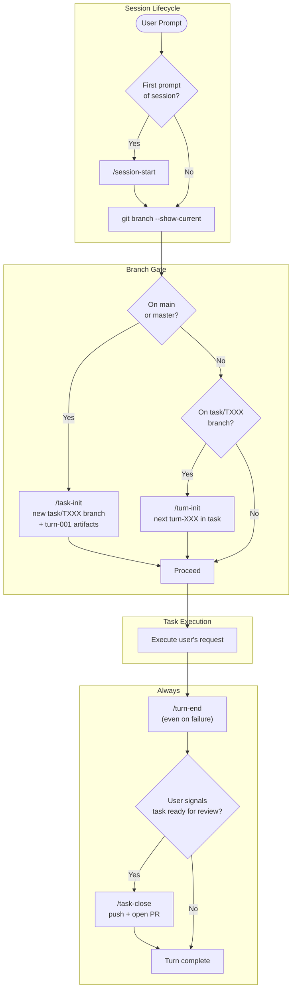

# coding-agents-config

Agentic pipeline configuration for Claude Code and Codex. Enforces a task/turn-based workflow with provenance tracking, branch protection, and governance rules, plus the **App Factory** (`af-*`) skill set for DSL-driven backend application generation.

## Setup

### 1. Clone the repo

```sh
git clone <repo-url> ~/coding-agents-config
```

### 2. Create symlinks (automated)

Run the setup script — it creates all symlinks and backs up any existing files:

```sh
bash scripts/setup.sh
```

<details>
<summary>Manual symlink commands</summary>

```sh
# Into ~/.claude/
ln -s ~/coding-agents-config/skills       ~/.claude/skills
ln -s ~/coding-agents-config/agents       ~/.claude/agents
ln -s ~/coding-agents-config/hooks        ~/.claude/hooks
ln -s ~/coding-agents-config/scripts      ~/.claude/scripts
ln -s ~/coding-agents-config/CLAUDE.md    ~/.claude/CLAUDE.md
ln -s ~/coding-agents-config/settings.json ~/.claude/settings.json

# Into ~/.codex/
ln -s ~/coding-agents-config/agents    ~/.codex/agents
ln -s ~/coding-agents-config/AGENTS.md ~/.codex/AGENTS.md

# Repo-local
ln -s ~/coding-agents-config/CLAUDE.md ./.claude/CLAUDE.md
```

`rules/`, `context/`, and `plugins/` are also linked by the script if present; they don't currently exist in this repo. If any target already exists, back it up first (`mv <target> <target>.bak`).
</details>

### 3. Verify

```sh
ls -la ~/.claude/skills        # should point to ~/coding-agents-config/skills
ls -la ~/.claude/agents        # should point to ~/coding-agents-config/agents
ls -la ~/.claude/hooks         # should point to ~/coding-agents-config/hooks
ls -la ~/.claude/CLAUDE.md     # should point to ~/coding-agents-config/CLAUDE.md
ls -la ~/.claude/settings.json # should point to ~/coding-agents-config/settings.json
```

## Structure

```
coding-agents-config/
├── CLAUDE.md           # Global instructions — task/turn protocol, branch rules
├── AGENTS.md           # Codex loader directive (reads ~/.claude/CLAUDE.md)
├── settings.json       # Claude Code settings (model, permissions, hooks, plugins)
├── package.json        # npm dependency (caveman, used by the caveman plugin)
├── hooks/
│   └── branch-guard.sh # PreToolUse(Bash) hook — blocks edits on main/master
├── agents/
│   └── agent-architecture-planner.md # Sonnet sub-agent for App Factory planning
├── skills/             # Slash-command skills (see below)
├── scripts/
│   ├── setup.sh         # Creates the symlinks above
│   └── af-state.sh      # Helpers for reading/writing .appfactory/memory/state.yaml
├── docs/                # Reference docs (AppFactory plan, skill summary, migration notes)
├── archive/             # Deprecated skills/templates kept for reference (not symlinked)
├── .appfactory/         # Task/turn tracking and specs for THIS repo's own work
│   ├── tasks/           # task-NNN/ directories with turns/turn-NNN/ artifacts
│   ├── specs/           # Specifications (PRD, DDD, DSL)
│   ├── prompts/         # Prompt templates
│   └── memory/          # Project memory (state.yaml)
└── .github/
    ├── PULL_REQUEST_TEMPLATE.md
    └── ISSUE_TEMPLATE/   # epic.md, task.md, bug.md
```

## Skills

### Task/turn pipeline (this repo's governance)

| Skill | Description |
|-------|--------------|
| `session-start` | Load repository state and core pipeline context. Run at the start of every session. |
| `task-init` | Initialize a new task branch (`task/TXXX`) and create task + `turn-001` artifacts. Run when on `main`/`master`. |
| `turn-init` | Initialize the next turn within the active task branch. Run when already on a task branch. |
| `turn-end` | Finalize the active turn (context, trace, ADR, manifest, index) after every coding prompt, even on failure. |
| `task-close` | Finalize the active task branch, push it, and open a pull request against `main`. |
| `branch-guard` | Safety net: creates a turn-scoped branch if work is attempted on `main`/`master`. |

### App Factory (`af-*`) — DSL-driven SDLC pipeline

| Skill | Description |
|-------|--------------|
| `af-orchestrator` | Orchestrates the full App Factory software development lifecycle. |
| `af-project-init` | Exports required environment variables and initializes a new AppFactory project. |
| `af-be-prd-build` | Builds a business-facing backend PRD from an intake worksheet/discovery notes. |
| `af-be-ddd-orchestrator` | Orchestrates the backend DDD build → analyze → refactor loop → test phases. |
| `af-be-ddd-build` | Generates a human-readable backend DDD document from an approved PRD. |
| `af-be-ddd-analysis` | Audits a DDD document for quality, completeness, and PRD alignment. |
| `af-be-ddd-refactor` | Applies targeted patches to a DDD document based on `af-be-ddd-analysis` findings. |
| `af-be-ddd-tests` | Generates Gherkin/BDD feature files from the DDD and PRD specs. |
| `af-be-ddd-dsl` | Generates a backend application DSL YAML document from the DDD document. |
| `af-be-plan` | Generates a backend execution plan from the domain DSL and a tech-stack profile. |
| `af-be-implementation` | Copies the selected tech-stack implementation and generates domain code from the plan + BDD specs. |
| `af-app-check` | Audits an application for production readiness (security, database, deployment, code quality). |
| `af-memory` | CRUD operations against `.appfactory/memory/state.yaml` for pipeline state tracking. |

### Utility skill bundles

Each of these is a namespace directory containing one nested skill:

| Bundle | Nested skill | Description |
|--------|--------------|--------------|
| `dsl-utils/` | `dsl-model-interpreter` | Parse and validate `app-dsl` YAML specifications before code generation. |
| `e2e-tests/` | `http-test-artifacts` | Generate `.http` request files from backend endpoint specs. |
| `ui-utils/` | `ui-implementation-language` | Declarative YAML standard for describing UI pages, widgets, and state bindings. |
| `unit-tests/` | `test-implementation-sync` | Keep generated unit tests synchronized with service/DTO implementations. |

### Other

| Skill | Description |
|-------|--------------|
| `eval-labeler` | Labels/compares two model responses (Response A vs B) against `Eval.md` run directories. |

## Execution Flow

The pipeline enforces a strict task/turn workflow for all coding tasks:


```mermaid
flowchart TB
    subgraph SESSION["Session Lifecycle"]
        START([User Prompt]) --> SS{First prompt<br/>of session?}
        SS -->|Yes| SESSION_START["/session-start"]
        SS -->|No| BRANCH_CHECK
        SESSION_START --> BRANCH_CHECK["git branch --show-current"]
    end

    subgraph BRANCH_GATE["Branch Gate"]
        BRANCH_CHECK --> IS_MAIN{On main<br/>or master?}
        IS_MAIN -->|Yes| TASK_INIT["/task-init<br/>new task/TXXX branch<br/>+ turn-001 artifacts"]
        IS_MAIN -->|No| IS_TASK{On task/TXXX<br/>branch?}
        IS_TASK -->|Yes| TURN_INIT["/turn-init<br/>next turn-XXX in task"]
        IS_TASK -->|No| PROCEED
        TASK_INIT --> PROCEED
        TURN_INIT --> PROCEED
    end

    subgraph EXECUTION["Task Execution"]
        PROCEED["Proceed"] --> EXEC["Execute user's request"]
    end

    subgraph POST_EXEC["Always"]
        EXEC --> TURN_END["/turn-end<br/>(even on failure)"]
        TURN_END --> READY{User signals<br/>task ready for review?}
        READY -->|Yes| TASK_CLOSE["/task-close<br/>push + open PR"]
        READY -->|No| DONE["Turn complete"]
        TASK_CLOSE --> DONE
    end
```

### Turn artifacts

Every turn writes to `.appfactory/tasks/task-XXX/turns/turn-XXX/`:

- `turn_context.md`
- `execution_trace.json`
- `adr.md` (full or minimal, per ADR rules)
- `manifest.json`

### Task artifacts

Every task writes to `.appfactory/tasks/task-XXX/`:

- `task_context.md`
- `task_status.json`
- `task_summary.md`
- `pull_request.md`

`.appfactory/tasks_index.csv` gets one row per task, updated as status changes.

## Hooks

| Hook | Trigger | Purpose |
|------|---------|---------|
| `branch-guard.sh` | `PreToolUse(Bash)` | Blocks work on `main`/`master` before it happens. |

## Agents

| Agent | Model | Purpose |
|-------|-------|---------|
| `agent-architecture-planner` | sonnet | Reads PRD/DDD/DSL and repo structure to produce architecture decisions, module maps, and task plans for downstream App Factory skills. |

## Adding a new skill

Each skill lives in its own directory under `skills/` with a `SKILL.md` file:

```
skills/my-skill/
└── SKILL.md
```

`SKILL.md` needs a frontmatter block with at least `name` and `description`; `disable-model-invocation: true` prevents auto-invocation without an explicit slash command.

## Branch rules

- Task branches: `task/TXXX` (e.g. `task/T003`)
- Never commit directly to `main` or `master`
- Never skip `/turn-end`
- Commit messages use the format:

  ```text
  AI Coding Agent Change:
  - <imperative bullet>
  - <imperative bullet>
  ```

## Syncing across machines

Since this is a standard git repo, pull on any machine to stay current:

```sh
cd ~/coding-agents-config && git pull
```

The symlinks mean changes are picked up immediately — no reinstall needed.
