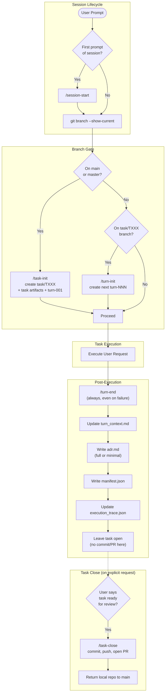

# coding-agents-config

Agentic pipeline configuration for Claude Code (and Codex). Enforces a task/turn-based workflow with provenance tracking, branch protection, and governance rules, and ships the App Factory skill library for spec-driven backend generation (PRD → DDD → DSL → plan → implementation).

## Setup

### 1. Clone the repo

```sh
git clone <repo-url> ~/coding-agents-config
```

### 2. Create symlinks (automated)

Run the setup script — it creates all symlinks and backs up any existing files:

```sh
bash scripts/setup.sh
```

It links into three places:

- `~/.claude/` — `skills`, `agents`, `rules`, `hooks`, `context`, `scripts`, `plugins`, `CLAUDE.md`, `settings.json`
- `~/.codex/` — `agents`, `AGENTS.md`
- `./.claude/` (repo-local) — `CLAUDE.md`

`rules/`, `context/`, and `plugins/` aren't tracked in this repo yet; the script still links them so they pick up content the moment those directories are added.

<details>
<summary>Manual symlink commands</summary>

```sh
ln -s ~/coding-agents-config/skills ~/.claude/skills
ln -s ~/coding-agents-config/agents ~/.claude/agents
ln -s ~/coding-agents-config/hooks ~/.claude/hooks
ln -s ~/coding-agents-config/scripts ~/.claude/scripts
ln -s ~/coding-agents-config/CLAUDE.md ~/.claude/CLAUDE.md
ln -s ~/coding-agents-config/settings.json ~/.claude/settings.json
ln -s ~/coding-agents-config/agents ~/.codex/agents
ln -s ~/coding-agents-config/AGENTS.md ~/.codex/AGENTS.md
```

If any of these already exist, back them up first (`mv <target> <target>.bak`).
</details>

### 3. Verify

```sh
ls -la ~/.claude/skills        # should point to ~/coding-agents-config/skills
ls -la ~/.claude/agents        # should point to ~/coding-agents-config/agents
ls -la ~/.claude/hooks         # should point to ~/coding-agents-config/hooks
ls -la ~/.claude/CLAUDE.md     # should point to ~/coding-agents-config/CLAUDE.md
ls -la ~/.claude/settings.json # should point to ~/coding-agents-config/settings.json
```

## Structure

```
coding-agents-config/
├── CLAUDE.md           # Global instructions — task/turn protocol, branch rules
├── AGENTS.md           # Codex loader directive (points to CLAUDE.md)
├── settings.json       # Claude Code settings (model, permissions)
├── hooks/
│   └── branch-guard.sh # PreToolUse hook: auto-creates a task/TXXX branch when on main/master
├── skills/             # SKILL.md-based skills (24)
│   ├── session-start/  # Load repo state + context docs at session start
│   ├── task-init/      # Create task branch + turn-001 (run from main/master)
│   ├── turn-init/      # Create the next turn within the active task branch
│   ├── turn-end/       # Finalize turn artifacts (context, trace, ADR, manifest)
│   ├── task-close/     # Push task branch and open a PR against main
│   ├── branch-guard/   # Create a turn-scoped branch if on main/master
│   ├── af-*/           # App Factory SDLC pipeline (PRD, DDD, DSL, plan, implementation, orchestrator, memory)
│   ├── eval-labeler/   # Label model-response evaluation runs
│   └── dsl-utils/, e2e-tests/, ui-utils/, unit-tests/  # Nested utility skills (DSL parsing, HTTP test artifacts, UI DSL, test/impl sync)
├── agents/
│   └── agent-architecture-planner.md # Architecture/planning subagent for App Factory projects
├── scripts/
│   ├── setup.sh        # Symlinks this repo into ~/.claude and ~/.codex
│   └── af-state.sh     # Shell helpers for .appfactory/memory/state.yaml
├── .appfactory/        # Task/turn tracking and specs
│   ├── tasks/          # task-XXX/ directories, each with turns/turn-XXX/
│   ├── specs/          # Specifications (PRD, DDD, DSL, plan)
│   ├── prompts/        # Prompt templates
│   ├── memory/         # Project memory (state.yaml)
│   └── tasks_index.csv # Registry of all tasks and their status
├── docs/               # Reference documentation (App Factory plan, migration notes)
├── archive/            # Superseded skill library (pre-App Factory scaffolding skills, kept for reference)
└── .github/            # Issue and PR templates
```

## Execution Flow

The agentic pipeline enforces a task/turn workflow for all coding prompts:


```mermaid
flowchart TB
    subgraph SESSION["Session Lifecycle"]
        START([User Prompt]) --> SS{First prompt<br/>of session?}
        SS -->|Yes| SESSION_START["/session-start"]
        SS -->|No| CHECK_BRANCH
        SESSION_START --> CHECK_BRANCH["git branch --show-current"]
    end

    subgraph GATE["Branch Gate"]
        CHECK_BRANCH --> IS_MAIN{On main<br/>or master?}
        IS_MAIN -->|Yes| TASK_INIT["/task-init<br/>create task/TXXX<br/>+ task artifacts + turn-001"]
        IS_MAIN -->|No| IS_TASK{On task/TXXX<br/>branch?}
        IS_TASK -->|Yes| TURN_INIT["/turn-init<br/>create next turn-NNN"]
        IS_TASK -->|No| PROCEED
        TASK_INIT --> PROCEED["Proceed"]
        TURN_INIT --> PROCEED
    end

    subgraph EXECUTION["Task Execution"]
        PROCEED --> EXEC["Execute User Request"]
    end

    subgraph POST_EXEC["Post-Execution"]
        EXEC --> TURN_END["/turn-end<br/>(always, even on failure)"]
        TURN_END --> WRITE_CTX["Update turn_context.md"]
        WRITE_CTX --> WRITE_ADR["Write adr.md<br/>(full or minimal)"]
        WRITE_ADR --> WRITE_MANIFEST["Write manifest.json"]
        WRITE_MANIFEST --> UPDATE_TRACE["Update execution_trace.json"]
        UPDATE_TRACE --> LEAVE_OPEN["Leave task open<br/>(no commit/PR here)"]
    end

    subgraph CLOSE["Task Close (on explicit request)"]
        LEAVE_OPEN -.-> READY{User says<br/>task ready<br/>for review?}
        READY -->|Yes| TASK_CLOSE["/task-close<br/>commit, push, open PR"]
        TASK_CLOSE --> RETURN_MAIN["Return local repo to main"]
    end
```

### Task/Turn Protocol Summary

| Phase | Trigger | Steps | Outputs |
|-------|---------|-------|---------|
| **Session Start** | First prompt of session | Load git state → load context docs → display banner | Context loaded |
| **Task Init** | Current branch is `main`/`master` | Resolve `TASK_ID` → create `task/TXXX` → scaffold task dir + turn-001 → append `tasks_index.csv` | `task_context.md`, `task_status.json`, `task_summary.md`, `pull_request.md` |
| **Turn Init** | Current branch is `task/TXXX` | Resolve next `TURN_ID` → create `turns/turn-NNN/` | `turn_context.md`, `execution_trace.json` |
| **Execution** | Every prompt | Execute the user's request | Modified files |
| **Turn End** | After every prompt, even on failure | Update turn context → write ADR → write manifest → update trace | 4 turn artifacts complete |
| **Task Close** | User signals the task is ready for review | Update task artifacts → commit → push → open PR against `main` → return to `main` | PR opened, task marked `pr-open` |

## Skills (24)

| Category | Skill | Description |
|----------|-------|-------------|
| **Session** | `session-start` | Load repo state and core pipeline context at the start of every session |
| **Task** | `task-init` | Initialize a new task branch and create task + turn-001 artifacts (from main/master) |
| | `task-close` | Finalize the active task branch, push it, and open a PR against main |
| **Turn** | `turn-init` | Initialize the next turn within the active task branch |
| | `turn-end` | Finalize the active turn after execution (ADR, manifest, trace) |
| | `branch-guard` | Create a turn-scoped branch if on main/master |
| **App Factory Pipeline** | `af-orchestrator` | Orchestrate the App Factory software development lifecycle end to end |
| | `af-project-init` | Export required environment variables and bootstrap a new App Factory project |
| | `af-be-prd-build` | Build a business-facing backend PRD from an intake worksheet |
| | `af-be-ddd-orchestrator` | Orchestrate the backend DDD build → analyze → refactor → test loop |
| | `af-be-ddd-build` | Generate a backend Domain-Driven Design document from an approved PRD |
| | `af-be-ddd-analysis` | Analyze a generated DDD spec for quality, completeness, and PRD alignment |
| | `af-be-ddd-refactor` | Refactor a DDD spec using `af-be-ddd-analysis` findings |
| | `af-be-ddd-dsl` | Generate a backend application DSL YAML document from a DDD document |
| | `af-be-ddd-tests` | Generate Gherkin-style BDD feature files from DDD and PRD specs |
| | `af-be-plan` | Generate a backend execution plan from a DSL and a tech stack profile |
| | `af-be-implementation` | Copy a tech stack implementation and generate domain code from the plan + BDD specs |
| | `af-app-check` | Audit an application for production readiness (security, database, deployment, code quality) |
| | `af-memory` | CRUD operations on `.appfactory/memory/state.yaml` for pipeline state tracking |
| **Utility / Testing** | `dsl-utils/dsl-model-interpreter` | Parse and validate app-dsl YAML specifications |
| | `ui-utils/ui-implementation-language` | Declarative YAML language for UI pages, layouts, widgets, and bindings |
| | `e2e-tests/http-test-artifacts` | Generate `.http` request files for API endpoint testing |
| | `unit-tests/test-implementation-sync` | Keep unit tests synchronized with actual service/DTO implementations |
| | `eval-labeler` | Label model-response evaluation runs (Response A vs Response B) |

## Agents

| Agent | Description |
|-------|--------------|
| `agent-architecture-planner` | Reads PRD, DDD, DSL, and repo structure to produce architecture decisions, module maps, task plans, and sequencing for downstream coding agents |

## Hooks

| Hook | Trigger | Purpose |
|------|---------|---------|
| `branch-guard.sh` | PreToolUse (bash / write / edit) | Auto-create a `task/TXXX` branch when on main/master instead of blocking |

## Task/Turn Templates

Each lifecycle skill carries its own templates rather than a shared top-level directory:

| Location | Purpose |
|----------|---------|
| `skills/task-init/templates/task_context.md` | Task context scaffold |
| `skills/task-init/templates/turn_context.md` | Turn-001 context scaffold |
| `skills/turn-init/templates/turn_context.md` | Turn-NNN context scaffold |
| `skills/task-init/scripts/get-next-task-id.sh` | Resolves the next zero-padded task id |
| `skills/turn-init/scripts/get-next-turn-id.sh` | Resolves the next zero-padded turn id |

## Adding a new skill

Each skill lives in its own directory under `skills/` with a `SKILL.md` file:

```
skills/my-skill/
└── SKILL.md
```

Use Claude Code's built-in `skill-creator` skill to scaffold one.

## Syncing across machines

Since this is a standard git repo, pull on any machine to stay current:

```sh
cd ~/coding-agents-config && git pull
```

The symlinks mean changes are picked up immediately — no reinstall needed.
