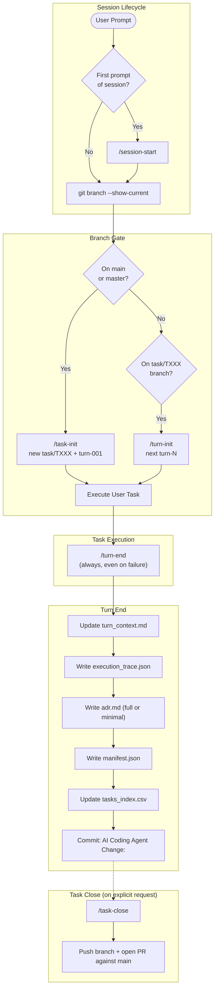

# coding-agents-config

Agentic pipeline configuration for Claude Code and Codex. Enforces a turn-based workflow with provenance tracking, branch protection, and governance rules, plus the **App Factory** (`af-*`) skill library for spec-driven application generation.

## Setup

### 1. Clone the repo

```sh
git clone <repo-url> ~/coding-agents-config
```

### 2. Create symlinks (automated)

Run the setup script — it creates all symlinks and backs up any existing files:

```sh
bash scripts/setup.sh
```

<details>
<summary>Manual symlink commands</summary>

```sh
ln -s ~/coding-agents-config/skills ~/.claude/skills
ln -s ~/coding-agents-config/agents ~/.claude/agents
ln -s ~/coding-agents-config/hooks ~/.claude/hooks
ln -s ~/coding-agents-config/scripts ~/.claude/scripts
ln -s ~/coding-agents-config/CLAUDE.md ~/.claude/CLAUDE.md
ln -s ~/coding-agents-config/settings.json ~/.claude/settings.json
ln -s ~/coding-agents-config/agents ~/.codex/agents
ln -s ~/coding-agents-config/AGENTS.md ~/.codex/AGENTS.md
```

If any of these already exist, back them up first (`mv <target> <target>.bak`).
</details>

### 3. Verify

```sh
ls -la ~/.claude/skills        # should point to ~/coding-agents-config/skills
ls -la ~/.claude/agents        # should point to ~/coding-agents-config/agents
ls -la ~/.claude/hooks         # should point to ~/coding-agents-config/hooks
ls -la ~/.claude/CLAUDE.md     # should point to ~/coding-agents-config/CLAUDE.md
ls -la ~/.claude/settings.json # should point to ~/coding-agents-config/settings.json
```

## Structure

```
coding-agents-config/
├── CLAUDE.md           # Global instructions — turn protocol, branch rules
├── AGENTS.md           # Agent loader directive (Codex)
├── settings.json       # Claude Code settings (model, permissions, hooks, plugins)
├── hooks/
│   └── branch-guard.sh # PreToolUse(Bash) hook — auto-creates task/TXXX if on main/master
├── scripts/
│   ├── setup.sh         # Creates the symlinks listed above
│   └── af-state.sh      # Shell helpers for reading/writing .appfactory/memory/state.yaml
├── agents/
│   └── agent-architecture-planner.md  # Architecture/planning agent for App Factory projects
├── skills/              # Slash-command skills
│   ├── .system/         # Codex built-in meta-skills (skill-creator, skill-installer, ...)
│   ├── .nestjs/         # NestJS + Prisma full-stack codegen skills
│   ├── session-start/   # Load repo state and pipeline context at session start
│   ├── task-init/       # Create a new task/TXXX branch + task and turn-001 artifacts
│   ├── turn-init/       # Create the next turn directory and initial artifacts
│   ├── turn-end/        # Finalize a turn (PR, ADR, manifest, commit)
│   ├── task-close/      # Push the task branch and open a pull request
│   ├── branch-guard/    # Create a turn-scoped branch if on main/master
│   ├── af-*/            # App Factory skill library (PRD → DDD → DSL → plan → build → test)
│   └── ...              # Other utility skills (dsl-utils, e2e-tests, ui-utils, unit-tests, eval-labeler)
├── .appfactory/         # Task/turn tracking and specs (see below)
├── archive/             # Superseded skills and templates kept for reference
└── docs/                # Reference documentation and migration history
```

## Execution Flow

The agentic pipeline enforces a strict turn-based workflow for all coding tasks:


```mermaid
flowchart TB
    subgraph SESSION["Session Lifecycle"]
        START([User Prompt]) --> SS{First prompt<br/>of session?}
        SS -->|Yes| SESSION_START["/session-start"]
        SS -->|No| BRANCH_CHECK
        SESSION_START --> BRANCH_CHECK["git branch --show-current"]
    end

    subgraph BRANCH_GATE["Branch Gate"]
        BRANCH_CHECK --> IS_MAIN{On main<br/>or master?}
        IS_MAIN -->|Yes| TASK_INIT["/task-init<br/>new task/TXXX + turn-001"]
        IS_MAIN -->|No| IS_TASK{On task/TXXX<br/>branch?}
        IS_TASK -->|Yes| TURN_INIT["/turn-init<br/>next turn-N"]
        TASK_INIT --> EXEC
        TURN_INIT --> EXEC
    end

    subgraph EXECUTION["Task Execution"]
        EXEC["Execute User Task"] --> TURN_END["/turn-end<br/>(always, even on failure)"]
    end

    subgraph POST_EXEC["Turn End"]
        TURN_END --> WRITE_CTX["Update turn_context.md"]
        WRITE_CTX --> WRITE_TRACE["Write execution_trace.json"]
        WRITE_TRACE --> WRITE_ADR["Write adr.md (full or minimal)"]
        WRITE_ADR --> WRITE_MANIFEST["Write manifest.json"]
        WRITE_MANIFEST --> UPDATE_INDEX["Update tasks_index.csv"]
        UPDATE_INDEX --> COMMIT["Commit: AI Coding Agent Change:"]
    end

    subgraph CLOSE["Task Close (on explicit request)"]
        COMMIT -.-> TASK_CLOSE["/task-close"]
        TASK_CLOSE --> PUSH["Push branch + open PR against main"]
    end
```

### Turn Protocol Summary

| Phase | Trigger | Skill | Outputs |
|-------|---------|-------|---------|
| **Session Start** | First prompt of session | `session-start` | Repo state + context loaded |
| **Task Init** | Current branch is `main`/`master` | `task-init` | New `task/TXXX` branch, `task-XXX/` artifacts, `turn-001` |
| **Turn Init** | Current branch is `task/TXXX` | `turn-init` | Next `turn-XXX/` directory + initial artifacts |
| **Execution** | — | — | Modified files |
| **Turn End** | After every coding prompt, even on failure | `turn-end` | `turn_context.md`, `execution_trace.json`, `adr.md`, `manifest.json`, commit |
| **Task Close** | User indicates the task is ready for review | `task-close` | Pushed branch, pull request against `main` |

`hooks/branch-guard.sh` backs the same gate as a `PreToolUse(Bash)` hook: if a Bash command runs while on `main`/`master`, it auto-creates the next `task/TXXX` branch.

## Skills

### Pipeline / governance

| Skill | Description |
|-------|-------------|
| `session-start` | Loads repository state and core pipeline context at the start of every session |
| `task-init` | Initializes a new task branch plus task and turn-001 artifacts when on `main`/`master` |
| `turn-init` | Initializes the next turn within the active task branch |
| `turn-end` | Finalizes the active turn (context, trace, ADR, manifest, commit) — runs after every prompt |
| `task-close` | Finalizes the active task branch, pushes it, and opens a pull request against `main` |
| `branch-guard` | Creates a turn-scoped branch if currently on `main`/`master` |

### App Factory (`af-*`) — spec-driven backend pipeline

| Skill | Description |
|-------|-------------|
| `af-orchestrator` | Top-level orchestrator for the App Factory software development lifecycle |
| `af-project-init` | Initializes an AppFactory project (exports required env vars, runs init script) |
| `af-memory` | Reads/writes `.appfactory/memory/state.yaml` to track pipeline progress across skills |
| `af-be-prd-build` | Builds a business-facing backend PRD from intake notes → `spec-be-prd.md` |
| `af-be-ddd-build` | Generates a backend DDD document from an approved PRD |
| `af-be-ddd-analysis` | Analyzes a DDD spec for quality, completeness, and PRD alignment |
| `af-be-ddd-refactor` | Refactors a DDD spec from `af-be-ddd-analysis` findings |
| `af-be-ddd-orchestrator` | Orchestrates the DDD build → analyze → refactor loop → test phases |
| `af-be-ddd-dsl` | Generates a backend application DSL YAML from a DDD document |
| `af-be-ddd-tests` | Generates Gherkin BDD scenarios from DDD + PRD specs, organized by aggregate |
| `af-be-plan` | Generates a step-by-step backend implementation plan from a DSL + tech-stack profile |
| `af-be-implementation` | Generates backend code from the plan and BDD features into a tech-stack scaffold |
| `af-app-check` | Audits an application for production readiness (security, database, deployment, code quality) |

### Utility

| Skill | Description |
|-------|-------------|
| `dsl-utils` | Parses and validates app-dsl YAML specs before code generation |
| `ui-utils` | Declarative YAML language for defining UI pages, layouts, widgets, and bindings, framework-neutral |
| `e2e-tests` | Generates `.http` request files for REST-client API endpoint testing |
| `unit-tests` | Keeps unit tests synchronized with actual service/DTO implementations |
| `eval-labeler` | Generates structured labels/notes when comparing two model responses on a coding task |

### `.nestjs/` — NestJS + Prisma codegen

| Skill | Description |
|-------|-------------|
| `app-from-dsl` | Orchestrates full-stack generation (entity, CRUD API, forms, tests) from app-dsl YAML |
| `nestjs-prisma-resource` | Generates a complete NestJS CRUD resource backed by Prisma from an input schema |
| `nestjs-crud-resource` | Generates a NestJS CRUD module (controller, service, DTOs) from a DSL backend spec |
| `nestjs-customer-crud-scaffold` | Scaffolds a NestJS customer CRUD app via a Nest CLI wrapper |
| `nestjs-observability` | Adds structured observability (logging, correlation IDs, redaction) to a NestJS + Prisma backend |
| `field-mapper-generator` | Generates field mapper/converter utilities between UI, API, and persistence layers |

### `.system/` — Codex built-in meta-skills

| Skill | Description |
|-------|-------------|
| `skill-creator` | Guides creation of new skills with a `SKILL.md` |
| `skill-installer` | Installs skills into `$CODEX_HOME/skills` from a curated list or GitHub repo |
| `plugin-creator` | Scaffolds Codex plugin directories with a `plugin.json` manifest |
| `openai-docs` | Looks up OpenAI API/product documentation with citations |
| `imagegen` | Generates or edits raster images |

Superseded skills (e.g. `schema-to-database`, `code-entity-to-crud`, `prisma-persistence`, `shadcn`, `react-form-page`) and the legacy `templates/` directory now live under `archive/` for reference.

## Agents

| Agent | Purpose |
|-------|---------|
| `agent-architecture-planner` | Reads the PRD/DDD/DSL and existing repo structure to produce spec-alignment analysis, architecture decisions, a module/repo map, and an atomic task plan for downstream coding agents |

## `.appfactory/`

Per-task tracking, generated specs, and pipeline memory, organized as:

```
.appfactory/
├── changelog.md
├── tasks_index.csv     # One row per task: id, branch, status, turn count, PR
├── tasks/
│   └── task-XXX/
│       ├── task_context.md, task_status.json, task_summary.md, pull_request.md
│       └── turns/turn-XXX/
│           ├── turn_context.md, execution_trace.json, adr.md, manifest.json
├── specs/              # Generated PRD/DDD/DSL/plan output (af-* skills)
├── prompts/            # Working prompt drafts/notes
└── memory/             # state.yaml (af-memory / scripts/af-state.sh)
```

## Hooks

| Hook | Trigger | Purpose |
|------|---------|---------|
| `branch-guard.sh` | `PreToolUse(Bash)` | Auto-creates the next `task/TXXX` branch if a Bash command runs while on `main`/`master` |

## Scripts

| Script | Purpose |
|--------|---------|
| `setup.sh` | Symlinks this repo's skills/agents/hooks/scripts/config into `~/.claude/` and `~/.codex/`, backing up conflicts |
| `af-state.sh` | Source-able bash function library for reading/writing `.appfactory/memory/state.yaml` (stage tracking, prerequisites, artifact status) |

## Adding a new skill

Each skill lives in its own directory under `skills/` with a `SKILL.md` file:

```
skills/my-skill/
└── SKILL.md
```

The `.system/skill-creator` meta-skill can guide you through creating one — invoke it from Claude Code.

## Commit message format

```text
AI Coding Agent Change:
- <imperative bullet>
- <imperative bullet>
- <imperative bullet>
```

## Syncing across machines

Since this is a standard git repo, pull on any machine to stay current:

```sh
cd ~/coding-agents-config && git pull
```

The symlinks mean changes are picked up immediately — no reinstall needed.
