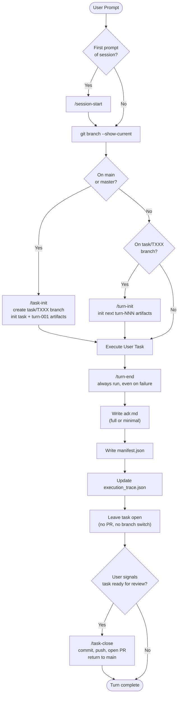

# coding-agents-config

Agentic pipeline configuration for Claude Code and Codex. Enforces a task/turn-based workflow with provenance tracking, branch protection, and governance rules for AppFactory-style AI coding pipelines.

## Setup

### 1. Clone the repo

```sh
git clone <repo-url> ~/coding-agents-config
```

### 2. Create symlinks (automated)

Run the setup script — it creates all symlinks and backs up any existing files:

```sh
bash scripts/setup.sh
```

This links repo content into both `~/.claude/` (Claude Code) and `~/.codex/` (Codex), plus a repo-local `.claude/CLAUDE.md`:

<details>
<summary>Manual symlink commands</summary>

```sh
# ~/.claude/
ln -s ~/coding-agents-config/skills       ~/.claude/skills
ln -s ~/coding-agents-config/agents       ~/.claude/agents
ln -s ~/coding-agents-config/hooks        ~/.claude/hooks
ln -s ~/coding-agents-config/scripts      ~/.claude/scripts
ln -s ~/coding-agents-config/CLAUDE.md    ~/.claude/CLAUDE.md
ln -s ~/coding-agents-config/settings.json ~/.claude/settings.json

# ~/.codex/
ln -s ~/coding-agents-config/agents    ~/.codex/agents
ln -s ~/coding-agents-config/AGENTS.md ~/.codex/AGENTS.md

# repo-local
ln -s ~/coding-agents-config/CLAUDE.md ./.claude/CLAUDE.md
```

If any of these already exist, back them up first (`mv <target> <target>.bak`).

> `scripts/setup.sh` also attempts to link `rules`, `context`, and `plugins` into `~/.claude/` for forward compatibility — these directories don't exist in the repo yet, so skip them if using the manual commands above.

</details>

### 3. Verify

```sh
ls -la ~/.claude/skills        # should point to ~/coding-agents-config/skills
ls -la ~/.claude/agents        # should point to ~/coding-agents-config/agents
ls -la ~/.claude/CLAUDE.md     # should point to ~/coding-agents-config/CLAUDE.md
ls -la ~/.claude/settings.json # should point to ~/coding-agents-config/settings.json
ls -la ~/.codex/AGENTS.md      # should point to ~/coding-agents-config/AGENTS.md
```

## Structure

```
coding-agents-config/
├── CLAUDE.md            # Global instructions — task/turn protocol, branch rules
├── AGENTS.md            # Codex loader directive (reads ~/.claude/CLAUDE.md)
├── settings.json        # Claude Code settings (model, permissions)
├── hooks/                # Shell hooks triggered by Claude Code events
│   └── branch-guard.sh   # Prevents edits on main/master
├── agents/               # Subagent definitions (e.g. agent-architecture-planner)
├── skills/                # Slash-command skills
│   ├── .system/           # Meta-skills (skill-creator, skill-installer, imagegen, ...)
│   ├── session-start/      # Load repo state and pipeline context
│   ├── task-init/          # Create a new task branch + turn-001 artifacts
│   ├── turn-init/          # Create the next turn within the active task
│   ├── turn-end/           # Finalize a turn with ADR + manifest
│   ├── task-close/         # Finalize task, push branch, open PR
│   ├── branch-guard/       # Guard against edits on main/master
│   ├── af-*/               # AppFactory backend DDD/PRD/plan/build/test skills
│   └── ...                 # See "Skills" below for the full list
├── scripts/                # Automation scripts
│   ├── setup.sh             # Create ~/.claude and ~/.codex symlinks
│   └── af-state.sh          # Read/write .appfactory pipeline state
├── .appfactory/             # Task/turn tracking for this repo's own pipeline
│   ├── tasks/                # task-NNN/ directories with turn-NNN artifacts
│   ├── tasks_index.csv       # Registry of all tasks
│   ├── specs/                # Specifications
│   ├── prompts/               # Prompt templates
│   └── memory/                 # Project memory / changelog
├── docs/                    # Reference documentation
├── archive/                  # Retired/superseded skills and templates
└── .github/                   # Issue templates, PR template
```

## Execution Flow

The agentic pipeline enforces a two-level **task → turn** workflow for all coding prompts:


```mermaid
flowchart TB
    START([User Prompt]) --> SS{First prompt<br/>of session?}
    SS -->|Yes| SESSION_START["/session-start"]
    SS -->|No| CHECK_BRANCH
    SESSION_START --> CHECK_BRANCH["git branch --show-current"]

    CHECK_BRANCH --> IS_MAIN{On main<br/>or master?}
    IS_MAIN -->|Yes| TASK_INIT["/task-init<br/>create task/TXXX branch<br/>init task + turn-001 artifacts"]
    IS_MAIN -->|No| IS_TASK{On task/TXXX<br/>branch?}
    IS_TASK -->|Yes| TURN_INIT["/turn-init<br/>init next turn-NNN artifacts"]
    IS_TASK -->|No| PROCEED

    TASK_INIT --> PROCEED["Execute User Task"]
    TURN_INIT --> PROCEED

    PROCEED --> TURN_END["/turn-end<br/>always run, even on failure"]
    TURN_END --> WRITE_ADR["Write adr.md<br/>(full or minimal)"]
    WRITE_ADR --> WRITE_MANIFEST["Write manifest.json"]
    WRITE_MANIFEST --> UPDATE_TRACE["Update execution_trace.json"]
    UPDATE_TRACE --> LEAVE_OPEN["Leave task open<br/>(no PR, no branch switch)"]

    LEAVE_OPEN --> READY{User signals<br/>task ready for review?}
    READY -->|Yes| TASK_CLOSE["/task-close<br/>commit, push, open PR<br/>return to main"]
    READY -->|No| DONE([Turn complete])
    TASK_CLOSE --> DONE
```

### Task/Turn Protocol Summary

| Phase | Trigger | Skill | Outputs |
|-------|---------|-------|---------|
| **Session Start** | First prompt of session | `session-start` | Repo/context state loaded |
| **Task Init** | On `main`/`master` | `task-init` | New `task/TXXX` branch, `task_context.md`, `task_status.json`, `task_summary.md`, `pull_request.md`, turn-001 artifacts |
| **Turn Init** | On an existing `task/TXXX` branch | `turn-init` | Next `turn-NNN` directory with `turn_context.md`, `execution_trace.json` |
| **Execution** | Every coding prompt | — | Modified files |
| **Turn End** | After execution, always | `turn-end` | `adr.md`, `manifest.json`, updated `execution_trace.json` |
| **Task Close** | User signals task ready for review | `task-close` | Commit, push, PR against `main`, branch returns to `main` |

Task ids and turn ids are both zero-padded to 3 digits (`001`, `002`, ...). Task ids are global; turn ids reset per task. See `CLAUDE.md` for the full protocol and hard gates (e.g. never write code while on `main`/`master`).

## Skills

### Pipeline / Task-Turn

| Skill | Description |
|-------|-------------|
| `session-start` | Load repository state and core pipeline context at the start of every session |
| `task-init` | Initialize a new task branch and create task plus turn-001 artifacts (run on `main`/`master`) |
| `turn-init` | Initialize the next turn within the active task branch |
| `turn-end` | Finalize the active turn after execution, even on failure |
| `task-close` | Finalize the active task branch, push it, and open a pull request against `main` |
| `branch-guard` | Check current branch and create a turn-scoped branch if on `main`/`master` |

### AppFactory Backend Pipeline (`af-*`)

| Skill | Description |
|-------|-------------|
| `af-orchestrator` | Orchestrate the App Factory software development lifecycle |
| `af-project-init` | Orchestrate AppFactory project initialization by exporting required env vars and invoking the helper script |
| `af-be-prd-build` | Build a business-facing PRD for a backend application/service/module from an intake worksheet |
| `af-be-ddd-build` | Generate a backend Domain-Driven Design document from an approved PRD |
| `af-be-ddd-analysis` | Analyze a backend DDD document |
| `af-be-ddd-dsl` | Generate a backend application DSL YAML document from a DDD document |
| `af-be-ddd-refactor` | Refactor a backend DDD document |
| `af-be-ddd-tests` (`af-ddd-tests`) | Generate Gherkin-style BDD scenarios from DDD and PRD specifications |
| `af-be-ddd-orchestrator` | Orchestrate the backend DDD workflow through build, analyze, refactor-loop, and test phases |
| `af-be-plan` | Generate a backend execution plan from a domain DSL and a tech stack profile |
| `af-be-implementation` | Execute backend application generation from the execution plan and BDD specs into a tech stack implementation |
| `af-memory` | CRUD operations for AppFactory pipeline state (`.appfactory/state.yaml`) |
| `af-app-check` | Audit an application for production readiness (security, database, deployment, code quality) |

### Utility Categories

| Category | Sub-skill | Description |
|----------|-----------|--------------|
| `dsl-utils` | `dsl-model-interpreter` | Parse and validate app-dsl YAML specifications |
| `e2e-tests` | `http-test-artifacts` | Generate `.http` request files for API endpoint testing |
| `ui-utils` | `ui-implementation-language` | Declarative YAML language for defining UI pages, layouts, and widgets |
| `unit-tests` | `test-implementation-sync` | Ensure unit tests stay synchronized with actual implementations |
| — | `eval-labeler` | Process `Eval.md` files to label and compare model responses (A vs B) |

### Meta-Skills (`.system/`)

| Skill | Description |
|-------|-------------|
| `skill-creator` | Guide for creating and updating skills |
| `skill-installer` | Install skills into `$CODEX_HOME/skills` from a curated list or GitHub repo |
| `plugin-creator` | Scaffold Codex plugin directories with a `.codex-plugin/plugin.json` manifest |
| `imagegen` | Generate or edit raster images (photos, illustrations, textures, sprites, mockups) |
| `openai-docs` | Look up official OpenAI documentation with citations for model/prompt guidance |

## Agents

| Agent | Description |
|-------|-------------|
| `agent-architecture-planner` | Reads PRD, DDD, DSL, and repo structure to produce specification alignment, architecture decisions, module maps, task plans, and review artifacts for downstream coding agents |

## Hooks

| Hook | Trigger | Purpose |
|------|---------|---------|
| `branch-guard.sh` | PreToolUse(Edit) | Block edits on `main`/`master` |

## Archive

`archive/` holds retired or superseded skills and templates kept for reference (e.g. `code-entity-to-crud`, `nestjs-crud-resource`, `schema-to-database`, `legacy-turns`, `templates`). See `archive/README.md` and `archive/SUMMARY.md` for details on what moved and why.

## Adding a new skill

Each skill lives in its own directory under `skills/` with a `SKILL.md` file:

```
skills/my-skill/
└── SKILL.md
```

The `.system/skill-creator` meta-skill can guide you through creating one — invoke it from Claude Code or Codex.

## Syncing across machines

Since this is a standard git repo, pull on any machine to stay current:

```sh
cd ~/coding-agents-config && git pull
```

The symlinks mean changes are picked up immediately — no reinstall needed.
