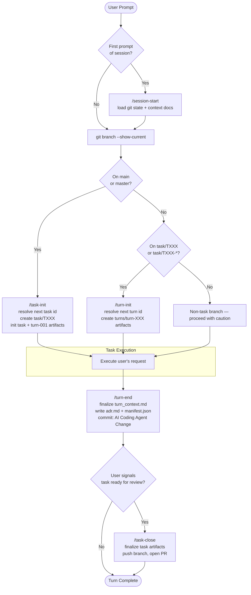

# coding-agents-config

Agentic pipeline configuration for Claude Code (and Codex). Enforces a task/turn-based workflow with provenance tracking, branch protection, and governance rules.

## Setup

### 1. Clone the repo

```sh
git clone <repo-url> ~/coding-agents-config
```

### 2. Create symlinks (automated)

Run the setup script — it creates all symlinks and backs up any existing files:

```sh
bash scripts/setup.sh
```

The script links three destinations from this repo:

| Destination | Items linked |
|-------------|--------------|
| `~/.claude/` | `skills`, `agents`, `rules`, `hooks`, `context`, `scripts`, `plugins`, `CLAUDE.md`, `settings.json` |
| `~/.codex/` | `agents`, `AGENTS.md` |
| `./.claude/` (repo-local) | `CLAUDE.md` |

> Note: `rules/`, `context/`, and `plugins/` are reserved for future use and are not present in this repo yet — linking them is a no-op until those directories exist.

<details>
<summary>Manual symlink commands</summary>

```sh
ln -s ~/coding-agents-config/skills ~/.claude/skills
ln -s ~/coding-agents-config/agents ~/.claude/agents
ln -s ~/coding-agents-config/hooks ~/.claude/hooks
ln -s ~/coding-agents-config/scripts ~/.claude/scripts
ln -s ~/coding-agents-config/CLAUDE.md ~/.claude/CLAUDE.md
ln -s ~/coding-agents-config/settings.json ~/.claude/settings.json
ln -s ~/coding-agents-config/agents ~/.codex/agents
ln -s ~/coding-agents-config/AGENTS.md ~/.codex/AGENTS.md
```

If any of these already exist, back them up first (`mv <target> <target>.bak`).
</details>

### 3. Verify

```sh
ls -la ~/.claude/skills        # should point to ~/coding-agents-config/skills
ls -la ~/.claude/agents        # should point to ~/coding-agents-config/agents
ls -la ~/.claude/hooks         # should point to ~/coding-agents-config/hooks
ls -la ~/.claude/CLAUDE.md     # should point to ~/coding-agents-config/CLAUDE.md
ls -la ~/.claude/settings.json # should point to ~/coding-agents-config/settings.json
```

## Structure

```
coding-agents-config/
├── CLAUDE.md           # Global instructions — task/turn protocol, branch rules
├── AGENTS.md           # Agent loader directive (Codex)
├── settings.json       # Claude Code settings (model, permissions, hooks, plugins)
├── package.json        # npm dependency manifest (caveman)
├── hooks/              # Shell hooks triggered by Claude Code events
│   └── branch-guard.sh # Prevents edits on main/master
├── skills/             # Slash-command skills
│   ├── .system/        # Meta-skills (skill-creator, skill-installer, plugin-creator, ...)
│   ├── session-start/  # Load repo state at session start
│   ├── task-init/      # Create a new task branch + task artifacts
│   ├── turn-init/      # Create the next turn directory in the active task
│   ├── turn-end/       # Finalize a turn (ADR, manifest, commit)
│   ├── task-close/     # Finalize a task, push, open a PR
│   ├── branch-guard/   # Legacy safety net if a session lands on main/master
│   ├── af-*/           # App Factory backend DDD/PRD/plan/implementation skills
│   └── ...             # Utility skills (dsl-utils, ui-utils, e2e-tests, unit-tests, eval-labeler)
├── scripts/             # Automation scripts
│   ├── setup.sh         # Creates the symlinks described above
│   └── af-state.sh      # AppFactory state.yaml helpers, sourced by af-* skills
├── agents/               # Standalone sub-agent definitions (e.g. agent-architecture-planner)
├── docs/                 # Reference documentation and migration notes
├── archive/              # Retired skills/templates kept for history
├── .github/              # PR/issue templates
└── .appfactory/          # Task/turn tracking and specs
    ├── tasks/            # task-XXX/ directories with turns/, status, PR, and summary
    ├── tasks_index.csv   # Registry of every task, its branch, status, and PR URL
    ├── specs/            # Specifications
    ├── prompts/          # Prompt templates
    └── memory/           # Project memory (state.yaml)
```

## Execution Flow

The pipeline enforces a task/turn workflow: a **task** is a branch-scoped unit of work that becomes one pull request, and a **turn** is one AI execution cycle within that task.


```mermaid
flowchart TB
    START([User Prompt]) --> SS{First prompt<br/>of session?}
    SS -->|Yes| SESSION_START["/session-start<br/>load git state + context docs"]
    SS -->|No| BRANCH_CHECK
    SESSION_START --> BRANCH_CHECK["git branch --show-current"]

    BRANCH_CHECK --> IS_MAIN{On main<br/>or master?}
    IS_MAIN -->|Yes| TASK_INIT["/task-init<br/>resolve next task id<br/>create task/TXXX<br/>init task + turn-001 artifacts"]
    IS_MAIN -->|No| IS_TASK{On task/TXXX<br/>or task/TXXX-*?}
    IS_TASK -->|Yes| TURN_INIT["/turn-init<br/>resolve next turn id<br/>create turns/turn-XXX artifacts"]
    IS_TASK -->|No| WARN["Non-task branch — proceed with caution"]

    TASK_INIT --> EXEC
    TURN_INIT --> EXEC
    WARN --> EXEC

    subgraph EXECUTION["Task Execution"]
        EXEC["Execute user's request"]
    end

    EXEC --> TURN_END["/turn-end<br/>finalize turn_context.md<br/>write adr.md + manifest.json<br/>commit: AI Coding Agent Change"]
    TURN_END --> READY{User signals<br/>task ready for review?}
    READY -->|Yes| TASK_CLOSE["/task-close<br/>finalize task artifacts<br/>push branch, open PR"]
    READY -->|No| DONE([Turn Complete])
    TASK_CLOSE --> DONE
```

### Turn Protocol Summary

| Phase | Skill | Outputs |
|-------|-------|---------|
| **Session Start** | `session-start` | Git state + context docs loaded |
| **Task Init** (on `main`/`master`) | `task-init` | `task/TXXX` branch, `task_context.md`, `task_status.json`, turn-001 artifacts |
| **Turn Init** (on a task branch) | `turn-init` | `turns/turn-XXX/turn_context.md`, `execution_trace.json` |
| **Execution** | — | Modified files for the user's request |
| **Turn End** | `turn-end` | Updated `turn_context.md`, `adr.md`, `manifest.json`, commit |
| **Task Close** (on request) | `task-close` | `task_summary.md`, `pull_request.md`, pushed branch, PR |

## Skills

| Category | Skill | Description |
|----------|-------|--------------|
| **Pipeline** | `session-start` | Load repository state and core pipeline context at the start of a session |
| | `task-init` | Initialize a new task branch and create task + turn-001 artifacts |
| | `turn-init` | Initialize the next turn within the active task branch |
| | `turn-end` | Finalize the active turn (ADR, manifest, commit) after every prompt |
| | `task-close` | Finalize the active task branch, push it, and open a PR against main |
| | `branch-guard` | Legacy safety net that creates a turn-scoped branch if a session lands on main/master |
| **App Factory — Product** | `af-project-init` | Orchestrate AppFactory project initialization (env vars + helper script) |
| | `af-be-prd-build` | Build a business-facing backend PRD from an intake worksheet |
| | `af-memory` | CRUD operations on `.appfactory/memory/state.yaml` for pipeline state |
| | `af-orchestrator` | Orchestrates the App Factory software development lifecycle end-to-end |
| **App Factory — Backend DDD** | `af-be-ddd-orchestrator` | Orchestrate the backend DDD workflow (build, analyze, refactor, test) |
| | `af-be-ddd-build` | Generate a backend Domain-Driven Design document from an approved PRD |
| | `af-be-ddd-dsl` | Generate a backend application DSL YAML from a DDD document |
| | `af-be-ddd-analysis` | Analyze DDD output for gaps and inconsistencies |
| | `af-be-ddd-refactor` | Refactor DDD/DSL output based on analysis findings |
| | `af-be-ddd-tests` | Generate Gherkin BDD feature files from DDD and PRD specs |
| **App Factory — Backend Build** | `af-be-plan` | Generate a step-by-step backend execution plan from a DSL and tech stack profile |
| | `af-be-implementation` | Generate backend domain code from the execution plan and BDD specs |
| | `af-app-check` | Audit an application for production readiness (security, DB, deployment, code quality) |
| **Utility** | `dsl-utils` | Shared helpers for DSL parsing/validation |
| | `ui-utils` | Shared helpers for UI/frontend generation |
| | `e2e-tests` | End-to-end test generation helpers |
| | `unit-tests` | Unit test generation helpers |
| | `eval-labeler` | Label and compare two model responses (Response A vs B) for coding tasks |

### Meta-Skills (`.system`)

| Skill | Description |
|-------|-------------|
| `skill-creator` | Create new skills with SKILL.md |
| `skill-installer` | Install skills from marketplaces |
| `plugin-creator` | Scaffold a new Claude Code plugin |
| `imagegen` | Image generation helper |
| `openai-docs` | OpenAI API reference lookup |

## Agents

Standalone sub-agent definitions in `agents/` (symlinked to both `~/.claude/agents` and `~/.codex/agents`):

| Agent | Description |
|-------|--------------|
| `agent-architecture-planner` | Reads the PRD, DDD, and DSL for an App Factory project to produce architecture decisions, module maps, task plans, and review artifacts |

## Hooks

| Hook | Trigger | Purpose |
|------|---------|---------|
| `branch-guard.sh` | `PreToolUse(Bash)` | Blocks risky edits on main/master |

## Docs

Reference material and migration notes live in `docs/`, including `appFactory-plan.md`, `skill-summary.md`, and analyses of migrating from the legacy `ai/agentic-pipeline/` layout to `.appfactory/`.

## Archive

`archive/` holds retired skills and templates (e.g. the original DSL-first `app-from-dsl` skill family) kept for historical reference — see `archive/README.md` and `archive/SUMMARY.md`.

## Adding a new skill

Each skill lives in its own directory under `skills/` with a `SKILL.md` file:

```
skills/my-skill/
└── SKILL.md
```

The `.system/skill-creator` meta-skill can guide you through creating one — invoke it from Claude Code.

## Syncing across machines

Since this is a standard git repo, pull on any machine to stay current:

```sh
cd ~/coding-agents-config && git pull
```

The symlinks mean changes are picked up immediately — no reinstall needed.
