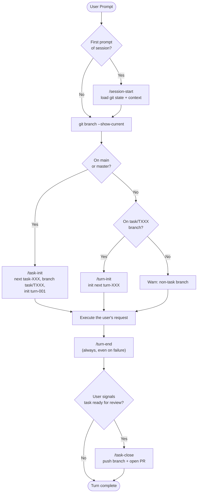

# coding-agents-config

Agentic pipeline configuration for Claude Code and Codex. Enforces a turn-based, task-scoped workflow with provenance tracking, branch protection, and governance rules, plus the **App Factory** (`af-*`) skill set for AI-driven application generation (PRD → DDD → DSL → plan → implementation).

## Setup

### 1. Clone the repo

```sh
git clone <repo-url> ~/coding-agents-config
```

### 2. Create symlinks (automated)

Run the setup script — it creates all symlinks and backs up any existing files:

```sh
bash scripts/setup.sh
```

This links into `~/.claude/` (skills, agents, rules, hooks, context, scripts, plugins, `CLAUDE.md`, `settings.json`), into `~/.codex/` (agents, `AGENTS.md`), and into the repo-local `./.claude/CLAUDE.md`.

<details>
<summary>Manual symlink commands</summary>

```sh
ln -s ~/coding-agents-config/skills   ~/.claude/skills
ln -s ~/coding-agents-config/agents   ~/.claude/agents
ln -s ~/coding-agents-config/hooks    ~/.claude/hooks
ln -s ~/coding-agents-config/scripts  ~/.claude/scripts
ln -s ~/coding-agents-config/CLAUDE.md    ~/.claude/CLAUDE.md
ln -s ~/coding-agents-config/settings.json ~/.claude/settings.json

ln -s ~/coding-agents-config/agents    ~/.codex/agents
ln -s ~/coding-agents-config/AGENTS.md ~/.codex/AGENTS.md
```

If any of these already exist, back them up first (`mv <target> <target>.bak`).
</details>

### 3. Verify

```sh
ls -la ~/.claude/skills        # should point to ~/coding-agents-config/skills
ls -la ~/.claude/hooks         # should point to ~/coding-agents-config/hooks
ls -la ~/.claude/CLAUDE.md     # should point to ~/coding-agents-config/CLAUDE.md
ls -la ~/.claude/settings.json # should point to ~/coding-agents-config/settings.json
ls -la ~/.codex/AGENTS.md      # should point to ~/coding-agents-config/AGENTS.md
```

## Structure

```
coding-agents-config/
├── CLAUDE.md           # Global instructions — task/turn protocol, branch rules
├── AGENTS.md           # Codex loader directive (points at ~/.claude/CLAUDE.md)
├── settings.json       # Claude Code settings (model, permissions, hooks)
├── package.json        # Repo-level dependencies (e.g. caveman)
├── agents/             # Agent architecture reference docs
│   └── agent-architecture-planner.md
├── docs/                # Reference documentation (migrations, plans, skill summary)
├── hooks/               # Shell hooks triggered by Claude Code events
│   └── branch-guard.sh  # Auto-creates a task branch when on main/master
├── scripts/             # Automation scripts
│   ├── setup.sh          # Create symlinks into ~/.claude and ~/.codex
│   └── af-state.sh       # App Factory state.yaml helper functions
├── skills/              # Slash-command / model-invocable skills
│   ├── .system/           # Meta-skills (skill-creator, skill-installer, plugin-creator, ...)
│   ├── session-start/     # Load repo state and pipeline context
│   ├── task-init/         # Create a new task branch + turn-001 artifacts
│   ├── turn-init/         # Start the next turn within the active task
│   ├── turn-end/          # Finalize a turn (context, trace, ADR, manifest, commit)
│   ├── task-close/        # Finalize a task, push branch, open PR
│   ├── branch-guard/      # Guard against writing on main/master
│   ├── af-*/              # App Factory skills (PRD, DDD, DSL, plan, implementation, ...)
│   ├── dsl-utils/, ui-utils/, unit-tests/, e2e-tests/  # Utility skill groups
│   └── eval-labeler/      # Label/compare model responses for evals
├── .appfactory/          # Task/turn tracking, specs, prompts, memory
│   ├── tasks/              # task-XXX/ directories, each with turns/turn-XXX/
│   ├── specs/              # Generated specs (PRD, DDD, DSL, plan)
│   ├── prompts/            # Prompt templates
│   ├── memory/             # Pipeline state (state.yaml)
│   └── tasks_index.csv     # Registry of all tasks
├── archive/              # Retired skills/templates kept for reference
└── .github/              # PR and issue templates
```

## Task and Turn Workflow

The pipeline enforces a strict, branch-scoped workflow. A **task** is one unit of work that becomes one pull request; a **turn** is one AI execution cycle inside that task's branch.


```mermaid
flowchart TB
    START([User Prompt]) --> SS{First prompt<br/>of session?}
    SS -->|Yes| SESSION_START["/session-start<br/>load git state + context"]
    SS -->|No| CHECK_BRANCH
    SESSION_START --> CHECK_BRANCH["git branch --show-current"]

    CHECK_BRANCH --> IS_MAIN{On main<br/>or master?}
    IS_MAIN -->|Yes| TASK_INIT["/task-init<br/>next task-XXX, branch task/TXXX,<br/>init turn-001"]
    IS_MAIN -->|No| IS_TASK{On task/TXXX<br/>branch?}
    IS_TASK -->|Yes| TURN_INIT["/turn-init<br/>init next turn-XXX"]
    IS_TASK -->|No| WARN["Warn: non-task branch"]

    TASK_INIT --> EXEC
    TURN_INIT --> EXEC
    WARN --> EXEC

    EXEC["Execute the user's request"] --> TURN_END["/turn-end<br/>(always, even on failure)"]
    TURN_END --> READY{User signals<br/>task ready for review?}
    READY -->|Yes| TASK_CLOSE["/task-close<br/>push branch + open PR"]
    READY -->|No| DONE([Turn complete])
    TASK_CLOSE --> DONE
```

The `branch-guard.sh` hook backs this up: if a write or bash action is attempted while still on `main`/`master`, it auto-creates the next `task/TXXX` branch before the action runs.

### Turn Artifacts

Every turn under `.appfactory/tasks/task-XXX/turns/turn-XXX/` requires:

- `turn_context.md`
- `execution_trace.json`
- `adr.md`
- `manifest.json`

### Task Artifacts

Every task under `.appfactory/tasks/task-XXX/` requires:

- `task_context.md`
- `task_status.json`
- `task_summary.md`
- `pull_request.md`

Commit messages use the format:

```text
AI Coding Agent Change:
- <imperative bullet>
- <imperative bullet>
```

## Skills

### Pipeline Control

| Skill | Description |
|-------|-------------|
| `session-start` | Load repository state and core pipeline context at the start of a session |
| `task-init` | Initialize a new task branch and create task + turn-001 artifacts (run on `main`/`master`) |
| `turn-init` | Initialize the next turn within the active task branch |
| `turn-end` | Finalize the active turn (context, trace, ADR, manifest, commit) — always runs, even on failure |
| `task-close` | Finalize the active task, push it, and open a pull request against `main` |
| `branch-guard` | Create a task-scoped branch if currently on `main`/`master` |

### App Factory (`af-*`)

AI-driven backend application generation pipeline: PRD → DDD → DSL → plan → implementation.

| Skill | Description |
|-------|-------------|
| `af-orchestrator` | Orchestrates the full App Factory software development lifecycle |
| `af-project-init` | Export required environment variables and initialize an App Factory project |
| `af-memory` | CRUD operations on `.appfactory/memory/state.yaml` for pipeline state tracking |
| `af-app-check` | Audit an application for production readiness (security, database, deployment, code quality) |
| `af-be-prd-build` | Build a backend PRD from an intake worksheet or discovery notes |
| `af-be-ddd-orchestrator` | Orchestrate the backend DDD build → analyze → refactor → test loop |
| `af-be-ddd-build` | Generate a backend DDD document from an approved PRD |
| `af-be-ddd-analysis` | Audit a generated DDD document for quality, completeness, and PRD alignment |
| `af-be-ddd-refactor` | Apply DDD analysis findings back into the DDD document |
| `af-be-ddd-dsl` | Generate a backend DSL YAML document from the DDD document |
| `af-be-ddd-tests` | Generate Gherkin BDD feature files from the DDD and PRD |
| `af-be-plan` | Generate a backend execution plan from the DSL and a tech-stack profile |
| `af-be-implementation` | Generate backend domain code from the execution plan and BDD specs into the target project |

### Utility Skill Groups

| Group | Skill | Description |
|-------|-------|-------------|
| `dsl-utils` | `dsl-model-interpreter` | Parse and validate app-dsl YAML specifications before code generation |
| `ui-utils` | `ui-implementation-language` | Declarative YAML language for UI pages, widgets, forms, and API bindings |
| `unit-tests` | `test-implementation-sync` | Keep generated unit tests synchronized with their target implementations |
| `e2e-tests` | `http-test-artifacts` | Generate `.http` request files for API endpoint testing |

### Other

| Skill | Description |
|-------|-------------|
| `eval-labeler` | Label and compare model responses (A vs B) for coding-task evaluations |

### Meta-Skills (`.system`)

| Skill | Description |
|-------|-------------|
| `skill-creator` | Guide for creating and updating skills |
| `skill-installer` | Install skills from a curated list or another GitHub repo |
| `plugin-creator` | Scaffold plugin directories and marketplace entries |
| `imagegen` | Generate or edit raster images (photos, illustrations, textures, mockups) |
| `openai-docs` | Look up up-to-date OpenAI product/API documentation |

## Hooks

| Hook | Trigger | Purpose |
|------|---------|---------|
| `branch-guard.sh` | `PreToolUse` (Bash / write tools) | Auto-create the next `task/TXXX` branch if still on `main`/`master` |

## Archive

Earlier iterations of the pipeline (a `turn/T{ID}`-branch-only model, standalone scaffolding skills like `schema-to-database` and `nestjs-prisma-resource`, and the original top-level `templates/` directory) are preserved under `archive/` for reference. Active skills carry their own `templates/` subdirectories where needed (e.g. `skills/task-init/templates`, `skills/af-be-plan/templates`).

## Adding a new skill

Each skill lives in its own directory under `skills/` with a `SKILL.md` file:

```
skills/my-skill/
└── SKILL.md
```

The `.system/skill-creator` meta-skill can guide you through creating one — invoke it from Claude Code.

## Syncing across machines

Since this is a standard git repo, pull on any machine to stay current:

```sh
cd ~/coding-agents-config && git pull
```

The symlinks mean changes are picked up immediately — no reinstall needed.
