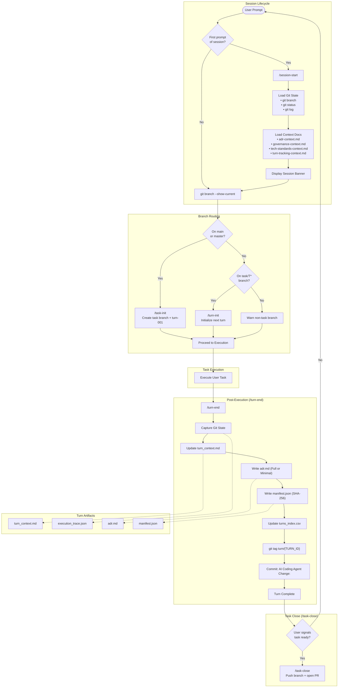

# coding-agents-config

Agentic pipeline configuration for Claude Code. Enforces turn-based workflow with provenance tracking, branch protection, and governance rules. Also includes the AppFactory skill suite for AI-driven backend application generation.

## Setup

### 1. Clone the repo

```sh
git clone <repo-url> ~/coding-agents-config
```

### 2. Create symlinks (automated)

Run the setup script — it creates all symlinks and backs up any existing files:

```sh
bash scripts/setup.sh
```

The script symlinks the following into `~/.claude/`:

| Item | Purpose |
|------|---------|
| `skills/` | Slash-command skills |
| `agents/` | Agent definition files |
| `hooks/` | Shell hooks |
| `scripts/` | Automation scripts |
| `CLAUDE.md` | Global pipeline instructions |
| `settings.json` | Claude Code settings |

It also symlinks `agents/` and `AGENTS.md` into `~/.codex/` for Codex compatibility, and creates a local `.claude/CLAUDE.md` symlink in the repo root.

<details>
<summary>Manual symlink commands</summary>

```sh
ln -s ~/coding-agents-config/skills    ~/.claude/skills
ln -s ~/coding-agents-config/agents    ~/.claude/agents
ln -s ~/coding-agents-config/hooks     ~/.claude/hooks
ln -s ~/coding-agents-config/scripts   ~/.claude/scripts
ln -s ~/coding-agents-config/CLAUDE.md ~/.claude/CLAUDE.md
ln -s ~/coding-agents-config/settings.json ~/.claude/settings.json

# Codex
ln -s ~/coding-agents-config/agents   ~/.codex/agents
ln -s ~/coding-agents-config/AGENTS.md ~/.codex/AGENTS.md
```

If any of these already exist, back them up first (`mv <target> <target>.bak`).
</details>

### 3. Verify

```sh
ls -la ~/.claude/skills        # should point to ~/coding-agents-config/skills
ls -la ~/.claude/agents        # should point to ~/coding-agents-config/agents
ls -la ~/.claude/hooks         # should point to ~/coding-agents-config/hooks
ls -la ~/.claude/CLAUDE.md     # should point to ~/coding-agents-config/CLAUDE.md
ls -la ~/.claude/settings.json # should point to ~/coding-agents-config/settings.json
```

## Structure

```
coding-agents-config/
├── CLAUDE.md               # Global instructions — turn protocol, branch rules
├── AGENTS.md               # Agent loader directive
├── settings.json           # Claude Code settings (model, permissions, hooks)
├── agents/                 # Agent definition files
│   └── agent-architecture-planner.md
├── hooks/                  # Shell hooks triggered by Claude Code events
│   └── branch-guard.sh     # Prevents edits on main/master
├── skills/                 # Slash-command skills
│   ├── .system/            # Marketplace markers
│   ├── session-start/      # Initialize session context
│   ├── task-init/          # Create task branch and turn-001 artifacts
│   ├── task-close/         # Finalize task branch and open PR
│   ├── turn-init/          # Create turn directory and artifacts
│   ├── turn-end/           # Finalize turn with ADR, manifest, index
│   ├── branch-guard/       # Create turn branch if on main
│   ├── af-be-build-prd/    # AppFactory: generate backend PRD
│   ├── af-be-build-ddd/    # AppFactory: generate backend DDD document
│   ├── af-be-build-dsl/    # AppFactory: generate backend DSL YAML
│   ├── af-be-build-plan/   # AppFactory: generate backend execution plan
│   ├── af-be-build-implementation/ # AppFactory: execute backend generation
│   ├── af-memory/          # AppFactory: pipeline state management
│   └── af-project-init/    # AppFactory: initialize new project scaffold
├── scripts/                # Automation scripts
│   └── setup.sh
├── docs/                   # Reference documentation
├── archive/                # Retired skills and templates
│   ├── templates/          # Legacy turn lifecycle templates
│   └── ...                 # Archived scaffolding skills
└── .appfactory/            # Task/turn tracking and specs
    ├── tasks/              # Task branches with turns
    ├── specs/              # Specifications
    ├── prompts/            # Prompt templates
    └── memory/             # Project memory
```

## Execution Flow

The agentic pipeline enforces a strict turn-based workflow for all coding tasks:


```mermaid
flowchart TB
    subgraph SESSION["Session Lifecycle"]
        START([User Prompt]) --> SS{First prompt<br/>of session?}
        SS -->|Yes| SESSION_START["/session-start"]
        SS -->|No| BRANCH_CHECK

        SESSION_START --> LOAD_GIT["Load Git State<br/>• git branch<br/>• git status<br/>• git log"]
        LOAD_GIT --> LOAD_CTX["Load Context Docs<br/>• adr-context.md<br/>• governance-context.md<br/>• tech-standards-context.md<br/>• turn-tracking-context.md"]
        LOAD_CTX --> BANNER["Display Session Banner"]
        BANNER --> BRANCH_CHECK
    end

    subgraph BRANCH_GATE["Branch Routing"]
        BRANCH_CHECK["git branch --show-current"] --> IS_MAIN{On main<br/>or master?}
        IS_MAIN -->|Yes| TASK_INIT["/task-init<br/>Create task branch + turn-001"]
        IS_MAIN -->|No| IS_TASK{On task/T*<br/>branch?}
        TASK_INIT --> PROCEED
        IS_TASK -->|Yes| TURN_INIT["/turn-init<br/>Initialize next turn"]
        IS_TASK -->|No| WARN["Warn non-task branch"]
        TURN_INIT --> PROCEED
        WARN --> PROCEED["Proceed to Execution"]
    end

    subgraph EXECUTION["Task Execution"]
        PROCEED --> EXEC["Execute User Task"]
    end

    subgraph POST_EXEC["Post-Execution (/turn-end)"]
        EXEC --> TURN_END["/turn-end"]
        TURN_END --> CAPTURE_GIT["Capture Git State"]
        CAPTURE_GIT --> UPDATE_CTX["Update turn_context.md"]
        UPDATE_CTX --> WRITE_ADR["Write adr.md (Full or Minimal)"]
        WRITE_ADR --> WRITE_MANIFEST["Write manifest.json (SHA-256)"]
        WRITE_MANIFEST --> UPDATE_INDEX["Update turns_index.csv"]
        UPDATE_INDEX --> TAG["git tag turn/{TURN_ID}"]
        TAG --> COMMIT["Commit: AI Coding Agent Change:"]
        COMMIT --> COMPLETE["Turn Complete"]
    end

    subgraph TASK_CLOSE["Task Close (/task-close)"]
        COMPLETE --> USER_REVIEW{User signals<br/>task ready?}
        USER_REVIEW -->|Yes| TASK_CLOSE_SKILL["/task-close<br/>Push branch + open PR"]
        USER_REVIEW -->|No| START
    end

    subgraph ARTIFACTS["Turn Artifacts"]
        direction LR
        A1["turn_context.md"]
        A2["execution_trace.json"]
        A3["adr.md"]
        A4["manifest.json"]
    end

    UPDATE_CTX -.-> A1
    CAPTURE_GIT -.-> A2
    WRITE_ADR -.-> A3
    WRITE_MANIFEST -.-> A4
```

### Turn Protocol Summary

| Phase | Skill | Outputs |
|-------|-------|---------|
| **Session Start** | `/session-start` | Context loaded, git state, session banner |
| **Task Init** | `/task-init` | `task/TXXX` branch, `task_context.md`, `task_status.json`, turn-001 dir |
| **Turn Init** | `/turn-init` | `turn_context.md`, `execution_trace.json` |
| **Execution** | *(user task)* | Modified source files |
| **Turn End** | `/turn-end` | `adr.md`, `manifest.json`, `turns_index.csv` updated, git tag, commit |
| **Task Close** | `/task-close` | Branch pushed, pull request opened |

## Skills (13)

### Turn Lifecycle

| Skill | Description |
|-------|-------------|
| `session-start` | Load repository state and core pipeline context. Run at the start of every session. |
| `task-init` | Initialize a new task branch (`task/TXXX`) and create task-level plus turn-001 artifacts. Run when on main/master. |
| `task-close` | Finalize the active task branch, push it, and open a pull request against main. |
| `turn-init` | Initialize the next turn within the active task branch. |
| `turn-end` | Finalize the active turn: write ADR, manifest, update index, tag, commit. |
| `branch-guard` | Check the current branch and halt writes on main/master. |

### AppFactory Pipeline

| Skill | Description |
|-------|-------------|
| `af-be-build-prd` | Build a business-facing PRD for a backend application from discovery notes or a PRD worksheet. |
| `af-be-build-ddd` | Generate a backend Domain-Driven Design document from an approved PRD. |
| `af-be-build-dsl` | Generate a backend DSL YAML from a DDD document for downstream code-generation skills. |
| `af-be-build-plan` | Generate a backend execution plan from a DSL and selected tech stack profile. |
| `af-be-build-implementation` | Execute backend application generation from a DSL and tech stack implementation. |
| `af-memory` | CRUD operations for AppFactory pipeline state (`state.yml` in `.appfactory/memory/`). |
| `af-project-init` | Initialize a new AppFactory project scaffold with prompts, specs, gitignore, and README. |

## Agents

| Agent | Description |
|-------|-------------|
| `agent-architecture-planner` | Architecture and planning agent for App Factory projects. Reads PRD, DDD, DSL, and repo structure to produce spec gap matrices, module maps, event maps, integration maps, and phase-by-phase implementation plans. |

## Hooks

| Hook | Trigger | Purpose |
|------|---------|---------|
| `branch-guard.sh` | `PreToolUse(Bash)` | Block edits on main/master |

## Directory: `.appfactory/`

The `.appfactory/` directory lives inside every project using this pipeline and tracks all task and turn state:

```
.appfactory/
  tasks_index.csv         # One row per task; updated on create and status change
  tasks/
    task-001/
      task_context.md
      task_status.json
      task_summary.md
      pull_request.md
      turns/
        turn-001/
          turn_context.md
          execution_trace.json
          adr.md
          manifest.json
  specs/                  # PRD, DDD, DSL artifacts
  prompts/                # Prompt templates
  memory/                 # Pipeline state (state.yml)
```

## Adding a new skill

Each skill lives in its own directory under `skills/` with a `SKILL.md` file:

```
skills/my-skill/
└── SKILL.md
```

Refer to any existing skill's `SKILL.md` as a template, or consult the `skill-creator` meta-skill documentation in `.system/`.

## Syncing across machines

Since this is a standard git repo, pull on any machine to stay current:

```sh
cd ~/coding-agents-config && git pull
```

The symlinks mean changes are picked up immediately — no reinstall needed.
