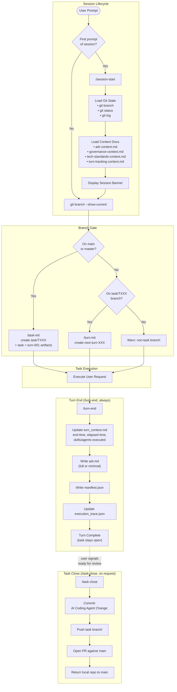

# coding-agents-config

Agentic pipeline configuration shared across Claude Code and Codex. Enforces a task/turn-based workflow with provenance tracking, branch protection, and governance rules, plus a library of scaffolding and App Factory (AF) skills.

## Setup

### 1. Clone the repo

```sh
git clone <repo-url> ~/coding-agents-config
```

### 2. Create symlinks (automated)

Run the setup script — it creates all symlinks and backs up any existing files:

```sh
bash scripts/setup.sh
```

It links:

- Into `~/.claude/`: `skills`, `agents`, `hooks`, `scripts`, `CLAUDE.md`, `settings.json` (plus `rules`, `context`, `plugins` if present)
- Into `~/.codex/`: `agents`, `AGENTS.md`
- Into the repo-local `./.claude/`: `CLAUDE.md`

<details>
<summary>Manual symlink commands</summary>

```sh
ln -s ~/coding-agents-config/skills ~/.claude/skills
ln -s ~/coding-agents-config/agents ~/.claude/agents
ln -s ~/coding-agents-config/hooks ~/.claude/hooks
ln -s ~/coding-agents-config/scripts ~/.claude/scripts
ln -s ~/coding-agents-config/CLAUDE.md ~/.claude/CLAUDE.md
ln -s ~/coding-agents-config/settings.json ~/.claude/settings.json
ln -s ~/coding-agents-config/agents ~/.codex/agents
ln -s ~/coding-agents-config/AGENTS.md ~/.codex/AGENTS.md
```

If any of these already exist, back them up first (`mv <target> <target>.bak`).
</details>

### 3. Verify

```sh
ls -la ~/.claude/skills        # should point to ~/coding-agents-config/skills
ls -la ~/.claude/hooks         # should point to ~/coding-agents-config/hooks
ls -la ~/.claude/CLAUDE.md     # should point to ~/coding-agents-config/CLAUDE.md
ls -la ~/.claude/settings.json # should point to ~/coding-agents-config/settings.json
ls -la ~/.codex/agents         # should point to ~/coding-agents-config/agents
```

## Structure

```
coding-agents-config/
├── CLAUDE.md           # Global instructions — task/turn protocol, branch rules
├── AGENTS.md           # Codex agent loader directive
├── settings.json       # Claude Code settings (model, permissions)
├── agents/             # Subagent definitions (e.g. agent-architecture-planner)
├── hooks/              # Shell hooks triggered by Claude Code events
│   └── branch-guard.sh # PreToolUse hook — auto-creates a task branch off main/master
├── skills/             # Slash-command skills
│   ├── .system/        # Meta-skills (skill-creator, skill-installer, plugin-creator, imagegen, openai-docs)
│   ├── .nestjs/         # NestJS/Prisma scaffolding skills
│   ├── session-start/  # Load repo state + pipeline context (start of every session)
│   ├── task-init/       # Create a task branch + task/turn-001 artifacts
│   ├── turn-init/       # Create the next turn within the active task
│   ├── turn-end/        # Finalize a turn (ADR, manifest, trace)
│   ├── task-close/      # Push the task branch and open a PR against main
│   ├── branch-guard/    # Legacy branch-protection skill
│   ├── af-*/            # App Factory SDLC skills (PRD, DDD, DSL, plan, implementation, tests, audits)
│   ├── dsl-utils/       # DSL parsing/validation utilities
│   ├── e2e-tests/       # HTTP test artifact generation
│   ├── ui-utils/        # UI DSL language reference
│   └── unit-tests/      # Test/implementation sync checks
├── scripts/             # Automation scripts
│   ├── setup.sh         # Creates the symlinks above
│   └── af-state.sh      # AppFactory state.yaml helpers, sourced by af-* skills
├── .appfactory/         # Task/turn tracking and specs
│   ├── tasks/           # task-XXX directories, each with turns/turn-XXX
│   ├── specs/           # Specifications
│   ├── prompts/         # Prompt templates
│   ├── memory/          # Project memory (state.yaml)
│   ├── changelog.md     # Project changelog
│   └── tasks_index.csv  # Registry of all tasks
├── archive/             # Retired skills and docs kept for reference
└── docs/                # Reference documentation
```

## Execution Flow

The agentic pipeline enforces a strict task/turn-based workflow for every coding prompt:


```mermaid
flowchart TB
    subgraph SESSION["Session Lifecycle"]
        START([User Prompt]) --> SS{First prompt<br/>of session?}
        SS -->|Yes| SESSION_START["/session-start"]
        SS -->|No| BRANCH_CHECK
        SESSION_START --> LOAD_GIT["Load Git State<br/>• git branch<br/>• git status<br/>• git log"]
        LOAD_GIT --> LOAD_CTX["Load Context Docs<br/>• adr-context.md<br/>• governance-context.md<br/>• tech-standards-context.md<br/>• turn-tracking-context.md"]
        LOAD_CTX --> BANNER["Display Session Banner"]
        BANNER --> BRANCH_CHECK
    end

    subgraph BRANCH_GATE["Branch Gate"]
        BRANCH_CHECK["git branch --show-current"] --> IS_MAIN{On main<br/>or master?}
        IS_MAIN -->|Yes| TASK_INIT["/task-init<br/>create task/TXXX<br/>+ task + turn-001 artifacts"]
        IS_MAIN -->|No| IS_TASK{On task/TXXX<br/>branch?}
        IS_TASK -->|Yes| TURN_INIT["/turn-init<br/>create next turn-XXX"]
        IS_TASK -->|No| WARN["Warn: non-task branch"]
    end

    subgraph EXECUTION["Task Execution"]
        TASK_INIT --> EXEC["Execute User Request"]
        TURN_INIT --> EXEC
        WARN --> EXEC
    end

    subgraph POST_EXEC["Turn End (/turn-end, always)"]
        EXEC --> TURN_END["/turn-end"]
        TURN_END --> UPDATE_CTX["Update turn_context.md<br/>end time, elapsed time,<br/>skills/agents executed"]
        UPDATE_CTX --> WRITE_ADR["Write adr.md<br/>(full or minimal)"]
        WRITE_ADR --> WRITE_MANIFEST["Write manifest.json"]
        WRITE_MANIFEST --> UPDATE_TRACE["Update execution_trace.json"]
        UPDATE_TRACE --> COMPLETE["Turn Complete<br/>(task stays open)"]
    end

    subgraph TASK_CLOSE["Task Close (/task-close, on request)"]
        COMPLETE -.->|user signals<br/>ready for review| CLOSE["/task-close"]
        CLOSE --> COMMIT["Commit:<br/>AI Coding Agent Change:"]
        COMMIT --> PUSH["Push task branch"]
        PUSH --> PR["Open PR against main"]
        PR --> RETURN["Return local repo to main"]
    end
```

### Task/Turn Protocol Summary

| Phase | Skill | Trigger | Outputs |
|-------|-------|---------|---------|
| **Session Start** | `session-start` | First prompt of the session | Git state + 4 context docs loaded |
| **Task Init** | `task-init` | Current branch is `main`/`master` | `task/TXXX` branch, `task_context.md`, `task_status.json`, `task_summary.md`, `pull_request.md`, `turn-001` |
| **Turn Init** | `turn-init` | Already on a `task/TXXX` branch | Next `turn-XXX` with `turn_context.md`, `execution_trace.json` |
| **Execution** | — | Every coding prompt | Modified files |
| **Turn End** | `turn-end` | After every execution, even on failure | `adr.md`, `manifest.json`, updated `execution_trace.json` |
| **Task Close** | `task-close` | User signals the task is ready for review | Commit, push, PR against `main`, registry updates |

## Skills

| Category | Skill | Description |
|----------|-------|-------------|
| **Session/Task/Turn** | `session-start` | Load repository state and core pipeline context at session start |
| | `task-init` | Initialize a new task branch and create task + turn-001 artifacts |
| | `turn-init` | Initialize the next turn within the active task branch |
| | `turn-end` | Finalize the active turn after execution (ADR, manifest, trace) |
| | `task-close` | Finalize the task branch, push it, and open a PR against main |
| | `branch-guard` | Legacy: create a turn-scoped branch if on main/master |
| **App Factory (af-\*)** | `af-orchestrator` | Orchestrate the App Factory software development lifecycle |
| | `af-project-init` | Export required env vars and initialize an AppFactory project |
| | `af-memory` | CRUD operations on `.appfactory/memory/state.yaml` pipeline state |
| | `af-be-prd-build` | Build a backend PRD from an intake worksheet |
| | `af-be-ddd-build` | Generate a backend DDD document from an approved PRD |
| | `af-be-ddd-analysis` | Audit a generated DDD document for quality and PRD alignment |
| | `af-be-ddd-refactor` | Apply targeted patches to a DDD document from analysis findings |
| | `af-be-ddd-orchestrator` | Orchestrate the DDD build/analyze/refactor/test loop |
| | `af-be-ddd-dsl` | Generate a backend DSL YAML document from a DDD document |
| | `af-be-ddd-tests` | Generate Gherkin/BDD scenarios from DDD and PRD specs |
| | `af-be-plan` | Generate a backend execution plan from a DSL and tech-stack profile |
| | `af-be-implementation` | Generate backend domain code from the execution plan and BDD specs |
| | `af-app-check` | Audit an application for production readiness |
| **Scaffolding (.nestjs)** | `nestjs-prisma-resource` | Generate a NestJS CRUD resource backed by Prisma from a schema |
| | `nestjs-crud-resource` | Generate a NestJS CRUD module from a DSL backend spec |
| | `nestjs-customer-crud-scaffold` | Scaffold a NestJS customer CRUD app via the Nest CLI |
| | `nestjs-observability` | Add structured logging/observability to a NestJS + Prisma backend |
| | `app-from-dsl` | Orchestrate full-stack app generation from app-dsl YAML |
| | `field-mapper-generator` | Generate field mapper/converter utilities from DSL mapper specs |
| | `prisma/prisma-persistence` | Generate Prisma schema and migrations from a DSL persistence model |
| | `prisma/prisma-guidelines` | Prisma development guidelines and constraints reference |
| **Utilities** | `dsl-utils/dsl-model-interpreter` | Parse and validate app-dsl YAML specifications |
| | `ui-utils/ui-implementation-language` | Declarative YAML standard for UI pages, widgets, and bindings |
| | `e2e-tests/http-test-artifacts` | Generate `.http` files for REST endpoint testing |
| | `unit-tests/test-implementation-sync` | Keep unit tests synchronized with service/DTO implementations |
| | `eval-labeler` | Label and compare model responses (A/B) for coding tasks |
| **Meta (.system)** | `skill-creator` | Guide for creating and updating skills |
| | `skill-installer` | Install skills from a curated list or another repo |
| | `plugin-creator` | Scaffold Codex plugin directories and marketplace entries |
| | `imagegen` | Generate or edit raster images for repo assets |
| | `openai-docs` | Look up official OpenAI docs/model guidance with citations |

## Agents

| Agent | Description |
|-------|-------------|
| `agent-architecture-planner` | Reads PRD/DDD/DSL and the existing repo to produce architecture decisions, module maps, task plans, and review artifacts |

## Hooks

| Hook | Trigger | Purpose |
|------|---------|---------|
| `branch-guard.sh` | PreToolUse (write/edit/bash tools) | Auto-creates a task branch when invoked on `main`/`master` |

## Adding a new skill

Each skill lives in its own directory under `skills/` with a `SKILL.md` file:

```
skills/my-skill/
└── SKILL.md
```

The `.system/skill-creator` meta-skill can guide you through creating one — invoke it from Claude Code.

## Syncing across machines

Since this is a standard git repo, pull on any machine to stay current:

```sh
cd ~/coding-agents-config && git pull
```

The symlinks mean changes are picked up immediately — no reinstall needed.
