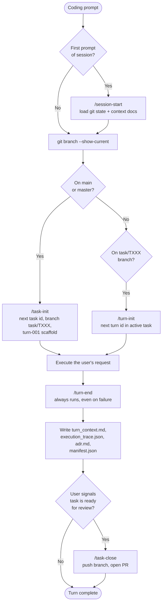

# coding-agents-config

Agentic pipeline configuration for Claude Code. Enforces a task/turn-based workflow with provenance tracking, branch protection, and governance rules, plus the **App Factory** skill set for spec-driven full-stack application generation.

## Setup

### 1. Clone the repo

```sh
git clone <repo-url> ~/coding-agents-config
```

### 2. Create symlinks (automated)

Run the setup script — it creates all symlinks and backs up any existing files:

```sh
bash scripts/setup.sh
```

<details>
<summary>Manual symlink commands</summary>

```sh
# ~/.claude/
ln -s ~/coding-agents-config/skills ~/.claude/skills
ln -s ~/coding-agents-config/agents ~/.claude/agents
ln -s ~/coding-agents-config/hooks ~/.claude/hooks
ln -s ~/coding-agents-config/scripts ~/.claude/scripts
ln -s ~/coding-agents-config/CLAUDE.md ~/.claude/CLAUDE.md
ln -s ~/coding-agents-config/settings.json ~/.claude/settings.json

# ~/.codex/
ln -s ~/coding-agents-config/agents ~/.codex/agents
ln -s ~/coding-agents-config/AGENTS.md ~/.codex/AGENTS.md

# repo-local ./.claude/
ln -s ~/coding-agents-config/CLAUDE.md ./.claude/CLAUDE.md
```

If any of these already exist, back them up first (`mv <target> <target>.bak`).
</details>

### 3. Verify

```sh
ls -la ~/.claude/skills        # should point to ~/coding-agents-config/skills
ls -la ~/.claude/hooks         # should point to ~/coding-agents-config/hooks
ls -la ~/.claude/CLAUDE.md     # should point to ~/coding-agents-config/CLAUDE.md
ls -la ~/.claude/settings.json # should point to ~/coding-agents-config/settings.json
```

## Structure

```
coding-agents-config/
├── CLAUDE.md           # Global instructions — task/turn protocol, branch rules
├── AGENTS.md           # Agent loader directive (points Codex at ~/.claude/CLAUDE.md)
├── settings.json       # Claude Code settings (model, permissions, hooks)
├── agents/             # Agent role definitions
│   └── agent-architecture-planner.md
├── hooks/              # Shell hooks triggered by Claude Code events
│   └── branch-guard.sh # Auto-creates a task branch when on main/master
├── scripts/             # Automation scripts
│   ├── setup.sh         # Creates the symlinks above
│   └── af-state.sh      # Helpers for reading/writing .appfactory state
├── skills/              # Slash-command skills (see below)
├── .appfactory/         # Task/turn tracking and pipeline state
│   ├── tasks/            # One directory per task, each with its turns
│   ├── tasks_index.csv   # Registry of all tasks and their status
│   ├── specs/            # Specifications
│   ├── prompts/          # Prompt templates used to build/maintain skills
│   └── memory/           # Pipeline state (state.yaml, managed by af-memory)
├── docs/                 # Reference documentation (migration notes, skill summary)
├── archive/              # Superseded skills and templates kept for reference
└── .github/              # Issue templates, PR template
```

## Task / Turn Workflow

Every coding prompt runs inside a **task** (one branch, one eventual pull request) made up of one or more **turns** (one AI execution cycle each). The workflow is driven by five lifecycle skills:


```mermaid
flowchart TB
    START([Coding prompt]) --> FIRST{First prompt<br/>of session?}
    FIRST -->|Yes| SESSION_START["/session-start<br/>load git state + context docs"]
    FIRST -->|No| BRANCH_CHECK
    SESSION_START --> BRANCH_CHECK["git branch --show-current"]

    BRANCH_CHECK --> IS_MAIN{On main<br/>or master?}
    IS_MAIN -->|Yes| TASK_INIT["/task-init<br/>next task id, branch task/TXXX,<br/>turn-001 scaffold"]
    IS_MAIN -->|No| IS_TASK{On task/TXXX<br/>branch?}
    IS_TASK -->|Yes| TURN_INIT["/turn-init<br/>next turn id in active task"]

    TASK_INIT --> EXEC
    TURN_INIT --> EXEC["Execute the user's request"]

    EXEC --> TURN_END["/turn-end<br/>always runs, even on failure"]
    TURN_END --> ARTIFACTS["Write turn_context.md,<br/>execution_trace.json, adr.md,<br/>manifest.json"]

    ARTIFACTS --> READY{User signals<br/>task is ready<br/>for review?}
    READY -->|Yes| TASK_CLOSE["/task-close<br/>push branch, open PR"]
    READY -->|No| DONE([Turn complete])
    TASK_CLOSE --> DONE
```

**Hard gate:** code is never written on `main`/`master`. `hooks/branch-guard.sh` runs as a `PreToolUse` hook and auto-creates the next `task/TXXX` branch if it detects one of those branches before a write or bash tool runs.

Each task lives under `.appfactory/tasks/task-XXX/` with `task_context.md`, `task_status.json`, `task_summary.md`, and `pull_request.md`. Each turn lives under `.../turns/turn-XXX/` with `turn_context.md`, `execution_trace.json`, `adr.md`, and `manifest.json`. New tasks get a row in `.appfactory/tasks_index.csv`.

## Skills (24)

### Task/Turn Lifecycle

| Skill | Description |
|-------|-------------|
| `session-start` | Load repository state and core pipeline context at the start of a session |
| `task-init` | Initialize a new task branch (`task/TXXX`) and create task + turn-001 artifacts |
| `turn-init` | Initialize the next turn within the active task branch |
| `turn-end` | Finalize the active turn after execution (context, trace, ADR, manifest) |
| `task-close` | Finalize the active task branch, push it, and open a pull request against main |
| `branch-guard` | Check current branch and create a turn-scoped branch if on main/master |

### App Factory Pipeline

Spec-driven backend application generation, orchestrated top-down:

| Phase | Skill | Description |
|-------|-------|-------------|
| Init | `af-project-init` | Export required env vars and invoke the project-init helper script |
| Orchestration | `af-orchestrator` | Orchestrate the full App Factory software development lifecycle |
| Requirements | `af-be-prd-build` | Build a business-facing backend PRD from an intake worksheet |
| DDD | `af-be-ddd-orchestrator` | Orchestrate the backend DDD workflow (build → analyze → refactor → test) |
| DDD | `af-be-ddd-build` | Generate a human-readable backend DDD document from an approved PRD |
| DDD | `af-be-ddd-analysis` | Analyze a DDD spec for quality, completeness, and PRD alignment |
| DDD | `af-be-ddd-refactor` | Refactor a DDD document based on analysis findings |
| DDD | `af-be-ddd-dsl` | Generate a backend DSL YAML document from a DDD document |
| Testing | `af-be-ddd-tests` | Generate Gherkin-style BDD scenarios from DDD and PRD specs |
| Planning | `af-be-plan` | Generate a backend execution plan from a domain DSL and tech-stack profile |
| Implementation | `af-be-implementation` | Copy a tech-stack implementation and generate domain code from the plan |
| Validation | `af-app-check` | Audit an application for production readiness (security, DB, deploy, quality) |
| State | `af-memory` | CRUD operations on `.appfactory/memory/state.yaml` for pipeline state |

### Utilities

| Group | Skill | Description |
|-------|-------|-------------|
| `dsl-utils/` | `dsl-model-interpreter` | Parse and validate DSL YAML specifications |
| `e2e-tests/` | `http-test-artifacts` | Generate `.http` request files and sample payloads |
| `ui-utils/` | `ui-implementation-language` | Reference for the UI implementation language/conventions |
| `unit-tests/` | `test-implementation-sync` | Keep unit tests in sync with implementation changes |
| — | `eval-labeler` | Label and score model-response evaluation runs (Response A vs B) |

Older, superseded skills (e.g. `schema-to-database`, `nestjs-crud-resource`, `react-form-page`, `code-entity-to-crud`) live under `archive/` for reference and are not part of the active pipeline.

## Hooks

| Hook | Trigger | Purpose |
|------|---------|---------|
| `branch-guard.sh` | `PreToolUse` (write/bash tools) | Auto-create a `task/TXXX` branch when on main/master |

## Adding a new skill

Each skill lives in its own directory under `skills/` with a `SKILL.md` file:

```
skills/my-skill/
└── SKILL.md
```

## Syncing across machines

Since this is a standard git repo, pull on any machine to stay current:

```sh
cd ~/coding-agents-config && git pull
```

The symlinks mean changes are picked up immediately — no reinstall needed.
