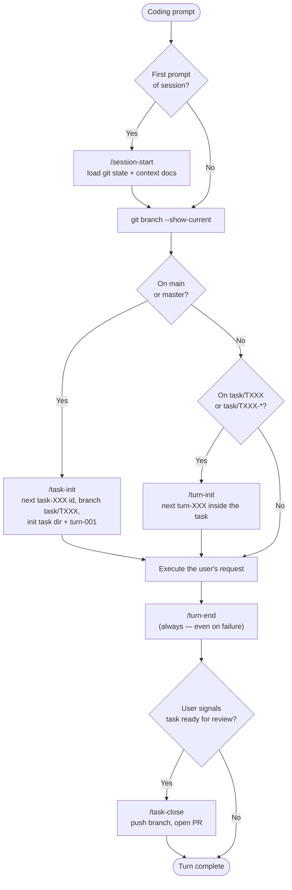

# coding-agents-config

Agentic pipeline configuration for Claude Code (and, partially, Codex). Enforces a task/turn-based workflow with provenance tracking, branch protection, and governance rules, plus a library of 35+ skills for the AppFactory application-generation pipeline.

## Setup

### 1. Clone the repo

```sh
git clone <repo-url> ~/coding-agents-config
```

### 2. Create symlinks (automated)

Run the setup script — it links this repo into `~/.claude/`, `~/.codex/`, and a repo-local `./.claude/`, backing up any existing files:

```sh
bash scripts/setup.sh
```

<details>
<summary>Manual symlink commands</summary>

```sh
# ~/.claude/
ln -s ~/coding-agents-config/skills    ~/.claude/skills
ln -s ~/coding-agents-config/agents    ~/.claude/agents
ln -s ~/coding-agents-config/hooks     ~/.claude/hooks
ln -s ~/coding-agents-config/scripts   ~/.claude/scripts
ln -s ~/coding-agents-config/plugins   ~/.claude/plugins
ln -s ~/coding-agents-config/CLAUDE.md ~/.claude/CLAUDE.md
ln -s ~/coding-agents-config/settings.json ~/.claude/settings.json

# ~/.codex/
ln -s ~/coding-agents-config/agents    ~/.codex/agents
ln -s ~/coding-agents-config/AGENTS.md ~/.codex/AGENTS.md

# repo-local (per project)
ln -s ~/coding-agents-config/CLAUDE.md ./.claude/CLAUDE.md
```

`rules/` and `context/` are also wired up by `scripts/setup.sh` for future use, but don't exist in this repo yet — the linker only backs up/replaces a destination when a matching source is present.

If any target already exists, `setup.sh` backs it up first (`mv <target> <target>.bak`); doing it by hand, back it up yourself the same way.
</details>

### 3. Verify

```sh
ls -la ~/.claude/skills        # -> ~/coding-agents-config/skills
ls -la ~/.claude/agents        # -> ~/coding-agents-config/agents
ls -la ~/.claude/hooks         # -> ~/coding-agents-config/hooks
ls -la ~/.claude/CLAUDE.md     # -> ~/coding-agents-config/CLAUDE.md
ls -la ~/.claude/settings.json # -> ~/coding-agents-config/settings.json
ls -la ~/.codex/AGENTS.md      # -> ~/coding-agents-config/AGENTS.md
```

## Structure

```
coding-agents-config/
├── CLAUDE.md           # Global instructions — task/turn protocol, branch rules
├── AGENTS.md           # Codex loader directive (points at ~/.claude/CLAUDE.md)
├── settings.json       # Claude Code settings (model, permissions, hooks, plugins)
├── hooks/
│   └── branch-guard.sh # PreToolUse(Bash) hook: auto-creates task/TXXX off main/master
├── scripts/
│   ├── setup.sh        # Creates the symlinks described above
│   └── af-state.sh     # Shell helpers for reading/writing .appfactory/memory/state.yaml
├── skills/             # Slash-command skills (see below)
│   ├── .system/        # Cross-tool meta-skills (skill-creator, skill-installer, ...)
│   ├── .nestjs/        # NestJS/Prisma backend scaffolding skills
│   └── ...             # Session/turn/task lifecycle + AppFactory (af-*) skills
├── agents/             # Subagent definitions (e.g. agent-architecture-planner.md)
├── docs/               # Design notes and migration analyses for the pipeline itself
├── archive/            # Retired skills and legacy (pre-.appfactory) turn history
├── .appfactory/        # Live task/turn tracking, specs, prompts, and memory
│   ├── tasks/          # task-XXX/ directories with turns, ADRs, PR drafts
│   ├── specs/          # Specifications
│   ├── prompts/        # Prompt templates
│   ├── memory/         # Project memory (state.yaml)
│   ├── tasks_index.csv # Registry of all tasks and their status
│   └── changelog.md
├── plugins/            # Local Claude Code plugin installs (gitignored, created on demand)
├── package.json        # Marketplace/plugin dependency (caveman)
└── .github/            # Issue and PR templates
```

Per-skill templates (ADRs, PRs, manifests, tech-stack docs, etc.) now live inside the skill that owns them — e.g. `skills/af-be-plan/templates/`, `skills/af-project-init/templates/` — rather than in one shared top-level `templates/` directory.

## Execution Flow

Every coding prompt is governed by `CLAUDE.md`:


```mermaid
flowchart TB
    START([Coding prompt]) --> FIRST{First prompt<br/>of session?}
    FIRST -->|Yes| SESSION_START["/session-start<br/>load git state + context docs"]
    FIRST -->|No| BRANCH
    SESSION_START --> BRANCH["git branch --show-current"]

    BRANCH --> IS_MAIN{On main<br/>or master?}
    IS_MAIN -->|Yes| TASK_INIT["/task-init<br/>next task-XXX id, branch task/TXXX,<br/>init task dir + turn-001"]
    IS_MAIN -->|No| IS_TASK{On task/TXXX<br/>or task/TXXX-*?}
    IS_TASK -->|Yes| TURN_INIT["/turn-init<br/>next turn-XXX inside the task"]
    IS_TASK -->|No| EXEC

    TASK_INIT --> EXEC["Execute the user's request"]
    TURN_INIT --> EXEC

    EXEC --> TURN_END["/turn-end<br/>(always — even on failure)"]
    TURN_END --> READY{User signals<br/>task ready for review?}
    READY -->|Yes| TASK_CLOSE["/task-close<br/>push branch, open PR"]
    READY -->|No| DONE([Turn complete])
    TASK_CLOSE --> DONE
```

**Hard gate:** code is never written on `main`/`master`. `hooks/branch-guard.sh` backs this up at the tool-call level — it fires on every `Bash` call and, if the branch is still `main`/`master`, auto-creates the next `task/TXXX` branch before the command runs.

Each turn must produce `turn_context.md`, `execution_trace.json`, `adr.md`, and `manifest.json`; each task must produce `task_context.md`, `task_status.json`, `task_summary.md`, and `pull_request.md` — all under `.appfactory/tasks/task-XXX/`. See `CLAUDE.md` for the full directory layout, commit-message format, and ADR rules.

## Skills (37)

### Session / turn / task lifecycle (6)

| Skill | Description |
|-------|-------------|
| `session-start` | Load repository state and core pipeline context. Run at the start of every session. |
| `task-init` | Initialize a new task branch and create task plus turn-001 artifacts. Run when current branch is main/master. |
| `turn-init` | Initialize the next turn within the active task branch. |
| `turn-end` | Finalize the active turn after execution. Run after every coding prompt, even on failure. |
| `task-close` | Finalize the active task branch, push it, and open a pull request against main. |
| `branch-guard` | Check current git branch and create a turn-scoped branch if on main/master (legacy companion to the hook and `task-init`). |

### AppFactory pipeline (`af-*`) (13)

| Skill | Description |
|-------|-------------|
| `af-orchestrator` | Orchestrates the App Factory software development lifecycle end to end. |
| `af-project-init` | Orchestrates AppFactory project initialization by exporting required environment variables and invoking the helper script. |
| `af-be-prd-build` | Builds a business-facing PRD for a backend app/service/module from a completed intake worksheet. |
| `af-be-ddd-orchestrator` | Orchestrates the backend DDD workflow through build, analyze, refactor loop, and test phases. |
| `af-be-ddd-build` | Generates a human-readable backend Domain-Driven Design document from an approved PRD. |
| `af-be-ddd-analysis` | Audits a generated DDD document for quality, completeness, and alignment with PRD requirements. |
| `af-be-ddd-refactor` | Refactors a DDD document using the findings from `af-be-ddd-analysis`. |
| `af-be-ddd-tests` | Generates Gherkin-style BDD scenarios from the DDD and PRD specifications. |
| `af-be-ddd-dsl` | Generates a backend application DSL YAML document from the DDD document. |
| `af-be-plan` | Generates a backend execution plan from the domain DSL and a selected tech-stack profile. |
| `af-be-implementation` | Copies the selected tech-stack implementation into the target project and generates domain code from the plan and BDD specs. |
| `af-app-check` | Audits an application for production readiness (security, database, deployment, code quality). |
| `af-memory` | CRUD operations for AppFactory pipeline state (`state.yaml`) shared across skills. |

### Utility / cross-cutting (4)

| Skill | Description |
|-------|-------------|
| `dsl-utils/dsl-model-interpreter` | Parses and validates app-dsl YAML specifications before code generation. |
| `e2e-tests/http-test-artifacts` | Generates `.http` request files for API endpoint testing from backend DSL specs. |
| `ui-utils/ui-implementation-language` | Declarative YAML language for UI pages, layouts, widgets, forms, and API bindings. |
| `unit-tests/test-implementation-sync` | Keeps generated unit tests synchronized with their target service/DTO implementations. |

### Evaluation (1)

| Skill | Description |
|-------|-------------|
| `eval-labeler` | Processes `Eval.md` files to label and compare Response A vs Response B for coding tasks. |

### NestJS / Prisma scaffolding (`.nestjs/`) (8)

| Skill | Description |
|-------|-------------|
| `app-from-dsl` | Orchestrates full-stack application generation from app-dsl YAML specifications. |
| `field-mapper-generator` | Generates field mapper/converter utilities between UI, API, and persistence layers. |
| `nestjs-crud-resource` | Generates a NestJS CRUD module (controller, service, DTOs) from a DSL backend spec. |
| `nestjs-customer-crud-scaffold` | Scaffolds a NestJS customer CRUD app via a non-interactive Nest CLI wrapper. |
| `nestjs-observability` | Adds structured logging, correlation IDs, and Prisma query logging to a NestJS backend. |
| `nestjs-prisma-resource` | Generates a full NestJS + Prisma CRUD resource (DTOs, service, controller, module) from a schema. |
| `prisma/prisma-guidelines` | Prisma schema and migration conventions for AppFactory-generated backends. |
| `prisma/prisma-persistence` | Generates Prisma persistence layer code from DSL specifications. |

### Meta-skills (`.system/`) (5)

| Skill | Description |
|-------|-------------|
| `skill-creator` | Guide for creating or updating a skill's `SKILL.md`. |
| `skill-installer` | Installs skills into the local skills directory from a curated list or GitHub repo. |
| `plugin-creator` | Scaffolds plugin directories, manifests, and marketplace entries. |
| `imagegen` | Generates or edits raster images (photos, illustrations, textures, sprites, mockups). |
| `openai-docs` | Looks up official OpenAI API/model documentation with citations. |

See `docs/skill-summary.md` for the AppFactory skills mapped to pipeline phase and invoking parent.

## Agents

| Agent | Description |
|-------|-------------|
| `agent-architecture-planner` | Reads the PRD, DDD, DSL, and existing repo structure to produce architecture decisions, module maps, task plans, and review artifacts for downstream coding agents. |

## Docs

Design notes and migration history for the pipeline itself, under `docs/`:

| Doc | Purpose |
|-----|---------|
| `skill-summary.md` | AppFactory skills mapped to pipeline phase, step, and invoking parent. |
| `appFactory-plan.md` | AppFactory implementation plan. |
| `app-nextjs-nestjs-prisma.md` | Skill orchestration pipeline for generating Next.js + NestJS + Prisma apps from DSL. |
| `migration-ai-to-appfactory.md` | Analysis of migrating task artifacts from `ai/` to `.appfactory/`. |
| `ai-to-appfactory-migration-analysis.md` | Follow-up scope notes for the same migration. |

## Archive

`archive/` holds skills and turn history retired from active use — including the pre-`.appfactory` "legacy turns" audit trail and earlier full-stack scaffolding skills (`app-from-dsl`, `nestjs-crud-resource`, `prisma-persistence`, `react-form-page`, etc.) superseded by the current `af-*` pipeline and `.nestjs/` skills. See `archive/README.md` and `archive/SUMMARY.md` for the original skill taxonomy and boundaries.

## Hooks

| Hook | Trigger | Purpose |
|------|---------|---------|
| `branch-guard.sh` | `PreToolUse(Bash)` | If the current branch is `main`/`master`, auto-creates and checks out the next `task/TXXX` branch before the command runs. |

## Adding a new skill

Each skill lives in its own directory with a `SKILL.md` file, either directly under `skills/` or nested inside a grouping directory (e.g. `skills/.nestjs/`, `skills/dsl-utils/`):

```
skills/my-skill/
└── SKILL.md
```

The `.system/skill-creator` meta-skill can guide you through creating one — invoke it from Claude Code.

## Syncing across machines

Since this is a standard git repo, pull on any machine to stay current:

```sh
cd ~/coding-agents-config && git pull
```

The symlinks mean changes are picked up immediately — no reinstall needed.
