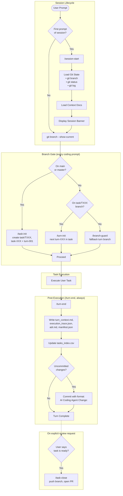

# coding-agents-config

Agentic pipeline configuration for Claude Code (and Codex). Enforces a turn-based workflow with provenance tracking, branch protection, and governance rules, plus the AppFactory (`af-*`) skill set for generating backend applications from a PRD.

## Setup

### 1. Clone the repo

```sh
git clone <repo-url> ~/coding-agents-config
```

### 2. Create symlinks (automated)

Run the setup script — it creates all symlinks and backs up any existing files:

```sh
bash scripts/setup.sh
```

<details>
<summary>Manual symlink commands</summary>

```sh
# Into ~/.claude/
ln -s ~/coding-agents-config/skills    ~/.claude/skills
ln -s ~/coding-agents-config/agents    ~/.claude/agents
ln -s ~/coding-agents-config/hooks     ~/.claude/hooks
ln -s ~/coding-agents-config/scripts   ~/.claude/scripts
ln -s ~/coding-agents-config/CLAUDE.md ~/.claude/CLAUDE.md
ln -s ~/coding-agents-config/settings.json ~/.claude/settings.json

# Into ~/.codex/
ln -s ~/coding-agents-config/agents    ~/.codex/agents
ln -s ~/coding-agents-config/AGENTS.md ~/.codex/AGENTS.md

# Repo-local override
ln -s ~/coding-agents-config/CLAUDE.md ./.claude/CLAUDE.md
```

If any of these already exist, back them up first (`mv <target> <target>.bak`). `scripts/setup.sh` also links optional `rules/`, `context/`, and `plugins/` directories into `~/.claude/` if/when they exist in this repo.
</details>

### 3. Verify

```sh
ls -la ~/.claude/skills        # should point to ~/coding-agents-config/skills
ls -la ~/.claude/agents        # should point to ~/coding-agents-config/agents
ls -la ~/.claude/hooks         # should point to ~/coding-agents-config/hooks
ls -la ~/.claude/CLAUDE.md     # should point to ~/coding-agents-config/CLAUDE.md
ls -la ~/.claude/settings.json # should point to ~/coding-agents-config/settings.json
```

## Structure

```
coding-agents-config/
├── CLAUDE.md            # Global instructions — turn protocol, branch rules
├── AGENTS.md            # Codex loader directive (reads ~/.claude/CLAUDE.md)
├── settings.json        # Claude Code settings (model, permissions, hooks, plugins)
├── package.json         # npm deps used by installed plugins (e.g. caveman)
├── agents/              # Standalone subagent definitions
│   └── agent-architecture-planner.md
├── hooks/                # Shell hooks triggered by Claude Code events
│   └── branch-guard.sh   # Auto-creates a task/TXXX branch when on main/master
├── scripts/              # Automation scripts
│   ├── setup.sh           # Creates the ~/.claude and ~/.codex symlinks
│   └── af-state.sh        # Helper for AppFactory state.yaml management
├── skills/               # Slash-command skills
│   ├── session-start/      # Load repo state + context at session start
│   ├── task-init/          # Create a new task/TXXX branch + task-001/turn-001 artifacts
│   ├── turn-init/          # Start the next turn inside the active task branch
│   ├── turn-end/           # Finalize a turn (PR notes, ADR, manifest, commit)
│   ├── task-close/         # Push the task branch and open a pull request
│   ├── branch-guard/       # Fallback: create a turn branch if still on main/master
│   ├── af-orchestrator/    # Orchestrates the full AppFactory SDLC
│   ├── af-project-init/    # AppFactory project bootstrap
│   ├── af-be-prd-build/    # Build a backend PRD from a discovery worksheet
│   ├── af-be-ddd-orchestrator/ # Drives the DDD build → analysis → refactor → test loop
│   ├── af-be-ddd-build/    # PRD -> Domain-Driven Design document
│   ├── af-be-ddd-analysis/ # Audit a DDD document for gaps vs. the PRD
│   ├── af-be-ddd-refactor/ # Patch a DDD document from analysis findings
│   ├── af-be-ddd-tests/    # DDD/PRD -> Gherkin BDD feature files
│   ├── af-be-ddd-dsl/      # DDD document -> backend DSL YAML
│   ├── af-be-plan/         # DSL + tech-stack profile -> execution plan
│   ├── af-be-implementation/ # Execution plan -> generated backend code
│   ├── af-app-check/       # Production-readiness audit
│   ├── af-memory/          # CRUD on .appfactory/state.yaml
│   ├── eval-labeler/       # Label/compare model-response eval runs
│   ├── dsl-utils/dsl-model-interpreter/       # Parse/validate app-dsl YAML
│   ├── e2e-tests/http-test-artifacts/         # Generate .http request files
│   ├── ui-utils/ui-implementation-language/   # Declarative UI-YAML spec
│   ├── unit-tests/test-implementation-sync/   # Keep tests aligned with implementation
│   └── .system/            # Meta-skills (not part of the pipeline)
│       ├── skill-creator/    # Scaffold a new skill
│       ├── skill-installer/  # Install skills from a marketplace or repo
│       ├── plugin-creator/   # Scaffold a plugin directory
│       ├── imagegen/         # Generate/edit raster images
│       └── openai-docs/      # Look up OpenAI API/product docs
├── .appfactory/           # Task/turn tracking and AppFactory pipeline state
│   ├── tasks/               # task-XXX/ directories with turn-XXX/ artifacts
│   ├── tasks_index.csv      # Registry of all tasks and their status
│   ├── changelog.md
│   ├── specs/                # PRD/DDD/DSL specs produced by af-* skills
│   ├── prompts/               # Prompt templates
│   └── memory/                # Pipeline state (state.yaml)
├── .github/               # Issue templates + pull_request_template.md
├── docs/                  # Reference documentation (migration notes, skill summary, plans)
└── archive/               # Retired skills and superseded docs, kept for reference
```

## Execution Flow

The agentic pipeline enforces a strict turn-based workflow for all coding tasks:


```mermaid
flowchart TB
    subgraph SESSION["Session Lifecycle"]
        START([User Prompt]) --> SS{First prompt<br/>of session?}
        SS -->|Yes| SESSION_START["/session-start"]
        SS -->|No| BRANCH_CHECK

        SESSION_START --> LOAD_GIT["Load Git State<br/>• git branch<br/>• git status<br/>• git log"]
        LOAD_GIT --> LOAD_CTX["Load Context Docs"]
        LOAD_CTX --> BANNER["Display Session Banner"]
        BANNER --> BRANCH_CHECK
    end

    subgraph BRANCH_GATE["Branch Gate (every coding prompt)"]
        BRANCH_CHECK["git branch --show-current"] --> IS_MAIN{On main<br/>or master?}
        IS_MAIN -->|Yes| TASK_INIT["/task-init<br/>create task/TXXX,<br/>task-XXX + turn-001"]
        IS_MAIN -->|No| IS_TASK{On task/TXXX<br/>branch?}
        IS_TASK -->|Yes| TURN_INIT["/turn-init<br/>next turn-XXX in task"]
        IS_TASK -->|No| BRANCH_GUARD["/branch-guard<br/>fallback turn branch"]
        TASK_INIT --> PROCEED
        TURN_INIT --> PROCEED
        BRANCH_GUARD --> PROCEED
    end

    subgraph EXECUTION["Task Execution"]
        PROCEED["Proceed"] --> EXEC["Execute User Task"]
    end

    subgraph POST_EXEC["Post-Execution (/turn-end, always)"]
        EXEC --> TURN_END["/turn-end"]
        TURN_END --> WRITE_ARTIFACTS["Write turn_context.md,<br/>execution_trace.json,<br/>adr.md, manifest.json"]
        WRITE_ARTIFACTS --> UPDATE_INDEX["Update tasks_index.csv"]
        UPDATE_INDEX --> CHECK_UNCOMMITTED{Uncommitted<br/>changes?}
        CHECK_UNCOMMITTED -->|Yes| COMMIT["Commit with format:<br/>AI Coding Agent Change:"]
        CHECK_UNCOMMITTED -->|No| COMPLETE
        COMMIT --> COMPLETE["Turn Complete"]
    end

    subgraph TASK_CLOSE["On explicit review request"]
        COMPLETE -.-> TC{User says<br/>task is ready?}
        TC -->|Yes| TASK_CLOSE_SKILL["/task-close<br/>push branch, open PR"]
    end
```

### Turn Protocol Summary

| Phase | Skill | Runs when | Outputs |
|-------|-------|-----------|---------|
| **Session Start** | `session-start` | First prompt of the session | Git state + context loaded |
| **Task Init** | `task-init` | Current branch is `main`/`master` | New `task/TXXX` branch, `task-XXX/` + `turn-001/` artifacts |
| **Turn Init** | `turn-init` | Already on a `task/TXXX` branch | Next `turn-XXX/` artifacts |
| **Branch Guard** | `branch-guard` | Fallback if still on `main`/`master` | Turn-scoped branch |
| **Execution** | — | Every coding prompt | Modified files |
| **Turn End** | `turn-end` | After every prompt, even on failure | `turn_context.md`, `execution_trace.json`, `adr.md`, `manifest.json`, commit |
| **Task Close** | `task-close` | User signals the task is ready for review | Pushed branch, opened PR |

## Skills

### Turn/task lifecycle

| Skill | Description |
|-------|-------------|
| `session-start` | Load repository state and core pipeline context; run at the start of every session |
| `task-init` | Initialize a new task branch and create `task-XXX` + `turn-001` artifacts (run when on `main`/`master`) |
| `turn-init` | Initialize the next turn within the active task branch |
| `turn-end` | Finalize the active turn after execution — PR notes, ADR, manifest, commit |
| `task-close` | Finalize the active task branch, push it, and open a pull request against `main` |
| `branch-guard` | Fallback: create a turn-scoped branch if still on `main`/`master` |

### AppFactory pipeline (`af-*`)

| Skill | Description |
|-------|-------------|
| `af-orchestrator` | Orchestrates the full App Factory software development lifecycle |
| `af-project-init` | Bootstraps a new AppFactory project (env vars + helper script) |
| `af-be-prd-build` | Builds a business-facing backend PRD from a discovery worksheet |
| `af-be-ddd-orchestrator` | Drives the DDD build → analyze → refactor loop → test phases |
| `af-be-ddd-build` | Generates a human-readable backend DDD document from an approved PRD |
| `af-be-ddd-analysis` | Audits a DDD document for quality, completeness, and PRD alignment |
| `af-be-ddd-refactor` | Patches a DDD document based on `af-be-ddd-analysis` findings |
| `af-be-ddd-tests` | Generates Gherkin-style BDD feature files from the DDD and PRD |
| `af-be-ddd-dsl` | Generates a backend DSL YAML document from the DDD document |
| `af-be-plan` | Generates a step-by-step backend execution plan from the DSL and a tech-stack profile |
| `af-be-implementation` | Generates backend code from the execution plan and BDD feature specs |
| `af-app-check` | Audits an application for production readiness (security, database, deployment, code quality) |
| `af-memory` | CRUD operations on `.appfactory/` pipeline state (`state.yaml`) |

### Utility

| Skill | Description |
|-------|-------------|
| `eval-labeler` | Labels/compares Response A vs. Response B model evaluation runs |
| `dsl-utils/dsl-model-interpreter` | Parses and validates app-dsl YAML specifications |
| `e2e-tests/http-test-artifacts` | Generates `.http` request files for REST endpoint testing |
| `ui-utils/ui-implementation-language` | Declarative YAML language for UI pages, layouts, and bindings |
| `unit-tests/test-implementation-sync` | Keeps generated unit tests synchronized with the implementation |

### Meta-skills (`.system`)

| Skill | Description |
|-------|-------------|
| `skill-creator` | Scaffold a new skill |
| `skill-installer` | Install skills from a curated list or a GitHub repo |
| `plugin-creator` | Scaffold a plugin directory (`.codex-plugin/plugin.json`) |
| `imagegen` | Generate or edit raster images |
| `openai-docs` | Look up official OpenAI API/product documentation |

## Agents

| Agent | Description |
|-------|-------------|
| `agent-architecture-planner` | Reads the PRD, DDD, DSL, and repo structure to produce architecture decisions, module maps, and task plans for downstream coding agents |

## Hooks

| Hook | Trigger | Purpose |
|------|---------|---------|
| `branch-guard.sh` | `PreToolUse` (Bash/write tools) | Auto-creates a `task/TXXX` branch when a write is attempted on `main`/`master` |

## Adding a new skill

Each skill lives in its own directory under `skills/` with a `SKILL.md` file:

```
skills/my-skill/
└── SKILL.md
```

Related skills can be grouped under a category folder (e.g. `skills/dsl-utils/my-skill/SKILL.md`), following the pattern used by `dsl-utils/`, `e2e-tests/`, `ui-utils/`, and `unit-tests/`.

The `.system/skill-creator` meta-skill can guide you through creating one — invoke it from Claude Code.

## Syncing across machines

Since this is a standard git repo, pull on any machine to stay current:

```sh
cd ~/coding-agents-config && git pull
```

The symlinks mean changes are picked up immediately — no reinstall needed.
