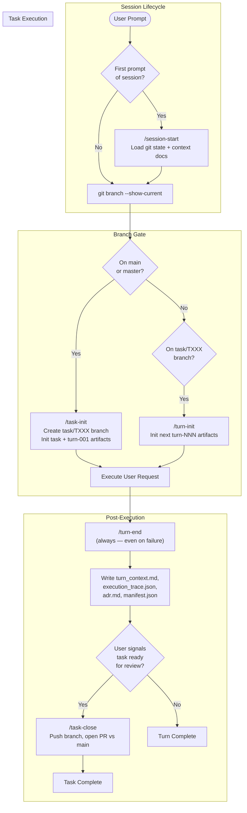

# coding-agents-config

Agentic pipeline configuration for Claude Code (and Codex). Enforces a task/turn-based workflow with provenance tracking, branch protection, and governance rules for the App Factory (`af-*`) code-generation pipeline.

## Setup

### 1. Clone the repo

```sh
git clone <repo-url> ~/coding-agents-config
```

### 2. Create symlinks (automated)

Run the setup script — it creates all symlinks and backs up any existing files:

```sh
bash scripts/setup.sh
```

<details>
<summary>Manual symlink commands</summary>

```sh
# ~/.claude/
ln -s ~/coding-agents-config/skills   ~/.claude/skills
ln -s ~/coding-agents-config/agents   ~/.claude/agents
ln -s ~/coding-agents-config/hooks    ~/.claude/hooks
ln -s ~/coding-agents-config/scripts  ~/.claude/scripts
ln -s ~/coding-agents-config/CLAUDE.md    ~/.claude/CLAUDE.md
ln -s ~/coding-agents-config/settings.json ~/.claude/settings.json

# ~/.codex/
ln -s ~/coding-agents-config/agents    ~/.codex/agents
ln -s ~/coding-agents-config/AGENTS.md ~/.codex/AGENTS.md

# repo-local ./.claude/
ln -s ~/coding-agents-config/CLAUDE.md ./.claude/CLAUDE.md
```

If any of these already exist, back them up first (`mv <target> <target>.bak`).
</details>

### 3. Verify

```sh
ls -la ~/.claude/skills        # should point to ~/coding-agents-config/skills
ls -la ~/.claude/agents        # should point to ~/coding-agents-config/agents
ls -la ~/.claude/hooks         # should point to ~/coding-agents-config/hooks
ls -la ~/.claude/CLAUDE.md     # should point to ~/coding-agents-config/CLAUDE.md
ls -la ~/.claude/settings.json # should point to ~/coding-agents-config/settings.json
```

## Structure

```
coding-agents-config/
├── CLAUDE.md            # Global instructions — task/turn protocol, branch rules
├── AGENTS.md             # Codex loader directive (points at ~/.claude/CLAUDE.md)
├── settings.json         # Claude Code settings (model, permissions, hooks, plugins)
├── package.json           # Node dependency (caveman) used by installed skills/plugins
├── hooks/                 # Shell hooks triggered by Claude Code events
│   └── branch-guard.sh    # PreToolUse hook — auto-creates task/TXXX branch if on main/master
├── agents/                # Subagent definitions
│   └── agent-architecture-planner.md
├── skills/                # Slash-command skills
│   ├── session-start/     # Load git state + pipeline context (first prompt of session)
│   ├── task-init/         # Create task/TXXX branch + task-001 artifacts (run on main/master)
│   ├── turn-init/         # Create next turn directory + artifacts inside a task branch
│   ├── turn-end/          # Finalize turn — PR draft, ADR, manifest, index update
│   ├── task-close/        # Finalize task branch, push, open PR against main
│   ├── branch-guard/      # Legacy turn-scoped branch guard
│   ├── af-orchestrator/       # Orchestrates the App Factory SDLC end to end
│   ├── af-project-init/       # Export AppFactory env vars, run init helper script
│   ├── af-memory/             # CRUD for .appfactory/memory/state.yaml pipeline state
│   ├── af-be-prd-build/       # Build backend PRD from an intake worksheet
│   ├── af-be-ddd-build/       # Generate backend DDD doc from an approved PRD
│   ├── af-be-ddd-analysis/    # Audit a DDD spec for quality/completeness/gaps
│   ├── af-be-ddd-refactor/    # Patch a DDD spec from analysis findings
│   ├── af-be-ddd-orchestrator/# Orchestrate the DDD build/analyze/refactor/test loop
│   ├── af-be-ddd-dsl/         # Generate backend DSL YAML from a DDD doc
│   ├── af-be-plan/            # Generate a backend execution plan from DSL + tech-stack profile
│   ├── af-be-ddd-tests/       # Generate Gherkin/BDD feature files from DDD + PRD
│   ├── af-be-implementation/  # Generate backend code from the execution plan + BDD specs
│   ├── af-app-check/          # Production-readiness audit (security, DB, deploy, quality)
│   ├── dsl-utils/dsl-model-interpreter/     # Parse and validate App Factory DSL YAML
│   ├── e2e-tests/http-test-artifacts/       # Generate HTTP request test artifacts
│   ├── ui-utils/ui-implementation-language/ # UI implementation language helper
│   ├── unit-tests/test-implementation-sync/ # Keep tests aligned with implementation
│   └── eval-labeler/      # Label/score Response A vs Response B model evals
├── scripts/                # Automation scripts
│   ├── setup.sh            # Creates the symlinks above
│   └── af-state.sh         # Bash helpers for reading/writing .appfactory state.yaml
├── .appfactory/             # Task/turn tracking and App Factory specs
│   ├── tasks/               # task-XXX/ directories, each with nested turns/turn-XXX/
│   ├── tasks_index.csv       # Registry of tasks and their status
│   ├── specs/                 # Specifications
│   ├── prompts/                # Prompt drafts used to build/iterate on skills
│   ├── memory/                 # state.yaml — pipeline state (see af-memory)
│   └── changelog.md
├── archive/                 # Retired/legacy skill library (base-node-fullstack era)
├── .github/                  # PR + issue templates
│   ├── PULL_REQUEST_TEMPLATE.md
│   └── ISSUE_TEMPLATE/         # epic.md, task.md, bug.md
└── docs/                     # Reference documentation
    ├── appFactory-plan.md
    ├── app-nextjs-nestjs-prisma.md
    ├── skill-summary.md
    ├── migration-ai-to-appfactory.md
    └── ai-to-appfactory-migration-analysis.md
```

## Execution Flow

The agentic pipeline enforces a task/turn workflow for every coding prompt:


```mermaid
flowchart TB
    subgraph SESSION["Session Lifecycle"]
        START([User Prompt]) --> SS{First prompt<br/>of session?}
        SS -->|Yes| SESSION_START["/session-start<br/>Load git state + context docs"]
        SS -->|No| CHECK_BRANCH
        SESSION_START --> CHECK_BRANCH
    end

    subgraph BRANCH_GATE["Branch Gate"]
        CHECK_BRANCH["git branch --show-current"] --> IS_MAIN{On main<br/>or master?}
        IS_MAIN -->|Yes| TASK_INIT["/task-init<br/>Create task/TXXX branch<br/>Init task + turn-001 artifacts"]
        IS_MAIN -->|No| IS_TASK{On task/TXXX<br/>branch?}
        IS_TASK -->|Yes| TURN_INIT["/turn-init<br/>Init next turn-NNN artifacts"]
        TASK_INIT --> EXEC
        TURN_INIT --> EXEC
    end

    subgraph EXECUTION["Task Execution"]
        EXEC["Execute User Request"]
    end

    subgraph POST_EXEC["Post-Execution"]
        EXEC --> TURN_END["/turn-end<br/>(always — even on failure)"]
        TURN_END --> ARTIFACTS["Write turn_context.md,<br/>execution_trace.json,<br/>adr.md, manifest.json"]
        ARTIFACTS --> READY{User signals<br/>task ready<br/>for review?}
        READY -->|Yes| TASK_CLOSE["/task-close<br/>Push branch, open PR vs main"]
        READY -->|No| DONE["Turn Complete"]
        TASK_CLOSE --> DONE2["Task Complete"]
    end
```

### Task/Turn Protocol Summary

| Phase | Trigger | Skill | Outputs |
|-------|---------|-------|---------|
| **Session Start** | First prompt of session | `session-start` | Git state + context loaded |
| **Task Init** | Branch is `main`/`master` | `task-init` | New `task/TXXX` branch, `task-XXX/` dir, `turn-001` |
| **Turn Init** | Branch is `task/TXXX[-*]` | `turn-init` | Next `turn-NNN/` dir + initial artifacts |
| **Execution** | Every prompt | — | Modified files |
| **Turn End** | Every prompt, always | `turn-end` | `turn_context.md`, `execution_trace.json`, `adr.md`, `manifest.json` |
| **Task Close** | User signals task is ready for review | `task-close` | Branch pushed, PR opened against `main` |

The `hooks/branch-guard.sh` `PreToolUse` hook is a safety net: if a write/bash tool call happens while still on `main`/`master`, it auto-creates the next `task/TXXX` branch before the call proceeds.

## Skills

| Category | Skill | Description |
|----------|-------|-------------|
| **Session** | `session-start` | Load repo state and core pipeline context at session start |
| **Task/Turn** | `task-init` | Create task branch + `task-001` artifacts (run on main/master) |
| | `turn-init` | Create next turn directory + artifacts inside the active task |
| | `turn-end` | Finalize the active turn (PR draft, ADR, manifest, index) |
| | `task-close` | Finalize task branch, push, open PR against `main` |
| | `branch-guard` | Legacy turn-scoped branch guard |
| **App Factory — Orchestration** | `af-orchestrator` | Orchestrate the App Factory SDLC |
| | `af-project-init` | Export AppFactory env vars, invoke init helper script |
| | `af-memory` | CRUD for `.appfactory/memory/state.yaml` pipeline state |
| **App Factory — Backend (PRD → DDD → DSL → Plan → Code)** | `af-be-prd-build` | Build a backend PRD from an intake worksheet |
| | `af-be-ddd-build` | Generate a backend DDD document from an approved PRD |
| | `af-be-ddd-analysis` | Audit a DDD spec for quality, completeness, and gaps |
| | `af-be-ddd-refactor` | Patch a DDD spec from `af-be-ddd-analysis` findings |
| | `af-be-ddd-orchestrator` | Orchestrate the DDD build/analyze/refactor/test loop |
| | `af-be-ddd-dsl` | Generate backend DSL YAML from a DDD document |
| | `af-be-plan` | Generate a backend execution plan from DSL + tech-stack profile |
| | `af-be-ddd-tests` | Generate Gherkin/BDD feature files from DDD + PRD specs |
| | `af-be-implementation` | Generate backend code from the execution plan + BDD specs |
| **App Factory — Quality** | `af-app-check` | Production-readiness audit (security, DB, deploy, code quality) |
| **Utility (grouped)** | `dsl-utils/dsl-model-interpreter` | Parse and validate App Factory DSL YAML |
| | `e2e-tests/http-test-artifacts` | Generate HTTP request test artifacts |
| | `ui-utils/ui-implementation-language` | UI implementation language helper |
| | `unit-tests/test-implementation-sync` | Keep tests aligned with implementation |
| **Eval** | `eval-labeler` | Label/score Response A vs Response B model evals |

## Agents

| Agent | Description |
|-------|-------------|
| `agent-architecture-planner` | Reads PRD, DDD, DSL, and repo structure to produce architecture decisions, module maps, task plans, and sequencing for downstream coding agents |

## Hooks

| Hook | Trigger | Purpose |
|------|---------|---------|
| `branch-guard.sh` | `PreToolUse` (write/bash tools) | Auto-create `task/TXXX` branch when on `main`/`master` |

## Scripts

| Script | Purpose |
|--------|---------|
| `setup.sh` | Create the `~/.claude`, `~/.codex`, and repo-local symlinks |
| `af-state.sh` | Bash helpers for reading/writing `.appfactory/memory/state.yaml` |

## .appfactory/

Tracks App Factory pipeline state and task/turn artifacts:

- `tasks/task-XXX/` — one directory per task, with `task_context.md`, `task_status.json`, `task_summary.md`, `pull_request.md`, and nested `turns/turn-XXX/` (`turn_context.md`, `execution_trace.json`, `adr.md`, `manifest.json`)
- `tasks_index.csv` — registry of all tasks and their status
- `specs/` — specifications
- `prompts/` — prompt drafts used to build and iterate on skills
- `memory/state.yaml` — pipeline state read/written by `af-memory` and `af-state.sh`
- `changelog.md` — pipeline change history

## archive/

Retired skill library from an earlier (`base-node-fullstack`) iteration of the pipeline — DSL-first, full-stack generation skills (`app-from-dsl`, `nestjs-crud-resource`, `react-form-page`, `prisma-persistence`, etc.), superseded by the `af-*` App Factory skills above. Kept for reference; see `archive/README.md` and `archive/SUMMARY.md`.

## Adding a new skill

Each skill lives in its own directory under `skills/` with a `SKILL.md` file:

```
skills/my-skill/
└── SKILL.md
```

## Commit Message Format

```text
AI Coding Agent Change:
- <imperative bullet>
- <imperative bullet>
- <imperative bullet>
```

## Syncing across machines

Since this is a standard git repo, pull on any machine to stay current:

```sh
cd ~/coding-agents-config && git pull
```

The symlinks mean changes are picked up immediately — no reinstall needed.
