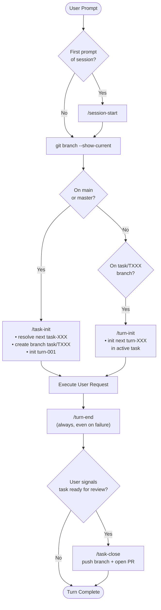

# coding-agents-config

Agentic pipeline configuration for Claude Code and Codex. Enforces task/turn-based workflow with provenance tracking, branch protection, and governance rules, plus the App Factory (`af-*`) skill pipeline for generating full-stack applications from specifications.

## Setup

### 1. Clone the repo

```sh
git clone <repo-url> ~/coding-agents-config
```

### 2. Create symlinks (automated)

Run the setup script — it creates all symlinks and backs up any existing files:

```sh
bash scripts/setup.sh
```

<details>
<summary>Manual symlink commands</summary>

```sh
# ~/.claude/
ln -s ~/coding-agents-config/skills ~/.claude/skills
ln -s ~/coding-agents-config/agents ~/.claude/agents
ln -s ~/coding-agents-config/hooks ~/.claude/hooks
ln -s ~/coding-agents-config/scripts ~/.claude/scripts
ln -s ~/coding-agents-config/CLAUDE.md ~/.claude/CLAUDE.md
ln -s ~/coding-agents-config/settings.json ~/.claude/settings.json

# ~/.codex/
ln -s ~/coding-agents-config/agents ~/.codex/agents
ln -s ~/coding-agents-config/AGENTS.md ~/.codex/AGENTS.md
```

If any of these already exist, back them up first (`mv <target> <target>.bak`).
</details>

### 3. Verify

```sh
ls -la ~/.claude/skills        # should point to ~/coding-agents-config/skills
ls -la ~/.claude/agents        # should point to ~/coding-agents-config/agents
ls -la ~/.claude/hooks         # should point to ~/coding-agents-config/hooks
ls -la ~/.claude/CLAUDE.md     # should point to ~/coding-agents-config/CLAUDE.md
ls -la ~/.claude/settings.json # should point to ~/coding-agents-config/settings.json
ls -la ~/.codex/AGENTS.md      # should point to ~/coding-agents-config/AGENTS.md
```

## Structure

```
coding-agents-config/
├── CLAUDE.md              # Global instructions — task/turn protocol, branch rules
├── AGENTS.md              # Codex loader directive (points at ~/.claude/CLAUDE.md)
├── settings.json          # Claude Code settings (model, permissions, env)
├── package.json           # Node dependency (caveman templating)
├── agents/                # Subagent definitions
│   └── agent-architecture-planner.md
├── hooks/                 # Shell hooks triggered by Claude Code events
│   └── branch-guard.sh    # Auto-creates task/TXXX branch when on main/master
├── scripts/               # Automation scripts
│   ├── setup.sh           # Creates ~/.claude and ~/.codex symlinks
│   └── af-state.sh        # AppFactory pipeline state helpers
├── skills/                # Slash-command skills (see Skills below)
│   ├── .system/           # Shared meta-skills (skill-creator, skill-installer, ...)
│   ├── .nestjs/            # NestJS/Prisma scaffolding skills
│   ├── session-start/, task-init/, task-close/, turn-init/, turn-end/, branch-guard/
│   ├── af-*/               # App Factory pipeline skills
│   └── dsl-utils/, e2e-tests/, ui-utils/, unit-tests/, eval-labeler/
├── .appfactory/            # Task/turn tracking and pipeline state
│   ├── tasks/              # task-XXX/ directories with turns/, ADRs, manifests
│   ├── tasks_index.csv     # Registry of all tasks and their status
│   ├── specs/               # Specifications
│   ├── prompts/             # Prompt templates
│   ├── memory/               # Project memory
│   └── changelog.md
├── docs/                   # Reference documentation (pipeline plans, migration notes,
│                            # docs/skill-summary.md — App Factory skill sequence table)
├── archive/                 # Deprecated skills/templates superseded by skills/ and .appfactory/
└── .github/                 # PR and issue templates
```

## Execution Flow

The agentic pipeline enforces a task/turn workflow for all coding tasks (see `CLAUDE.md` for the full specification):


```mermaid
flowchart TB
    START([User Prompt]) --> FIRST{First prompt<br/>of session?}
    FIRST -->|Yes| SESSION_START["/session-start"]
    FIRST -->|No| BRANCH_CHECK
    SESSION_START --> BRANCH_CHECK["git branch --show-current"]

    BRANCH_CHECK --> IS_MAIN{On main<br/>or master?}
    IS_MAIN -->|Yes| TASK_INIT["/task-init<br/>• resolve next task-XXX<br/>• create branch task/TXXX<br/>• init turn-001"]
    IS_MAIN -->|No| IS_TASK{On task/TXXX<br/>branch?}
    IS_TASK -->|Yes| TURN_INIT["/turn-init<br/>• init next turn-XXX<br/>in active task"]

    TASK_INIT --> EXEC
    TURN_INIT --> EXEC["Execute User Request"]

    EXEC --> TURN_END["/turn-end<br/>(always, even on failure)"]
    TURN_END --> READY{User signals<br/>task ready for review?}
    READY -->|Yes| TASK_CLOSE["/task-close<br/>push branch + open PR"]
    READY -->|No| DONE([Turn Complete])
    TASK_CLOSE --> DONE
```

### Task/Turn Model

| Concept | Scope | ID Format | Notes |
|---------|-------|-----------|-------|
| **Task** | One branch, becomes one pull request | `task-XXX` global, zero-padded | Branch: `task/TXXX` |
| **Turn** | One AI execution cycle within a task | `turn-XXX`, resets per task | Never skip `/turn-end` |

Every turn writes `turn_context.md`, `execution_trace.json`, `adr.md`, and `manifest.json` under `.appfactory/tasks/task-XXX/turns/turn-XXX/`. Every task writes `task_context.md`, `task_status.json`, `task_summary.md`, and `pull_request.md` under `.appfactory/tasks/task-XXX/`, and gets one row in `.appfactory/tasks_index.csv`.

## Skills

Skills live under `skills/`, one directory per skill (or nested under a namespace directory), each with a `SKILL.md`.

### Lifecycle

| Skill | Description |
|-------|-------------|
| `session-start` | Load repository state and core pipeline context at the start of every session |
| `task-init` | Initialize a new task branch (`task/TXXX`) and create task + turn-001 artifacts |
| `turn-init` | Initialize the next turn within the active task branch |
| `turn-end` | Finalize the active turn after execution — run after every coding prompt, even on failure |
| `task-close` | Finalize the active task branch, push it, and open a pull request against main |
| `branch-guard` | Check current git branch and create a turn-scoped branch if on main/master |

### App Factory Pipeline (`af-*`)

Orchestrated backend generation from PRD → DDD → DSL → plan → implementation. See `docs/skill-summary.md` for the full phase-by-phase sequence and invocation graph.

| Skill | Description |
|-------|-------------|
| `af-orchestrator` | Orchestrates the App Factory software development lifecycle end to end |
| `af-project-init` | Initialize an AppFactory project by exporting required environment variables |
| `af-be-prd-build` | Build a business-facing backend PRD from an intake worksheet |
| `af-be-ddd-orchestrator` | Orchestrate the backend DDD build → analyze → refactor loop → test phases |
| `af-be-ddd-build` | Generate a human-readable backend DDD document from an approved PRD |
| `af-be-ddd-analysis` | Audit a generated DDD document for quality, completeness, and PRD alignment |
| `af-be-ddd-refactor` | Patch a DDD document using `af-be-ddd-analysis` findings |
| `af-be-ddd-tests` | Generate Gherkin-style BDD scenarios from DDD and PRD specifications |
| `af-be-plan` | Generate a backend execution plan from a domain DSL and tech stack profile |
| `af-be-ddd-dsl` | Generate a backend domain DSL YAML document from a DDD document |
| `af-be-implementation` | Execute backend code generation from the execution plan and BDD specs |
| `af-app-check` | Audit an application for production readiness before release/QA/staging |
| `af-memory` | CRUD operations for AppFactory pipeline state (`state.yaml`) |

### Utility

| Skill | Description |
|-------|-------------|
| `dsl-utils/dsl-model-interpreter` | Parse and validate `app-dsl` YAML specifications before code generation |
| `e2e-tests/http-test-artifacts` | Generate `.http` request files for REST endpoint testing |
| `ui-utils/ui-implementation-language` | Declarative YAML language for UI pages, layouts, widgets, and forms |
| `unit-tests/test-implementation-sync` | Keep generated unit tests synchronized with service/DTO implementations |
| `eval-labeler` | Process `Eval.md` files to label and compare model A/B coding responses |

### NestJS/Prisma Scaffolding (`.nestjs/`)

| Skill | Description |
|-------|-------------|
| `app-from-dsl` | Orchestrate full-stack generation (entity, CRUD API, forms, tests) from app-dsl YAML |
| `field-mapper-generator` | Generate field mapper/converter utilities between UI, API, and persistence layers |
| `nestjs-crud-resource` | Generate a NestJS CRUD module (controller, service, DTOs) from a DSL backend spec |
| `nestjs-customer-crud-scaffold` | Scaffold a NestJS customer CRUD app via a non-interactive Nest CLI wrapper |
| `nestjs-observability` | Add structured logging, correlation IDs, and Prisma query logging to a NestJS backend |
| `nestjs-prisma-resource` | Generate a complete Prisma-backed NestJS CRUD resource from an input schema |
| `prisma/prisma-guidelines`, `prisma/prisma-persistence` | Prisma schema and persistence-layer conventions |

### Meta-Skills (`.system/`)

Shared, product-agnostic meta-skills (skill/plugin authoring, image generation). Marked with `.codex-system-skills.marker`.

| Skill | Description |
|-------|-------------|
| `skill-creator` | Guide for creating or updating a skill |
| `skill-installer` | Install skills into `$CODEX_HOME/skills` from a curated list or GitHub repo |
| `plugin-creator` | Scaffold plugin directories with a `.codex-plugin/plugin.json` manifest |
| `imagegen` | Generate or edit raster images (illustrations, textures, mockups) |
| `openai-docs` | Look up official OpenAI product/API documentation |

## Templates

There is no shared top-level `templates/` directory — templates live alongside the skill that owns them, e.g. `skills/af-be-ddd-build/templates/ddd-template.md`, `skills/af-be-plan/templates/execution-plan-template.md`, `skills/task-init/templates/`. Legacy shared templates (ADR, PR, commit message, tech-stack) are preserved under `archive/templates/`.

## Hooks

| Hook | Trigger | Purpose |
|------|---------|---------|
| `branch-guard.sh` | PreToolUse (Bash / file write) | If on `main`/`master`, auto-creates and switches to the next `task/TXXX` branch instead of blocking |

## Adding a new skill

Each skill lives in its own directory under `skills/` with a `SKILL.md` file:

```
skills/my-skill/
└── SKILL.md
```

The `.system/skill-creator` meta-skill can guide you through creating one — invoke it from Claude Code.

## Syncing across machines

Since this is a standard git repo, pull on any machine to stay current:

```sh
cd ~/coding-agents-config && git pull
```

The symlinks mean changes are picked up immediately — no reinstall needed.
