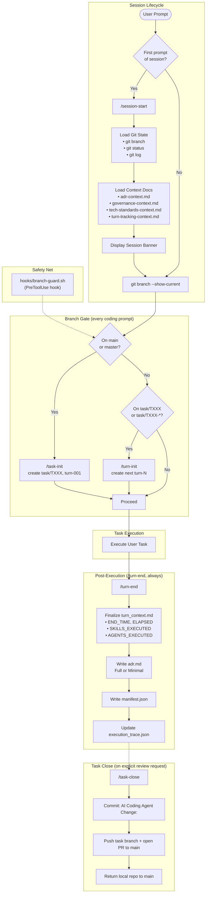

# coding-agents-config

Agentic pipeline configuration shared across Claude Code and Codex. Enforces a task/turn-based workflow with provenance tracking, branch protection, and governance rules, plus a library of App Factory (`af-*`) skills for spec-driven backend generation.

## Setup

### 1. Clone the repo

```sh
git clone <repo-url> ~/coding-agents-config
```

### 2. Create symlinks (automated)

Run the setup script — it links the repo into `~/.claude/` and `~/.codex/`, backing up any existing files:

```sh
bash scripts/setup.sh
```

<details>
<summary>Manual symlink commands</summary>

```sh
# ~/.claude/
ln -s ~/coding-agents-config/skills       ~/.claude/skills
ln -s ~/coding-agents-config/agents       ~/.claude/agents
ln -s ~/coding-agents-config/hooks        ~/.claude/hooks
ln -s ~/coding-agents-config/scripts      ~/.claude/scripts
ln -s ~/coding-agents-config/CLAUDE.md    ~/.claude/CLAUDE.md
ln -s ~/coding-agents-config/settings.json ~/.claude/settings.json

# ~/.codex/
ln -s ~/coding-agents-config/agents    ~/.codex/agents
ln -s ~/coding-agents-config/AGENTS.md ~/.codex/AGENTS.md

# repo-local ./.claude/
ln -s ~/coding-agents-config/CLAUDE.md ./.claude/CLAUDE.md
```

`scripts/setup.sh` also attempts to link `rules/`, `context/`, and `plugins/` into `~/.claude/` for forward compatibility; these directories don't exist in the repo yet, so skip them if scripting this by hand.

If any target already exists, back it up first (`mv <target> <target>.bak`) — the script does this automatically.
</details>

### 3. Verify

```sh
ls -la ~/.claude/skills        # should point to ~/coding-agents-config/skills
ls -la ~/.claude/agents        # should point to ~/coding-agents-config/agents
ls -la ~/.claude/hooks         # should point to ~/coding-agents-config/hooks
ls -la ~/.claude/CLAUDE.md     # should point to ~/coding-agents-config/CLAUDE.md
ls -la ~/.claude/settings.json # should point to ~/coding-agents-config/settings.json
ls -la ~/.codex/AGENTS.md      # should point to ~/coding-agents-config/AGENTS.md
```

## Structure

```
coding-agents-config/
├── CLAUDE.md              # Global instructions — task/turn protocol, branch rules
├── AGENTS.md              # Codex loader directive (reads ~/.claude/CLAUDE.md)
├── settings.json           # Claude Code settings (model, permissions, hooks, plugins)
├── package.json             # Repo-level npm deps (e.g. caveman)
├── agents/                 # Agent role definitions
│   └── agent-architecture-planner.md
├── hooks/                  # Shell hooks triggered by Claude Code events
│   └── branch-guard.sh     # PreToolUse guard against edits on main/master
├── scripts/                # Automation scripts
│   ├── setup.sh            # Creates ~/.claude and ~/.codex symlinks
│   └── af-state.sh         # AppFactory state.yaml helpers, sourced by af-* skills
├── skills/                 # Slash-command skills (see below)
│   ├── .system/             # Meta-skills (skill-creator, skill-installer, plugin-creator, ...)
│   ├── .nestjs/              # NestJS/Prisma code-generation skills
│   ├── af-*/                 # App Factory SDLC skills (PRD → DDD → DSL → plan → build)
│   ├── session-start/        # Load git state + governance context at session start
│   ├── task-init/            # Create a task branch + turn-001 when on main/master
│   ├── turn-init/            # Create the next turn inside an active task branch
│   ├── turn-end/              # Finalize a turn's artifacts (ADR, manifest, trace)
│   ├── task-close/           # Push the task branch and open a PR against main
│   ├── branch-guard/          # Hook-driven fallback branch guard
│   └── dsl-utils/, e2e-tests/, ui-utils/, unit-tests/  # Category folders, one nested skill each
├── docs/                    # Reference documentation (migration notes, plans, skill summary)
├── archive/                 # Retired skills, legacy turns, and superseded templates
├── .appfactory/             # Task/turn tracking and AppFactory pipeline state
│   ├── tasks/               # task-001, task-002, ... with turns/ subdirectories
│   ├── tasks_index.csv      # Registry of all tasks and their status
│   ├── specs/                # Specifications (empty until populated per-task)
│   ├── prompts/               # Prompt drafts and worksheets
│   ├── memory/                # AppFactory state.yaml (per-project, empty in this repo)
│   └── changelog.md
└── .github/
    ├── PULL_REQUEST_TEMPLATE.md
    └── ISSUE_TEMPLATE/         # epic.md, task.md, bug.md
```

## Execution Flow

The agentic pipeline enforces a task/turn-based workflow for all coding tasks:


```mermaid
flowchart TB
    subgraph SESSION["Session Lifecycle"]
        START([User Prompt]) --> SS{First prompt<br/>of session?}
        SS -->|Yes| SESSION_START["/session-start"]
        SS -->|No| BRANCH_CHECK
        SESSION_START --> LOAD_GIT["Load Git State<br/>• git branch<br/>• git status<br/>• git log"]
        LOAD_GIT --> LOAD_CTX["Load Context Docs<br/>• adr-context.md<br/>• governance-context.md<br/>• tech-standards-context.md<br/>• turn-tracking-context.md"]
        LOAD_CTX --> BANNER["Display Session Banner"]
        BANNER --> BRANCH_CHECK
    end

    subgraph GATE["Branch Gate (every coding prompt)"]
        BRANCH_CHECK["git branch --show-current"] --> IS_MAIN{On main<br/>or master?}
        IS_MAIN -->|Yes| TASK_INIT["/task-init<br/>create task/TXXX, turn-001"]
        IS_MAIN -->|No| IS_TASK{On task/TXXX<br/>or task/TXXX-*?}
        IS_TASK -->|Yes| TURN_INIT["/turn-init<br/>create next turn-N"]
        IS_TASK -->|No| PROCEED
        TASK_INIT --> PROCEED["Proceed"]
        TURN_INIT --> PROCEED
    end

    subgraph EXECUTION["Task Execution"]
        PROCEED --> EXEC["Execute User Task"]
    end

    subgraph POST_EXEC["Post-Execution (/turn-end, always)"]
        EXEC --> TURN_END["/turn-end"]
        TURN_END --> UPDATE_CTX["Finalize turn_context.md<br/>• END_TIME, ELAPSED<br/>• SKILLS_EXECUTED<br/>• AGENTS_EXECUTED"]
        UPDATE_CTX --> WRITE_ADR["Write adr.md<br/>Full or Minimal"]
        WRITE_ADR --> WRITE_MANIFEST["Write manifest.json"]
        WRITE_MANIFEST --> UPDATE_TRACE["Update execution_trace.json"]
    end

    subgraph CLOSE["Task Close (on explicit review request)"]
        UPDATE_TRACE -.-> TASK_CLOSE["/task-close"]
        TASK_CLOSE --> COMMIT["Commit: AI Coding Agent Change:"]
        COMMIT --> PUSH["Push task branch + open PR to main"]
        PUSH --> RETURN["Return local repo to main"]
    end

    subgraph SAFETY["Safety Net"]
        HOOK["hooks/branch-guard.sh<br/>(PreToolUse hook)"] -.-> IS_MAIN
    end
```

### Turn Protocol Summary

| Phase | Trigger | Steps | Outputs |
|-------|---------|-------|---------|
| **Session Start** | First prompt of session | Load git state → load 4 context docs → display banner | Context loaded |
| **Task Init** | Current branch is `main`/`master` | Resolve `TASK_ID` → `git checkout -b task/TXXX` → create task dir + turn-001 → append `tasks_index.csv` | Task branch, `task_context.md`, `task_status.json`, `task_summary.md`, `pull_request.md`, turn-001 |
| **Turn Init** | Already on a `task/TXXX` branch | Resolve next `TURN_ID` → create `turns/turn-N/` → write context + trace → bump `totalTurns` | `turn_context.md`, `execution_trace.json` |
| **Execution** | Every coding prompt | Execute the user's request | Modified files |
| **Turn End** | After every prompt, even on failure | Finalize context → write ADR → write manifest → update trace | `adr.md`, `manifest.json`, updated `execution_trace.json` |
| **Task Close** | User signals the task is ready for review | Update task artifacts → commit → push → open PR → return to `main` | PR against `main`, updated `tasks_index.csv` |

`hooks/branch-guard.sh` runs as a `PreToolUse` hook on `Bash`/write tools and is a secondary safety net: if a tool call is attempted while still on `main`/`master`, it blocks/redirects before `task-init` gets a chance to run.

## Skills

Skills live under `skills/`. Categories prefixed with `.` (`.system`, `.nestjs`) and the four `*-utils`/`*-tests` folders (`dsl-utils`, `e2e-tests`, `ui-utils`, `unit-tests`) are containers for one or more nested skills rather than skills themselves.

### Pipeline (session, task, turn)

| Skill | Description |
|-------|-------------|
| `session-start` | Load repository state and core pipeline context at the start of every session |
| `task-init` | Initialize a new task branch and create task + turn-001 artifacts (run when on `main`/`master`) |
| `turn-init` | Initialize the next turn within the active task branch |
| `turn-end` | Finalize the active turn's artifacts after execution, even on failure |
| `task-close` | Finalize the active task branch, push it, and open a PR against `main` |
| `branch-guard` | Hook-invoked fallback: create a turn-scoped branch if still on `main`/`master` |

### App Factory (`af-*`) — spec-driven SDLC

| Skill | Description |
|-------|-------------|
| `af-orchestrator` | Orchestrates the App Factory software development lifecycle end to end |
| `af-project-init` | Bootstraps AppFactory project env vars and repo init via helper scripts |
| `af-memory` | CRUD operations for AppFactory pipeline state (`state.yaml`) |
| `af-be-prd-build` | Builds a business-facing backend PRD from an intake worksheet |
| `af-be-ddd-orchestrator` | Orchestrates the backend DDD build → analyze → refactor → test loop |
| `af-be-ddd-build` | Generates a human-readable backend DDD document from an approved PRD |
| `af-be-ddd-analysis` | Analyzes a DDD document for gaps/inconsistencies |
| `af-be-ddd-refactor` | Refactors a DDD document based on analysis findings |
| `af-be-ddd-dsl` | Generates a backend application DSL YAML from a DDD document |
| `af-be-ddd-tests` | Generates Gherkin/BDD feature files from DDD + PRD specs |
| `af-be-plan` | Generates a backend execution plan from a DSL YAML and tech-stack profile |
| `af-be-implementation` | Executes backend code generation from the plan and BDD specs into the target project |
| `af-app-check` | Audits an application for production readiness (security, DB, deployment, code quality) |

### Scaffolding (`.nestjs`)

| Skill | Description |
|-------|-------------|
| `app-from-dsl` | Orchestrates full-stack generation (entity, CRUD API, forms, tests) from app-dsl YAML |
| `nestjs-prisma-resource` | Generates a full NestJS CRUD resource backed by Prisma from an input schema |
| `nestjs-crud-resource` | Generates a NestJS CRUD module (controller/service/DTOs) from a DSL backend spec |
| `nestjs-customer-crud-scaffold` | Scaffolds a NestJS customer CRUD app via a non-interactive Nest CLI wrapper |
| `nestjs-observability` | Adds structured logging, correlation IDs, and Prisma query logging to a NestJS backend |
| `field-mapper-generator` | Generates field mapper/converter utilities from DSL mapper specs |

### Testing & implementation utilities

| Skill | Description |
|-------|-------------|
| `unit-tests/test-implementation-sync` | Keeps unit tests in sync with implementation changes |
| `e2e-tests/http-test-artifacts` | Generates HTTP-level end-to-end test artifacts |
| `dsl-utils/dsl-model-interpreter` | Interprets DSL model documents for downstream skills |
| `ui-utils/ui-implementation-language` | Determines/enforces the UI implementation language for a project |

### Other

| Skill | Description |
|-------|-------------|
| `eval-labeler` | Processes `Eval.md` files to label and compare model responses (Response A vs B) |

### Meta-skills (`.system`)

| Skill | Description |
|-------|-------------|
| `skill-creator` | Guide for creating or updating skills |
| `skill-installer` | Installs skills into `$CODEX_HOME/skills` from a curated list or GitHub repo |
| `plugin-creator` | Scaffolds Codex plugin directories and marketplace entries |
| `imagegen` | Generates or edits raster images (photos, illustrations, mockups) |
| `openai-docs` | Looks up official OpenAI API/product documentation with citations |

## Templates

There is no top-level `templates/` directory. Templates live alongside the skills that use them and under `archive/templates/`:

| Template | Location | Purpose |
|----------|----------|---------|
| `task_context.md` | `skills/task-init/templates/` | Task context scaffold |
| `turn_context.md` | `skills/task-init/templates/`, `skills/turn-init/templates/` | Turn context scaffold |
| `README.md`, `gitignore.template` | `skills/af-project-init/templates/` | New-project scaffolding |
| `adr_template.md`, `pull_request_template.md`, `manifest.schema.json`, `metadata_header.txt`, `branch_naming.md`, `commit_message.md`, `tech-stack.template.md` | `archive/templates/` | Legacy turn-lifecycle templates, kept for reference |

## Hooks

| Hook | Trigger | Purpose |
|------|---------|---------|
| `branch-guard.sh` | `PreToolUse` (Bash / write tools) | Blocks or redirects edits attempted on `main`/`master` |

## Adding a new skill

Each skill lives in its own directory under `skills/` with a `SKILL.md` file:

```
skills/my-skill/
└── SKILL.md
```

The `.system/skill-creator` meta-skill can guide you through creating one — invoke it from Claude Code.

## Syncing across machines

Since this is a standard git repo, pull on any machine to stay current:

```sh
cd ~/coding-agents-config && git pull
```

The symlinks mean changes are picked up immediately — no reinstall needed.
