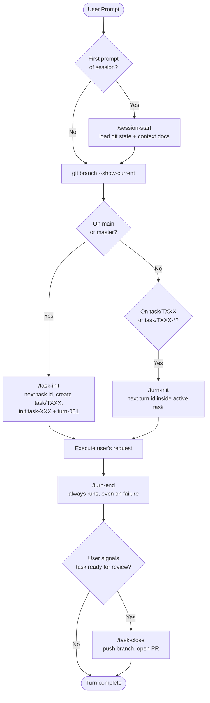

# coding-agents-config

Agentic pipeline configuration for Claude Code and Codex. Enforces a task/turn-based workflow with provenance tracking, branch protection, and governance rules, plus the AppFactory skill set for DSL-driven application generation.

## Setup

### 1. Clone the repo

```sh
git clone <repo-url> ~/coding-agents-config
```

### 2. Create symlinks (automated)

Run the setup script — it creates all symlinks and backs up any existing files:

```sh
bash scripts/setup.sh
```

It links into three locations:

- `~/.claude/` — `skills`, `agents`, `rules`, `hooks`, `context`, `scripts`, `plugins`, `CLAUDE.md`, `settings.json`
- `~/.codex/` — `agents`, `AGENTS.md`
- `./.claude/` (repo-local) — `CLAUDE.md`

Some targets (`rules`, `context`, `plugins`) don't exist in this repo yet; the script still links them so they pick up content automatically if added later.

<details>
<summary>Manual symlink commands</summary>

```sh
ln -s ~/coding-agents-config/skills ~/.claude/skills
ln -s ~/coding-agents-config/agents ~/.claude/agents
ln -s ~/coding-agents-config/hooks ~/.claude/hooks
ln -s ~/coding-agents-config/scripts ~/.claude/scripts
ln -s ~/coding-agents-config/CLAUDE.md ~/.claude/CLAUDE.md
ln -s ~/coding-agents-config/settings.json ~/.claude/settings.json
ln -s ~/coding-agents-config/agents ~/.codex/agents
ln -s ~/coding-agents-config/AGENTS.md ~/.codex/AGENTS.md
```

If any of these already exist, back them up first (`mv <target> <target>.bak`).
</details>

### 3. Verify

```sh
ls -la ~/.claude/skills        # should point to ~/coding-agents-config/skills
ls -la ~/.claude/agents        # should point to ~/coding-agents-config/agents
ls -la ~/.claude/hooks         # should point to ~/coding-agents-config/hooks
ls -la ~/.claude/CLAUDE.md     # should point to ~/coding-agents-config/CLAUDE.md
ls -la ~/.claude/settings.json # should point to ~/coding-agents-config/settings.json
```

## Structure

```
coding-agents-config/
├── CLAUDE.md           # Global instructions — task/turn protocol, branch rules
├── AGENTS.md           # Codex loader directive (points at ~/.claude/CLAUDE.md)
├── settings.json       # Claude Code settings (model, permissions, hooks, plugins)
├── hooks/              # Shell hooks triggered by Claude Code events
│   └── branch-guard.sh # Auto-creates a task branch on PreToolUse if on main/master
├── agents/             # Standalone subagent definitions
│   └── agent-architecture-planner.md
├── scripts/            # Automation scripts
│   ├── setup.sh        # Creates the symlinks described above
│   └── af-state.sh     # Helpers for reading/writing .appfactory/memory/state.yaml
├── skills/             # Slash-command skills (see below)
├── docs/               # Reference documentation and migration notes
├── archive/            # Superseded skill library (DSL-first full-stack generation, pre-AppFactory)
├── .appfactory/        # Task/turn tracking and specs
│   ├── tasks/          # Task branches with turns (task_context.md, task_status.json, ...)
│   ├── specs/          # PRD/DDD/DSL specification artifacts
│   ├── prompts/        # Prompt templates used to drive the pipeline
│   ├── memory/         # Pipeline state (state.yaml)
│   ├── tasks_index.csv # Registry of all tasks and their status
│   └── changelog.md
└── .github/            # Issue templates, PR template
```

## Execution Flow

The pipeline enforces a strict task/turn workflow for all coding prompts, defined in `CLAUDE.md`:


```mermaid
flowchart TB
    START([User Prompt]) --> FIRST{First prompt<br/>of session?}
    FIRST -->|Yes| SESSION_START["/session-start<br/>load git state + context docs"]
    FIRST -->|No| CHECK_BRANCH
    SESSION_START --> CHECK_BRANCH

    CHECK_BRANCH["git branch --show-current"] --> IS_MAIN{On main<br/>or master?}
    IS_MAIN -->|Yes| TASK_INIT["/task-init<br/>next task id, create task/TXXX,<br/>init task-XXX + turn-001"]
    IS_MAIN -->|No| IS_TASK{On task/TXXX<br/>or task/TXXX-*?}
    IS_TASK -->|Yes| TURN_INIT["/turn-init<br/>next turn id inside active task"]

    TASK_INIT --> EXEC
    TURN_INIT --> EXEC["Execute user's request"]

    EXEC --> TURN_END["/turn-end<br/>always runs, even on failure"]
    TURN_END --> READY{User signals<br/>task ready for review?}
    READY -->|Yes| TASK_CLOSE["/task-close<br/>push branch, open PR"]
    READY -->|No| DONE([Turn complete])
    TASK_CLOSE --> DONE
```

**Hard gate**: no write or edit action may occur on `main`/`master` — `/task-init` must succeed first. `hooks/branch-guard.sh` enforces this at the tool-call level as a backstop, auto-creating `task/T<next-id>` if a write is attempted on `main`/`master`.

### Task and turn artifacts

| Scope | Location | Files |
|-------|----------|-------|
| Task | `.appfactory/tasks/task-XXX/` | `task_context.md`, `task_status.json`, `task_summary.md`, `pull_request.md` |
| Turn | `.appfactory/tasks/task-XXX/turns/turn-XXX/` | `turn_context.md`, `execution_trace.json`, `adr.md`, `manifest.json` |

Task ids are global and zero-padded (`001`, `002`, ...); turn ids reset per task. `.appfactory/tasks_index.csv` tracks every task's branch, status, and PR URL.

## Skills

### Task/turn lifecycle

| Skill | Description |
|-------|-------------|
| `session-start` | Load repository state and core pipeline context at the start of every session |
| `task-init` | Initialize a new task branch and create task + turn-001 artifacts (run when on main/master) |
| `turn-init` | Initialize the next turn within the active task branch |
| `turn-end` | Finalize the active turn after execution, even on failure |
| `task-close` | Finalize the active task branch, push it, and open a PR against main |
| `branch-guard` | Model-disabled fallback; mirrors `hooks/branch-guard.sh` to create a turn-scoped branch off main |

### AppFactory pipeline (`af-*`)

DSL-driven backend application generation, orchestrated end-to-end by `af-orchestrator`:

| # | Phase | Skill | Invoked by | Description |
|---|-------|-------|------------|-------------|
| 1 | Initialization | `af-project-init` | `af-orchestrator` | Export required env vars and invoke the AppFactory init helper script |
| 2 | Requirements | `af-be-prd-build` | `af-orchestrator` | Build a business-facing PRD from intake worksheets/questionnaires |
| 3 | Domain-Driven Design | `af-be-ddd-orchestrator` | `af-orchestrator` | Orchestrate the DDD build → analyze → refactor loop |
| 4 | | `af-be-ddd-build` | `af-be-ddd-orchestrator` | Generate a human-readable DDD document from an approved PRD |
| 5 | | `af-be-ddd-analysis` | `af-be-ddd-orchestrator` | Audit a DDD document for quality, completeness, and PRD alignment |
| 6 | | `af-be-ddd-refactor` | `af-be-ddd-orchestrator` | Apply targeted patches to the DDD based on analysis findings |
| 7 | Testing specs | `af-be-ddd-tests` | `af-be-ddd-orchestrator` | Generate Gherkin BDD feature files from DDD + PRD, organized by aggregate |
| 8 | Planning | `af-be-plan` | `af-orchestrator` | Generate a step-by-step backend execution plan from DSL + tech stack profile |
| 9 | DSL generation | `af-be-ddd-dsl` | `af-be-implementation` | Generate the backend application DSL YAML from the DDD document |
| 10 | Implementation | `af-be-implementation` | `af-orchestrator` | Copy the target tech stack implementation and generate domain code from the plan + BDD specs |
| 11 | Validation | `af-app-check` | `af-orchestrator` | Audit the generated app for production readiness (security, database, deployment, code quality) |
| 12 | Cross-cutting | `af-memory` | All `af-*` skills | CRUD operations on `.appfactory/memory/state.yaml` for pipeline state |

### Category skills

These directories group sub-skills used during `af-be-implementation`:

| Category | Sub-skill | Description |
|----------|-----------|--------------|
| `dsl-utils/` | `dsl-model-interpreter` | Parse and validate app-dsl YAML specifications before code generation |
| `e2e-tests/` | `http-test-artifacts` | Generate `.http` request files for REST client endpoint testing |
| `ui-utils/` | `ui-implementation-language` | Declarative YAML standard for framework-neutral UI page/widget definitions |
| `unit-tests/` | `test-implementation-sync` | Keep unit tests synchronized with actual service/DTO implementations |

### Utility

| Skill | Description |
|-------|-------------|
| `eval-labeler` | Process `Eval.md` files to generate structured notes and labeled model-response comparisons |

## Agents

| Agent | Model | Description |
|-------|-------|--------------|
| `agent-architecture-planner` | sonnet | Reads PRD/DDD/DSL and repo structure to produce architecture decisions, module maps, task plans, and review artifacts for downstream coding agents |

## Hooks

| Hook | Trigger | Purpose |
|------|---------|---------|
| `branch-guard.sh` | `PreToolUse` (bash/write/edit tools) | Auto-create a `task/T<next-id>` branch when a write is attempted on `main`/`master` |

## Archive

`archive/` holds the original DSL-first full-stack skill library (`app-from-dsl`, `prisma-persistence`, `nestjs-crud-resource`, `react-form-page`, etc.) that predates the AppFactory pipeline. See `archive/README.md` and `archive/SUMMARY.md` for its taxonomy and generation flow; `docs/migration-ai-to-appfactory.md` and `docs/ai-to-appfactory-migration-analysis.md` document the migration to `.appfactory/`.

## Adding a new skill

Each skill lives in its own directory under `skills/` with a `SKILL.md` file:

```
skills/my-skill/
└── SKILL.md
```

`SKILL.md` needs a frontmatter `name` and `description` (used for model-invocation matching); set `disable-model-invocation: true` for skills that should only run via an explicit hook or another skill.

## Syncing across machines

Since this is a standard git repo, pull on any machine to stay current:

```sh
cd ~/coding-agents-config && git pull
```

The symlinks mean changes are picked up immediately — no reinstall needed.
