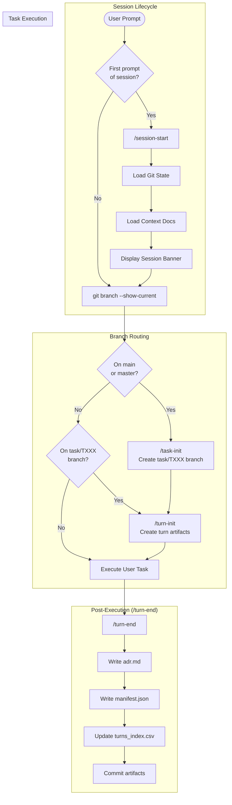

# coding-agents-config

Agentic pipeline configuration for Claude Code. Enforces a task/turn workflow with provenance tracking, branch protection, and governance rules. Also hosts the App Factory pipeline — an AI-driven SDLC for generating backend applications from requirements through to working code.

## Setup

### 1. Clone the repo

```sh
git clone <repo-url> ~/coding-agents-config
```

### 2. Create symlinks (automated)

Run the setup script — it creates all symlinks and backs up any existing files:

```sh
bash scripts/setup.sh
```

<details>
<summary>Manual symlink commands</summary>

```sh
ln -s ~/coding-agents-config/skills ~/.claude/skills
ln -s ~/coding-agents-config/hooks ~/.claude/hooks
ln -s ~/coding-agents-config/CLAUDE.md ~/.claude/CLAUDE.md
ln -s ~/coding-agents-config/settings.json ~/.claude/settings.json
```

If any of these already exist, back them up first (`mv <target> <target>.bak`).
</details>

### 3. Verify

```sh
ls -la ~/.claude/skills        # should point to ~/coding-agents-config/skills
ls -la ~/.claude/hooks         # should point to ~/coding-agents-config/hooks
ls -la ~/.claude/CLAUDE.md     # should point to ~/coding-agents-config/CLAUDE.md
ls -la ~/.claude/settings.json # should point to ~/coding-agents-config/settings.json
```

## Structure

```
coding-agents-config/
├── CLAUDE.md           # Global instructions — task/turn protocol, branch rules
├── AGENTS.md           # Agent loader directive
├── settings.json       # Claude Code settings (model, permissions, hooks)
├── hooks/              # Shell hooks triggered by Claude Code events
│   └── branch-guard.sh # Blocks edits on main/master
├── skills/             # Slash-command skills (see Skills section below)
│   ├── session-start/  # Initialize session context
│   ├── task-init/      # Create task branch and task-001 artifacts
│   ├── task-close/     # Finalize task, push branch, open PR
│   ├── turn-init/      # Create turn directory and artifacts
│   ├── turn-end/       # Finalize turn with ADR, manifest, index
│   ├── branch-guard/   # Create task branch if on main
│   ├── af-orchestrator/       # App Factory SDLC orchestrator
│   ├── af-be-ddd-orchestrator/# DDD workflow orchestrator
│   └── ...             # Other App Factory and utility skills
├── scripts/            # Automation scripts
│   ├── setup.sh        # Symlink installer
│   └── af-state.sh     # App Factory pipeline state helper
├── agents/             # Agent architecture documentation
│   └── agent-architecture-planner.md
├── docs/               # Reference documentation
│   ├── skill-summary.md
│   ├── app-nextjs-nestjs-prisma.md
│   └── ...
├── archive/            # Retired skills and templates
└── .appfactory/        # Task/turn tracking and pipeline state
    ├── tasks_index.csv # Global task registry
    ├── tasks/          # Per-task artifacts and turns
    ├── specs/          # Specifications
    ├── prompts/        # Prompt templates
    └── memory/         # Project memory
```

## Execution Flow

The agentic pipeline enforces a strict task/turn workflow for all coding sessions:


```mermaid
flowchart TB
    subgraph SESSION["Session Lifecycle"]
        START([User Prompt]) --> SS{First prompt<br/>of session?}
        SS -->|Yes| SESSION_START["/session-start"]
        SS -->|No| BRANCH_CHECK

        SESSION_START --> LOAD_GIT["Load Git State"]
        LOAD_GIT --> LOAD_CTX["Load Context Docs"]
        LOAD_CTX --> BANNER["Display Session Banner"]
        BANNER --> BRANCH_CHECK
    end

    subgraph BRANCH_GATE["Branch Routing"]
        BRANCH_CHECK["git branch --show-current"] --> IS_MAIN{On main<br/>or master?}
        IS_MAIN -->|Yes| TASK_INIT["/task-init<br/>Create task/TXXX branch"]
        IS_MAIN -->|No| IS_TASK{On task/TXXX<br/>branch?}
        IS_TASK -->|Yes| TURN_INIT["/turn-init<br/>Create turn artifacts"]
        IS_TASK -->|No| PROCEED
        TASK_INIT --> TURN_INIT
        TURN_INIT --> PROCEED
    end

    subgraph EXECUTION["Task Execution"]
        PROCEED["Execute User Task"]
    end

    subgraph POST_EXEC["Post-Execution (/turn-end)"]
        PROCEED --> TURN_END["/turn-end"]
        TURN_END --> WRITE_ADR["Write adr.md"]
        WRITE_ADR --> WRITE_MANIFEST["Write manifest.json"]
        WRITE_MANIFEST --> UPDATE_INDEX["Update turns_index.csv"]
        UPDATE_INDEX --> COMMIT["Commit artifacts"]
    end
```

### Task and Turn Protocol

| Phase | Trigger | Action | Outputs |
|-------|---------|--------|---------|
| **Session Start** | First prompt of session | `/session-start` — load git state + context | Context loaded |
| **Task Init** | Branch is `main`/`master` | `/task-init` — create `task/TXXX`, init artifacts | `task_context.md`, `task_status.json` |
| **Turn Init** | Branch is `task/TXXX` | `/turn-init` — create `turns/turn-XXX/` | `turn_context.md`, `execution_trace.json` |
| **Execution** | Always | Execute the user's request | Modified files |
| **Turn End** | After every prompt | `/turn-end` — write ADR, manifest, index, commit | `adr.md`, `manifest.json`, `turns_index.csv` |
| **Task Close** | User marks task ready | `/task-close` — push branch, open PR | Pull request |

### Branch Rules

- Task branch format: `task/TXXX` (e.g. `task/T001`)
- Task IDs are global and zero-padded to 3 digits: `001`, `002`, `003`
- Turn IDs reset per task: `001`, `002`, `003`
- **Never commit directly to `main` or `master`**

### Turn Artifacts

Every turn produces four required artifacts under `.appfactory/tasks/task-XXX/turns/turn-XXX/`:

| File | Purpose |
|------|---------|
| `turn_context.md` | Execution context, timing, skills used |
| `execution_trace.json` | Structured trace of actions taken |
| `adr.md` | Architecture Decision Record (full or minimal) |
| `manifest.json` | SHA-256 checksums of modified files |

### Task Artifacts

Every task produces four required artifacts under `.appfactory/tasks/task-XXX/`:

| File | Purpose |
|------|---------|
| `task_context.md` | Task scope and objectives |
| `task_status.json` | Current task state |
| `task_summary.md` | Summary of work done |
| `pull_request.md` | PR description |

## Skills (24)

### Lifecycle Skills

| Skill | Description |
|-------|-------------|
| `session-start` | Load repository state and core pipeline context at session start |
| `task-init` | Initialize a new `task/TXXX` branch and task + turn-001 artifacts |
| `task-close` | Finalize the active task, push branch, and open a PR against main |
| `turn-init` | Initialize the next turn within the active task branch |
| `turn-end` | Finalize turn — write ADR, manifest, update index, commit |
| `branch-guard` | Create task branch if on main/master |

### App Factory Pipeline Skills

The App Factory is an AI-driven SDLC that builds backend applications from a requirements worksheet to working, tested code.

```
af-orchestrator
  └─ af-project-init       (1) Initialize project, export env vars
  └─ af-be-prd-build       (2) Build PRD from requirements worksheet
  └─ af-be-ddd-orchestrator (3) Orchestrate DDD workflow
       └─ af-be-ddd-build      (3a) Generate DDD doc from PRD
       └─ af-be-ddd-analysis   (3b) Analyze DDD for quality & completeness
       └─ af-be-ddd-refactor   (3c) Refactor DDD based on analysis
       └─ af-be-ddd-tests      (3d) Generate Gherkin BDD scenarios
  └─ af-be-plan            (4) Generate backend execution plan
  └─ af-be-ddd-dsl         (5) Generate DSL YAML from DDD doc
  └─ af-be-implementation  (6) Execute backend code generation
  └─ af-app-check          (7) Production-readiness audit
  └─ af-memory             (*)  Pipeline state CRUD (used by all skills)
```

| Skill | Phase | Description |
|-------|-------|-------------|
| `af-orchestrator` | Orchestration | Top-level App Factory SDLC orchestrator |
| `af-project-init` | Initialization | Export env vars, initialize project scaffold |
| `af-be-prd-build` | Requirements | Build business-facing PRD from intake worksheet |
| `af-be-ddd-orchestrator` | DDD | Orchestrate build → analyze → refactor → test loop |
| `af-be-ddd-build` | DDD | Generate human-readable DDD doc from PRD |
| `af-be-ddd-analysis` | DDD | Analyze DDD for quality, completeness, PRD alignment |
| `af-be-ddd-refactor` | DDD | Refactor DDD based on analysis findings |
| `af-be-ddd-tests` | Testing | Generate Gherkin BDD scenarios from DDD and PRD |
| `af-be-plan` | Planning | Generate backend execution plan from DSL + tech stack |
| `af-be-ddd-dsl` | DSL | Generate DSL YAML from DDD doc for code generation |
| `af-be-implementation` | Implementation | Copy tech stack, generate domain code from DSL |
| `af-app-check` | Validation | Audit app for security, DB, deployment, code quality |
| `af-memory` | Utility | CRUD for AppFactory state.yaml pipeline state |

### Utility Skills

| Skill | Description |
|-------|-------------|
| `eval-labeler` | Evaluate and label model response comparisons (Response A vs B) |
| `dsl-utils` | DSL utility helpers |
| `ui-utils` | UI utility helpers |
| `e2e-tests` | End-to-end test utilities |
| `unit-tests` | Unit test utilities |

## Hooks

| Hook | Trigger | Purpose |
|------|---------|---------|
| `branch-guard.sh` | `PreToolUse(Bash)` | Block shell commands (edits, writes) on main/master |

## Settings

`settings.json` configures the Claude Code session:

| Setting | Value |
|---------|-------|
| Model | `opus` (claude-opus-4-5) |
| Small/fast model | `claude-sonnet-4-6` |
| `NODE_ENV` | `development` |
| `INSIDE_CLAUDE_CODE` | `1` |
| Bash timeout | 300 seconds |

Allowed commands include `git`, `gh`, `pnpm`, `npm`, `docker`, `psql`, `jq`, `curl`, and standard POSIX utilities. Denied: `rm -rf /`, force-push to main, `npm publish`.

## App Factory Environment Variables

Set in CLAUDE.md and used across all `af-*` skills:

| Variable | Value |
|----------|-------|
| `AF_ROOT` | `~/gallery/app-factory` |
| `AF_GITHUB_PROFILE` | `bobwares` |
| `AF_GENERATED_PROJECT_ROOT` | `~/generated-apps` |
| `AF_TECH_STACK_DSL` | `~/gallery/app-factory/tech-stack-profiles` |
| `AF_TECH_STACK_IMPLEMENTATIONS` | `~/gallery/app-factory/tech-stack-implementations` |
| `max_ddd_tries` | `3` |

## Adding a new skill

Each skill lives in its own directory under `skills/` with a `SKILL.md` file:

```
skills/my-skill/
└── SKILL.md
```

Use the `.system/skill-creator` meta-skill to scaffold one — invoke it from Claude Code.

## Commit Message Format

```text
AI Coding Agent Change:
- <imperative bullet>
- <imperative bullet>
- <imperative bullet>
```

## Syncing across machines

Since this is a standard git repo, pull on any machine to stay current:

```sh
cd ~/coding-agents-config && git pull
```

The symlinks mean changes are picked up immediately — no reinstall needed.
