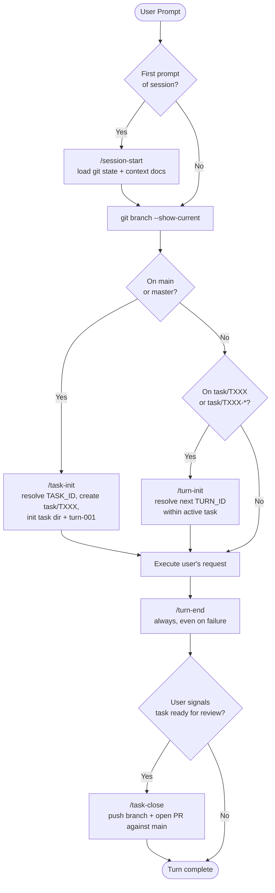

# coding-agents-config

Agentic pipeline configuration for Claude Code and Codex. Enforces a task/turn-based workflow with provenance tracking, branch protection, and governance rules, and hosts the **App Factory** (`af-*`) skill set for DSL-driven application generation.

## Setup

### 1. Clone the repo

```sh
git clone <repo-url> ~/coding-agents-config
```

### 2. Create symlinks (automated)

Run the setup script — it creates all symlinks and backs up any existing files:

```sh
bash scripts/setup.sh
```

<details>
<summary>Manual symlink commands</summary>

```sh
# ~/.claude/
ln -s ~/coding-agents-config/skills ~/.claude/skills
ln -s ~/coding-agents-config/agents ~/.claude/agents
ln -s ~/coding-agents-config/rules ~/.claude/rules
ln -s ~/coding-agents-config/hooks ~/.claude/hooks
ln -s ~/coding-agents-config/context ~/.claude/context
ln -s ~/coding-agents-config/scripts ~/.claude/scripts
ln -s ~/coding-agents-config/plugins ~/.claude/plugins
ln -s ~/coding-agents-config/CLAUDE.md ~/.claude/CLAUDE.md
ln -s ~/coding-agents-config/settings.json ~/.claude/settings.json

# ~/.codex/
ln -s ~/coding-agents-config/agents ~/.codex/agents
ln -s ~/coding-agents-config/AGENTS.md ~/.codex/AGENTS.md

# repo-local ./.claude/
ln -s ~/coding-agents-config/CLAUDE.md ./.claude/CLAUDE.md
```

If any of these already exist, `scripts/setup.sh` backs them up automatically (`<target>.bak`). `rules/`, `context/`, and `plugins/` are optional local directories (`plugins/` is git-ignored) — the script links them even if empty/absent so they're ready to populate.
</details>

### 3. Verify

```sh
ls -la ~/.claude/skills        # should point to ~/coding-agents-config/skills
ls -la ~/.claude/agents        # should point to ~/coding-agents-config/agents
ls -la ~/.claude/hooks         # should point to ~/coding-agents-config/hooks
ls -la ~/.claude/scripts       # should point to ~/coding-agents-config/scripts
ls -la ~/.claude/CLAUDE.md     # should point to ~/coding-agents-config/CLAUDE.md
ls -la ~/.claude/settings.json # should point to ~/coding-agents-config/settings.json
ls -la ~/.codex/AGENTS.md      # should point to ~/coding-agents-config/AGENTS.md
```

## Structure

```
coding-agents-config/
├── CLAUDE.md              # Global instructions — container constants, task/turn protocol, branch rules
├── AGENTS.md              # Codex loader directive (reads ~/.claude/CLAUDE.md)
├── settings.json          # Claude Code settings: model, permissions, hooks, plugins, voice
├── package.json           # npm dependency: caveman
├── hooks/
│   └── branch-guard.sh    # PreToolUse(Bash) hook — auto-creates task/TXXX if still on main/master
├── agents/
│   └── agent-architecture-planner.md  # Sonnet subagent: PRD/DDD/DSL-driven architecture & planning
├── skills/                # Claude Code skills (slash commands)
│   ├── session-start/          # Load git state + pipeline context at session start
│   ├── task-init/              # Create task/TXXX branch + turn-001 (run on main/master)
│   ├── turn-init/               # Create next turn inside the active task branch
│   ├── turn-end/                 # Finalize turn artifacts (adr.md, manifest.json, trace) + commit
│   ├── task-close/                # Push task branch and open PR against main
│   ├── branch-guard/               # Manual fallback: create a turn-scoped branch off main
│   ├── af-orchestrator/            # Top-level App Factory SDLC orchestrator
│   ├── af-project-init/            # Bootstrap an App Factory project (env vars + helper script)
│   ├── af-be-prd-build/            # Build a backend PRD from an intake worksheet
│   ├── af-be-ddd-orchestrator/     # Orchestrate the DDD build/analyze/refactor/test loop
│   │   ├── af-be-ddd-build/        # Generate DDD doc from an approved PRD
│   │   ├── af-be-ddd-analysis/     # Audit a DDD doc for quality/completeness/PRD alignment
│   │   ├── af-be-ddd-refactor/     # Patch a DDD doc from analysis findings
│   │   └── af-be-ddd-tests/        # Generate Gherkin/BDD scenarios from DDD + PRD
│   ├── af-be-plan/                 # Backend execution plan from DSL YAML + tech stack profile
│   ├── af-be-ddd-dsl/              # Generate DSL YAML from a DDD document
│   ├── af-be-implementation/       # Generate backend code from plan + BDD specs + tech stack
│   ├── af-app-check/               # Production-readiness audit (security, DB, deploy, quality)
│   ├── af-memory/                  # CRUD for AppFactory pipeline state (.appfactory/memory/state.yml)
│   ├── dsl-utils/dsl-model-interpreter/       # Parse/validate app-dsl YAML specs
│   ├── ui-utils/ui-implementation-language/   # Declarative YAML standard for UI pages/forms
│   ├── unit-tests/test-implementation-sync/   # Keep unit tests in sync with implementations
│   └── e2e-tests/http-test-artifacts/         # Generate .http request files for API testing
├── scripts/
│   ├── setup.sh            # Create ~/.claude and ~/.codex symlinks
│   └── af-state.sh         # Bash helpers for af-memory state.yml CRUD
├── .appfactory/            # Task/turn tracking and App Factory pipeline state
│   ├── tasks_index.csv     # Registry: task id, branch, status, PR url, turn count
│   ├── changelog.md
│   ├── tasks/
│   │   └── task-XXX/
│   │       ├── task_context.md
│   │       ├── task_status.json
│   │       ├── task_summary.md
│   │       ├── pull_request.md
│   │       └── turns/
│   │           └── turn-XXX/
│   │               ├── turn_context.md
│   │               ├── execution_trace.json
│   │               ├── adr.md
│   │               └── manifest.json
│   ├── specs/
│   ├── prompts/
│   └── memory/
├── docs/                   # Reference docs (App Factory skill/phase table, migration notes, plans)
├── archive/                # Superseded skills/templates from earlier iterations
└── .github/                # PR and issue templates
```

## Execution Flow

Every coding prompt is expected to follow this sequence (defined in `CLAUDE.md`):


```mermaid
flowchart TB
    START([User Prompt]) --> FIRST{First prompt<br/>of session?}
    FIRST -->|Yes| SESSION_START["/session-start<br/>load git state + context docs"]
    FIRST -->|No| CHECK_BRANCH
    SESSION_START --> CHECK_BRANCH["git branch --show-current"]

    CHECK_BRANCH --> IS_MAIN{On main<br/>or master?}
    IS_MAIN -->|Yes| TASK_INIT["/task-init<br/>resolve TASK_ID, create task/TXXX,<br/>init task dir + turn-001"]
    IS_MAIN -->|No| IS_TASK{On task/TXXX<br/>or task/TXXX-*?}
    IS_TASK -->|Yes| TURN_INIT["/turn-init<br/>resolve next TURN_ID<br/>within active task"]
    IS_TASK -->|No| PROCEED

    TASK_INIT --> PROCEED["Execute user's request"]
    TURN_INIT --> PROCEED

    PROCEED --> TURN_END["/turn-end<br/>always, even on failure"]
    TURN_END --> READY{User signals<br/>task ready for review?}
    READY -->|Yes| TASK_CLOSE["/task-close<br/>push branch + open PR against main"]
    READY -->|No| DONE([Turn complete])
    TASK_CLOSE --> DONE
```

`hooks/branch-guard.sh` runs as a `PreToolUse` hook on every `Bash` call as a safety net: if it detects the session is still on `main`/`master`, it auto-creates the next `task/TXXX` branch before the command executes.

### Task and Turn Model

- A **task** is the branch-scoped unit of work that becomes one pull request (`task/TXXX`, ids zero-padded and global).
- A **turn** is one AI execution cycle within the active task branch (`turn-XXX`, ids zero-padded and reset per task).
- Required task artifacts: `task_context.md`, `task_status.json`, `task_summary.md`, `pull_request.md`.
- Required turn artifacts: `turn_context.md`, `execution_trace.json`, `adr.md`, `manifest.json`.
- `.appfactory/tasks_index.csv` is appended/updated as tasks are created and change status.

## Skills

### Task/Turn Governance

| Skill | Description |
|-------|-------------|
| `session-start` | Load repository state and core pipeline context. Runs at the start of every session. |
| `task-init` | Initialize a new task branch (`task/TXXX`) and create task + `turn-001` artifacts. Runs when on `main`/`master`. |
| `turn-init` | Initialize the next turn within the active task branch. Runs when already on a task branch. |
| `turn-end` | Finalize the active turn (adr, manifest, execution trace) after execution — always, even on failure. |
| `task-close` | Finalize the active task branch, push it, and open a pull request against `main`. |
| `branch-guard` | Manual fallback: create a turn-scoped branch if still on `main`/`master` and `TURN_ID` is set. |

### App Factory (`af-*`) — DSL-driven application generation

| Skill | Description |
|-------|-------------|
| `af-orchestrator` | Orchestrates the App Factory software development lifecycle end to end. |
| `af-project-init` | Bootstraps an App Factory project by exporting required environment variables. |
| `af-be-prd-build` | Builds a business-facing backend PRD from an intake worksheet or discovery notes. |
| `af-be-ddd-orchestrator` | Orchestrates the backend DDD workflow through build, analyze, refactor, and test phases. |
| `af-be-ddd-build` | Generates a human-readable backend DDD document from an approved PRD. |
| `af-be-ddd-analysis` | Audits a generated DDD document for quality, completeness, and PRD alignment. |
| `af-be-ddd-refactor` | Refactors a DDD document using `af-be-ddd-analysis` findings. |
| `af-be-ddd-tests` | Generates Gherkin-style BDD scenarios from DDD and PRD specifications. |
| `af-be-plan` | Generates a backend execution plan from a domain DSL YAML and a tech stack profile. |
| `af-be-ddd-dsl` | Generates a backend application DSL YAML document from a DDD document. |
| `af-be-implementation` | Generates backend domain code from the execution plan, tech stack, and BDD specs. |
| `af-app-check` | Audits an application for production readiness (security, database, deployment, quality). |
| `af-memory` | CRUD operations for AppFactory pipeline state (`.appfactory/memory/state.yml`). |

### Utilities

| Skill | Description |
|-------|-------------|
| `dsl-utils/dsl-model-interpreter` | Parses and validates `app-dsl` YAML specifications before code generation. |
| `ui-utils/ui-implementation-language` | Declarative YAML standard for UI pages, layouts, forms, and API interactions. |
| `unit-tests/test-implementation-sync` | Keeps unit tests synchronized with actual service/DTO implementations. |
| `e2e-tests/http-test-artifacts` | Generates `.http` request files for REST client API testing. |
| `eval-labeler` | Processes `Eval.md` files to label and compare two model responses on coding tasks. |

See `docs/skill-summary.md` for the full App Factory phase/step table.

## Agents

| Agent | Description |
|-------|-------------|
| `agent-architecture-planner` | Sonnet subagent that reads PRD/DDD/DSL and repo structure to produce architecture decisions, module maps, and task plans for downstream coding agents. |

## Commit Message Format

```text
AI Coding Agent Change:
- <imperative bullet>
- <imperative bullet>
- <imperative bullet>
```

## `.appfactory/`

Tracks task/turn provenance and App Factory pipeline state:

- `tasks_index.csv` — one row per task: id, branch, status, created/closed timestamps, PR URL, turn count.
- `changelog.md` — running changelog.
- `tasks/task-XXX/` — task-level artifacts plus a `turns/turn-XXX/` directory per turn.
- `specs/`, `prompts/`, `memory/` — pipeline specs, prompt templates, and state storage for `af-*` skills.

## `archive/`

Earlier iterations of the skill library (e.g. `schema-to-database`, `nestjs-crud-resource`, `react-form-page`, `templates/`) kept for reference. See `archive/README.md` and `archive/SUMMARY.md` for that generation's design notes; these are not wired into the active `CLAUDE.md` workflow.

## Syncing across machines

Since this is a standard git repo, pull on any machine to stay current:

```sh
cd ~/coding-agents-config && git pull
```

The symlinks mean changes are picked up immediately — no reinstall needed.
