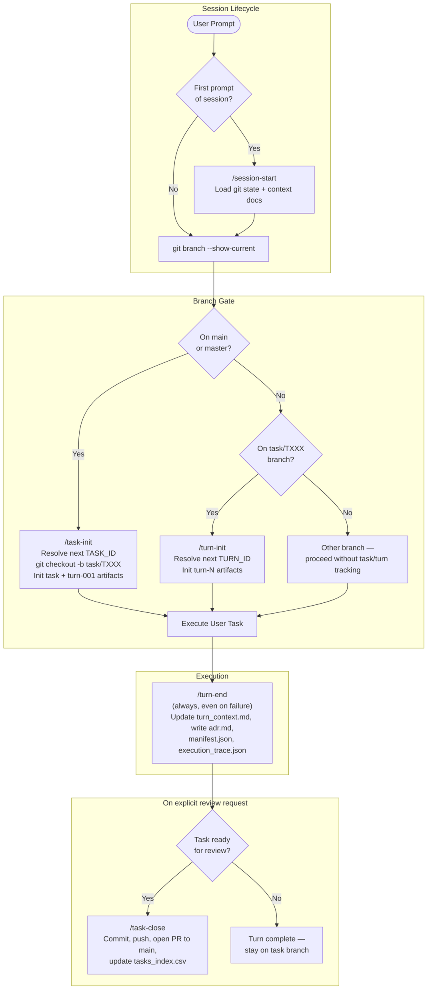

# coding-agents-config

Agentic pipeline configuration for Claude Code (and Codex). Enforces a task/turn-based workflow with provenance tracking, branch protection, and governance rules, plus the App Factory (`af-*`) skill library for DSL-driven backend generation.

## Setup

### 1. Clone the repo

```sh
git clone <repo-url> ~/coding-agents-config
```

### 2. Create symlinks (automated)

Run the setup script — it creates all symlinks and backs up any existing files:

```sh
bash scripts/setup.sh
```

<details>
<summary>Manual symlink commands</summary>

```sh
# ~/.claude/
ln -s ~/coding-agents-config/skills       ~/.claude/skills
ln -s ~/coding-agents-config/agents       ~/.claude/agents
ln -s ~/coding-agents-config/hooks        ~/.claude/hooks
ln -s ~/coding-agents-config/scripts      ~/.claude/scripts
ln -s ~/coding-agents-config/CLAUDE.md    ~/.claude/CLAUDE.md
ln -s ~/coding-agents-config/settings.json ~/.claude/settings.json

# ~/.codex/
ln -s ~/coding-agents-config/agents    ~/.codex/agents
ln -s ~/coding-agents-config/AGENTS.md ~/.codex/AGENTS.md

# repo-local
ln -s ~/coding-agents-config/CLAUDE.md ./.claude/CLAUDE.md
```

If any of these already exist, back them up first (`mv <target> <target>.bak`).

> `rules/`, `context/`, and `plugins/` are also linked into `~/.claude/` by `scripts/setup.sh` if present in this repo, but they are not currently tracked here (`plugins/` and `.claude/` are gitignored — they're local/runtime state, not shared config).
</details>

### 3. Verify

```sh
ls -la ~/.claude/skills        # should point to ~/coding-agents-config/skills
ls -la ~/.claude/agents        # should point to ~/coding-agents-config/agents
ls -la ~/.claude/hooks         # should point to ~/coding-agents-config/hooks
ls -la ~/.claude/CLAUDE.md     # should point to ~/coding-agents-config/CLAUDE.md
ls -la ~/.claude/settings.json # should point to ~/coding-agents-config/settings.json
```

## Structure

```
coding-agents-config/
├── CLAUDE.md              # Global instructions — task/turn protocol, branch rules
├── AGENTS.md              # Codex loader directive (reads ~/.claude/CLAUDE.md)
├── settings.json          # Claude Code settings (model, permissions, hooks, plugins)
├── package.json           # Root npm deps (e.g. caveman)
├── hooks/                 # Shell hooks triggered by Claude Code events
│   └── branch-guard.sh    # PreToolUse hook — auto-creates task/TXXX branch off main/master
├── agents/                # Subagent definitions
│   └── agent-architecture-planner.md
├── scripts/                # Automation scripts
│   ├── setup.sh            # Creates ~/.claude and ~/.codex symlinks
│   └── af-state.sh         # AppFactory state helper
├── skills/                 # Slash-command skills (see table below)
│   ├── session-start/      # Load repo + pipeline context at session start
│   ├── task-init/          # Create task/TXXX branch + task-001 artifacts
│   ├── turn-init/          # Create the next turn inside the active task
│   ├── turn-end/           # Finalize a turn (ADR, manifest, trace)
│   ├── task-close/         # Push task branch, open PR, return to main
│   ├── branch-guard/       # Legacy turn-branch safety net (see note below)
│   ├── af-*/                # App Factory SDLC skills (PRD → DDD → DSL → plan → build → check)
│   ├── dsl-utils/           # → dsl-model-interpreter/
│   ├── e2e-tests/           # → http-test-artifacts/
│   ├── ui-utils/            # → ui-implementation-language/
│   ├── unit-tests/          # → test-implementation-sync/
│   └── eval-labeler/        # Score/compare Response A vs B eval runs
├── .appfactory/             # Task/turn tracking, specs, prompts, memory
│   ├── tasks/                # task-XXX/ dirs, each with turns/turn-XXX/
│   ├── tasks_index.csv       # Registry of all tasks
│   ├── changelog.md
│   ├── prompts/              # Saved prompt drafts
│   ├── specs/                # (currently empty)
│   └── memory/                # (currently empty)
├── docs/                    # Reference docs (AppFactory plan, migration notes, skill summary)
├── archive/                  # Retired skills, templates, and prior README/SUMMARY
│   └── templates/             # adr/PR/manifest/commit/branch-naming templates (no longer top-level)
└── .github/                  # PR template, issue templates
```

Per-skill templates now live inside the skill that owns them (e.g. `skills/task-init/templates/`, `skills/af-be-plan/templates/`) rather than a shared top-level `templates/` directory. The original shared template set was moved to `archive/templates/` when the pipeline migrated to the App Factory (`af-*`) skill set — see `archive/README.md` and `archive/SUMMARY.md` for that history.

## Execution Flow

The agentic pipeline enforces a task/turn workflow for all coding prompts, per `CLAUDE.md`:


```mermaid
flowchart TB
    subgraph SESSION["Session Lifecycle"]
        START([User Prompt]) --> SS{First prompt<br/>of session?}
        SS -->|Yes| SESSION_START["/session-start<br/>Load git state + context docs"]
        SS -->|No| CHECK_BRANCH
        SESSION_START --> CHECK_BRANCH["git branch --show-current"]
    end

    subgraph GATE["Branch Gate"]
        CHECK_BRANCH --> IS_MAIN{On main<br/>or master?}
        IS_MAIN -->|Yes| TASK_INIT["/task-init<br/>Resolve next TASK_ID<br/>git checkout -b task/TXXX<br/>Init task + turn-001 artifacts"]
        IS_MAIN -->|No| IS_TASK{On task/TXXX<br/>branch?}
        IS_TASK -->|Yes| TURN_INIT["/turn-init<br/>Resolve next TURN_ID<br/>Init turn-N artifacts"]
        IS_TASK -->|No| WARN["Other branch —<br/>proceed without task/turn tracking"]
        TASK_INIT --> EXEC
        TURN_INIT --> EXEC
        WARN --> EXEC
    end

    subgraph EXEC_BLOCK["Execution"]
        EXEC["Execute User Task"] --> TURN_END["/turn-end<br/>(always, even on failure)<br/>Update turn_context.md, write adr.md,<br/>manifest.json, execution_trace.json"]
    end

    subgraph CLOSE["On explicit review request"]
        TURN_END --> READY{Task ready<br/>for review?}
        READY -->|Yes| TASK_CLOSE["/task-close<br/>Commit, push, open PR to main,<br/>update tasks_index.csv"]
        READY -->|No| DONE["Turn complete —<br/>stay on task branch"]
    end
```

A `PreToolUse` hook (`hooks/branch-guard.sh`) provides a safety net: if a write or `Bash` tool runs while still on `main`/`master`, it auto-creates the next `task/TXXX` branch before the tool executes.

> **Note:** the `branch-guard` *skill* (`skills/branch-guard/SKILL.md`) predates the current task/turn model and still describes creating a `turn/T<ID>` branch. The active mechanism is `task-init`'s `task/TXXX` branches plus the `hooks/branch-guard.sh` auto-create hook above; treat the skill doc as legacy pending cleanup.

### Task/Turn Artifacts

Every task (`./.appfactory/tasks/task-XXX/`) requires `task_context.md`, `task_status.json`, `task_summary.md`, `pull_request.md`.

Every turn (`.../turns/turn-XXX/`) requires `turn_context.md`, `execution_trace.json`, `adr.md`, `manifest.json`.

## Skills

### Core pipeline

| Skill | Description |
|-------|-------------|
| `session-start` | Load repo state and core pipeline context docs at the start of every session |
| `task-init` | Initialize a new `task/TXXX` branch and task + `turn-001` artifacts (run when on main/master) |
| `turn-init` | Initialize the next turn within the active task branch |
| `turn-end` | Finalize the active turn (ADR, manifest, trace) — run after every coding prompt, even on failure |
| `task-close` | Finalize the task branch, push it, and open a PR against `main` |
| `branch-guard` | Legacy turn-branch safety net (see note above); disabled from direct model invocation |

### App Factory SDLC (`af-*`)

Ordered per `docs/skill-summary.md`; orchestrated end-to-end by `af-orchestrator`.

| Skill | Description |
|-------|-------------|
| `af-orchestrator` | Orchestrates the full App Factory software development lifecycle |
| `af-project-init` | Bootstraps AppFactory project env vars, Git/GitHub setup |
| `af-be-prd-build` | Builds a business-facing backend PRD from an intake worksheet |
| `af-be-ddd-orchestrator` | Orchestrates the backend DDD build → analyze → refactor → test loop |
| `af-be-ddd-build` | Generates a human-readable backend DDD doc from an approved PRD |
| `af-be-ddd-analysis` | Audits a generated DDD doc for quality, completeness, PRD alignment |
| `af-be-ddd-refactor` | Applies targeted patches to a DDD doc per analysis findings |
| `af-be-ddd-tests` | Generates Gherkin/BDD feature files from DDD + PRD specs |
| `af-be-plan` | Generates a backend execution plan from a domain DSL + tech-stack profile |
| `af-be-ddd-dsl` | Generates a backend DSL YAML doc from the DDD document |
| `af-be-implementation` | Executes backend code generation from the plan + BDD specs into the target project |
| `af-app-check` | Audits an application for production readiness (security, DB, deploy, code quality) |
| `af-memory` | CRUD helper for `.appfactory/state.yaml` pipeline state, used by all `af-*` skills |

### Utility skills (nested under a category folder)

| Category folder | Skill | Description |
|------------------|-------|-------------|
| `dsl-utils/` | `dsl-model-interpreter` | Parse and validate `app-dsl` YAML specs before code generation |
| `e2e-tests/` | `http-test-artifacts` | Generate `.http` request files for API endpoint testing |
| `ui-utils/` | `ui-implementation-language` | Declarative YAML standard for UI pages/layouts/widgets/forms |
| `unit-tests/` | `test-implementation-sync` | Keep generated unit tests synchronized with their implementations |

### Other

| Skill | Description |
|-------|-------------|
| `eval-labeler` | Processes `Eval.md` files to label and compare Response A vs Response B model outputs |

## Hooks

| Hook | Trigger | Purpose |
|------|---------|---------|
| `branch-guard.sh` | `PreToolUse` (write tools, `Bash`) | If on `main`/`master`, auto-creates and switches to the next `task/TXXX` branch before the tool runs |

## Agents

| Agent | Purpose |
|-------|---------|
| `agent-architecture-planner` | Subagent definition under `agents/` (linked to both `~/.claude/agents` and `~/.codex/agents`) |

## Adding a new skill

Each skill lives in its own directory under `skills/` with a `SKILL.md` file (frontmatter `name` + `description`, optionally `disable-model-invocation`):

```
skills/my-skill/
├── SKILL.md
└── templates/   # optional, skill-local templates
```

Skills that group multiple related tools (like `dsl-utils/`, `e2e-tests/`) nest the actual skill one directory deeper, e.g. `skills/dsl-utils/dsl-model-interpreter/SKILL.md`.

## Archive

`archive/` holds retired skills (e.g. `schema-to-database`, `nestjs-crud-resource`, `react-form-page`, `shadcn`) and the shared `templates/` set from before the pipeline migrated to the `af-*` App Factory skill library. See `archive/README.md` and `archive/SUMMARY.md` for the taxonomy and generation flow those skills implemented.

## Syncing across machines

Since this is a standard git repo, pull on any machine to stay current:

```sh
cd ~/coding-agents-config && git pull
```

The symlinks mean changes are picked up immediately — no reinstall needed.
