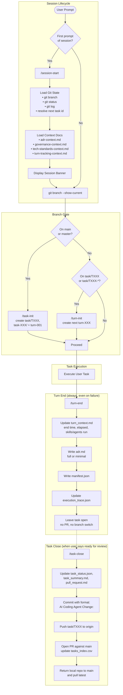

# coding-agents-config

Agentic pipeline configuration for Claude Code and Codex. Enforces a task/turn-based
workflow with provenance tracking, branch protection, and App Factory (AF) skills for
PRD → DDD → DSL → plan → implementation → test generation.

## Setup

### 1. Clone the repo

```sh
git clone <repo-url> ~/coding-agents-config
```

### 2. Create symlinks (automated)

Run the setup script — it symlinks the repo into `~/.claude` (Claude Code) and
`~/.codex` (Codex), backing up any existing files first:

```sh
bash scripts/setup.sh
```

<details>
<summary>Manual symlink commands</summary>

```sh
ln -s ~/coding-agents-config/skills ~/.claude/skills
ln -s ~/coding-agents-config/agents ~/.claude/agents
ln -s ~/coding-agents-config/hooks ~/.claude/hooks
ln -s ~/coding-agents-config/scripts ~/.claude/scripts
ln -s ~/coding-agents-config/CLAUDE.md ~/.claude/CLAUDE.md
ln -s ~/coding-agents-config/settings.json ~/.claude/settings.json

ln -s ~/coding-agents-config/agents ~/.codex/agents
ln -s ~/coding-agents-config/AGENTS.md ~/.codex/AGENTS.md
```

If any of these already exist, back them up first (`mv <target> <target>.bak`).
</details>

### 3. Verify

```sh
ls -la ~/.claude/skills        # should point to ~/coding-agents-config/skills
ls -la ~/.claude/agents        # should point to ~/coding-agents-config/agents
ls -la ~/.claude/hooks         # should point to ~/coding-agents-config/hooks
ls -la ~/.claude/CLAUDE.md     # should point to ~/coding-agents-config/CLAUDE.md
ls -la ~/.claude/settings.json # should point to ~/coding-agents-config/settings.json
```

## Structure

```
coding-agents-config/
├── CLAUDE.md              # Global instructions — task/turn protocol, branch rules
├── AGENTS.md              # Codex loader directive (points at CLAUDE.md)
├── settings.json          # Claude Code settings (model, permissions, hooks, plugins)
├── package.json           # Root dependency (caveman)
├── agents/                # Subagent definitions
│   └── agent-architecture-planner.md
├── hooks/                 # Shell hooks triggered by Claude Code events
│   └── branch-guard.sh    # PreToolUse hook — auto-creates task/TXXX branch off main/master
├── scripts/                # Automation scripts
│   ├── setup.sh           # Create ~/.claude and ~/.codex symlinks
│   └── af-state.sh        # AppFactory state.yaml helpers, sourced by af-* skills
├── skills/                 # Slash-command skills
│   ├── session-start/, task-init/, turn-init/, turn-end/, task-close/, branch-guard/
│   │                       # Pipeline lifecycle skills (see Execution Flow)
│   ├── af-*/               # App Factory: PRD → DDD → DSL → plan → implementation → tests
│   ├── dsl-utils/, e2e-tests/, ui-utils/, unit-tests/
│   │                       # Grouping dirs, each holding one nested reference/utility skill
│   └── eval-labeler/       # Model response evaluation labeling
├── docs/                   # Reference documentation (AppFactory plan, migration notes, skill summary)
├── .appfactory/             # Task/turn tracking and pipeline state
│   ├── tasks/               # task-XXX/ dirs, each with turns/turn-XXX/ and PR artifacts
│   ├── tasks_index.csv      # Task registry
│   ├── specs/                # Specifications
│   ├── prompts/              # Draft/reference prompts
│   ├── memory/                # AppFactory pipeline state (state.yaml)
│   └── changelog.md
├── archive/                 # Retired skills, legacy templates, and legacy turn artifacts
└── .github/                  # PR and issue templates
```

## Execution Flow

The agentic pipeline enforces a task/turn workflow for every coding prompt:


```mermaid
flowchart TB
    subgraph SESSION["Session Lifecycle"]
        START([User Prompt]) --> SS{First prompt<br/>of session?}
        SS -->|Yes| SESSION_START["/session-start"]
        SS -->|No| BRANCH_CHECK
        SESSION_START --> LOAD_GIT["Load Git State<br/>• git branch<br/>• git status<br/>• git log<br/>• resolve next task id"]
        LOAD_GIT --> LOAD_CTX["Load Context Docs<br/>• adr-context.md<br/>• governance-context.md<br/>• tech-standards-context.md<br/>• turn-tracking-context.md"]
        LOAD_CTX --> BANNER["Display Session Banner"]
        BANNER --> BRANCH_CHECK
    end

    subgraph BRANCH_GATE["Branch Gate"]
        BRANCH_CHECK["git branch --show-current"] --> IS_MAIN{On main<br/>or master?}
        IS_MAIN -->|Yes| TASK_INIT["/task-init<br/>create task/TXXX,<br/>task-XXX/ + turn-001"]
        IS_MAIN -->|No| IS_TASK{On task/TXXX<br/>or task/TXXX-*?}
        IS_TASK -->|Yes| TURN_INIT["/turn-init<br/>create next turn-XXX"]
        IS_TASK -->|No| PROCEED
        TASK_INIT --> PROCEED["Proceed"]
        TURN_INIT --> PROCEED
    end

    subgraph EXECUTION["Task Execution"]
        PROCEED --> EXEC["Execute User Task"]
    end

    subgraph TURN_END_PHASE["Turn End (always, even on failure)"]
        EXEC --> TURN_END["/turn-end"]
        TURN_END --> UPDATE_CTX["Update turn_context.md<br/>end time, elapsed, skills/agents run"]
        UPDATE_CTX --> WRITE_ADR["Write adr.md<br/>full or minimal"]
        WRITE_ADR --> WRITE_MANIFEST["Write manifest.json"]
        WRITE_MANIFEST --> UPDATE_TRACE["Update execution_trace.json"]
        UPDATE_TRACE --> LEAVE_OPEN["Leave task open<br/>no PR, no branch switch"]
    end

    subgraph TASK_CLOSE_PHASE["Task Close (when user says ready for review)"]
        LEAVE_OPEN -.-> TASK_CLOSE["/task-close"]
        TASK_CLOSE --> UPDATE_TASK["Update task_status.json,<br/>task_summary.md, pull_request.md"]
        UPDATE_TASK --> COMMIT["Commit with format:<br/>AI Coding Agent Change:"]
        COMMIT --> PUSH["Push task/TXXX to origin"]
        PUSH --> OPEN_PR["Open PR against main<br/>update tasks_index.csv"]
        OPEN_PR --> RETURN_MAIN["Return local repo to main<br/>and pull latest"]
    end
```

### Task/Turn Protocol Summary

| Phase | Skill | Steps | Outputs |
|-------|-------|-------|---------|
| **Session Start** | `session-start` | Load git state → resolve next task id → load 4 context docs → banner | Context loaded |
| **Task Init** | `task-init` | Run only on `main`/`master` → create `task/TXXX` → scaffold task dir + `turn-001` → append `tasks_index.csv` | Task branch, task artifacts, `turn-001` |
| **Turn Init** | `turn-init` | Run on an existing `task/TXXX` branch → resolve next turn id → scaffold `turn-XXX` → bump `totalTurns` | `turn_context.md`, `execution_trace.json` |
| **Execution** | — | Execute the user's request | Modified files |
| **Turn End** | `turn-end` | Always run, even on failure → finalize `turn_context.md` → write `adr.md` + `manifest.json` → update `execution_trace.json` | Turn artifacts complete, task stays open |
| **Task Close** | `task-close` | Run when the user signals the task is ready for review → update task artifacts → commit → push → open PR against `main` → return to `main` | Pushed branch, open PR |

## Skills

Skills live under `skills/` and are grouped by purpose. Four entries
(`dsl-utils/`, `e2e-tests/`, `ui-utils/`, `unit-tests/`) are grouping
directories that currently each hold one nested reference skill.

### Pipeline lifecycle

| Skill | Description |
|-------|-------------|
| `session-start` | Load repository state and core pipeline context. Run at the start of every session. |
| `task-init` | Initialize a new task branch (`task/TXXX`) and create task plus `turn-001` artifacts. Runs on `main`/`master`. |
| `turn-init` | Initialize the next turn within the active task branch. |
| `turn-end` | Finalize the active turn after execution — ADR, manifest, execution trace. Runs after every prompt. |
| `task-close` | Finalize the active task branch, push it, and open a pull request against `main`. |
| `branch-guard` | Check current git branch and create a turn-scoped branch if on `main`/`master`. |

### App Factory (`af-*`) — PRD → DDD → DSL → plan → implementation → tests

| Skill | Description |
|-------|-------------|
| `af-orchestrator` | Orchestrates the App Factory software development lifecycle end to end. |
| `af-project-init` | Orchestrate AppFactory project initialization by exporting required env vars and invoking the helper script. |
| `af-memory` | CRUD operations for AppFactory pipeline state management (`state.yaml` in `.appfactory/`). |
| `af-be-prd-build` | Build a business-facing backend PRD from a completed PRD intake worksheet. |
| `af-be-ddd-build` | Generate a backend Domain-Driven Design document from an approved PRD. |
| `af-be-ddd-analysis` | Audit a generated DDD spec for quality, completeness, and PRD alignment. |
| `af-be-ddd-refactor` | Refactor a DDD spec using `af-be-ddd-analysis` findings. |
| `af-be-ddd-orchestrator` | Orchestrate the backend DDD workflow through build, analyze, refactor-loop, and test phases. |
| `af-be-ddd-dsl` | Generate a backend application DSL YAML document from a DDD document. |
| `af-be-ddd-tests` | Generate Gherkin-style BDD feature files from DDD and PRD specifications. |
| `af-be-plan` | Generate a backend execution plan from a domain DSL and a tech stack profile. |
| `af-be-implementation` | Execute backend code generation from the execution plan and BDD feature specs into the target project. |
| `af-app-check` | Audit an application for production readiness (security, database, deployment, code quality). |

### Reference / utility skills

| Skill | Description |
|-------|-------------|
| `dsl-utils/dsl-model-interpreter` | Parse and validate `app-dsl` YAML specifications before code generation. |
| `e2e-tests/http-test-artifacts` | Generate `.http` request files for API endpoint testing from `app-dsl/backend/` specs. |
| `ui-utils/ui-implementation-language` | Declarative YAML standard for UI pages, layouts, widgets, forms, and state bindings. |
| `unit-tests/test-implementation-sync` | Keep generated unit tests synchronized with actual service/DTO implementations. |
| `eval-labeler` | Process `Eval.md` files to label and compare two model responses (Response A vs B) for coding tasks. |

## Agents

| Agent | Description |
|-------|-------------|
| `agent-architecture-planner` | Reads PRD, DDD, DSL, and repo structure to produce architecture decisions, module maps, task plans, and review artifacts for downstream coding agents. |

## Hooks

| Hook | Trigger | Purpose |
|------|---------|---------|
| `branch-guard.sh` | `PreToolUse(Bash)` | Auto-create `task/TXXX` off the next unused task id when a write/bash tool runs on `main`/`master`. |

## Adding a new skill

Each skill lives in its own directory under `skills/` with a `SKILL.md` file:

```
skills/my-skill/
└── SKILL.md
```

## Syncing across machines

Since this is a standard git repo, pull on any machine to stay current:

```sh
cd ~/coding-agents-config && git pull
```

The symlinks mean changes are picked up immediately — no reinstall needed.
