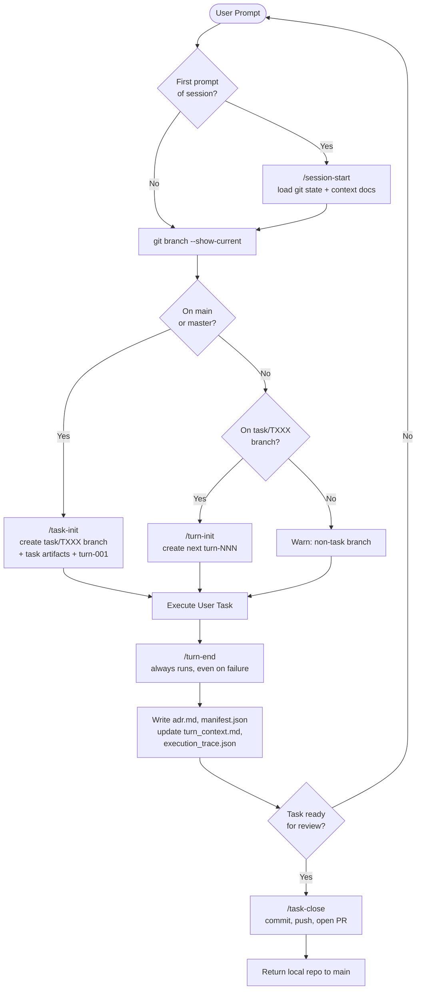

# coding-agents-config

Agentic pipeline configuration for Claude Code and Codex. Provides the **App
Factory** skill library (PRD → DDD → DSL → plan → implementation) plus a
task/turn governance layer that enforces branch protection, provenance
tracking, and ADR/PR artifacts for every coding session.

## Setup

### 1. Clone the repo

```sh
git clone <repo-url> ~/coding-agents-config
```

### 2. Create symlinks (automated)

Run the setup script — it creates all symlinks and backs up any existing files:

```sh
bash scripts/setup.sh
```

<details>
<summary>Manual symlink commands</summary>

```sh
# ~/.claude/
ln -s ~/coding-agents-config/skills       ~/.claude/skills
ln -s ~/coding-agents-config/agents       ~/.claude/agents
ln -s ~/coding-agents-config/hooks        ~/.claude/hooks
ln -s ~/coding-agents-config/scripts      ~/.claude/scripts
ln -s ~/coding-agents-config/CLAUDE.md    ~/.claude/CLAUDE.md
ln -s ~/coding-agents-config/settings.json ~/.claude/settings.json

# ~/.codex/
ln -s ~/coding-agents-config/agents    ~/.codex/agents
ln -s ~/coding-agents-config/AGENTS.md ~/.codex/AGENTS.md

# repo-local ./.claude/
ln -s ~/coding-agents-config/CLAUDE.md ./.claude/CLAUDE.md
```

If any of these already exist, back them up first (`mv <target> <target>.bak`).
</details>

`scripts/setup.sh` also links `rules/`, `context/`, and `plugins/` into
`~/.claude/` if those directories exist in the repo — they're reserved
extension points and not present by default.

### 3. Verify

```sh
ls -la ~/.claude/skills        # should point to ~/coding-agents-config/skills
ls -la ~/.claude/hooks         # should point to ~/coding-agents-config/hooks
ls -la ~/.claude/CLAUDE.md     # should point to ~/coding-agents-config/CLAUDE.md
ls -la ~/.claude/settings.json # should point to ~/coding-agents-config/settings.json
ls -la ~/.codex/AGENTS.md      # should point to ~/coding-agents-config/AGENTS.md
```

## Structure

```
coding-agents-config/
├── CLAUDE.md              # Global instructions — task/turn protocol, branch rules
├── AGENTS.md              # Codex loader directive (reads ~/.claude/CLAUDE.md)
├── settings.json           # Claude Code settings (model, permissions, hooks, plugins)
├── package.json             # npm dependency (caveman plugin)
├── hooks/
│   └── branch-guard.sh     # PreToolUse(Bash) hook — auto-creates task/TXXX off main/master
├── scripts/
│   ├── setup.sh             # Creates the symlinks described above
│   └── af-state.sh          # Shared helpers for reading/writing .appfactory/memory/state.yaml
├── agents/
│   └── agent-architecture-planner.md
├── skills/                  # Slash-command skills (see below)
│   ├── .system/              # Meta-skills (skill-creator, skill-installer, plugin-creator, ...)
│   ├── .nestjs/               # NestJS/Prisma code-generation skills
│   ├── session-start/         # Load git state + pipeline context at session start
│   ├── task-init/              # Create task/TXXX branch + task/turn-001 artifacts
│   ├── turn-init/               # Create the next turn within the active task
│   ├── turn-end/                 # Finalize a turn (ADR, manifest, execution trace)
│   ├── task-close/                # Push task branch and open PR against main
│   ├── branch-guard/               # Legacy manual branch guard (superseded by hooks/branch-guard.sh)
│   ├── af-*/                        # App Factory PRD/DDD/DSL/plan/implementation skills
│   ├── dsl-utils/, e2e-tests/,       # Utility skill groups (one nested skill each)
│   │   ui-utils/, unit-tests/
│   └── eval-labeler/                 # Label/compare model responses for coding evals
├── .appfactory/               # Task/turn tracking, specs, prompts, memory
│   ├── tasks/                   # task-XXX/ directories (task + turn artifacts)
│   ├── tasks_index.csv           # Registry of all tasks
│   ├── specs/                     # Specifications
│   ├── prompts/                    # Prompt library
│   ├── memory/                      # state.yaml pipeline memory
│   └── changelog.md
├── archive/                    # Retired skills/templates kept for reference (unlinked)
├── docs/                       # Reference docs (AppFactory plan, migration analysis, ...)
└── .github/
    ├── PULL_REQUEST_TEMPLATE.md
    └── ISSUE_TEMPLATE/
```

Per-skill templates (ADR, PRD, DDD, DSL, execution-plan, Gherkin feature,
turn/task context, etc.) live inside each skill's own `templates/`
subdirectory rather than a shared top-level `templates/` folder — e.g.
`skills/task-init/templates/`, `skills/af-be-ddd-build/templates/`.

## Execution Flow

The pipeline enforces a task/turn workflow: a **task** is the branch-scoped
unit of work that becomes one pull request; a **turn** is one AI execution
cycle within that task.


```mermaid
flowchart TB
    START([User Prompt]) --> SS{First prompt<br/>of session?}
    SS -->|Yes| SESSION_START["/session-start<br/>load git state + context docs"]
    SS -->|No| CHECK_BRANCH
    SESSION_START --> CHECK_BRANCH["git branch --show-current"]

    CHECK_BRANCH --> IS_MAIN{On main<br/>or master?}
    IS_MAIN -->|Yes| TASK_INIT["/task-init<br/>create task/TXXX branch<br/>+ task artifacts + turn-001"]
    IS_MAIN -->|No| IS_TASK{On task/TXXX<br/>branch?}
    IS_TASK -->|Yes| TURN_INIT["/turn-init<br/>create next turn-NNN"]
    IS_TASK -->|No| WARN["Warn: non-task branch"]

    TASK_INIT --> EXEC
    TURN_INIT --> EXEC
    WARN --> EXEC

    EXEC["Execute User Task"] --> TURN_END["/turn-end<br/>always runs, even on failure"]
    TURN_END --> ARTIFACTS["Write adr.md, manifest.json<br/>update turn_context.md,<br/>execution_trace.json"]
    ARTIFACTS --> READY{Task ready<br/>for review?}
    READY -->|No| START
    READY -->|Yes| TASK_CLOSE["/task-close<br/>commit, push, open PR"]
    TASK_CLOSE --> BACK["Return local repo to main"]
```

A `PreToolUse(Bash)` hook (`hooks/branch-guard.sh`) is a safety net: if a
tool call is about to run on `main`/`master`, it auto-creates the next
`task/TXXX` branch before the call proceeds.

### Turn Protocol Summary

| Phase | Skill | Trigger | Outputs |
|-------|-------|---------|---------|
| Session start | `session-start` | First prompt of session | Git state + context loaded |
| Task init | `task-init` | Current branch is `main`/`master` | `task/TXXX` branch, task artifacts, turn-001 |
| Turn init | `turn-init` | Current branch is `task/TXXX` | Next `turn-NNN` directory + artifacts |
| Execution | — | Every coding prompt | Modified files |
| Turn end | `turn-end` | After every coding prompt, even on failure | `adr.md`, `manifest.json`, updated trace |
| Task close | `task-close` | User indicates task is ready for review | Commit, push, PR against `main` |

## Skills

### Pipeline / governance

| Skill | Description |
|-------|-------------|
| `session-start` | Load repository git state and core pipeline context at session start |
| `task-init` | Create a `task/TXXX` branch and initialize task + turn-001 artifacts |
| `turn-init` | Initialize the next turn within the active task branch |
| `turn-end` | Finalize the active turn (ADR, manifest, execution trace) |
| `task-close` | Finalize the task, push the branch, and open a PR against `main` |
| `branch-guard` | Legacy manual branch guard (`turn/T*` model); superseded by `hooks/branch-guard.sh` |

### App Factory (`af-*`)

| Skill | Description |
|-------|-------------|
| `af-orchestrator` | Orchestrates the App Factory software development lifecycle |
| `af-project-init` | Bootstraps env vars and project scaffolding for a new AppFactory project |
| `af-memory` | CRUD for `.appfactory/memory/state.yaml` pipeline state |
| `af-be-prd-build` | Build a backend PRD from an intake worksheet |
| `af-be-ddd-orchestrator` | Orchestrate the backend DDD build → analyze → refactor → test loop |
| `af-be-ddd-build` | Generate a backend DDD document from an approved PRD |
| `af-be-ddd-analysis` | Audit a generated DDD document for completeness and PRD alignment |
| `af-be-ddd-refactor` | Apply `af-be-ddd-analysis` findings back into the DDD document |
| `af-be-ddd-dsl` | Generate a backend domain DSL YAML from the DDD document |
| `af-be-ddd-tests` | Generate Gherkin/BDD feature specs from the DDD + PRD |
| `af-be-plan` | Generate a backend execution plan from the domain DSL + tech-stack profile |
| `af-be-implementation` | Generate backend domain code from the execution plan + BDD specs |
| `af-app-check` | Audit an application for production readiness (security, DB, deploy, code quality) |

### Utilities

| Skill group | Nested skill | Description |
|-------------|--------------|-------------|
| `dsl-utils` | `dsl-model-interpreter` | Parse and validate app-dsl YAML specifications |
| `e2e-tests` | `http-test-artifacts` | Generate `.http` request files for API endpoint testing |
| `ui-utils` | `ui-implementation-language` | Declarative YAML standard for UI pages/widgets/forms |
| `unit-tests` | `test-implementation-sync` | Keep unit tests synchronized with implementation code |
| `eval-labeler` | — | Label/compare model responses (Response A vs B) for coding evals |

### Meta-skills (`.system/`) and code generators (`.nestjs/`)

Hidden namespaces holding Codex meta-skills (`skill-creator`, `skill-installer`,
`plugin-creator`, `imagegen`, `openai-docs`) and NestJS/Prisma code
generators (`nestjs-prisma-resource`, `nestjs-crud-resource`,
`nestjs-observability`, `app-from-dsl`, `field-mapper-generator`, ...).

## Hooks

| Hook | Trigger | Purpose |
|------|---------|---------|
| `branch-guard.sh` | `PreToolUse(Bash)` | Auto-create the next `task/TXXX` branch if a tool call is about to run on `main`/`master` |

## Adding a new skill

Each skill lives in its own directory under `skills/` with a `SKILL.md` file:

```
skills/my-skill/
└── SKILL.md
```

The `.system/skill-creator` meta-skill can guide you through creating one — invoke it from Claude Code.

## Syncing across machines

Since this is a standard git repo, pull on any machine to stay current:

```sh
cd ~/coding-agents-config && git pull
```

The symlinks mean changes are picked up immediately — no reinstall needed.
