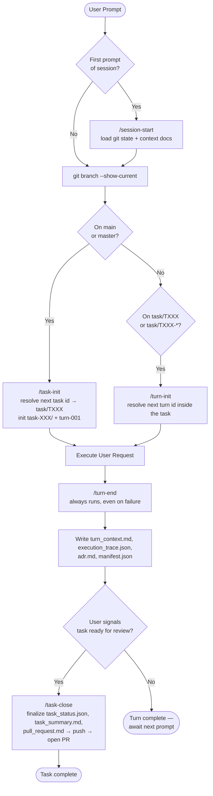

# coding-agents-config

Agentic pipeline configuration for Claude Code. Enforces a task/turn-based workflow with provenance tracking, branch protection, and governance rules.

## Setup

### 1. Clone the repo

```sh
git clone <repo-url> ~/coding-agents-config
```

### 2. Create symlinks (automated)

Run the setup script — it creates all symlinks and backs up any existing files:

```sh
bash scripts/setup.sh
```

The script links into three places:

- `~/.claude/` (Claude Code): `skills`, `agents`, `rules`, `hooks`, `context`, `scripts`, `plugins`, `CLAUDE.md`, `settings.json`
- `~/.codex/` (Codex): `agents`, `AGENTS.md`
- `./.claude/` (repo-local): `CLAUDE.md`

Only items that currently exist in this repo are meaningful targets — `rules`, `context`, and `plugins` are reserved names the script will happily link once those directories are added.

<details>
<summary>Manual symlink commands</summary>

```sh
ln -s ~/coding-agents-config/skills ~/.claude/skills
ln -s ~/coding-agents-config/agents ~/.claude/agents
ln -s ~/coding-agents-config/hooks ~/.claude/hooks
ln -s ~/coding-agents-config/scripts ~/.claude/scripts
ln -s ~/coding-agents-config/CLAUDE.md ~/.claude/CLAUDE.md
ln -s ~/coding-agents-config/settings.json ~/.claude/settings.json

ln -s ~/coding-agents-config/agents ~/.codex/agents
ln -s ~/coding-agents-config/AGENTS.md ~/.codex/AGENTS.md
```

If any of these already exist, back them up first (`mv <target> <target>.bak`).
</details>

### 3. Verify

```sh
ls -la ~/.claude/skills        # should point to ~/coding-agents-config/skills
ls -la ~/.claude/agents        # should point to ~/coding-agents-config/agents
ls -la ~/.claude/hooks         # should point to ~/coding-agents-config/hooks
ls -la ~/.claude/scripts       # should point to ~/coding-agents-config/scripts
ls -la ~/.claude/CLAUDE.md     # should point to ~/coding-agents-config/CLAUDE.md
ls -la ~/.claude/settings.json # should point to ~/coding-agents-config/settings.json
```

## Structure

```
coding-agents-config/
├── CLAUDE.md           # Global instructions — task/turn protocol, branch rules
├── AGENTS.md           # Codex loader directive (points at ~/.claude/CLAUDE.md)
├── settings.json       # Claude Code settings (model, permissions, hooks, plugins)
├── package.json        # Declares the `caveman` plugin dependency
├── agents/             # Subagent definitions
│   └── agent-architecture-planner.md
├── hooks/              # Shell hooks triggered by Claude Code events
│   └── branch-guard.sh # PreToolUse(Bash) hook — blocks edits on main/master
├── skills/             # Slash-command skills (see table below)
│   ├── .system/        # Meta-skills: skill-creator, skill-installer, plugin-creator, imagegen, openai-docs
│   ├── session-start/  # Initialize session context
│   ├── task-init/      # Create task branch + turn-001 (run from main/master)
│   ├── turn-init/      # Create the next turn inside a task branch
│   ├── turn-end/       # Finalize turn with ADR, manifest, execution trace
│   ├── task-close/     # Finalize task, push branch, open PR
│   ├── branch-guard/   # Legacy turn/T{ID} branch fallback
│   ├── af-*/           # App Factory PRD → DDD → DSL → plan → build pipeline (13 skills)
│   ├── dsl-utils/      # Container dir — nested dsl-model-interpreter skill
│   ├── e2e-tests/      # Container dir — nested http-test-artifacts skill
│   ├── ui-utils/       # Container dir — nested ui-implementation-language skill
│   ├── unit-tests/     # Container dir — nested test-implementation-sync skill
│   └── eval-labeler/   # Label/score model-response evaluation runs
├── scripts/            # Automation scripts
│   ├── setup.sh        # Creates the symlinks described above
│   └── af-state.sh     # Helpers for reading/writing .appfactory/memory/state.yaml
├── .appfactory/        # Task/turn tracking and specs
│   ├── tasks/          # task-XXX/ directories with turns/turn-XXX/ artifacts
│   ├── tasks_index.csv # Registry of all tasks and their status
│   ├── specs/          # Specifications
│   ├── prompts/        # Prompt templates
│   └── memory/         # Project/pipeline state (state.yaml)
├── docs/               # Reference documentation (App Factory design notes)
├── .github/            # Issue templates and PR template
└── archive/            # Superseded skill library kept for reference
```

## Execution Flow

The pipeline enforces a task/turn workflow, defined in `CLAUDE.md`, for all coding prompts. A **task** is the branch-scoped unit of work that becomes one pull request (`task/TXXX`); a **turn** is one AI execution cycle within that task branch (`turns/turn-XXX/`).


```mermaid
flowchart TB
    START([User Prompt]) --> FIRST{First prompt<br/>of session?}
    FIRST -->|Yes| SESSION_START["/session-start<br/>load git state + context docs"]
    FIRST -->|No| CHECK_BRANCH
    SESSION_START --> CHECK_BRANCH["git branch --show-current"]

    CHECK_BRANCH --> IS_MAIN{On main<br/>or master?}
    IS_MAIN -->|Yes| TASK_INIT["/task-init<br/>resolve next task id → task/TXXX<br/>init task-XXX/ + turn-001"]
    IS_MAIN -->|No| IS_TASK{On task/TXXX<br/>or task/TXXX-*?}
    IS_TASK -->|Yes| TURN_INIT["/turn-init<br/>resolve next turn id inside the task"]

    TASK_INIT --> EXEC["Execute User Request"]
    TURN_INIT --> EXEC

    EXEC --> TURN_END["/turn-end<br/>always runs, even on failure"]
    TURN_END --> WRITE_ARTIFACTS["Write turn_context.md, execution_trace.json,<br/>adr.md, manifest.json"]
    WRITE_ARTIFACTS --> READY{User signals<br/>task ready for review?}
    READY -->|Yes| TASK_CLOSE["/task-close<br/>finalize task_status.json, task_summary.md,<br/>pull_request.md → push → open PR"]
    READY -->|No| DONE(["Turn complete —<br/>await next prompt"])
    TASK_CLOSE --> DONE2(["Task complete"])
```

### Task/Turn Protocol Summary

| Phase | When | Outputs |
|-------|------|---------|
| **Session Start** | First prompt of the session | Git state + context docs loaded |
| **Task Init** | Current branch is `main`/`master` | `task/TXXX` branch, `task-XXX/` dir, `turn-001` |
| **Turn Init** | Current branch is `task/TXXX[-*]` | Next `turn-XXX/` dir inside the active task |
| **Execution** | Every prompt | Modified files |
| **Turn End** | After every prompt, even on failure | `turn_context.md`, `execution_trace.json`, `adr.md`, `manifest.json` |
| **Task Close** | User signals the task is ready for review | `task_status.json`, `task_summary.md`, `pull_request.md`, pushed branch, opened PR |

The hard gate: code is never written while on `main`/`master` — `hooks/branch-guard.sh` (see below) enforces this even if `/task-init` is skipped.

## Skills (24, plus 5 meta-skills under `.system/`)

| Category | Skill | Description |
|----------|-------|-------------|
| **Session/Task/Turn** | `session-start` | Load repo state and pipeline context at session start |
| | `task-init` | Create task branch + turn-001 (run from main/master) |
| | `turn-init` | Create the next turn inside the active task branch |
| | `turn-end` | Finalize the active turn (ADR, manifest, execution trace) |
| | `task-close` | Finalize task, push branch, open PR against main |
| | `branch-guard` | Legacy fallback — creates a `turn/T{ID}` branch if on main/master |
| **App Factory (af-*)** | `af-orchestrator` | Orchestrate the App Factory SDLC end to end |
| | `af-project-init` | Export required env vars and bootstrap a new App Factory project |
| | `af-memory` | CRUD operations on `.appfactory/memory/state.yaml` |
| | `af-app-check` | Audit an application for production readiness |
| | `af-be-prd-build` | Build a backend PRD from an intake worksheet |
| | `af-be-ddd-build` | Generate a backend DDD document from an approved PRD |
| | `af-be-ddd-analysis` | Audit a DDD document for quality, completeness, PRD alignment |
| | `af-be-ddd-refactor` | Patch a DDD document using `af-be-ddd-analysis` findings |
| | `af-be-ddd-orchestrator` | Orchestrate the DDD build → analyze → refactor → test loop |
| | `af-be-ddd-dsl` | Generate a backend DSL YAML from a DDD document |
| | `af-be-ddd-tests` | Generate Gherkin/BDD scenarios from DDD + PRD |
| | `af-be-plan` | Generate a backend execution plan from DSL + tech stack profile |
| | `af-be-implementation` | Generate backend domain code from the execution plan |
| **Utility (container dirs)** | `dsl-utils/dsl-model-interpreter` | Parse and validate app-dsl YAML specifications |
| | `e2e-tests/http-test-artifacts` | Generate `.http` request files for API endpoint testing |
| | `ui-utils/ui-implementation-language` | Declarative YAML standard for UI pages/widgets/forms |
| | `unit-tests/test-implementation-sync` | Keep generated unit tests in sync with implementations |
| **Evaluation** | `eval-labeler` | Label/score model-response evaluation runs |

### Meta-Skills (`.system/`)

| Skill | Description |
|-------|-------------|
| `skill-creator` | Guide for creating or updating skills |
| `skill-installer` | Install skills into `$CODEX_HOME/skills` from a curated list or repo |
| `plugin-creator` | Scaffold Codex plugin directories and marketplace entries |
| `imagegen` | Generate or edit raster images |
| `openai-docs` | Look up official OpenAI API/product documentation |

## Turn/Task Artifacts

Rather than a shared `templates/` directory, each lifecycle skill (`task-init`, `turn-init`, `turn-end`, `task-close`) writes its own artifacts directly. A turn produces `turn_context.md`, `execution_trace.json`, `adr.md`, and `manifest.json`; a task produces `task_context.md`, `task_status.json`, `task_summary.md`, and `pull_request.md` (see `CLAUDE.md` for the full spec). Older, now-superseded template files (`adr_template.md`, `pull_request_template.md`, `manifest.schema.json`, etc.) live under `archive/templates/` for reference.

## Hooks

| Hook | Trigger | Purpose |
|------|---------|---------|
| `branch-guard.sh` | `PreToolUse` (Bash) | Auto-create `task/TXXX` and switch to it if still on `main`/`master` |

## Adding a new skill

Each skill lives in its own directory under `skills/` with a `SKILL.md` file:

```
skills/my-skill/
└── SKILL.md
```

The `.system/skill-creator` meta-skill can guide you through creating one — invoke it from Claude Code.

## Syncing across machines

Since this is a standard git repo, pull on any machine to stay current:

```sh
cd ~/coding-agents-config && git pull
```

The symlinks mean changes are picked up immediately — no reinstall needed.
