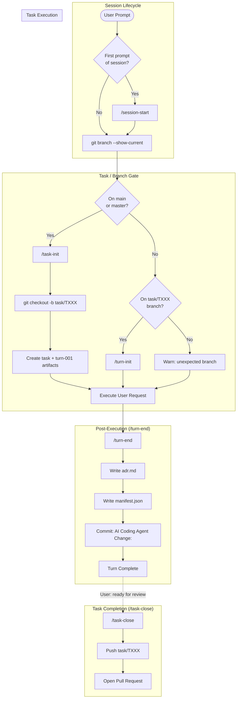

# coding-agents-config

Agentic pipeline configuration for Claude Code. Enforces a task/turn-based workflow with provenance tracking, branch protection, and governance rules. Powers the App Factory AI-augmented software development lifecycle.

## Setup

### 1. Clone the repo

```sh
git clone <repo-url> ~/coding-agents-config
```

### 2. Create symlinks (automated)

Run the setup script — it creates all symlinks and backs up any existing files:

```sh
bash scripts/setup.sh
```

<details>
<summary>What gets linked</summary>

The script symlinks these items into `~/.claude/`:

| Item | Purpose |
|------|---------|
| `skills` | Slash-command skills |
| `agents` | Agent specification documents |
| `hooks` | Shell hooks |
| `scripts` | Automation scripts |
| `CLAUDE.md` | Global instructions |
| `settings.json` | Claude Code settings |

It also symlinks `agents/` and `AGENTS.md` into `~/.codex/`, and links `CLAUDE.md` into the repo-local `.claude/`.

If any target already exists, it is backed up to `<target>.bak` before the symlink is created.
</details>

### 3. Verify

```sh
ls -la ~/.claude/skills        # should point to ~/coding-agents-config/skills
ls -la ~/.claude/hooks         # should point to ~/coding-agents-config/hooks
ls -la ~/.claude/agents        # should point to ~/coding-agents-config/agents
ls -la ~/.claude/CLAUDE.md     # should point to ~/coding-agents-config/CLAUDE.md
ls -la ~/.claude/settings.json # should point to ~/coding-agents-config/settings.json
```

## Structure

```
coding-agents-config/
├── CLAUDE.md           # Global instructions — task/turn protocol, branch rules
├── AGENTS.md           # Agent loader directive
├── settings.json       # Claude Code settings (model, permissions, env vars)
├── agents/             # Agent specification documents
│   └── agent-architecture-planner.md
├── hooks/              # Shell hooks triggered by Claude Code events
│   └── branch-guard.sh # Prevents edits on main/master
├── skills/             # Slash-command skills
│   ├── .system/        # Meta-skills (skill-creator, skill-installer, plugin-creator)
│   ├── .nestjs/        # NestJS scaffolding skills
│   ├── session-start/  # Load repository and pipeline context
│   ├── task-init/      # Create task branch and artifacts
│   ├── task-close/     # Finalize task and open pull request
│   ├── turn-init/      # Create turn directory and artifacts
│   ├── turn-end/       # Finalize turn with ADR, manifest, commit
│   ├── branch-guard/   # Create task branch if on main/master
│   ├── af-*/           # App Factory pipeline skills
│   ├── dsl-utils/      # DSL parsing utilities
│   ├── ui-utils/       # UI language utilities
│   ├── unit-tests/     # Unit test sync utilities
│   └── e2e-tests/      # E2E test artifact generation
├── scripts/            # Automation scripts
│   ├── setup.sh        # Symlink installer
│   └── af-state.sh     # App Factory state helper
├── docs/               # Reference documentation
├── archive/            # Archived items
└── .appfactory/        # Task/turn tracking and specs
    ├── tasks/          # Task branches with turns
    ├── specs/          # Specifications
    ├── prompts/        # Prompt templates
    └── memory/         # Project memory
```

## Execution Flow

The agentic pipeline enforces a task/turn-based workflow for all coding tasks:


```mermaid
flowchart TB
    subgraph SESSION["Session Lifecycle"]
        START([User Prompt]) --> SS{First prompt<br/>of session?}
        SS -->|Yes| SESSION_START["/session-start"]
        SS -->|No| CHECK_BRANCH
        SESSION_START --> CHECK_BRANCH["git branch --show-current"]
    end

    subgraph TASK_GATE["Task / Branch Gate"]
        CHECK_BRANCH --> IS_MAIN{On main<br/>or master?}
        IS_MAIN -->|Yes| TASK_INIT["/task-init"]
        TASK_INIT --> CREATE_TASK_BRANCH["git checkout -b task/TXXX"]
        CREATE_TASK_BRANCH --> INIT_ARTIFACTS["Create task + turn-001 artifacts"]
        IS_MAIN -->|No| IS_TASK{On task/TXXX<br/>branch?}
        IS_TASK -->|Yes| TURN_INIT["/turn-init"]
        IS_TASK -->|No| WARN["Warn: unexpected branch"]
        INIT_ARTIFACTS --> EXECUTE
        TURN_INIT --> EXECUTE
        WARN --> EXECUTE
    end

    subgraph EXECUTION["Task Execution"]
        EXECUTE["Execute User Request"]
    end

    subgraph POST_EXEC["Post-Execution (/turn-end)"]
        EXECUTE --> TURN_END["/turn-end"]
        TURN_END --> WRITE_ADR["Write adr.md"]
        WRITE_ADR --> WRITE_MANIFEST["Write manifest.json"]
        WRITE_MANIFEST --> COMMIT["Commit: AI Coding Agent Change:"]
        COMMIT --> COMPLETE["Turn Complete"]
    end

    subgraph TASK_CLOSE["Task Completion (/task-close)"]
        COMPLETE -.->|"User: ready for review"| TASK_CLOSE_SKILL["/task-close"]
        TASK_CLOSE_SKILL --> PUSH["Push task/TXXX"]
        PUSH --> PR["Open Pull Request"]
    end
```

### Task / Turn Protocol Summary

| Phase | Trigger | Steps | Outputs |
|-------|---------|-------|---------|
| **Session Start** | First prompt | Load git state + context docs → banner | Context loaded |
| **Task Init** | On main/master | Create `task/TXXX` branch → task artifacts + turn-001 | Branch, task dir |
| **Turn Init** | On task branch | Resolve next turn ID → create turn dir + artifacts | `turn_context.md`, `execution_trace.json` |
| **Execution** | Every coding prompt | Execute request | Modified files |
| **Turn End** | After every prompt | Update context → ADR → manifest → commit | 4 artifacts, commit |
| **Task Close** | User requests review | Push branch → open PR | Pull request |

### Artifact Locations

```
.appfactory/
  tasks/
    task-XXX/
      task_context.md
      task_status.json
      task_summary.md
      pull_request.md
      turns/
        turn-XXX/
          turn_context.md
          execution_trace.json
          adr.md
          manifest.json
```

## Skills

### Lifecycle Skills

| Skill | Description |
|-------|-------------|
| `session-start` | Load repository state and core pipeline context at session start |
| `task-init` | Initialize a new task branch and create task + turn-001 artifacts |
| `task-close` | Finalize the active task branch, push it, and open a pull request |
| `turn-init` | Initialize the next turn within the active task branch |
| `turn-end` | Finalize the active turn — write ADR, manifest, and commit |
| `branch-guard` | Create a task branch if on main/master |

### App Factory — Orchestration

| Skill | Description |
|-------|-------------|
| `af-orchestrator` | Orchestrate the full App Factory software development lifecycle |
| `af-be-ddd-orchestrator` | Orchestrate backend DDD workflow: build → analyze → refactor loop → tests |
| `af-project-init` | Initialize an App Factory project and export required environment variables |

### App Factory — DDD Pipeline

| Skill | Description |
|-------|-------------|
| `af-be-prd-build` | Build a business-facing PRD from a completed PRD worksheet |
| `af-be-ddd-build` | Generate a backend DDD document from an approved PRD |
| `af-be-ddd-analysis` | Analyze a DDD spec for quality, completeness, and PRD alignment |
| `af-be-ddd-refactor` | Refactor a DDD spec using findings from `af-be-ddd-analysis` |
| `af-be-ddd-dsl` | Generate a backend DSL YAML from a human-readable DDD document |
| `af-be-ddd-tests` | Generate Gherkin BDD scenarios from DDD and PRD specs |

### App Factory — Backend

| Skill | Description |
|-------|-------------|
| `af-be-plan` | Generate a backend execution plan from a domain DSL and tech stack profile |
| `af-be-implementation` | Execute backend code generation from a DSL and tech stack implementation |
| `af-app-check` | Audit an application for production readiness across security, DB, and code quality |

### App Factory — Utilities

| Skill | Description |
|-------|-------------|
| `af-memory` | CRUD operations for App Factory pipeline state in `.appfactory/state.yaml` |
| `dsl-utils/dsl-model-interpreter` | Parse and validate app-dsl YAML specifications |
| `ui-utils/ui-implementation-language` | Declarative YAML language for defining UI pages, forms, and API interactions |
| `unit-tests/test-implementation-sync` | Ensure unit tests stay synchronized with service/DTO implementations |
| `e2e-tests/http-test-artifacts` | Generate `.http` files for REST client testing of backend endpoints |
| `eval-labeler` | Process Eval.md files to generate structured evaluation results |

### NestJS Skills (`.nestjs`)

| Skill | Description |
|-------|-------------|
| `app-from-dsl` | Generate a NestJS application from a DSL YAML |
| `nestjs-crud-resource` | Generate a NestJS CRUD resource |
| `nestjs-prisma-resource` | Generate a NestJS CRUD resource with Prisma persistence |
| `nestjs-customer-crud-scaffold` | Scaffold a NestJS customer CRUD application |
| `nestjs-observability` | Add observability (logging, metrics, tracing) to a NestJS app |
| `field-mapper-generator` | Generate field mapper utilities |
| `prisma/prisma-guidelines` | Prisma usage guidelines and best practices |
| `prisma/prisma-persistence` | Generate Prisma persistence layer from a domain model |

### Meta-Skills (`.system`)

| Skill | Description |
|-------|-------------|
| `skill-creator` | Scaffold a new skill with SKILL.md |
| `skill-installer` | Install skills from marketplaces |
| `plugin-creator` | Create Claude Code plugins |
| `imagegen` | AI image generation utilities |
| `openai-docs` | OpenAI documentation reference |

## Hooks

| Hook | Trigger | Purpose |
|------|---------|---------|
| `branch-guard.sh` | PreToolUse(Edit) | Block file edits on main/master |

## Adding a new skill

Each skill lives in its own directory under `skills/` with a `SKILL.md` file:

```
skills/my-skill/
└── SKILL.md
```

Use the `.system/skill-creator` meta-skill to scaffold one from Claude Code:

```
/skill-creator
```

## Syncing across machines

Since this is a standard git repo, pull on any machine to stay current:

```sh
cd ~/coding-agents-config && git pull
```

The symlinks mean changes are picked up immediately — no reinstall needed.
