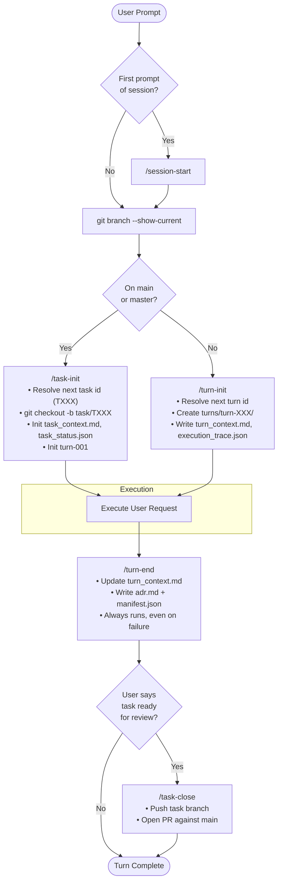

# coding-agents-config

Agentic pipeline configuration for Claude Code. Enforces turn-based workflow with provenance tracking, branch protection, and governance rules.

## Setup

### 1. Clone the repo

```sh
git clone <repo-url> ~/coding-agents-config
```

### 2. Create symlinks (automated)

Run the setup script — it creates all symlinks and backs up any existing files:

```sh
bash scripts/setup.sh
```

<details>
<summary>Manual symlink commands</summary>

```sh
ln -s ~/coding-agents-config/skills ~/.claude/skills
ln -s ~/coding-agents-config/hooks ~/.claude/hooks
ln -s ~/coding-agents-config/agents ~/.claude/agents
ln -s ~/coding-agents-config/scripts ~/.claude/scripts
ln -s ~/coding-agents-config/CLAUDE.md ~/.claude/CLAUDE.md
ln -s ~/coding-agents-config/settings.json ~/.claude/settings.json
```

If any of these already exist, back them up first (`mv <target> <target>.bak`).
</details>

### 3. Verify

```sh
ls -la ~/.claude/skills        # should point to ~/coding-agents-config/skills
ls -la ~/.claude/hooks         # should point to ~/coding-agents-config/hooks
ls -la ~/.claude/agents        # should point to ~/coding-agents-config/agents
ls -la ~/.claude/CLAUDE.md     # should point to ~/coding-agents-config/CLAUDE.md
ls -la ~/.claude/settings.json # should point to ~/coding-agents-config/settings.json
```

## Structure

```
coding-agents-config/
├── CLAUDE.md           # Global instructions — task/turn protocol, branch rules
├── AGENTS.md           # Agent loader directive
├── settings.json       # Claude Code settings (model, permissions, hooks)
├── hooks/              # Shell hooks triggered by Claude Code events
│   └── branch-guard.sh # Prevents edits on main/master
├── agents/             # Agent definitions
│   └── agent-architecture-planner.md
├── skills/             # Slash-command skills (each owns its own templates/)
│   ├── .system/        # Meta-skills (skill-creator, skill-installer, plugin-creator, ...)
│   ├── .nestjs/        # NestJS/Prisma scaffolding skills (app-from-dsl, prisma, ...)
│   ├── session-start/  # Initialize session context
│   ├── task-init/      # Create task branch and task + turn-001 artifacts
│   ├── task-close/     # Finalize task branch, push, open PR
│   ├── turn-init/      # Create turn directory and initial artifacts
│   ├── turn-end/       # Finalize turn with PR, ADR, manifest
│   ├── branch-guard/   # Create turn branch if on main/master
│   ├── af-*/           # AppFactory backend pipeline skills (PRD, DDD, plan, build, ...)
│   └── ...             # Other utility skills
├── scripts/            # Automation scripts
│   ├── setup.sh
│   └── af-state.sh
├── .appfactory/        # Task/turn tracking and specs
│   ├── tasks/          # Task branches with turns (task-XXX/turns/turn-XXX/)
│   ├── specs/          # Specifications
│   ├── prompts/        # Prompt templates
│   ├── memory/         # Project memory
│   ├── changelog.md
│   └── tasks_index.csv # Registry of all tasks
└── docs/               # Reference documentation
```

## Execution Flow

The agentic pipeline enforces a strict task/turn-based workflow for all coding tasks (see `CLAUDE.md`):


```mermaid
flowchart TB
    START([User Prompt]) --> FIRST{First prompt<br/>of session?}
    FIRST -->|Yes| SESSION_START["/session-start"]
    FIRST -->|No| CHECK_BRANCH
    SESSION_START --> CHECK_BRANCH

    CHECK_BRANCH["git branch --show-current"] --> IS_MAIN{On main<br/>or master?}

    IS_MAIN -->|Yes| TASK_INIT["/task-init<br/>• Resolve next task id (TXXX)<br/>• git checkout -b task/TXXX<br/>• Init task_context.md, task_status.json<br/>• Init turn-001"]
    IS_MAIN -->|No| TURN_INIT["/turn-init<br/>• Resolve next turn id<br/>• Create turns/turn-XXX/<br/>• Write turn_context.md, execution_trace.json"]

    TASK_INIT --> EXEC
    TURN_INIT --> EXEC

    subgraph EXECUTION["Execution"]
        EXEC["Execute User Request"]
    end

    EXEC --> TURN_END["/turn-end<br/>• Update turn_context.md<br/>• Write adr.md + manifest.json<br/>• Always runs, even on failure"]

    TURN_END --> READY{User says<br/>task ready<br/>for review?}
    READY -->|Yes| TASK_CLOSE["/task-close<br/>• Push task branch<br/>• Open PR against main"]
    READY -->|No| DONE([Turn Complete])
    TASK_CLOSE --> DONE
```

### Task/Turn Protocol Summary

| Phase | Trigger | Steps | Outputs |
|-------|---------|-------|---------|
| **Session Start** | First prompt of session | Load git state, context docs | Session context loaded |
| **Task Init** | Current branch is `main`/`master` | Resolve `TXXX` → create `task/TXXX` → init task artifacts + turn-001 | `task_context.md`, `task_status.json`, `turn-001/` |
| **Turn Init** | Current branch is `task/TXXX[-*]` | Resolve next `turn-XXX` → create turn directory + artifacts | `turn_context.md`, `execution_trace.json` |
| **Execution** | Always | Execute the user's request | Modified files |
| **Turn End** | Always, even on failure | Finalize turn artifacts | `adr.md`, `manifest.json`, updated `turn_context.md` |
| **Task Close** | User signals task is ready for review | Push branch, open PR against `main` | `pull_request.md`, open PR |

## Skills

Each skill lives in its own directory under `skills/` with a `SKILL.md` (and usually its own `templates/`).

### Pipeline (task/turn lifecycle)

| Skill | Description |
|-------|-------------|
| `session-start` | Load repository state and core pipeline context at session start |
| `task-init` | Initialize a new task branch (`task/TXXX`) and create task + turn-001 artifacts |
| `task-close` | Finalize the active task branch, push it, and open a pull request against `main` |
| `turn-init` | Initialize the next turn within the active task branch |
| `turn-end` | Finalize the active turn (artifacts, ADR, manifest) after every prompt |
| `branch-guard` | Create a turn-scoped branch if currently on `main`/`master` |

### AppFactory backend pipeline (`af-*`)

| Skill | Description |
|-------|-------------|
| `af-orchestrator` | Orchestrate the App Factory software development lifecycle |
| `af-project-init` | Export required environment variables and initialize an AppFactory project |
| `af-memory` | CRUD operations on `.appfactory/state.yaml` for pipeline state tracking |
| `af-be-prd-build` | Build a business-facing backend PRD from an intake worksheet/questionnaire |
| `af-be-ddd-orchestrator` | Orchestrate the backend DDD workflow (build → analyze → refactor → test) |
| `af-be-ddd-build` | Generate a human-readable backend Domain-Driven Design document from an approved PRD |
| `af-be-ddd-analysis` | Analyze a DDD specification for quality, completeness, and PRD alignment |
| `af-be-ddd-refactor` | Refactor a DDD document based on analysis findings |
| `af-be-ddd-tests` | Generate Gherkin-style BDD feature files from DDD and PRD specifications |
| `af-be-ddd-dsl` | Generate a backend application DSL YAML from a DDD document |
| `af-be-plan` | Generate a backend execution plan from a domain DSL and tech-stack profile |
| `af-be-implementation` | Generate backend domain code from the execution plan and BDD feature specs |
| `af-app-check` | Audit an application for production readiness (security, database, deployment, code quality) |

### Scaffolding (`.nestjs/*`)

| Skill | Description |
|-------|-------------|
| `app-from-dsl` | Orchestrate full-stack application generation from app-dsl YAML specifications |
| `nestjs-crud-resource` | Generate a NestJS CRUD module (controller, service, DTOs) from a DSL backend spec |
| `nestjs-prisma-resource` | Generate a complete NestJS + Prisma CRUD resource from an input schema |
| `nestjs-customer-crud-scaffold` | Scaffold a NestJS customer CRUD app via a non-interactive Nest CLI wrapper |
| `nestjs-observability` | Add structured observability (logging, correlation IDs, redaction) to a NestJS + Prisma backend |
| `field-mapper-generator` | Generate field mapper/converter utilities from DSL mapper specifications |
| `prisma` | Prisma schema and integration helpers |

### Utility

| Skill | Description |
|-------|-------------|
| `dsl-utils` (`dsl-model-interpreter`) | Parse and validate app-dsl YAML specifications |
| `ui-utils` (`ui-implementation-language`) | Declarative YAML standard for defining UI pages, layouts, and forms |
| `unit-tests` (`test-implementation-sync`) | Keep unit tests synchronized with service/DTO implementations |
| `e2e-tests` (`http-test-artifacts`) | Generate `.http` request files for REST endpoint testing |
| `eval-labeler` | Process `Eval.md` files to label and compare model responses (A vs B) |

### Meta-skills (`.system/`)

| Skill | Description |
|-------|-------------|
| `skill-creator` | Guide for creating and updating skills with a `SKILL.md` |
| `skill-installer` | Install skills into `$CODEX_HOME/skills` from a curated list or GitHub repo |
| `plugin-creator` | Scaffold plugin directories with `.codex-plugin/plugin.json` and marketplace entries |
| `imagegen` | Generate or edit raster images (illustrations, textures, mockups, sprites) |
| `openai-docs` | Look up official OpenAI product/API documentation with citations |

## Hooks

| Hook | Trigger | Purpose |
|------|---------|---------|
| `branch-guard.sh` | PreToolUse(Edit) | Block edits on `main`/`master` |

## Adding a new skill

Each skill lives in its own directory under `skills/` with a `SKILL.md` file:

```
skills/my-skill/
└── SKILL.md
```

The `.system/skill-creator` meta-skill can guide you through creating one — invoke it from Claude Code.

## Syncing across machines

Since this is a standard git repo, pull on any machine to stay current:

```sh
cd ~/coding-agents-config && git pull
```

The symlinks mean changes are picked up immediately — no reinstall needed.
