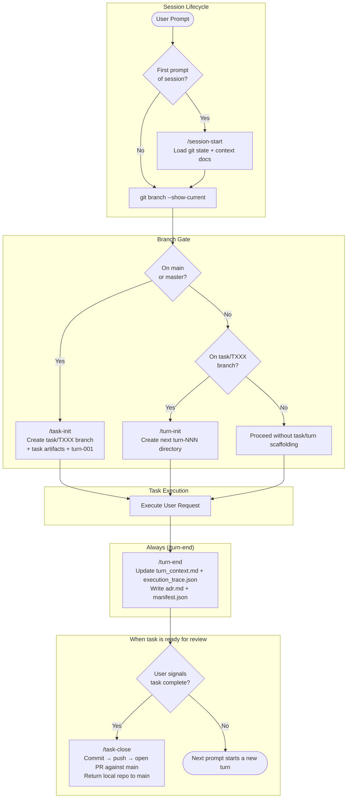

# coding-agents-config

Agentic pipeline configuration for Claude Code and Codex. Enforces a task/turn-based workflow with provenance tracking, branch protection, and governance rules, plus the **AppFactory** skill set for running an AI-augmented backend SDLC (PRD → DDD → plan → implementation → validation).

## Setup

### 1. Clone the repo

```sh
git clone <repo-url> ~/coding-agents-config
```

### 2. Create symlinks (automated)

Run the setup script — it creates all symlinks and backs up any existing files:

```sh
bash scripts/setup.sh
```

<details>
<summary>Manual symlink commands</summary>

```sh
# Into ~/.claude/
ln -s ~/coding-agents-config/skills     ~/.claude/skills
ln -s ~/coding-agents-config/agents     ~/.claude/agents
ln -s ~/coding-agents-config/hooks      ~/.claude/hooks
ln -s ~/coding-agents-config/scripts    ~/.claude/scripts
ln -s ~/coding-agents-config/CLAUDE.md  ~/.claude/CLAUDE.md
ln -s ~/coding-agents-config/settings.json ~/.claude/settings.json

# Into ~/.codex/
ln -s ~/coding-agents-config/agents    ~/.codex/agents
ln -s ~/coding-agents-config/AGENTS.md ~/.codex/AGENTS.md

# Repo-local
ln -s ~/coding-agents-config/CLAUDE.md ./.claude/CLAUDE.md
```

If any of these already exist, back them up first (`mv <target> <target>.bak`). See `scripts/setup.sh` for the full, idempotent list (it also links optional `rules/`, `context/`, and `plugins/` directories if present).
</details>

### 3. Verify

```sh
ls -la ~/.claude/skills        # should point to ~/coding-agents-config/skills
ls -la ~/.claude/agents        # should point to ~/coding-agents-config/agents
ls -la ~/.claude/CLAUDE.md     # should point to ~/coding-agents-config/CLAUDE.md
ls -la ~/.claude/settings.json # should point to ~/coding-agents-config/settings.json
ls -la ~/.codex/AGENTS.md      # should point to ~/coding-agents-config/AGENTS.md
```

## Structure

```
coding-agents-config/
├── CLAUDE.md              # Global instructions — task/turn protocol, branch rules
├── AGENTS.md               # Codex loader directive (reads CLAUDE.md)
├── settings.json           # Claude Code settings (model, permissions, hooks, plugins)
├── package.json            # Plugin dependency manifest (e.g. caveman marketplace plugin)
├── hooks/
│   └── branch-guard.sh     # PreToolUse(Bash) hook — legacy branch guard
├── skills/                 # Slash-command skills — see Skills below
│   ├── .system/            # Meta-skills (skill-creator, skill-installer, plugin-creator, ...)
│   ├── .nestjs/            # NestJS/Prisma scaffolding skills
│   ├── af-*/               # AppFactory backend SDLC pipeline skills
│   ├── session-start/ task-init/ turn-init/ turn-end/ task-close/ branch-guard/
│   ├── dsl-utils/ e2e-tests/ ui-utils/ unit-tests/  # single-skill namespaces
│   └── eval-labeler/
├── agents/                 # Standalone agent definitions
│   └── agent-architecture-planner.md
├── docs/                   # Reference documentation (AppFactory plan, skill summary, migration notes)
├── scripts/
│   ├── setup.sh            # Symlink installer
│   └── af-state.sh         # AppFactory pipeline state helper
├── .appfactory/             # Task/turn tracking and pipeline state
│   ├── tasks/               # task-NNN/ directories (context, status, summary, PR, turns/)
│   ├── tasks_index.csv      # Task registry
│   ├── changelog.md         # Turn-by-turn changelog
│   ├── prompts/             # Saved prompt drafts
│   ├── specs/               # Specifications (empty by default)
│   └── memory/              # Pipeline memory (empty by default)
├── .github/
│   ├── PULL_REQUEST_TEMPLATE.md
│   └── ISSUE_TEMPLATE/     # epic.md, task.md, bug.md
└── archive/                 # Superseded skills, templates, and legacy docs (kept for reference)
```

Note: `plugins/` is gitignored — it is created locally by `settings.json`'s `enabledPlugins`/marketplace config, not tracked in this repo.

## Execution Flow

The pipeline enforces a task/turn workflow for all coding prompts, defined in `CLAUDE.md`:


```mermaid
flowchart TB
    subgraph SESSION["Session Lifecycle"]
        START([User Prompt]) --> SS{First prompt<br/>of session?}
        SS -->|Yes| SESSION_START["/session-start<br/>Load git state + context docs"]
        SS -->|No| CHECK_BRANCH
        SESSION_START --> CHECK_BRANCH["git branch --show-current"]
    end

    subgraph GATE["Branch Gate"]
        CHECK_BRANCH --> IS_MAIN{On main<br/>or master?}
        IS_MAIN -->|Yes| TASK_INIT["/task-init<br/>Create task/TXXX branch<br/>+ task artifacts + turn-001"]
        IS_MAIN -->|No| IS_TASK{On task/TXXX<br/>branch?}
        IS_TASK -->|Yes| TURN_INIT["/turn-init<br/>Create next turn-NNN directory"]
        IS_TASK -->|No| WARN["Proceed without task/turn scaffolding"]
    end

    subgraph EXECUTION["Task Execution"]
        TASK_INIT --> EXEC["Execute User Request"]
        TURN_INIT --> EXEC
        WARN --> EXEC
    end

    subgraph POST_EXEC["Always (/turn-end)"]
        EXEC --> TURN_END["/turn-end<br/>Update turn_context.md + execution_trace.json<br/>Write adr.md + manifest.json"]
    end

    subgraph CLOSE["When task is ready for review"]
        TURN_END --> READY{User signals<br/>task complete?}
        READY -->|Yes| TASK_CLOSE["/task-close<br/>Commit → push → open PR against main<br/>Return local repo to main"]
        READY -->|No| NEXT_TURN([Next prompt starts a new turn])
    end
```

### Turn Protocol Summary

| Phase | Trigger | Skill | Outputs |
|-------|---------|-------|---------|
| **Session Start** | First prompt of the session | `session-start` | Git state + context loaded |
| **Task Init** | Current branch is `main`/`master` | `task-init` | `task/TXXX` branch, `task_*` files, `turn-001` |
| **Turn Init** | Current branch is `task/TXXX` | `turn-init` | Next `turns/turn-NNN/` with `turn_context.md`, `execution_trace.json` |
| **Execution** | — | (user request) | Modified files |
| **Turn End** | After every prompt, even on failure | `turn-end` | Updated `turn_context.md`/`execution_trace.json`, new `adr.md` + `manifest.json` |
| **Task Close** | User indicates the task is ready for review | `task-close` | Commit, push, PR against `main`, registry update, back to `main` |

`branch-guard` (wired as the `PreToolUse(Bash)` hook in `settings.json`) is a legacy fallback that creates a `turn/T<ID>` branch directly off `main`/`master`; the primary flow above (task-init → turn-init → turn-end → task-close) is what `CLAUDE.md` mandates today.

## Skills

### Task / Turn / Session Lifecycle

| Skill | Description |
|-------|--------------|
| `session-start` | Load repository state and core pipeline context at the start of a session |
| `task-init` | Create a `task/TXXX` branch and initialize task + `turn-001` artifacts (runs on `main`/`master`) |
| `turn-init` | Initialize the next turn directory within the active task branch |
| `turn-end` | Finalize the active turn: update context/trace, write ADR + manifest |
| `task-close` | Finalize the active task: commit, push, open a PR against `main` |
| `branch-guard` | Legacy: create a `turn/T<ID>` branch when invoked on `main`/`master` |

### AppFactory Backend SDLC (`af-*`)

| Skill | Description |
|-------|--------------|
| `af-orchestrator` | Orchestrate the full App Factory software development lifecycle |
| `af-project-init` | Bootstrap AppFactory project init (env vars + helper script) |
| `af-be-prd-build` | Build a business-facing PRD from an intake worksheet |
| `af-be-ddd-orchestrator` | Orchestrate the backend DDD build → analyze → refactor → test loop |
| `af-be-ddd-build` | Generate a backend Domain-Driven Design document from an approved PRD |
| `af-be-ddd-analysis` | Audit a DDD spec for quality, completeness, and PRD alignment |
| `af-be-ddd-refactor` | Patch a DDD spec using `af-be-ddd-analysis` findings |
| `af-be-ddd-tests` | Generate Gherkin/BDD feature files from DDD + PRD specs |
| `af-be-plan` | Generate a backend execution plan from a domain DSL + tech-stack profile |
| `af-be-ddd-dsl` | Generate the backend DSL YAML from the DDD document |
| `af-be-implementation` | Execute backend code generation from the plan + BDD features |
| `af-app-check` | Production-readiness audit (security, database, deployment, code quality) |
| `af-memory` | CRUD operations on AppFactory `state.yaml` pipeline state |

### NestJS / Prisma Scaffolding (`.nestjs/`)

| Skill | Description |
|-------|--------------|
| `app-from-dsl` | Orchestrate full-stack generation from `app-dsl` YAML specs |
| `field-mapper-generator` | Generate field mapper/converter utilities from DSL mapper specs |
| `nestjs-crud-resource` | Generate a NestJS CRUD module from DSL backend specs |
| `nestjs-prisma-resource` | Generate a schema-driven NestJS CRUD resource backed by Prisma |
| `nestjs-customer-crud-scaffold` | Non-interactive Nest CLI wrapper to scaffold a customer CRUD app |
| `nestjs-observability` | Add structured logging, correlation IDs, and Prisma query logging |
| `prisma/prisma-guidelines` | Prisma ORM development guidelines and constraints |
| `prisma/prisma-persistence` | Generate Prisma schema/migrations from a DSL persistence model |

### Single-Skill Namespaces

| Skill | Description |
|-------|--------------|
| `dsl-utils/dsl-model-interpreter` | Parse and interpret app-dsl YAML specifications |
| `e2e-tests/http-test-artifacts` | Generate HTTP request file test artifacts |
| `ui-utils/ui-implementation-language` | Resolve UI implementation language conventions |
| `unit-tests/test-implementation-sync` | Keep unit tests in sync with implementation |
| `eval-labeler` | Label and compare two model responses (Response A vs B) against a repo-based eval |

### Meta-Skills (`.system/`)

| Skill | Description |
|-------|--------------|
| `skill-creator` | Guide for creating or updating skills |
| `skill-installer` | Install skills from a curated list or GitHub repo path |
| `plugin-creator` | Scaffold plugin directories with `.codex-plugin/plugin.json` |
| `imagegen` | Generate or edit raster images for the current project |
| `openai-docs` | Look up OpenAI API/product documentation with citations |

See `docs/skill-summary.md` for the AppFactory pipeline phases in invocation order.

## Templates

Templates are colocated with the skill that owns them (e.g. `skills/task-init/templates/task_context.md`, `skills/turn-init/templates/turn_context.md`) rather than kept in one shared directory. The original shared template set (`adr_template.md`, `pull_request_template.md`, `manifest.schema.json`, `metadata_header.txt`, `branch_naming.md`, `commit_message.md`, `tech-stack.template.md`) has been superseded and moved to `archive/templates/` for reference.

## Hooks

| Hook | Trigger | Purpose |
|------|---------|---------|
| `branch-guard.sh` | `PreToolUse(Bash)` (configured in `settings.json`) | Legacy guard against direct work on `main`/`master` |

## Archive

`archive/` holds skills, templates, and docs from an earlier iteration of this repo (single flat `skills/` library, shared `templates/`, `turn/T<ID>`-branch model) that have been superseded by the current `.appfactory/` task/turn model and `af-*` skill set. Kept for historical reference — see `archive/README.md` and `archive/SUMMARY.md`.

## Adding a new skill

Each skill lives in its own directory under `skills/` with a `SKILL.md` file:

```
skills/my-skill/
└── SKILL.md
```

The `.system/skill-creator` meta-skill can guide you through creating one — invoke it from Claude Code.

## Syncing across machines

Since this is a standard git repo, pull on any machine to stay current:

```sh
cd ~/coding-agents-config && git pull
```

The symlinks mean changes are picked up immediately — no reinstall needed.
