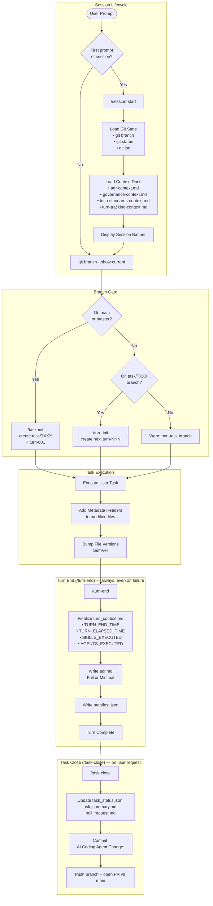

# coding-agents-config

Agentic pipeline configuration for Claude Code (and Codex). Enforces a task/turn-based workflow with provenance tracking, branch protection, and governance rules, plus a library of AppFactory backend-generation skills.

## Setup

### 1. Clone the repo

```sh
git clone <repo-url> ~/coding-agents-config
```

### 2. Create symlinks (automated)

Run the setup script — it links the repo into `~/.claude/` and `~/.codex/`, backing up any existing files:

```sh
bash scripts/setup.sh
```

<details>
<summary>Manual symlink commands</summary>

```sh
# ~/.claude/
ln -s ~/coding-agents-config/skills ~/.claude/skills
ln -s ~/coding-agents-config/agents ~/.claude/agents
ln -s ~/coding-agents-config/hooks ~/.claude/hooks
ln -s ~/coding-agents-config/scripts ~/.claude/scripts
ln -s ~/coding-agents-config/CLAUDE.md ~/.claude/CLAUDE.md
ln -s ~/coding-agents-config/settings.json ~/.claude/settings.json

# ~/.codex/
ln -s ~/coding-agents-config/agents ~/.codex/agents
ln -s ~/coding-agents-config/AGENTS.md ~/.codex/AGENTS.md
```

`scripts/setup.sh` also links `rules/`, `context/`, and `plugins/` into `~/.claude/` if they exist — those directories are reserved for future use and are not yet present in this repo.

If any target already exists, back it up first (`mv <target> <target>.bak`).
</details>

### 3. Verify

```sh
ls -la ~/.claude/skills        # should point to ~/coding-agents-config/skills
ls -la ~/.claude/CLAUDE.md     # should point to ~/coding-agents-config/CLAUDE.md
ls -la ~/.claude/settings.json # should point to ~/coding-agents-config/settings.json
ls -la ~/.codex/AGENTS.md      # should point to ~/coding-agents-config/AGENTS.md
```

## Structure

```
coding-agents-config/
├── CLAUDE.md             # Global instructions — task/turn protocol, branch rules
├── AGENTS.md             # Codex loader directive (reads ~/.claude/CLAUDE.md)
├── settings.json         # Claude Code settings (model, permissions, hooks, plugins)
├── package.json          # caveman plugin dependency
├── agents/               # Agent role/spec docs
│   └── agent-architecture-planner.md
├── hooks/                # Shell hooks triggered by Claude Code events
│   └── branch-guard.sh   # Blocks edits on main/master
├── scripts/               # Automation scripts
│   ├── setup.sh           # Create ~/.claude and ~/.codex symlinks
│   └── af-state.sh        # AppFactory state helpers
├── skills/                 # Slash-command skills (see Skills below)
│   ├── .system/             # Generic meta-skills (skill-creator, skill-installer, plugin-creator, imagegen, openai-docs)
│   ├── .nestjs/             # NestJS/Prisma scaffolding skills
│   ├── session-start/  task-init/  turn-init/  turn-end/  task-close/  branch-guard/  # Task & turn lifecycle
│   ├── af-*/                # AppFactory backend DDD pipeline skills
│   ├── dsl-utils/  ui-utils/  unit-tests/  e2e-tests/  # Category folders, each housing one nested skill
│   └── eval-labeler/        # Model response evaluation labeling
├── .appfactory/             # Task/turn tracking, specs, prompts, memory
│   ├── tasks/                # task-NNN/ directories: status, summary, PR draft, turns/turn-NNN/
│   ├── tasks_index.csv       # Registry of tasks
│   ├── specs/                 # Specifications
│   ├── prompts/                # Prompt drafts and notes
│   ├── memory/                  # Project memory
│   └── changelog.md
├── docs/                  # Reference and migration docs
├── archive/                # Retired skills, templates, and superseded docs
└── .github/                # Issue and PR templates
```

## Execution Flow

The agentic pipeline enforces a task/turn-based workflow for all coding tasks. A **task** is the branch-scoped unit of work that becomes one pull request (`task/TXXX`); a **turn** is one AI execution cycle within that task.


```mermaid
flowchart TB
    subgraph SESSION["Session Lifecycle"]
        START([User Prompt]) --> SS{First prompt<br/>of session?}
        SS -->|Yes| SESSION_START["/session-start"]
        SS -->|No| BRANCH_CHECK
        SESSION_START --> LOAD_GIT["Load Git State<br/>• git branch<br/>• git status<br/>• git log"]
        LOAD_GIT --> LOAD_CTX["Load Context Docs<br/>• adr-context.md<br/>• governance-context.md<br/>• tech-standards-context.md<br/>• turn-tracking-context.md"]
        LOAD_CTX --> BANNER["Display Session Banner"]
        BANNER --> BRANCH_CHECK
    end

    subgraph GATE["Branch Gate"]
        BRANCH_CHECK["git branch --show-current"] --> IS_MAIN{On main<br/>or master?}
        IS_MAIN -->|Yes| TASK_INIT["/task-init<br/>create task/TXXX<br/>+ turn-001"]
        IS_MAIN -->|No| IS_TASK{On task/TXXX<br/>branch?}
        IS_TASK -->|Yes| TURN_INIT["/turn-init<br/>create next turn-NNN"]
        IS_TASK -->|No| WARN["Warn: non-task branch"]
    end

    subgraph EXECUTION["Task Execution"]
        TASK_INIT --> EXEC["Execute User Task"]
        TURN_INIT --> EXEC
        WARN --> EXEC
        EXEC --> ADD_HEADERS["Add Metadata Headers<br/>to modified files"]
        ADD_HEADERS --> BUMP_VERSION["Bump File Versions<br/>SemVer"]
    end

    subgraph POST_EXEC["Turn End (/turn-end) — always, even on failure"]
        BUMP_VERSION --> TURN_END["/turn-end"]
        TURN_END --> UPDATE_CTX["Finalize turn_context.md<br/>• TURN_END_TIME<br/>• TURN_ELAPSED_TIME<br/>• SKILLS_EXECUTED<br/>• AGENTS_EXECUTED"]
        UPDATE_CTX --> WRITE_ADR["Write adr.md<br/>Full or Minimal"]
        WRITE_ADR --> WRITE_MANIFEST["Write manifest.json"]
        WRITE_MANIFEST --> COMPLETE["Turn Complete"]
    end

    subgraph CLOSE["Task Close (/task-close) — on user request"]
        COMPLETE -.-> TASK_CLOSE["/task-close"]
        TASK_CLOSE --> UPDATE_TASK["Update task_status.json,<br/>task_summary.md, pull_request.md"]
        UPDATE_TASK --> COMMIT["Commit:<br/>AI Coding Agent Change:"]
        COMMIT --> PUSH["Push branch + open PR vs main"]
    end
```

### Task/Turn Protocol Summary

| Phase | Trigger | Steps | Outputs |
|-------|---------|-------|---------|
| **Session Start** | First prompt of session | Load git state → load 4 context docs → display banner | Context loaded |
| **Task Init** | Branch is `main`/`master` | Resolve next task id → create `task/TXXX` → scaffold `turn-001` | Task + turn-001 artifacts |
| **Turn Init** | Already on `task/TXXX` | Resolve next turn id → create `turns/turn-NNN/` → write context + trace | `turn_context.md`, `execution_trace.json` |
| **Execution** | Every coding prompt | Execute task → add headers → bump versions | Modified files |
| **Turn End** | After every turn, even on failure | Finalize context → write ADR → write manifest | `adr.md`, `manifest.json` |
| **Task Close** | User signals task is ready for review | Update task artifacts → commit → push → open PR | `pull_request.md`, PR against `main` |

## Skills

Skills live under `skills/`, one directory per skill with a `SKILL.md`. They're organized into the following groups:

| Category | Skill | Description |
|----------|-------|-------------|
| **Task/Turn lifecycle** | `session-start` | Load repository state and core pipeline context at session start |
| | `task-init` | Initialize a new task branch (`task/TXXX`) and create task + turn-001 artifacts |
| | `turn-init` | Initialize the next turn within the active task branch |
| | `turn-end` | Finalize the active turn (ADR, manifest, trace) after every coding prompt |
| | `task-close` | Finalize the active task, push it, and open a PR against `main` |
| | `branch-guard` | Create a turn-scoped branch if work starts on `main`/`master` |
| **AppFactory backend pipeline (`af-*`)** | `af-orchestrator` | Orchestrate the App Factory software development lifecycle |
| | `af-project-init` | Export required environment variables and initialize an AppFactory project |
| | `af-be-prd-build` | Build a backend PRD from an intake worksheet or discovery notes |
| | `af-be-ddd-build` | Generate a backend Domain-Driven Design document from an approved PRD |
| | `af-be-ddd-analysis` | Audit a generated DDD document for quality, completeness, and PRD alignment |
| | `af-be-ddd-refactor` | Apply `af-be-ddd-analysis` findings to patch a DDD document |
| | `af-be-ddd-dsl` | Generate a backend DSL YAML document from a DDD document |
| | `af-be-ddd-tests` | Generate Gherkin BDD scenarios from DDD and PRD specifications |
| | `af-be-ddd-orchestrator` | Orchestrate the build → analyze → refactor → test DDD loop |
| | `af-be-plan` | Generate a backend execution plan from a domain DSL and tech-stack profile |
| | `af-be-implementation` | Generate backend domain code from the execution plan and BDD specs |
| | `af-app-check` | Audit an application for production readiness (security, DB, deploy, quality) |
| | `af-memory` | CRUD operations on `.appfactory/state.yaml` for pipeline state tracking |
| **DSL & code utilities** | `dsl-utils/dsl-model-interpreter` | Parse and validate app-dsl YAML specifications |
| | `ui-utils/ui-implementation-language` | Declarative YAML standard for UI pages, layouts, forms, and actions |
| | `unit-tests/test-implementation-sync` | Keep generated unit tests synchronized with implementations |
| | `e2e-tests/http-test-artifacts` | Generate `.http` request files for REST endpoint testing |
| **NestJS/Prisma scaffolding (`.nestjs/`)** | `app-from-dsl` | Orchestrate full-stack app generation from app-dsl YAML |
| | `nestjs-prisma-resource` | Generate a NestJS CRUD resource backed by Prisma from a schema |
| | `nestjs-crud-resource` | Generate a NestJS CRUD module from a DSL backend specification |
| | `nestjs-customer-crud-scaffold` | Scaffold a NestJS customer CRUD app via the Nest CLI |
| | `nestjs-observability` | Add structured logging, correlation IDs, and observability to a Prisma/NestJS backend |
| | `field-mapper-generator` | Generate field mapper/converter utilities from DSL mapper specs |
| | `prisma` | Prisma persistence guidelines and helpers |
| **Other** | `eval-labeler` | Label and compare model responses (A/B) for coding tasks |

### Meta-skills (`.system/`)

| Skill | Description |
|-------|-------------|
| `skill-creator` | Guide for creating or updating skills |
| `skill-installer` | Install skills from curated lists or GitHub repos |
| `plugin-creator` | Scaffold plugin directories and marketplace entries |
| `imagegen` | Generate or edit raster images for visual assets |
| `openai-docs` | Look up OpenAI product/API documentation |

## Templates

There is no single root `templates/` directory — templates live alongside the skill that owns them (e.g. `skills/af-be-ddd-build/templates/ddd-template.md`, `skills/task-init/templates/`, `skills/turn-init/templates/`). Earlier, shared templates (ADR, PR, manifest schema, commit message, branch naming) have been moved to `archive/templates/`.

## Hooks

| Hook | Trigger | Purpose |
|------|---------|---------|
| `branch-guard.sh` | PreToolUse(Bash) | Block edits on `main`/`master` |

## Adding a new skill

Each skill lives in its own directory under `skills/` with a `SKILL.md` file:

```
skills/my-skill/
└── SKILL.md
```

The `skill-creator` meta-skill (under `skills/.system/`) can guide you through creating one — invoke it from Claude Code.

## Syncing across machines

Since this is a standard git repo, pull on any machine to stay current:

```sh
cd ~/coding-agents-config && git pull
```

The symlinks mean changes are picked up immediately — no reinstall needed.
