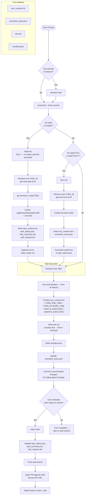

# coding-agents-config

Agentic pipeline configuration for Claude Code (and Codex). Enforces a task/turn-based workflow with provenance tracking, branch protection, and governance rules, plus the AppFactory skill set for backend SDLC generation.

## Setup

### 1. Clone the repo

```sh
git clone <repo-url> ~/coding-agents-config
```

### 2. Create symlinks (automated)

Run the setup script — it creates all symlinks and backs up any existing files:

```sh
bash scripts/setup.sh
```

`scripts/setup.sh` links the following into `~/.claude/` (Claude Code): `skills`, `agents`, `rules`, `hooks`, `context`, `scripts`, `plugins`, `CLAUDE.md`, `settings.json`; into `~/.codex/` (Codex): `agents`, `AGENTS.md`; and into the repo-local `./.claude/`: `CLAUDE.md`. Only `skills`, `agents`, `hooks`, `scripts`, `CLAUDE.md`, and `settings.json` currently exist in this repo — `rules`, `context`, and `plugins` are reserved for future use and are skipped/created on demand.

<details>
<summary>Manual symlink commands</summary>

```sh
ln -s ~/coding-agents-config/skills ~/.claude/skills
ln -s ~/coding-agents-config/agents ~/.claude/agents
ln -s ~/coding-agents-config/hooks ~/.claude/hooks
ln -s ~/coding-agents-config/scripts ~/.claude/scripts
ln -s ~/coding-agents-config/CLAUDE.md ~/.claude/CLAUDE.md
ln -s ~/coding-agents-config/settings.json ~/.claude/settings.json
```

If any of these already exist, back them up first (`mv <target> <target>.bak`).
</details>

### 3. Verify

```sh
ls -la ~/.claude/skills        # should point to ~/coding-agents-config/skills
ls -la ~/.claude/agents        # should point to ~/coding-agents-config/agents
ls -la ~/.claude/hooks         # should point to ~/coding-agents-config/hooks
ls -la ~/.claude/scripts       # should point to ~/coding-agents-config/scripts
ls -la ~/.claude/CLAUDE.md     # should point to ~/coding-agents-config/CLAUDE.md
ls -la ~/.claude/settings.json # should point to ~/coding-agents-config/settings.json
```

## Structure

```
coding-agents-config/
├── CLAUDE.md           # Global instructions — task/turn protocol, branch rules
├── AGENTS.md           # Agent loader directive (Codex)
├── settings.json       # Claude Code settings (model, permissions, hooks)
├── hooks/              # Shell hooks triggered by Claude Code events
│   └── branch-guard.sh # Prevents edits on main/master
├── agents/              # Standalone agent definitions
│   └── agent-architecture-planner.md
├── skills/              # Slash-command skills (see Skills below)
│   ├── .system/          # Meta-skills (skill-creator, skill-installer)
│   ├── session-start/    # Initialize session context
│   ├── task-init/        # Create task branch + turn-001 artifacts
│   ├── turn-init/        # Create the next turn's directory and artifacts
│   ├── turn-end/         # Finalize a turn with ADR + manifest
│   ├── task-close/       # Push task branch and open a pull request
│   ├── branch-guard/     # Create a turn-scoped branch if on main
│   ├── af-*/             # AppFactory backend SDLC pipeline skills
│   └── ...               # Other skills (templates live per-skill under
│                          # skills/<name>/templates/)
├── scripts/             # Automation scripts
│   ├── setup.sh          # Symlinks this repo into ~/.claude and ~/.codex
│   └── af-state.sh       # AppFactory .appfactory/memory/state.yaml helpers
├── .appfactory/          # Task/turn tracking and specs (see Directory Structure)
│   ├── tasks/             # Task branches with turns
│   ├── tasks_index.csv    # Registry of all tasks
│   ├── changelog.md       # Project changelog
│   ├── specs/             # Specifications
│   ├── prompts/           # Prompt templates
│   └── memory/            # Project memory
├── docs/                # Reference documentation (migration notes, skill summary)
├── archive/             # Retired/superseded skills and templates, kept for reference
└── .github/             # Issue templates, PR template
```

## Execution Flow

The agentic pipeline enforces a strict task/turn-based workflow for all coding tasks. A **task** is the branch-scoped unit of work that becomes one pull request (`task/TXXX`, global zero-padded id). A **turn** is one AI execution cycle within the active task branch (`turn-XXX`, zero-padded per task).


```mermaid
flowchart TB
    START([User Prompt]) --> SS{First prompt<br/>of session?}
    SS -->|Yes| SESSION_START["/session-start"]
    SS -->|No| CHECK_BRANCH
    SESSION_START --> CHECK_BRANCH["git branch --show-current"]

    CHECK_BRANCH --> IS_MAIN{On main<br/>or master?}
    IS_MAIN -->|Yes| TASK_INIT["/task-init<br/>HALT — no writes until this succeeds"]
    TASK_INIT --> RESOLVE_TASK["Resolve next TASK_ID<br/>get-next-task-id.sh"]
    RESOLVE_TASK --> CREATE_TASK_BRANCH["git checkout -b task/T{ID}"]
    CREATE_TASK_BRANCH --> INIT_TASK_DIR["Create .appfactory/tasks/task-{ID}/<br/>+ turn-001"]
    INIT_TASK_DIR --> WRITE_TASK_ARTIFACTS["Write task_context.md,<br/>task_status.json, task_summary.md,<br/>pull_request.md"]
    WRITE_TASK_ARTIFACTS --> APPEND_INDEX["Append row to tasks_index.csv"]
    APPEND_INDEX --> EXEC

    IS_MAIN -->|No| IS_TASK{On task/TXXX<br/>or task/TXXX-*?}
    IS_TASK -->|Yes| TURN_INIT["/turn-init"]
    TURN_INIT --> RESOLVE_TURN["Resolve next TURN_ID<br/>get-next-turn-id.sh"]
    RESOLVE_TURN --> CREATE_TURN_DIR["Create turns/turn-{ID}/"]
    CREATE_TURN_DIR --> WRITE_TURN_INIT["Write turn_context.md +<br/>execution_trace.json"]
    WRITE_TURN_INIT --> BUMP_TOTAL["Increment totalTurns<br/>in task_status.json"]
    BUMP_TOTAL --> EXEC
    IS_TASK -->|No| EXEC

    subgraph EXECUTION["Task Execution"]
        EXEC["Execute User Task"]
    end

    EXEC --> TURN_END["/turn-end (always — even on failure)"]
    TURN_END --> UPDATE_CTX["Finalize turn_context.md<br/>• TURN_END_TIME • TURN_ELAPSED_TIME<br/>• SKILLS_EXECUTED • AGENTS_EXECUTED"]
    UPDATE_CTX --> WRITE_ADR["Write adr.md<br/>(exactly one — full or minimal)"]
    WRITE_ADR --> WRITE_MANIFEST["Write manifest.json"]
    WRITE_MANIFEST --> UPDATE_TRACE["Update execution_trace.json"]
    UPDATE_TRACE --> COMMIT["Commit if uncommitted changes:<br/>AI Coding Agent Change:"]
    COMMIT --> READY{User indicates<br/>task ready for review?}
    READY -->|Yes| TASK_CLOSE["/task-close"]
    READY -->|No| DONE["Turn Complete —<br/>stay on task branch"]
    TASK_CLOSE --> UPDATE_TASK_ARTIFACTS["Update task_status.json,<br/>task_summary.md, pull_request.md"]
    UPDATE_TASK_ARTIFACTS --> PUSH["Push task branch"]
    PUSH --> OPEN_PR["Open PR against main<br/>Record PR URL"]
    OPEN_PR --> RETURN_MAIN["Switch back to main + pull"]

    subgraph ARTIFACTS["Turn Artifacts"]
        direction LR
        A1["turn_context.md"]
        A2["execution_trace.json"]
        A3["adr.md"]
        A4["manifest.json"]
    end
```

### Task/Turn Protocol Summary

| Phase | Trigger | Steps | Outputs |
|-------|---------|-------|---------|
| **Session Start** | First prompt of session | `/session-start` loads repo/git state and context docs | Session context loaded |
| **Task Init** | Coding prompt while on `main`/`master` | `/task-init` resolves next `TASK_ID` → creates `task/TXXX` → scaffolds task dir + turn-001 → appends `tasks_index.csv` | `task_context.md`, `task_status.json`, `task_summary.md`, `pull_request.md`, `turn-001/` |
| **Turn Init** | Coding prompt while on `task/TXXX` | `/turn-init` resolves next `TURN_ID` → creates turn dir → increments `totalTurns` | `turn_context.md`, `execution_trace.json` |
| **Execution** | Every coding prompt | Execute the user's request | Modified files |
| **Turn End** | Always, even on failure | `/turn-end` finalizes context, writes exactly one ADR, writes manifest, updates trace | `adr.md`, `manifest.json` (updated `turn_context.md`, `execution_trace.json`) |
| **Task Close** | User signals task ready for review | `/task-close` updates task artifacts, commits, pushes, opens PR against `main`, returns to `main` | Open pull request |

**Hard gate:** writing code on `main`/`master` is never allowed — `/task-init` must succeed first.

## Skills (24)

| Category | Skill | Description |
|----------|-------|-------------|
| **Session & Task/Turn Lifecycle** | `session-start` | Load repository state and core pipeline context at the start of every session |
| | `task-init` | Initialize a new task branch and create task plus turn-001 artifacts (run when on `main`/`master`) |
| | `turn-init` | Initialize the next turn within the active task branch |
| | `turn-end` | Finalize the active turn — ADR, manifest, execution trace (run after every coding prompt) |
| | `task-close` | Finalize the active task branch, push it, and open a pull request against `main` |
| | `branch-guard` | Create a turn-scoped branch if the current branch is `main`/`master` |
| **AppFactory Pipeline** | `af-orchestrator` | Orchestrate the App Factory software development lifecycle end to end |
| | `af-project-init` | Export required environment variables and bootstrap a new AppFactory project |
| | `af-be-prd-build` | Build a business-facing backend PRD from an intake worksheet or discovery notes |
| | `af-be-ddd-orchestrator` | Orchestrate the backend DDD build → analyze → refactor → test loop |
| | `af-be-ddd-build` | Generate a human-readable backend DDD document from an approved PRD |
| | `af-be-ddd-analysis` | Audit a generated DDD document for quality, completeness, and PRD alignment |
| | `af-be-ddd-refactor` | Apply targeted DDD corrections from an `af-be-ddd-analysis` report |
| | `af-be-ddd-tests` | Generate Gherkin/BDD feature files from the DDD and PRD specifications |
| | `af-be-ddd-dsl` | Generate a backend application DSL YAML document from the DDD document |
| | `af-be-plan` | Generate a backend execution plan from the domain DSL and a tech-stack profile |
| | `af-be-implementation` | Generate backend domain code from the execution plan and BDD feature specs |
| | `af-app-check` | Audit an application for production readiness (security, database, deployment, code quality) |
| | `af-memory` | CRUD operations on `.appfactory/memory/state.yaml` for pipeline state tracking |
| **Utilities** | `dsl-utils` / `dsl-model-interpreter` | Parse and validate `app-dsl` YAML specifications before code generation |
| | `e2e-tests` / `http-test-artifacts` | Generate `.http` request files for REST endpoint testing |
| | `ui-utils` / `ui-implementation-language` | Declarative YAML language for UI pages, layouts, widgets, and API bindings |
| | `unit-tests` / `test-implementation-sync` | Keep generated unit tests synchronized with actual service/DTO implementations |
| | `eval-labeler` | Label and compare model responses (Response A vs. B) for coding-task evaluations |

See [`docs/skill-summary.md`](docs/skill-summary.md) for the AppFactory skills ordered by pipeline phase and invoking orchestrator.

### Meta-Skills (.system)

| Skill | Description |
|-------|-------------|
| `skill-creator` | Create new skills with SKILL.md |
| `skill-installer` | Install skills from marketplaces |

## Templates

Templates now live alongside the skill that owns them, under `skills/<skill-name>/templates/` (e.g. `skills/af-be-ddd-build/templates/ddd-template.md`, `skills/af-be-plan/templates/execution-plan-template.md`). Retired top-level templates (`adr_template.md`, `pull_request_template.md`, `tech-stack.template.md`) are preserved under [`archive/templates/`](archive/templates) for reference.

## Hooks

| Hook | Trigger | Purpose |
|------|---------|---------|
| `branch-guard.sh` | `PreToolUse(Bash)` | If on `main`/`master`, auto-create and switch to the next `task/TXXX` branch before the tool call runs |

## Adding a new skill

Each skill lives in its own directory under `skills/` with a `SKILL.md` file:

```
skills/my-skill/
└── SKILL.md
```

The `.system/skill-creator` meta-skill can guide you through creating one — invoke it from Claude Code.

## Syncing across machines

Since this is a standard git repo, pull on any machine to stay current:

```sh
cd ~/coding-agents-config && git pull
```

The symlinks mean changes are picked up immediately — no reinstall needed.
