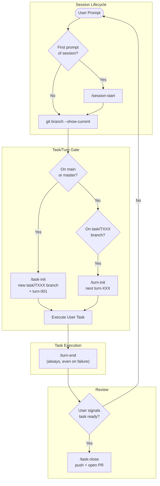

# coding-agents-config

Agentic pipeline configuration for Claude Code and Codex. Enforces a turn-based workflow with provenance tracking, branch protection, and governance rules, plus the **AppFactory (`af-*`)** skill suite for DSL-driven application generation.

## Setup

### 1. Clone the repo

```sh
git clone <repo-url> ~/coding-agents-config
```

### 2. Create symlinks (automated)

Run the setup script — it links the repo into `~/.claude/`, `~/.codex/`, and a repo-local `./.claude/`, backing up any existing files:

```sh
bash scripts/setup.sh
```

<details>
<summary>Manual symlink commands</summary>

```sh
# ~/.claude/
ln -s ~/coding-agents-config/skills ~/.claude/skills
ln -s ~/coding-agents-config/agents ~/.claude/agents
ln -s ~/coding-agents-config/hooks ~/.claude/hooks
ln -s ~/coding-agents-config/scripts ~/.claude/scripts
ln -s ~/coding-agents-config/CLAUDE.md ~/.claude/CLAUDE.md
ln -s ~/coding-agents-config/settings.json ~/.claude/settings.json

# ~/.codex/
ln -s ~/coding-agents-config/agents ~/.codex/agents
ln -s ~/coding-agents-config/AGENTS.md ~/.codex/AGENTS.md

# repo-local
ln -s ~/coding-agents-config/CLAUDE.md ./.claude/CLAUDE.md
```

If any of these already exist, back them up first (`mv <target> <target>.bak`).
</details>

### 3. Verify

```sh
ls -la ~/.claude/skills     # should point to ~/coding-agents-config/skills
ls -la ~/.claude/hooks      # should point to ~/coding-agents-config/hooks
ls -la ~/.claude/CLAUDE.md  # should point to ~/coding-agents-config/CLAUDE.md
ls -la ~/.claude/settings.json # should point to ~/coding-agents-config/settings.json
```

## Structure

```
coding-agents-config/
├── CLAUDE.md           # Global instructions — turn/task protocol, branch rules
├── AGENTS.md           # Codex loader directive (loads ~/.claude/CLAUDE.md)
├── settings.json       # Claude Code settings (model, permissions, hooks, plugins)
├── agents/             # Subagent definitions (e.g. agent-architecture-planner)
├── hooks/              # Shell hooks triggered by Claude Code events
│   └── branch-guard.sh # Prevents edits on main/master
├── skills/             # Slash-command skills (see below)
│   └── .system/        # Meta-skills (skill-creator, skill-installer, plugin-creator, ...)
├── scripts/             # Automation scripts
│   ├── setup.sh         # Creates all symlinks
│   └── af-state.sh      # AppFactory pipeline state helper
├── .appfactory/         # Task/turn tracking and pipeline state
│   ├── tasks/           # task-XXX/ folders, each with turns/turn-XXX/ artifacts
│   ├── specs/           # Specifications
│   ├── prompts/         # Prompt drafts and notes
│   ├── memory/          # Pipeline state (state.yaml)
│   └── tasks_index.csv  # Registry of all tasks and their status
├── docs/                # Reference documentation (migration notes, plans)
└── archive/             # Retired skills/templates kept for reference
```

## Execution Flow

The agentic pipeline enforces a strict task/turn workflow for all coding tasks:


```mermaid
flowchart TB
    subgraph SESSION["Session Lifecycle"]
        START([User Prompt]) --> SS{First prompt<br/>of session?}
        SS -->|Yes| SESSION_START["/session-start"]
        SS -->|No| BRANCH_CHECK
        SESSION_START --> BRANCH_CHECK["git branch --show-current"]
    end

    subgraph BRANCH_GATE["Task/Turn Gate"]
        BRANCH_CHECK --> IS_MAIN{On main<br/>or master?}
        IS_MAIN -->|Yes| TASK_INIT["/task-init<br/>new task/TXXX branch<br/>+ turn-001"]
        IS_MAIN -->|No| IS_TASK{On task/TXXX<br/>branch?}
        IS_TASK -->|Yes| TURN_INIT["/turn-init<br/>next turn-XXX"]
        TASK_INIT --> EXEC
        TURN_INIT --> EXEC
    end

    subgraph EXECUTION["Task Execution"]
        EXEC["Execute User Task"] --> TURN_END["/turn-end<br/>(always, even on failure)"]
    end

    subgraph CLOSE["Review"]
        TURN_END --> READY{User signals<br/>task ready?}
        READY -->|Yes| TASK_CLOSE["/task-close<br/>push + open PR"]
        READY -->|No| START
    end
```

### Task/Turn Protocol Summary

| Concept | Scope | Branch | Skill(s) |
|---------|-------|--------|----------|
| **Task** | One unit of work → one PR | `task/TXXX` | `/task-init` (create), `/task-close` (finalize + PR) |
| **Turn** | One AI execution cycle within a task | same `task/TXXX` | `/turn-init` (start), `/turn-end` (finalize, always) |

Hard gate: code may never be written while on `main`/`master`; `/task-init` must run first.

## Skills

Skills live under `skills/`. Most are flat (`skills/<name>/SKILL.md`); a few are grouped under a category folder containing one or more nested skills.

### Pipeline / governance

| Skill | Description |
|-------|-------------|
| `session-start` | Load repository state and core pipeline context. Run at the start of every session. |
| `task-init` | Initialize a new task branch (`task/TXXX`) and create task + turn-001 artifacts. Run when on `main`/`master`. |
| `turn-init` | Initialize the next turn within the active task branch. |
| `turn-end` | Finalize the active turn after execution (always, even on failure). |
| `task-close` | Finalize the active task branch, push it, and open a pull request against `main`. |
| `branch-guard` | Check current branch and create a turn-scoped branch if on `main`/`master`. |

### AppFactory (`af-*`) — DSL-driven app generation

| Skill | Description |
|-------|-------------|
| `af-orchestrator` | Orchestrates the App Factory software development lifecycle end to end. |
| `af-project-init` | Bootstraps a new AppFactory project (env vars, Git/GitHub setup). |
| `af-memory` | CRUD operations on `.appfactory/memory/state.yaml` for pipeline state. |
| `af-be-prd-build` | Builds a backend-focused PRD from intake notes/questionnaire answers. |
| `af-be-ddd-orchestrator` | Orchestrates the backend DDD build → analyze → refactor → test loop. |
| `af-be-ddd-build` | Generates a backend Domain-Driven Design document from an approved PRD. |
| `af-be-ddd-analysis` | Audits a generated DDD document for completeness and PRD alignment. |
| `af-be-ddd-refactor` | Applies targeted patches to a DDD document from analysis findings. |
| `af-be-ddd-dsl` | Generates a backend application DSL YAML from a DDD document. |
| `af-be-ddd-tests` | Generates Gherkin/BDD feature files from the DDD and PRD specs. |
| `af-be-plan` | Generates a backend execution plan from the DSL and a tech-stack profile. |
| `af-be-implementation` | Executes backend code generation from the plan and BDD specs into the target project. |
| `af-app-check` | Audits an application for production readiness (security, DB, deployment, code quality). |

### Utility groups

| Group | Nested skill | Description |
|-------|--------------|-------------|
| `dsl-utils` | `dsl-model-interpreter` | Parses and validates app-dsl YAML specs before code generation. |
| `ui-utils` | `ui-implementation-language` | Declarative YAML language for UI pages, layouts, widgets, and forms. |
| `unit-tests` | `test-implementation-sync` | Keeps generated unit tests synchronized with their implementations. |
| `e2e-tests` | `http-test-artifacts` | Generates `.http` request files for REST endpoint testing. |

### Other

| Skill | Description |
|-------|-------------|
| `eval-labeler` | Processes `Eval.md` files to label/score and compare model responses (A vs B). |

### Meta-skills (`.system/`)

| Skill | Description |
|-------|-------------|
| `skill-creator` | Guide for creating or updating skills with a `SKILL.md`. |
| `skill-installer` | Installs skills from curated lists or GitHub repos. |
| `plugin-creator` | Scaffolds plugin directories (`.codex-plugin/plugin.json`, marketplace entries). |
| `imagegen` | Generates or edits raster images for mockups, sprites, and other bitmap assets. |
| `openai-docs` | Looks up OpenAI product/API docs with citations. |

> Earlier full-stack scaffolding skills (`schema-to-database`, `nestjs-prisma-resource`, `code-entity-to-crud`, etc.) and their templates have been superseded by the `af-*` suite and moved to `archive/`.

## Agents

Subagent definitions live in `agents/`:

| Agent | Description |
|-------|-------------|
| `agent-architecture-planner` | Reads the PRD, DDD, and DSL to produce architecture decisions, module maps, and task plans for downstream coding agents. |

## Hooks

| Hook | Trigger | Purpose |
|------|---------|---------|
| `branch-guard.sh` | `PreToolUse(Bash)` | Block edits/commits on `main`/`master`. |

## AppFactory state (`.appfactory/`)

- `tasks/task-XXX/` — one folder per task, with `task_context.md`, `task_status.json`, `task_summary.md`, `pull_request.md`, and a `turns/turn-XXX/` folder per turn (`turn_context.md`, `execution_trace.json`, `adr.md`, `manifest.json`).
- `tasks_index.csv` — registry of every task, its branch, status, and PR URL.
- `specs/` — specification inputs (PRD, DDD, DSL) for the current pipeline run.
- `prompts/` — prompt drafts and design notes for skills.
- `memory/` — `state.yaml`, the pipeline's working-state store, managed via the `af-memory` skill.

## Adding a new skill

Each skill lives in its own directory under `skills/` (optionally nested under a category folder) with a `SKILL.md` file:

```
skills/my-skill/
└── SKILL.md
```

The `.system/skill-creator` meta-skill can guide you through creating one — invoke it from Claude Code.

## Syncing across machines

Since this is a standard git repo, pull on any machine to stay current:

```sh
cd ~/coding-agents-config && git pull
```

The symlinks mean changes are picked up immediately — no reinstall needed.
